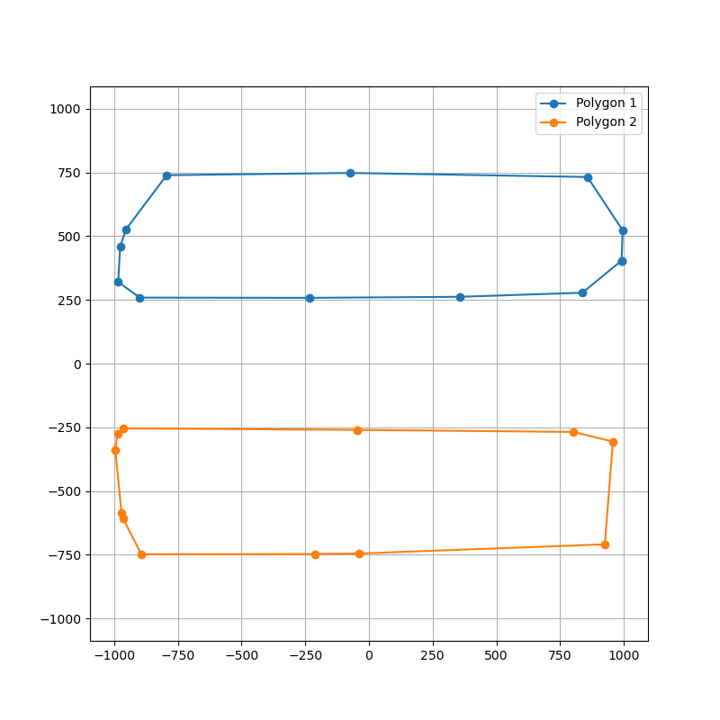
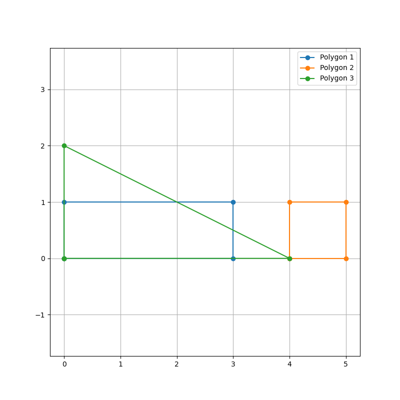

# AcWing 计算几何打卡记录

<span style="color: blue">这个系列还没有完结，最近会不定时更新</span>

## 基础知识

### AcWing 2983. 玩具

严重怀疑数据有问题，暴力 WA，二分能过。

```cpp
#include <iostream>
#include <cstring>
#define x first
#define y second

using namespace std;

const int N = 5010;
typedef long long LL;
typedef pair<LL, LL> PLL;

PLL operator -(PLL a, PLL b) {
    return {a.x - b.x, a.y - b.y};
}

LL operator *(PLL a, PLL b) {
    return a.x * b.y - a.y * b.x;
}

LL area(PLL a, PLL b, PLL c) {
    return (b - a) * (c - a);
}

struct Line {
    PLL u, d;
} a[N];
int res[N];

int main() {
    bool first = true;
    int n, m, x1, y1, x2, y2;
    while (scanf("%d", &n), n) {
        memset(res, 0, sizeof(res));
        scanf("%d%d%d%d%d", &m, &x1, &y1, &x2, &y2);
        for (int i = 1; i <= n; ++i) {
            int u, l;
            scanf("%d%d", &u, &l);
            a[i] = {{u, y1}, {l, y2}};
        }
        a[0] = {{x1, y1}, {x1, y2}};
        a[n + 1] = {{x2, y1}, {x2, y2}};
        for (int i = 1; i <= m; ++i) {
            PLL p;
            scanf("%lld%lld", &p.x, &p.y);
            int l = 0, r = n;
            while (l < r) {
                int mid = l + r + 1 >> 1;
                if (area(p, a[mid].u, a[mid].d) > 0) l = mid;
                else r = mid - 1;
            }
            res[l]++;
        }
        if (first) first = false;
        else printf("\n");
        for (int i = 0; i <= n; ++i) {
            printf("%d: %d\n", i, res[i]);
        }
    }
    return 0;
}
```
### AcWing 2984. 线段

```cpp
#include <iostream>
#include <cmath>
#define x first
#define y second

using namespace std;
typedef pair<double, double> PDD;
const int N = 110;
const double eps = 1e-8;

struct Line {
    PDD s[2];
} a[N];

int dcmp(double a, double b) {
    if (fabs(a - b) < eps) return 0;
    else if (a < b) return -1;
    else return 1;
}

int sign(double a) {
    if (fabs(a) < eps) return 0;
    else if (a < 0) return -1;
    else return 1;
}

PDD operator - (PDD a, PDD b) {
    return {a.x - b.x, a.y - b.y};
}

double operator * (PDD a, PDD b) {
    return a.x * b.y - a.y * b.x;
}

double area(PDD a, PDD b, PDD c) {
    return (b - a) * (c - a);
}

void solve() {
    int n;
    scanf("%d", &n);
    for (int i = 1; i <= n; ++i) {
        scanf("%lf%lf%lf%lf", &a[i].s[0].x, &a[i].s[0].y, &a[i].s[1].x, &a[i].s[1].y);
    }
    for (int i = 1; i <= n; ++i) {
        for (int t1 = 0; t1 < 2; ++t1) {
            for (int j = 1; j <= n; ++j) {
                for (int t2 = 0; t2 < 2; ++t2) {
                    PDD s = a[i].s[t1], t = a[j].s[t2];
                    if (!dcmp(s.x, t.x) && !dcmp(s.y, t.y)) continue;
                    bool f = true;
                    for (int k = 1; k <= n; ++k) {
                        // cout << s.x << ' ' << s.y << ' ' << t.x << ' ' << t.y << ' ' << a[k].s[0].x << ' ' << a[k].s[0].y << ' ' << a[k].s[1].x << ' ' << a[k].s[1].y << endl;
                        if (sign(area(s, t, a[k].s[0])) * sign(area(s, t, a[k].s[1])) > 0) {
                            // cout << area(s, t, a[k].s[0]) << ' ' << area(s, t, a[k].s[1]) << endl;
                            f = false;
                            break;
                        }
                    }
                    // return;
                    if (f) {
                        printf("Yes!\n");
                        return;
                    }
                }
            }
        }
    }
    printf("No!\n");
}
int main() {
    int T;
    scanf("%d", &T);
    while (T--) {
        solve();
    }
    return 0;
}
```
## 凸包

### AcWing 1401. 围住奶牛

```cpp
#include <iostream>
#include <algorithm>
#include <cmath>
#define x first
#define y second
using namespace std;
typedef pair<double, double> PDD;
const int N = 10010;
const double eps = 1e-8;
PDD a[N];
bool used[N];
int st[N], siz;

PDD operator -(PDD a, PDD b) {
    return {a.x - b.x, a.y - b.y};
}

double operator *(PDD a, PDD b) {
    return a.x * b.y - a.y * b.x;
}

double area(PDD a, PDD b, PDD c) {
    return (b - a) * (c - a);
}

int sign(double val) {
    if (fabs(val) < eps) return 0;
    else if (val < 0) return -1;
    else return 1;
}

double len(PDD a) {
    return sqrt(a.x * a.x + a.y * a.y);
}

int main() {
    int n;
    scanf("%d", &n);
    for (int i = 1; i <= n; ++i) {
        scanf("%lf%lf", &a[i].x, &a[i].y);
    }
    sort(a + 1, a + n + 1);
    for (int i = 1; i <= n; ++i) {
        while (siz >= 2 && sign(area(a[st[siz - 1]], a[st[siz]], a[i])) <= 0) {
            if (sign(area(a[st[siz - 1]], a[st[siz]], a[i])) == -1) used[st[siz]] = false;
            siz--;
        }
        st[++siz] = i;
        used[i] = true;
    }
    used[1] = false;
    for (int i = n - 1; i; --i) {
        if (used[i]) continue;
        while (siz >= 2 && sign(area(a[st[siz - 1]], a[st[siz]], a[i])) <= 0) siz--;
        st[++siz] = i;
    }
    cout << siz << endl;
    double res = 0;
    for (int i = 1; i < siz; ++i) {
        res += len(a[st[i]] - a[st[i + 1]]);
    }
    printf("%.2lf\n", res);
    return 0;
}
```

### AcWing 2935. 信用卡凸包

- long double 要用 `%Lf`；
- 括号套错，被洛谷卡了，这个问题是 GPT 发现的。

```cpp
#include <iostream>
#include <cmath>
#include <algorithm>
#define x first
#define y second
using namespace std;
typedef long double LD;
typedef pair<LD, LD> PDD;
const int N = 40010;
const LD eps = 1e-18;
const LD PI = acosl(-1);

PDD q[N];
int st[N], tp, m;
bool used[N];

PDD operator +(const PDD& a, const PDD& b) {
    return {a.x + b.x, a.y + b.y};
}

PDD operator -(const PDD& a, const PDD& b) {
    return {a.x - b.x, a.y - b.y};
}

LD operator *(const PDD& a, const PDD& b) {
    return a.x * b.y - a.y * b.x;
}

LD len(const PDD& a) {
    return sqrtl(a.x * a.x + a.y * a.y);
}

PDD rotate(const PDD& a, LD t) { // 逆时针旋转
    return {a.x * cosl(t) - a.y * sinl(t), a.x * sinl(t) + a.y * cosl(t)};
}

LD area(const PDD& a, const PDD& b, PDD c) {
    return (b - a) * (c - a);
}

int sign(LD a) {
    if (fabsl(a) < eps) return 0;
    else if (a < 0) return -1;
    else return 1;
}

int main() {
    int n;
    LD a, b, r;
    scanf("%d", &n);
    scanf("%Lf%Lf%Lf", &a, &b, &r);
    PDD diag[2] = {{b / 2 - r, a / 2 - r}, {r - b / 2, a / 2 - r}};
    for (int i = 1; i <= n; ++i) {
        LD px, py, t;
        scanf("%Lf%Lf%Lf", &px, &py, &t);
        q[++m] = PDD(px, py) + rotate(diag[0], t);
        q[++m] = PDD(px, py) + rotate(diag[1], t);
        q[++m] = PDD(px, py) - rotate(diag[0], t);
        q[++m] = PDD(px, py) - rotate(diag[1], t);
    }
    sort(q + 1, q + m + 1);
    for (int i = 1; i <= m; ++i) {
        while (tp >= 2 && sign(area(q[st[tp - 1]], q[st[tp]], q[i])) <= 0) {
            if (sign(area(q[st[tp - 1]], q[st[tp]], q[i])) == -1) used[st[tp--]] = false;
            else tp--;
        }
        st[++tp] = i;
        used[i] = true;
    }
    used[1] = false;
    for (int i = m - 1; i; --i) {
        if (used[i]) continue;
        while (tp >= 2 && sign(area(q[st[tp - 1]], q[st[tp]], q[i])) <= 0) tp--;
        st[++tp] = i;
    }
    LD res = 0;
    for (int i = 1; i < tp; ++i) {
        res += len(q[st[i + 1]] - q[st[i]]);
    }
    printf("%.2Lf\n", res + PI * r * 2);
    return 0;
}
```

## 半平面交

### AcWing 2803. 凸多边形

没想到能出这么多事，被 hack 的两组边界数据如下图



- 交点求错，应该求前两条线的交点是否在这条线的右侧；
- 直接 dcmp 函数返回的 -1 和 1 当 sort 的 cmp，导致 `nan` 和 `inf`；
- 多边形不相交输出 `nan`；
- 交于一点输出 `nan`。

```cpp
#include <iostream>
#include <cmath>
#include <algorithm>
#define x first
#define y second
using namespace std;
typedef pair<double, double> PDD;
const int N = 510;
const double eps = 1e-8;

struct Line {
    PDD s, t;
} a[N];
PDD p[60], ans[N];
int q[N];

int dcmp(double a, double b) {
    if (fabs(a - b) < eps) return 0;
    else if (a < b) return -1;
    else return 1;
}

int sign(double a) {
    if (fabs(a) < eps) return 0;
    else if (a < 0) return -1;
    else return 1;
}

PDD operator -(PDD a, PDD b) {
    return {a.x - b.x, a.y - b.y};
}

PDD operator +(PDD a, PDD b) {
    return {a.x + b.x, a.y + b.y};
}

PDD operator *(PDD a, double t) {
    return {a.x * t, a.y * t};
}

double operator *(PDD a, PDD b) {
    return a.x * b.y - a.y * b.x;
}

double area(PDD a, PDD b, PDD c) {
    return (b - a) * (c - a);
}

PDD get_line_intersection(PDD p, PDD v, PDD q, PDD w) {
    PDD u = p - q;
    double t = (w * u) / (v * w);
    return p + v * t;
}

PDD get_line_intersection(Line a, Line b) {
    return get_line_intersection(a.s, a.t - a.s, b.s, b.t - b.s);    
}

double get_angle(Line a) {
    return atan2(a.t.y - a.s.y, a.t.x - a.s.x);
}

bool cmp(Line a, Line b) {
    double A = get_angle(a), B = get_angle(b);
    return dcmp(A, B) ? A < B : area(a.s, a.t, b.s) < 0;
}

bool on_right(Line a, Line b, Line c) {
    return sign(area(a.s, a.t, get_line_intersection(b, c))) <= 0;
}

int main() {
    int n, m, l = 0;
    scanf("%d", &n);
    for (int i = 1; i <= n; ++i) {
        scanf("%d", &m);
        for (int j = 1; j <= m; ++j) {
            scanf("%lf%lf", &p[j].x, &p[j].y);
        }
        for (int j = 1; j < m; ++j) {
            a[++l] = {p[j], p[j + 1]};
        }
        a[++l] = {p[m], p[1]};    
    }
    sort(a + 1, a + l + 1, cmp);
    int hh = 0, tt = -1;
    for (int i = 1; i <= l; ++i) {
        if (i > 1 && !dcmp(get_angle(a[i]), get_angle(a[i - 1]))) continue;
        while (hh + 1 <= tt && on_right(a[i], a[q[tt - 1]], a[q[tt]])) tt--;
        while (hh + 1 <= tt && on_right(a[i], a[q[hh]], a[q[hh + 1]])) hh++;
        q[++tt] = i;
    }
    while (hh + 1 <= tt && on_right(a[q[hh]], a[q[tt - 1]], a[q[tt]])) tt--;
    while (hh + 1 <= tt && on_right(a[q[tt]], a[q[hh]], a[q[hh + 1]])) hh++;
    q[++tt] = q[hh];
    int len = 0;
    for (int i = hh; i < tt; ++i) {
        ans[++len] = get_line_intersection(a[q[i]], a[q[i + 1]]);
        // cout << q[i] << ' ';
    }
    // cout << endl;
    double res = 0;
    for (int i = 2; i < len; ++i) {
        res += area(ans[1], ans[i], ans[i + 1]);
        // cout << '(' << ans[i].x << ',' << ans[i].y << ')' << ' ';
    }
    // cout << endl;
    res = res / 2;
    printf("%.3lf\n", res);
    return 0;
}
```

### AcWing 2957. 赛车

参考之前[牛客多校的做法](https://invalidnamee.github.io/p/25ncmu2/#h-highway-upgrade-%E8%A1%A5)这道可以直接用单调栈做，因为只需要维护半个半平面交，斜率限定为正。

然后我又写挂了，`a[i].k > a[st[tp]].k` 写成了 `a[i].k > a[i - 1].k`，不知道我当时在想什么……

```cpp
#include <iostream>
#include <algorithm>
#include <vector>

using namespace std;
typedef long long LL;
const int N = 10010;
struct Node
{
    LL k, v;
    int id;     
} a[N];
int st[N], ans[N], tp;
vector<int> t[N];

int main() {
    int n;
    scanf("%d", &n);
    for (int i = 1; i <= n; ++i) {
        scanf("%lld", &a[i].k);
        a[i].id = i;
    }
    for (int i = 1; i <= n; ++i) {
        scanf("%lld", &a[i].v);
    }
    sort(a + 1, a + n + 1, [](Node a, Node b) {
        return a.v == b.v ? a.k < b.k : a.v < b.v;
    });
    for (int i = 1; i <= n; ++i) {
        while (tp > 1 && (a[i].k - a[st[tp]].k) * (a[st[tp - 1]].v - a[st[tp]].v) < (a[st[tp]].k - a[st[tp - 1]].k) * (a[st[tp]].v - a[i].v) || tp && a[i].k > a[st[tp]].k) tp--;
        st[++tp] = i;
    }
    for (int i = 1; i <= tp; ++i) {
        ans[i] = a[st[i]].id;
    }
    sort(ans + 1, ans + tp + 1);
    printf("%d\n", tp);
    for (int i = 1; i <= tp; ++i) {
        if (i == 1) printf("%d", ans[i]);
        else printf(" %d", ans[i]);
    }
    printf("\n");
    return 0;
}
```


## 旋转卡壳

### AcWing 2119. 最佳包裹

我这还没几天又和之前凸包挂在了同一个地方，`used[st[tp]] = false` 而不是 `used[tp] = false`.

成惯犯了……

```cpp
#include <iostream>
#include <algorithm>
#include <cmath>
#define x first
#define y second
using namespace std;
typedef long long LL;
typedef pair<LL, LL> PLL;
const int N = 50010;
PLL a[N];
int st[N], tp;
bool used[N];

PLL operator -(PLL a, PLL b) {
    return {a.x - b.x, a.y - b.y};
}

LL operator *(PLL a, PLL b) {
    return a.x * b.y - a.y * b.x;
}

LL area(PLL a, PLL b, PLL c) {
    return (b - a) * (c - a);
}

LL get_dis(PLL a, PLL b) {
    return (a.x - b.x) * (a.x - b.x) + (a.y - b.y) * (a.y - b.y);
}

int main() {
    int n;
    scanf("%d", &n);
    for (int i = 1; i <= n; ++i) {
        scanf("%lld%lld", &a[i].x, &a[i].y);
    }
    sort(a + 1, a + n + 1);
    for (int i = 1; i <= n; ++i) {
        while (tp > 1 && area(a[st[tp - 1]], a[st[tp]], a[i]) <= 0) {
            if (area(a[st[tp - 1]], a[st[tp]], a[i]) < 0) used[st[tp]] = false;
            tp--;
        }
        st[++tp] = i;
        used[i] = true;
    }
    used[1] = false;
    for (int i = n - 1; i; --i) {
        if (used[i]) continue;
        while (tp > 1 && area(a[st[tp - 1]], a[st[tp]], a[i]) <= 0) tp--;
        st[++tp] = i;
    }
    tp--;
    if (tp <= 2) {
        printf("%lld\n", get_dis(a[1], a[n]));
    }
    else {
        LL res = 0;
        for (int i = 1, j = 3; i < tp; ++i) {
            while (area(a[st[i]], a[st[i + 1]], a[st[j]]) <= area(a[st[i]], a[st[i + 1]], a[st[j % (tp - 1) + 1]])) j = j % (tp - 1) + 1;
            res = max(res, max(get_dis(a[st[i]], a[st[j]]), get_dis(a[st[i + 1]], a[st[j]])));
        }
        printf("%lld\n", res);
    }
    return 0;
}
```

### AcWing 2142. 最小矩形覆盖

我又又又又把凸包写挂了，这次更严重，不但写出了个 `used[i] = false`，而且 Andrew 第二轮的时候没判断有没有被取过。

```cpp
#include <iostream>
#include <cmath>
#include <algorithm>
#define x first
#define y second

using namespace std;

typedef pair<double, double> PDD;
const int N = 50010;
const double eps = 1e-12;
const double PI = acos(-1);

PDD a[N];
int st[N], tp;
bool used[N];

int sign(double a) {
    if (fabs(a) < eps) return 0;
    else if (a < 0) return -1;
    else return 1;
}

int dcmp(double a, double b) {
    if (fabs(a - b) < eps) return 0;
    else if (a < b) return -1;
    else return 1;
}

PDD operator +(PDD a, PDD b) {
    return {a.x + b.x, a.y + b.y};
}

PDD operator -(PDD a, PDD b) {
    return {a.x - b.x, a.y - b.y};
}

PDD operator *(PDD a, double b) {
    return {a.x * b, a.y * b};
}

PDD operator /(PDD a, double b) {
    return {a.x / b, a.y / b};
}

double operator *(PDD a, PDD b) {
    return a.x * b.y - a.y * b.x;
}

double operator &(PDD a, PDD b) {
    return a.x * b.x + a.y * b.y;
}

double area(PDD a, PDD b, PDD c) {
    return (b - a) * (c - a);
}

double getlen(PDD a) {
    return sqrt(pow(a.x, 2) + pow(a.y, 2));
}

double proj(PDD a, PDD b, PDD c) { // proj_(b - a) (c - b)
    return ((b - a) & (c - b)) / getlen(b - a);
}

PDD rotate(PDD a, double t) {
    return {a.x * cos(t) - a.y * sin(t), a.x * sin(t) + a.y * cos(t)};
}

PDD unit(PDD a) {
    return a / getlen(a);
}

ostream &operator <<(ostream &cout, const PDD &a) {
    cout << '(' << a.x << ',' << a.y << ')';
    return cout;
}

int main() {
    int n;
    scanf("%d", &n);
    for (int i = 1; i <= n; ++i) {
        scanf("%lf%lf", &a[i].x, &a[i].y);
    }
    sort(a + 1, a + n + 1);
    for (int i = 1; i <= n; ++i) {
        while (tp > 1 && sign(area(a[st[tp - 1]], a[st[tp]], a[i])) <= 0) {
            if (sign(area(a[st[tp - 1]], a[st[tp]], a[i])) == -1) used[st[tp]] = false;
            tp--;
        }
        st[++tp] = i;
        used[i] = true;
    }
    used[1] = false;
    for (int i = n; i; --i) {
        if (used[i]) continue;
        while (tp > 1 && sign(area(a[st[tp - 1]], a[st[tp]], a[i])) <= 0) tp--;
        st[++tp] = i;
    }
    tp--;
    double res = 1e18;
    PDD p[4];
    // for (int i = 1; i <= tp; ++i) cout << a[st[i]] << ' ';
    // cout << endl;
    for (int i = 1, j = 3, k = 2, l = 3; i < tp; ++i) {
        PDD &c = a[st[i]], &d = a[st[i + 1]];
        while (dcmp(area(c, d, a[st[j]]), area(c, d, a[st[j % tp + 1]])) < 0) j = j % tp + 1;
        while (dcmp(proj(c, d, a[st[k]]), proj(c, d, a[st[k % tp + 1]])) < 0) k = k % tp + 1;
        if (i == 1) l = j;
        while (dcmp(proj(c, d, a[st[l]]), proj(c, d, a[st[l % tp + 1]])) > 0) l = l % tp + 1;
        PDD &e = a[st[k]], &f = a[st[j]], &g = a[st[l]];
        double h = area(c, d, f) / getlen(d - c), w = ((e - g) & (d - c)) / getlen(d - c);
        if (dcmp(res, h * w) > 0) {
            res = h * w;
            PDD dh = unit(rotate(d - c, PI / 2)) * h;
            p[0] = d + unit(d - c) * proj(c, d, g);
            p[1] = d + unit(d - c) * proj(c, d, e);
            p[2] = p[1] + dh;
            p[3] = p[0] + dh;
        }
    }
    printf("%.5lf\n", res);
    int fir = 0;
    for (int i = 0; i < 4; ++i) {
        // -0.00000 不要背刺我😭
        if (sign(p[i].x) == 0) p[i].x = 0;
        if (sign(p[i].y) == 0) p[i].y = 0;
        if (dcmp(p[fir].y, p[i].y) == 1) fir = i;
        else if (dcmp(p[fir].y, p[i].y) == 0 && dcmp(p[fir].x, p[i].x) == 1) fir = i;
    }
    for (int i = 0; i < 4; ++i) {
        printf("%.5lf %.5lf\n", p[(i + fir) % 4].x, p[(i + fir) % 4].y);
    }
    return 0;
}
```

## 扫描线

### AcWing 3068. 扫描线

又是熟悉的低级错误时间。

- 区间合并跳到下一个区间的时候没初始化左右端点 * 1；
- 有效区间长度为 0 没有特判，越界访问了上一次的第一个区间 * 1。

```cpp
#include <iostream>
#include <algorithm>
#include <vector>
#define x first
#define y second

using namespace std;
typedef long long LL;
typedef pair<int, int> PII;
const int N = 1010;
PII a[N], b[N], t[N];
vector<int> values;
int n;

LL work(int l, int r) {
    int len = 0;
    for (int i = 1; i <= n; ++i) {
        if (a[i].x <= l && b[i].x >= r) {
            t[++len] = {a[i].y, b[i].y};
        }
    }
    if (!len) return 0; // 空的
    sort(t + 1, t + len + 1);
    LL res = 0;
    int L = t[1].x, R = t[1].y;
    for (int i = 2; i <= len; ++i) {
        if (t[i].x <= R) {
            R = max(R, t[i].y);
        }
        else {
            res += R - L;
            L = t[i].x, R = t[i].y;
        }
    }
    res += R - L;
    return res * (r - l);
}

int main() {
    scanf("%d", &n);
    for (int i = 1; i <= n; ++i) {
        scanf("%d%d%d%d", &a[i].x, &a[i].y, &b[i].x, &b[i].y);
        values.emplace_back(a[i].x), values.emplace_back(b[i].x);
    }
    sort(values.begin(), values.end());
    int m = values.size() - 1;
    LL res = 0;
    for (int i = 0; i < m; ++i) {
        if (values[i] != values[i + 1])
            res += work(values[i], values[i + 1]);
    }
    printf("%lld\n", res);
    return 0;
}
```