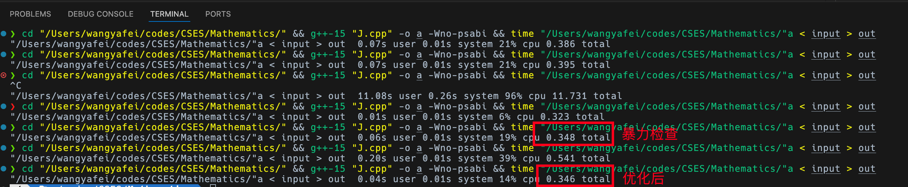

# CSES Mathematics

## Josephus Queries

一个经典问题，一次一次模拟时间上肯定不允许。需要**一次走一轮，一轮一轮走**。

1. 检查 $n = 1$，如果是直接返回 $1$。
2. 检查 $2k$ 是否大于 $n$
   - 如果是，递归 $n = \lceil\frac{n}{2}\rceil, k = k - \lfloor\frac{n}{2}\rfloor$
   - 否则返回 $2k$
3. 根据回溯时候得到的内层的位置推出外层的位置，返回

每次 $n$ 都能砍半，单次最坏 $O\left(\log n\right)$.

```cpp
#include <iostream>
#include <algorithm>

using namespace std;

int work(int n, int k) {
    if (n == 1) return 1;
    else if (k * 2 <= n) return k * 2;
    else {
        int pos = work((n + 1) / 2, k - n / 2);
        if (n & 1) return pos == 1 ? n : pos * 2 - 3;
        else return pos * 2 - 1;
    }
}

int main() {
    ios::sync_with_stdio(0);
    cin.tie(0), cout.tie(0);
    int T;
    cin >> T;
    while (T--) {
        int n, k;
        cin >> n >> k;
        cout << work(n, k) << endl;
    }
    return 0;
}
```

## Exponentiation

平平无奇的快速幂。

```cpp
#include <iostream>

using namespace std;

const int MOD = 1000000007;

int power(int n, int p) {
    int res = 1, base = n;
    while (p) {
        if (p & 1) res = (long long)res * base % MOD;
        base = (long long)base * base % MOD;
        p >>= 1;
    }
    return res;
}

int main() {
    ios::sync_with_stdio(0);
    cin.tie(0), cout.tie(0);
    int t;
    cin >> t;
    while (t--) {
        int a, b;
        cin >> a >> b;
        cout << power(a, b) << endl;
    }
    return 0;
}
```

## Exponentiation II

也是平平无奇的快速幂，指数上对 $10^9 + 7 - 1$ 取模即可。

```cpp
#include <iostream>

using namespace std;

const int MOD = 1000000007;

int power(int n, int p, int MOD) {
    int res = 1, base = n;
    while (p) {
        if (p & 1) res = (long long)res * base % MOD;
        base = (long long)base * base % MOD;
        p >>= 1;
    }
    return res;
}

int main() {
    ios::sync_with_stdio(0);
    cin.tie(0), cout.tie(0);
    int t;
    cin >> t;
    while (t--) {
        int a, b, c;
        cin >> a >> b >> c;
        cout << power(a, power(b, c, MOD - 1), MOD) << endl;
    }
    return 0;
}
```

## Counting Divisors

直接暴力数就行了。当然用线筛的标记数组数会更快一点。

```cpp
#include <iostream>
#include <cmath>

using namespace std;

int main() {
    ios::sync_with_stdio(0);
    cin.tie(0), cout.tie(0);
    int t;
    cin >> t;
    while (t--) {
        int n, l, cnt = 0;
        cin >> n;
        l = sqrt(n);
        for (int i = 1; i <= l; ++i) {
            if (n % i == 0) {
                if (i * i == n) cnt++;
                else cnt += 2;
            }
        }
        cout << cnt << endl;
    }
    return 0;
}
```

## Common Divisors

直接暴力就行，顺着扫一遍，把约数都标记上，如果想标记一个约数的时候发现他已经标记了就尝试更新答案。

```cpp
#include <iostream>
#include <cmath>

using namespace std;

const int M = 1000010;
bool v[M];

int main() {
    ios::sync_with_stdio(0);
    cin.tie(0), cout.tie(0);
    int n, res = 1;
    cin >> n;
    for (int i = 1; i <= n; ++i) {
        int x, l;
        cin >> x;
        l = sqrt(x);
        for (int j = 1; j <= l; ++j) {
            if (x % j == 0) {
                if (v[x / j]) res = max(res, x / j);
                else if (v[j]) res = max(res, j);
                v[j] = v[x / j] = true;
            }
        }
    }
    cout << res << endl;
    return 0;
}
```

## Sum of Divisors

经典的数论分块，答案是

$$
\sum_{i = 1}^{n}{\sum_{j = 1}^{n}\frac{i}{j}}
$$

我们知道随着 i 的增大，$\frac{i}{j}$ 的值最多只有 $\sqrt{n}$，成块状，同一块内可以乘法分配律把 $\frac{i}{j}$ 提出来，另一部分是等差数列求和，每次一段一段的跳就可以 $O\left(\sqrt{n}\right)$ 做完.

```cpp
#include <iostream>

using namespace std;

const int MOD = 1000000007;

int main() {
    ios::sync_with_stdio(0);
    cin.tie(0), cout.tie(0);
    long long n, res = 0;
    cin >> n;
    long long l = 1;
    while (l <= n) {
        long long r = n / (n / l);
        // cout << l << ' ' << r << endl;
        res = (res + (l + r) % MOD * ((r - l + 1) % MOD) % MOD * 500000004 % MOD * (n / l) % MOD) % MOD;
        l = r + 1;
    }
    cout << res << endl;
    return 0;
}
```

## Divisor Analysis

有三个任务，一个一个看

- 统计约数个数，很显然就是 
  $$
  cnt = \prod_{i = 1}^{n}{k_i + 1}
  $$
- 统计约数的和，考虑所有指数下的 $x_i$ 和其他数相乘在求和，全部乘起来结果应该是 
  $$
  s = \prod_{i = 1}^{n}{\prod_{j = 0}^{k}{x_i^j}} = \prod_{i = 1}^{n}{\frac{1 - x_i^{k_i + 1}}{1 - x_i}}
  $$
- 统计约数的乘积，考虑所有的指数下的 $x_i$ 和其他数相乘在相乘，这次全是乘法，所以相当于在指数上做加法
  $$ 
  mul = \prod_{i = 1}^{n}{x_i^{\frac{k * \left(k + 1\right)}{2}\left(cnt - k\right)}},\ \text{其中} cnt \text{是约数的数量}
  $$

实际写代码的时候第三个任务可以用递推的方式剩下在遍历一遍的时间。

```cpp
#include <iostream>
#include <algorithm>

using namespace std;
typedef long long LL;
const int MOD = 1000000007;
const int N = 100010;

LL power(LL n, LL p) {
    LL res = 1, base = n;
    while (p) {
        if (p & 1) res = res * base % MOD;
        base = base * base % MOD;
        p >>= 1;
    }
    return res;
}

int main() {
    ios::sync_with_stdio(0);
    cin.tie(0), cout.tie(0);
    int n;
    LL cnt = 1, s = 1, mul = 1, cntp = 1;
    cin >> n;
    for (int i = 1; i <= n; ++i) {
        LL x, k;
        cin >> x >> k;
        mul = power(mul, k + 1) * power(x, k * (k + 1) / 2 % (MOD - 1) * cntp % (MOD - 1)) % MOD;
        cnt = (cnt * (k + 1)) % MOD;
        cntp = (cntp * (k + 1)) % (MOD - 1);
        s = s * (power(x, k + 1) - 1) % MOD * power(x - 1, MOD - 2) % MOD; 
    }
    cout << cnt << ' ' << s << ' ' << mul << endl;
    return 0;
}
```

## Prime Multiples

这个很简单，容斥一下就行，应该需要防一下爆 long long。

```cpp
#include <iostream>
#include <algorithm>

using namespace std;
typedef long long LL;
const int N = 20;
LL a[N];

int main() {
    ios::sync_with_stdio(0);
    cin.tie(0), cout.tie(0);
    LL n;
    __int128_t res = 0;
    int k;
    cin >> n >> k;
    for (int i = 0; i < k; ++i) cin >> a[i];
    for (int i = 0; i < (1 << k); ++i) {
        LL t = 1, f = 1;
        for (int j = 0; j < k; ++j) {
            if (i >> j & 1) {
                if (__int128_t(t) * a[j] > n) {
                    f = 123;
                    break;
                }
                t *= a[j];
                f *= -1;
            }
        }
        if (f != 123) res += n / t * f;
    }
    cout << n - (LL)res << endl;
    return 0;
}
```

## Counting Coprime Pairs

> [!NOTE]
> 这道题看了题解，我没见过这种套路，我只能想到用 bitset 维护状态然后把不可选的或起来算个数，但是这样时间和空间都正好会爆掉。

线性 DP，先统计出来每个数的个数 $cnt_i$，然后从后往前做维护 $f_i$ 表示最大公约数为 $i$ 的数对个数

$$
f_i = \binom{cnt_i + cnt_{2i} + \dotsb}{2} - f_{2i} - f_{3i} - \dotsb
$$

次数的总和是一个调和级数，时间复杂度 $O(n \log n)$.

```cpp
#include <iostream>
#include <algorithm>

using namespace std;
typedef long long LL;
const int N = 1000010;
LL a[N], f[N];

int main() {
    ios::sync_with_stdio(0);
    cin.tie(0), cout.tie(0);
    int n;
    cin >> n;
    for (int i = 0; i < n; ++i) {
        int t;
        cin >> t;
        a[t]++;
    }
    for (int i = 1000000; i; --i) {
        LL cnt = 0;
        for (int j = 1; i * j <= 1000000; ++j) {
            cnt += a[i * j];
        }
        f[i] = cnt * (cnt - 1) / 2;
        for (int j = 2; i * j <= 1000000; ++j) {
            f[i] -= f[i * j];
        }
    }
    cout << f[1] << endl;
    return 0;
}
```

## Next Prime

> [!NOTE]
> 这道也看了题解，但是我真的很不理解为什么能变快。

考虑到素数的个数大概是 $\frac{n}{\ln{n}}$ 级别的，直接暴力往后找按理说很快就能找到。<span style="color: red">BUT</span>，我暴力检查 $[2, \sqrt{n}]$ 和用优化后的办法在我本地一个 `348ms` 一个 `346ms`，这完全可以当成是误差了吧，为什么在判题机上一个就 T 飞了，一个跑的飞快，我不能理解。

我的 CPU 是 `Apple M5 (10 + 10)`，系统版本是 `Tahoe 26.2`，g++ 版本是 `15.2.0`。应该可以稳定的复现出来，不理解怎么慢了。



优化素数判断的原理是一个数不在 6 的倍数的两侧那么一定不是素数，所以只判断了在 6 两侧的。

```cpp
#include <iostream>
#include <cmath>

using namespace std;
typedef long long LL;

bool prime(LL n) {
    if (n <= 3) return n > 1;
    if (n % 6 != 1 && n % 6 != 5) return false;
    int l = sqrt(n);
    for (int i = 5; i <= l; i += 6) {
        if (n % i == 0 || n % (i + 2) == 0) return false;
    }
    return true;
}

int main() {
    ios::sync_with_stdio(0);
    cin.tie(0), cout.tie(0);
    int t;
    cin >> t;
    while (t--) {
        LL n;
        cin >> n;
        while (!prime(++n));
        cout << n << endl;
    }
    return 0;
}
```

## Binomial Coefficients

预处理一下逆元然后直接算就行。

```cpp
#include <iostream>

using namespace std;
typedef long long LL;

const int N = 1000010, MOD = 1000000007;
LL p[N], inv[N];

LL power(LL n, LL p) {
    LL res = 1, base = n;
    while (p) {
        if (p & 1) res = res * base % MOD;
        base = base * base % MOD;
        p >>= 1;
    }
    return res;
}

void init() {
    int n = 1000000;
    inv[0] = p[0] = 1;
    for (int i = 1; i <= n; ++i) p[i] = p[i - 1] * i % MOD;
    inv[n] = power(p[n], MOD - 2);
    for (int i = n - 1; i; --i) inv[i] = inv[i + 1] * (i + 1) % MOD;
}

int main() {
    ios::sync_with_stdio(0);
    cin.tie(0), cout.tie(0);
    init();
    int t;
    cin >> t;
    while (t--) {
        int n, m;
        cin >> n >> m;
        cout << p[n] * inv[m] % MOD * inv[n - m] % MOD << endl;
    }
    return 0;
}
```

## Creating Strings II

先 $\mathrm{A}_n^n$ 排列一下，然后相同字母是无序的，在除掉字母的顺序。假设把所有字母映射到了 $[0, 25]$，每个字母的数量用 $m_i$ 表示，那么答案就是

$$
\frac{\mathrm{A}_n^n}{\prod_{i = 0}^{25}{\mathrm{A}_{m_i}^{m_i}}}
$$

```cpp
#include <iostream>

using namespace std;
typedef long long LL;

const int N = 1000010, MOD = 1000000007;
LL p[N], inv[N];
int cnt[26];

LL power(LL n, LL p) {
    LL res = 1, base = n;
    while (p) {
        if (p & 1) res = res * base % MOD;
        base = base * base % MOD;
        p >>= 1;
    }
    return res;
}

void init() {
    int n = 1000000;
    inv[0] = p[0] = 1;
    for (int i = 1; i <= n; ++i) p[i] = p[i - 1] * i % MOD;
    inv[n] = power(p[n], MOD - 2);
    for (int i = n - 1; i; --i) inv[i] = inv[i + 1] * (i + 1) % MOD;
}

int main() {
    ios::sync_with_stdio(0);
    cin.tie(0), cout.tie(0);
    init();
    string s;
    cin >> s;
    for (char c : s) cnt[c - 'a']++;
    LL res = p[s.length()];
    for (int t : cnt) {
        res = res * inv[t] % MOD;
    }
    cout << res << endl;
    return 0;
}
```

## Distributing Apples

隔板法，给每个板子上附带一个球保证允许一组内苹果数量是 0。

```cpp
#include <iostream>

using namespace std;
typedef long long LL;

const int N = 2000010, MOD = 1000000007;
LL p[N], inv[N];

LL power(LL n, LL p) {
    LL res = 1, base = n;
    while (p) {
        if (p & 1) res = res * base % MOD;
        base = base * base % MOD;
        p >>= 1;
    }
    return res;
}

void init() {
    int n = 2000000; // 注意把范围开两倍
    inv[0] = p[0] = 1;
    for (int i = 1; i <= n; ++i) p[i] = p[i - 1] * i % MOD;
    inv[n] = power(p[n], MOD - 2);
    for (int i = n - 1; i; --i) inv[i] = inv[i + 1] * (i + 1) % MOD;
}

LL C(int n, int m) {
    return p[n] * inv[m] % MOD * inv[n - m] % MOD;
}

int main() {
    ios::sync_with_stdio(0);
    cin.tie(0), cout.tie(0);
    init();
    int n, m;
    cin >> n >> m;
    cout << C(m + n - 1, n - 1) << endl;
    return 0;
}
```

## Christmas Party

到这里已经继承了上面的一大坨预处理代码一路了……

容斥原理，答案 = 不限制所有的 - 限制一个数必须在他位置 + 限制两个数必须在他位置 - 限制三个数必须在他位置……，即

$$
\sum_{i = 0}^{n}{\left(-1\right)^i\mathrm{C}_n^i \mathrm{A}_{n - i}^{n - i}}
$$

```cpp
#include <iostream>

using namespace std;
typedef long long LL;

const int N = 1000010, MOD = 1000000007;
LL p[N], inv[N];
int cnt[26];

LL power(LL n, LL p) {
    LL res = 1, base = n;
    while (p) {
        if (p & 1) res = res * base % MOD;
        base = base * base % MOD;
        p >>= 1;
    }
    return res;
}

void init() {
    int n = 1000000;
    inv[0] = p[0] = 1;
    for (int i = 1; i <= n; ++i) p[i] = p[i - 1] * i % MOD;
    inv[n] = power(p[n], MOD - 2);
    for (int i = n - 1; i; --i) inv[i] = inv[i + 1] * (i + 1) % MOD;
}

LL C(int n, int m) {
    return p[n] * inv[m] % MOD * inv[n - m] % MOD;
}

int main() {
    ios::sync_with_stdio(0);
    cin.tie(0), cout.tie(0);
    init();
    int n;
    cin >> n;
    LL res = 0;
    for (int i = 0, f = 1; i <= n; ++i, f *= -1) {
        res = ((res + C(n, i) * p[n - i] * f % MOD) + MOD) % MOD;
    }
    cout << res << endl;
    return 0;
}
```

## Permutation Order

这个其实就是统计一下阶乘从前往后模拟。枚举到第 $i$ 位的时候我们知道这一位差一个 $1$，$k$ 就会差 $\left(n - i\right)!$，第一类查询就是看看 $k$ 最多能减几个阶乘就选剩余的第几个数，第二类是检查剩余的数有几个比他小就给 $k$ 加上这个阶乘的几倍。

```cpp
#include <iostream>
#include <cstring>

using namespace std;

typedef long long LL;

const int N = 30;
LL p[N];
bool v[N];

void init() {
    int n = 20;
    p[0] = 1;
    for (int i = 1; i <= n; ++i) {
        p[i] = p[i - 1] * i;
    }
}

void solve1() {
    int n;
    LL k;
    cin >> n >> k;
    memset(v, 0, sizeof(bool) * (n + 1));
    k--;
    for (int i = 1; i <= n; ++i) {
        int t = k / p[n - i] + 1;
        for (int j = 1; j <= n; ++j) {
            if (!v[j] && --t == 0) {
                cout << j << ' ';
                v[j] = true;
                break;
            }
        }
        k %= p[n - i];
    }
    cout << endl;
}

void solve2() {
    int n;
    LL k = 0;
    cin >> n;
    memset(v, 0, sizeof(bool) * (n + 1));
    for (int i = 1; i <= n; ++i) {
        int a;
        cin >> a;
        for (int j = 1; j < a; ++j) {
            if (!v[j]) k += p[n - i];
        }
        v[a] = true;
    }
    cout << k + 1 << endl;
}

int main() {
    ios::sync_with_stdio(0);
    cin.tie(0), cout.tie(0);
    init();
    int T;
    cin >> T;
    while (T--) {
        int op;
        cin >> op;
        op == 1 ? solve1() : solve2();
    }
    return 0;
}
```

## Permutation Rounds

求所有环长的 LCM 即可。

```cpp
#include <iostream>
#include <map>
#include <cmath>

using namespace std;

typedef long long LL;
const int N = 200010;
const int MOD = 1000000007;

map<int, int> mp;
int ne[N];
bool vis[N];

LL power(LL n, LL p) {
    LL res = 1, base = n;
    while (p) {
        if (p & 1) res = res * base % MOD;
        base = base * base % MOD;
        p >>= 1;
    }
    return res;
}

void work(int n) {
    int l = sqrt(n);
    for (int i = 2; i <= l; ++i) {
        if (n % i == 0) {
            int t = 0;
            while (n % i == 0) {
                n /= i;
                t++;
            }
            mp[i] = max(mp[i], t);
        }
    }
    if (n != 1) mp[n] = max(mp[n], 1);
}

int main() {
    ios::sync_with_stdio(0);
    cin.tie(0), cout.tie(0);
    int n;
    cin >> n;
    for (int i = 1; i <= n; ++i) {
        cin >> ne[i];
    }
    for (int i = 1; i <= n; ++i) {
        if (!vis[i]) {
            int t = 0, x = i;
            while (!vis[x]) {
                vis[x] = true;
                x = ne[x];
                t++;
            }
            work(t);
        }
    }
    LL res = 1;
    for (auto [k, v] : mp) {
        res = res * power(k, v) % MOD;
    }
    cout << res << endl;
    return 0;
}
```

## Bracket Sequences I

> [!NOTE]
> 这道题看了题解，推出来一个小性质之后不会优化了。

首先如果 $n$ 是奇数直接是 $0$。偶数的情况先把 $n$ 除以 $2$，设 $f_i$ 为 $n = i$ 时候的方案数有

$$
f_i = \sum_{j = 1}^{i}{f_{j - 1} f_{i - j}}
$$

然后我自己做的时候就没有然后了。他是个 Catalan 数，有公式 $\frac{1}{n + 1}\binom{2n}{n}$，然后就做完了。

```cpp
#include <iostream>

using namespace std;
typedef long long LL;

const int N = 2000010, MOD = 1000000007;
LL p[N], inv[N];
int cnt[26];

LL power(LL n, LL p) {
    LL res = 1, base = n;
    while (p) {
        if (p & 1) res = res * base % MOD;
        base = base * base % MOD;
        p >>= 1;
    }
    return res;
}

void init() {
    int n = 2000000;
    inv[0] = p[0] = 1;
    for (int i = 1; i <= n; ++i) p[i] = p[i - 1] * i % MOD;
    inv[n] = power(p[n], MOD - 2);
    for (int i = n - 1; i; --i) inv[i] = inv[i + 1] * (i + 1) % MOD;
}

LL C(int n, int m) {
    return p[n] * inv[m] % MOD * inv[n - m] % MOD;
}

int main() {
    ios::sync_with_stdio(0);
    cin.tie(0), cout.tie(0);
    init();
    int n;
    cin >> n;
    if (n & 1) cout << 0 << endl;
    else cout << power(n / 2 + 1, MOD - 2) * C(n, n / 2) % MOD << endl;
    return 0;
}
```

## Bracket Sequences II

> [!NOTE]
> 这道题没看题解，但是问了 Gemini，也算是看了题解了吧。

首先非法情况输出 $0$，包括 $n$ 是奇数，前面的左括号超过一半了和前面左右括号已经不能匹配了这三种情况。之后考虑剩下的，设还剩下 $m$ 个，前面还有 $p$ 个 `(` 没有配对。现在我们要做的等同于**在一个坐标轴上从 p 开始走 m 步，走到 0，且中间不能穿到负半轴**。

- 首先如果不考虑负半轴那么答案就是
  $$
  \binom{m}{\frac{m - p}{2}}
  $$

- 只要经过了 $-1$ 就一定穿到了负半轴，根据反射原理，**把起点关于 $-1$ 对称过去，从这个对称点走到 $0$ 和从原来的点走到 $0$ 且必须经过 $-1$ 等价**，不合法的情况的情况相当于从 $m - p - 2$ 开始走 $m$ 步走到 $0$ 的方案个数
  $$
  \binom{m}{\frac{m - 2 - p}{2}}
  $$

答案是

$$
\binom{m}{\frac{m - p}{2}} - \binom{m}{\frac{m - 2 - p}{2}}
$$

```cpp
#include <iostream>

using namespace std;
typedef long long LL;

const int N = 2000010, MOD = 1000000007;
LL p[N], inv[N];

LL power(LL n, LL p) {
    LL res = 1, base = n;
    while (p) {
        if (p & 1) res = res * base % MOD;
        base = base * base % MOD;
        p >>= 1;
    }
    return res;
}

void init() {
    int n = 2000000;
    inv[0] = p[0] = 1;
    for (int i = 1; i <= n; ++i) p[i] = p[i - 1] * i % MOD;
    inv[n] = power(p[n], MOD - 2);
    for (int i = n - 1; i; --i) inv[i] = inv[i + 1] * (i + 1) % MOD;
}

LL C(int n, int m) {
    return p[n] * inv[m] % MOD * inv[n - m] % MOD;
}

int main() {
    ios::sync_with_stdio(0);
    cin.tie(0), cout.tie(0);
    init();
    int n;
    string s;
    cin >> n >> s;
    if (n & 1) cout << 0 << endl;
    else {
        int ps = 0;
        for (char c : s) {
            ps += c == '(' ? 1 : -1;
            if (ps < 0 || ps > n / 2) {
                cout << 0 << endl;
                return 0;
            }
        }
        int m = n - s.length();
        cout << (C(m, (m - ps) / 2) - C(m, (m - 2 - ps) / 2) + MOD) % MOD << endl;
    }
    return 0;
}
```

## Counting Necklaces

> [!NOTE]
> 这道也看了题解。

[伯恩赛德引理](https://baike.baidu.com/item/%E4%BC%AF%E6%81%A9%E8%B5%9B%E5%BE%B7%E5%BC%95%E7%90%86/8939639)。按照我的理解应该是假设有 $n$ 种旋转的可能，第 $i$ 种可能有 $c\left(i\right)$ 种方案能保持和原状态一样，那么总的方案个数就是

$$
\sum_{i = 1}^{n}{\frac{c\left(i\right)}{n}}
$$

对应到这道题上就是转 0 次到转 n - 1 次，保持不变能接受的乱序的最大的块大小就是 $\gcd\left(i, n\right)$，答案是

$$
\sum_{i = 0}^{n - 1}{\frac{m^{\gcd\left(i, n\right)}}{n}}
$$

```cpp
#include <iostream>

using namespace std;

typedef long long LL;
const int MOD = 1000000007;

LL power(LL n, LL p) {
    LL res = 1, base = n;
    while (p) {
        if (p & 1) res = res * base % MOD;
        base = base * base % MOD;
        p >>= 1;
    }
    return res;
}

int gcd(int a, int b) {
    return b ? gcd(b, a % b) : a;
}

int main() {
    ios::sync_with_stdio(0);
    cin.tie(0), cout.tie(0);
    int n, m;
    cin >> n >> m;
    LL res = 0;
    for (int i = 0; i < n; ++i) {
        res = (res + power(m, gcd(n, i))) % MOD;
    }
    cout << res * power(n, MOD - 2) % MOD << endl;
    return 0;
}
```

## Counting Grids

和上道题一个原理，把上一道的直接迁移过来用就行，一共只有三种状态，初始状态是 $2^{n * n}$，旋转 $180\degree$ 是一半上取整，旋转 $90\degree$ 和 $270\degree$ 是四分之一上取整。答案是

$$
\frac{1}{4} \left(2^{n^2} + 2^{\lceil\frac{n^2}{2}\rceil} + 2^{\lceil\frac{n^2}{4}\rceil + 1}\right)
$$

```cpp
#include <iostream>

using namespace std;

typedef long long LL;
const int MOD = 1000000007;

LL power(LL n, LL p) {
    LL res = 1, base = n;
    while (p) {
        if (p & 1) res = res * base % MOD;
        base = base * base % MOD;
        p >>= 1;
    }
    return res;
}

int main() {
    ios::sync_with_stdio(0);
    cin.tie(0), cout.tie(0);
    LL n;
    cin >> n;
    cout << (power(2, n * n) + power(2, (n * n + 1) / 2) + power(2, (n * n + 3) / 4) * 2) * power(4, MOD - 2) % MOD << endl;
    return 0;
}
```

## Fibonacci Numbers

经典的矩阵快速幂。

```cpp
#include <iostream>
#include <cstring>

using namespace std;

typedef long long LL;
const int MOD = 1000000007, N = 2;
LL a[N][N] = {
    {0, 1},
    {1, 1}
}, b[N][N];
LL v1[N] = {0, 1}, v2[N];

void mul1() {
    memset(v2, 0, sizeof(v2));
    v2[0] = (v1[0] * a[0][0] + v1[1] * a[1][0]) % MOD;
    v2[1] = (v1[0] * a[0][1] + v1[1] * a[1][1]) % MOD;
    memcpy(v1, v2, sizeof(v1));
}

void mul2() {
    memset(b, 0, sizeof(b));
    for (int k = 0; k < N; ++k)
        for (int i = 0; i < N; ++i)
            for (int j = 0; j < N; ++j)
                b[i][j] = (b[i][j] + a[i][k] * a[k][j]) % MOD;
    memcpy(a, b, sizeof(a));
}

int main() {
    ios::sync_with_stdio(0);
    cin.tie(0), cout.tie(0);
    LL n;
    cin >> n;
    while (n) {
        if (n & 1) mul1();
        mul2();
        n >>= 1;
    }
    cout << v1[0] << endl;
    return 0;
}
```

## Throwing Dice

仍然是矩阵快速幂，递推式如下

$$
\begin{bmatrix}
    v_0 & v_1 & v_2 & v_3 & v_4 & v_5
\end{bmatrix}
\begin{bmatrix}
    0 & 0 & 0 & 0 & 0 & 1\\
    1 & 0 & 0 & 0 & 0 & 1\\
    0 & 1 & 0 & 0 & 0 & 1\\
    0 & 0 & 1 & 0 & 0 & 1\\
    0 & 0 & 0 & 1 & 0 & 1\\
    0 & 0 & 0 & 0 & 1 & 1\\
\end{bmatrix}
=
\begin{bmatrix}
    v_1 & v_2 & v_3 & v_4 & v_5 & v_6
\end{bmatrix}
$$

```cpp
#include <iostream>
#include <cstring>

using namespace std;

typedef long long LL;
const int MOD = 1000000007, N = 6;
LL a[N][N] = {
    {0, 0, 0, 0, 0, 1},
    {1, 0, 0, 0, 0, 1},
    {0, 1, 0, 0, 0, 1},
    {0, 0, 1, 0, 0, 1},
    {0, 0, 0, 1, 0, 1},
    {0, 0, 0, 0, 1, 1}
}, b[N][N];
LL v1[N] = {1, 1, 2, 4, 8, 16}, v2[N];

void mul1() {
    memset(v2, 0, sizeof(v2));
    for (int i = 0; i < N; ++i)
        for (int j = 0; j < N; ++j)
            v2[i] = (v2[i] + v1[j] * a[j][i]) % MOD;
    memcpy(v1, v2, sizeof(v1));
}

void mul2() {
    memset(b, 0, sizeof(b));
    for (int k = 0; k < N; ++k)
        for (int i = 0; i < N; ++i)
            for (int j = 0; j < N; ++j)
                b[i][j] = (b[i][j] + a[i][k] * a[k][j]) % MOD;
    memcpy(a, b, sizeof(a));
}

int main() {
    ios::sync_with_stdio(0);
    cin.tie(0), cout.tie(0);
    LL n;
    cin >> n;
    if (n < 6) {
        cout << v1[n] << endl;
    }
    else {
        n -= 5;
        while (n) {
            if (n & 1) mul1();
            mul2();
            n >>= 1;
        }
        cout << v1[5] << endl;
    }
    return 0;
}
```

## Graph Paths I

仍然是矩阵快速幂的经典的用法，邻接矩阵的值存路径条数直接求 n 次方即可。

```cpp
#include <iostream>
#include <cstring>

using namespace std;

typedef long long LL;
const int MOD = 1000000007, N = 100;
LL a[N][N], b[N][N], c[N][N], d[N][N];

void mul1() {
    memset(d, 0, sizeof(d));
    for (int k = 0; k < N; ++k)
        for (int i = 0; i < N; ++i)
            for (int j = 0; j < N; ++j)
                d[i][j] = (d[i][j] + c[i][k] * a[k][j]) % MOD;
    memcpy(c, d, sizeof(c));
}

void mul2() {
    memset(b, 0, sizeof(b));
    for (int k = 0; k < N; ++k)
        for (int i = 0; i < N; ++i)
            for (int j = 0; j < N; ++j)
                b[i][j] = (b[i][j] + a[i][k] * a[k][j]) % MOD;
    memcpy(a, b, sizeof(a));
}

int main() {
    ios::sync_with_stdio(0);
    cin.tie(0), cout.tie(0);
    int n, m, k;
    cin >> n >> m >> k;
    for (int i = 1; i <= m; ++i) {
        int x, y;
        cin >> x >> y;
        a[--x][--y]++;
    }
    for (int i = 0; i < n; ++i) c[i][i] = 1;
    while (k) {
        if (k & 1) mul1();
        mul2();
        k >>= 1;
    }
    cout << c[0][n - 1] << endl;
    return 0;
}
```

## Graph Paths II

仍然是矩阵快速幂，但是变成了广义矩阵，`+` 和 `min` 组成的代数系统满足对 `+` 满足结合律，`+` 对 `min` 满足分配律，所以正常矩阵的性质可以套过来用。

```cpp
#include <iostream>
#include <cstring>

using namespace std;

typedef long long LL;
const int N = 100;
LL a[N][N], b[N][N], c[N][N], d[N][N];
int n, m, k;

void mul1() {
    memset(d, 0x3f, sizeof(d));
    for (int k = 0; k < n; ++k)
        for (int i = 0; i < n; ++i)
            for (int j = 0; j < n; ++j)
                d[i][j] = min(d[i][j], c[i][k] + a[k][j]);
    memcpy(c, d, sizeof(c));
}

void mul2() {
    memset(b, 0x3f, sizeof(b));
    for (int k = 0; k < n; ++k)
        for (int i = 0; i < n; ++i)
            for (int j = 0; j < n; ++j)
                b[i][j] = min(b[i][j], a[i][k] + a[k][j]);
    memcpy(a, b, sizeof(a));
}

int main() {
    ios::sync_with_stdio(0);
    cin.tie(0), cout.tie(0);
    cin >> n >> m >> k;
    memset(a, 0x3f, sizeof(a));
    memset(c, 0x3f, sizeof(c));
    for (int i = 1; i <= m; ++i) {
        int x, y, z;
        cin >> x >> y >> z;
        x--, y--;
        a[x][y] = min(a[x][y], (LL)z);
    }
    for (int i = 0; i < n; ++i) c[i][i] = 0;
    while (k) {
        if (k & 1) mul1();
        mul2();
        k >>= 1;
    }
    cout << (c[0][n - 1] == 0x3f3f3f3f3f3f3f3f ? -1 : c[0][n - 1]) << endl;
    return 0;
}
```

## System of Linear Equations

高斯消元的板子，学过线性代数应该都能会。

```cpp
#include <iostream>
#include <cstring>

using namespace std;
typedef long long LL;
const int N = 510, MOD = 1000000007;

LL power(LL n, LL p) {
    LL res = 1, base = n;
    while (p) {
        if (p & 1) res = res * base % MOD;
        base = base * base % MOD;
        p >>= 1;
    }
    return res;
}

LL a[N][N], res[N];
int l[N];

int main() {
    ios::sync_with_stdio(0);
    cin.tie(0), cout.tie(0);
    int n, m;
    cin >> n >> m;
    for (int i = 1; i <= n; ++i) {
        for (int j = 1; j <= m + 1; ++j) {
            cin >> a[i][j];
        }
    }
    for (int i = 1; i <= n; ++i) {
        int t = 0;
        l[i] = m + 1;
        for (int j = i; j <= n; ++j) {
            for (int k = l[i - 1] + 1; k <= m; ++k) {
                if (a[j][k]) {
                    if (k < l[i]) {
                        t = j, l[i] = k;
                    }
                    break;
                }
            }
        }
        if (!t) break;
        swap(a[i], a[t]);
        LL inv = power(a[i][l[i]], MOD - 2);
        for (int j = l[i]; j <= m + 1; ++j) a[i][j] = (a[i][j] * inv) % MOD;
        for (int j = i + 1; j <= n; ++j) {
            if (a[j][l[i]]) {
                inv = power(a[j][l[i]], MOD - 2);
                for (int k = l[i]; k <= m + 1; ++k) a[j][k] = (a[j][k] * inv % MOD - a[i][k] + MOD) % MOD;
            }
        }
    }
    for (int i = n; i; --i) {
        if (l[i] == m + 1) continue;
        else {
            for (int j = 1; j <= i - 1; ++j) {
                if (a[j][l[i]]) {
                    LL t = a[j][l[i]];
                    for (int k = l[i]; k <= m + 1; ++k) a[j][k] = ((a[j][k] - t * a[i][k]) % MOD + MOD) % MOD;
                }
            }
        }
    }
    memset(res, -1, sizeof(res));
    bool f = true;
    for (int i = 1; i <= n; ++i) {
        if (l[i] == m + 1) {
            if (a[i][m + 1]) {
                f = false;
                break;
            }
            else continue;
        }
        if (res[l[i]] != -1 && res[l[i]] != a[i][m + 1]) {
            f = false;
            break;
        }
        else res[l[i]] = a[i][m + 1];
    }
    if (f) {
        for (int i = 1; i <= m; ++i) {
            if (~res[i]) cout << res[i] << ' ';
            else cout << 0 << ' ';
        }
        cout << endl;
    }
    else cout << -1 << endl;
    return 0;
}
```

## Sum of Four Squares<span style="color: red">PROBLEM</span>

有一个很显然但是时间复杂度比较危险的做法，从前往后把这个 $10^7$ 个数全 DP 一遍。然后我就想从大到小枚举平方数以第一个遇到的为准，找到一个之后就直接不找了，没想到这个神秘的小优化跑的非常快，而且还是对的，

```cpp
#include <iostream>
#include <cmath>

using namespace std;

const int N = 10000010;
int f[N], g[N];

void init() {
    f[0] = 0;
    for (int i = 1; i <= 10000000; ++i) {
        for (int j = sqrt(i); j; --j) {
            int t = i - j * j;
            if (f[t] < 4) {
                f[i] = f[t] + 1;
                g[i] = t;
                break;
            }
        }
    }
}

int main() {
    ios::sync_with_stdio(0);
    cin.tie(0), cout.tie(0);
    init();
    int t;
    cin >> t;
    while (t--) {
        int n;
        cin >> n;
        for (int i = 0; i < 4; ++i) {
            cout << (int)sqrt(n - g[n]) << ' ';
            n = g[n];
        }
        cout << endl;
    }
    return 0;
}
```

## Triangle Number Sums

> [!NOTE]
> 这道题看了题解

Eureka Theorem 说一个数一定可以由不多于三个的 Triangle Numbers 的和表示，现在答案已经限制在 $\{1, 2, 3\}$ 了。

- 验证答案是否为 1: 直接二分查找验证一下
- 验证答案是否为 2: 双指针扫一遍即可
- 如果都不满足那就是 3

```cpp
#include <iostream>
#include <algorithm>
#include <vector>

using namespace std;
typedef long long LL;
const int N = 10000010;

vector<LL> v;
void init() {
    LL n = 1000000000000;
    for (LL i = 1, j = 1; j <= n; j += ++i) {
        v.emplace_back(j);
    }
}

int main() {
    ios::sync_with_stdio(0);
    cin.tie(0), cout.tie(0);
    init();
    int t;
    cin >> t;
    while (t--) {
        LL n;
        cin >> n;
        if (*lower_bound(v.begin(), v.end(), n) == n) cout << 1 << endl;
        else {
            bool f = false;
            for (int l = 0, r = v.size() - 1; l <= r; ) {
                if (v[l] + v[r] == n) {
                    f = true;
                    cout << 2 << endl;
                    break;
                }
                else if (v[l] + v[r] > n) r--;
                else l++;
            }
            if (!f) cout << 3 << endl;
        }
    }
    return 0;
}
```

## Dice Probability

这就是一个简单的二维 DP，但是要小心爆精度。

```cpp
#include <iostream>
#include <iomanip>
#include <cmath>

using namespace std;

const int N = 110;
const long double eps = 1e-18;
long double f[N][N * 6];

int main() {
    ios::sync_with_stdio(0);
    cin.tie(0), cout.tie(0);
    int n, a, b;
    cin >> n >> a >> b;
    f[0][0] = 1;
    for (int i = 0; i < n; ++i) {
        for (int j = 0; j <= n * 6; ++j) {
            if (fabs(f[i][j]) >= eps)  {
                for (int k = 1; k <= 6; ++k) {
                    f[i + 1][j + k] += f[i][j] / 6;
                }
            }
        }
    }
    double res = 0;
    for (int i = a; i <= b; ++i) {
        res += f[n][i];
    }
    cout << fixed << setprecision(6) << res << endl;
    return 0;
}
```

## Moving Robots

可以分别计算每个机器人走 $k$ 步后在每个位置的概率，最后把每个位置上不在的概率乘起来相加统计答案。

```cpp
#include <iostream>
#include <iomanip>
#include <vector>

using namespace std;
typedef long double LD;
const int N = 110, M = 8;
LD f[M * M][N][M][M];

LD calc(int i, int j) {
    if ((i == 0 || i == 7) && (j == 0 || j == 7)) return 1.0 / 2;
    else if (i == 0 || i == 7 || j == 0 || j == 7) return 1.0 / 3;
    else return 1.0 / 4;
}

int main() {
    ios::sync_with_stdio(0);
    cin.tie(0), cout.tie(0);
    int k;
    cin >> k;
    for (int i = 0; i < 8; ++i) {
        for (int j = 0; j < 8; ++j) {
            f[i * 8 + j][0][i][j] = 1;
        }
    }
    for (int o = 0; o < 64; ++o) {
        for (int l = 1; l <= k; ++l) {
            for (int i = 0; i < 8; ++i) {
                for (int j = 0; j < 8; ++j) {
                    if (i - 1 >= 0) f[o][l][i][j] += f[o][l - 1][i - 1][j] * calc(i - 1, j);
                    if (i + 1 < 8) f[o][l][i][j] += f[o][l - 1][i + 1][j] * calc(i + 1, j);
                    if (j - 1 >= 0) f[o][l][i][j] += f[o][l - 1][i][j - 1] * calc(i, j - 1);
                    if (j + 1 < 8) f[o][l][i][j] += f[o][l - 1][i][j + 1] * calc(i, j + 1);
                }
            }
        }
    }
    LD res = 0;
    for (int i = 0; i < 8; ++i) {
        for (int j = 0; j < 8; ++j) {
            LD t = 1.0;
            for (int o = 0; o < 64; ++o) {
                t *= 1.0 - f[o][k][i][j];
            }
            res += t;
        }
    }
    cout << fixed << setprecision(6) << res << endl;
    return 0;
}
```

## Candy Lottery

利用一下容斥，最大值是 $i$ 的概率等于全部不大于 $i$ 的概率减全部不大于 $i - 1$ 的概率，套入期望的公式里面答案应该是

$$
\sum_{i = 1}^{k}i\cdot\left[\left(\frac{i}{k}\right)^n - \left(\frac{i - 1}{k}\right)^n\right]
$$

```cpp
#include <iostream>
#include <iomanip>
#include <cmath>

using namespace std;

int main() {
    ios::sync_with_stdio(0);
    cin.tie(0), cout.tie(0);
    int n, k;
    cin >> n >> k;
    double res = 0, pre = 0;
    for (int i = 1; i <= k; ++i) {
        double p = pow((double)i / k, n);
        res += (p - pre) * i;
        pre = p;
    }
    cout << fixed << setprecision(6) << res << endl;
    return 0;
}
```

## Inversion Probability

思路完全没难度，直接暴力做都行，但是卡精度是真恶心，官方数据疑似有问题，我全用 Python 的整型算这都能错？？这是肯定不会错的 Python 代码。

```python
from fractions import Fraction
import sys
sys.set_int_max_str_digits(10 ** 5)

n = int(input())
r = list(map(int, input().split()))

res = Fraction(0, 1)
for i in range(n):
    for j in range(i):
        s = 0
        for cur in range(1, r[i] + 1):
            if r[j] > cur:
                s += (r[j] - cur)
        res += Fraction(s, r[i] * r[j])
a, b = res.numerator, res.denominator
aa, bb = a // b, 0
a %= b
for _ in range(6):
    a *= 10
    bb = bb * 10 + a // b
    a %= b
if a * 10 // b > 5 or a * 10 // b == 5 and bb % 2 == 1:
    bb += 1
    aa += bb // 10 ** 6
    bb %= 10 ** 6
print(f"{aa}.{bb:06d}")
```

这是会错但是知码开门加了 spj 后能过的 C++ 代码

```cpp
#include <iostream>
#include <iomanip>

using namespace std;

const int N = 110;
double p[N];
int r[N];

int main() {
    ios::sync_with_stdio(0);
    cin.tie(0), cout.tie(0);
    int n;
    double res = 0;
    cin >> n;
    for (int i = 1; i <= n; ++i) {
        cin >> r[i];
    }
    for (int i = n; i; --i) {
        for (int j = 1; j <= r[i]; ++j) {
            res += p[j] * (r[i] - j) / r[i];
        }
        for (int j = 1; j <= r[i]; ++j) {
            p[j] += 1.0 / r[i];
        }
    }
    cout << fixed << setprecision(6) << res << endl;
    return 0;
}
```

## Stick Game

简单的博弈论 DP，当某个状态能通过一步操作走到必败态，那这个状态就是必胜态，否则必败。拿完的人赢，所以给第 0 个位置初始化成必败态。

```cpp
#include <iostream>

using namespace std;

const int N = 1000010, M = 110;
bool f[N];
int a[M];

int main() {
    ios::sync_with_stdio(0);
    cin.tie(0), cout.tie(0);
    int n, k;
    cin >> n >> k;
    for (int i = 1; i <= k; ++i) cin >> a[i];
    f[0] = false;
    for (int i = 1; i <= n; ++i) {
        for (int j = 1; j <= k; ++j) {
            if (i - a[j] >= 0 && !f[i - a[j]]) {
                f[i] = true;
                break;
            }
        }
        cout << (f[i] ? 'W' : 'L');
    }
    cout << endl;
    return 0;
}
```

## Nim Game I

经典的取石子游戏，后手胜利当且仅当所有石子异或和为 0，必胜的策略就是每次都把先手取的值给抵消了，最后一次取消成 0。

```cpp
#include <iostream>

using namespace std;

int main() {
    ios::sync_with_stdio(0);
    cin.tie(0), cout.tie(0);
    int T;
    cin >> T;
    while (T--) {
        int n, x, t = 0;
        cin >> n;
        for (int i = 1; i <= n; ++i) {
            cin >> x;
            t ^= x;
        }
        cout << (t ? "first" : "second") << endl;
    }
    return 0;
}
```

## Nim Game II

这个不能一次性取完了，单组游戏的胜负是 4 个一循环的，全部模 4，然后就变成了上一个问题。

```cpp
#include <iostream>

using namespace std;

int main() {
    ios::sync_with_stdio(0);
    cin.tie(0), cout.tie(0);
    int T;
    cin >> T;
    while (T--) {
        int n, x, t = 0;
        cin >> n;
        for (int i = 1; i <= n; ++i) {
            cin >> x;
            t ^= x % 4;
        }
        cout << (t ? "first" : "second") << endl;
    }
    return 0;
}
```

## Stair Game

偶数的异或和不为 0 则必胜，先手挪偶数，对手挪奇数你下一步就在把他挪到挪走不影响平衡，对手挪偶数那就和上面的问题一样了。

```cpp
#include <iostream>

using namespace std;

int main() {
    ios::sync_with_stdio(0);
    cin.tie(0), cout.tie(0);
    int T;
    cin >> T;
    while (T--) {
        int n, x, t = 0;
        cin >> n;
        for (int i = 1; i <= n; ++i) {
            cin >> x;
            if (i % 2 == 0) t ^= x;
        }
        cout << (t ? "first" : "second") << endl;
    }
    return 0;
}
```

## Grundy's Game

> [!NOTE]
> 这道题看了题解，我会暴力求 SG 函数做，但是我打的表太大了没看出来超过 1222 之后似乎就没有必败态了。

官方题解也是先暴力打表看出来了 1222 后没有了，然后就断定大于 1222 必胜，否则用暴力的 SG 值判断。一个状态的 SG 值 = 所有后继状态的 SG 值的 mex 值，如果后继状态裂开了，整体的 SG 值就是裂开的各部分的 SG 值的 Nim 和（异或和）。

```cpp
#include <iostream>
#include <cstring>

using namespace std;

const int N = 1222;
int f[N];
bool a[N];

void init() {
    for (int i = 1; i < N; ++i) {
        memset(a, 0, sizeof(a));
        for (int j = 1; j < i; ++j) {
            if (i - j != j) a[f[i - j] ^ f[j]] = 1;
        }   
        for (int j = 0; j <= 1000; ++j) {
            if (!a[j]) {
                f[i] = j;
                break;
            }
        }
    }
}

int main() {
    ios::sync_with_stdio(0);
    cin.tie(0), cout.tie(0);
    init();
    int T;
    cin >> T;
    while (T--) {
        int n;
        cin >> n;
        if (n > N || f[n]) cout << "first" << endl;
        else cout << "second" << endl;
    }
    return 0;
}
```

## Another Game	

每次只能取一个，不难~~（其实很难）~~想到和奇偶性可能有关系。先手的人每次都给后手的留全偶数，这样一定能把 0 给后手，所以先手必胜当且仅当初始状态有奇数。

```cpp
#include <iostream>

using namespace std;

int main() {
    ios::sync_with_stdio(0);
    cin.tie(0), cout.tie(0);
    int T;
    cin >> T;
    while (T--) {
        int n, x;
        bool f = false;
        cin >> n;
        for (int i = 1; i <= n; ++i) {
            cin >> x;
            if (x & 1) f = true; 
        }
        cout << (f ? "first" : "second") << endl;
    }
    return 0;
}
```

<span class="text-2xl font-black text-red-500">完结撒花！！！🎉🎉🎉</span>