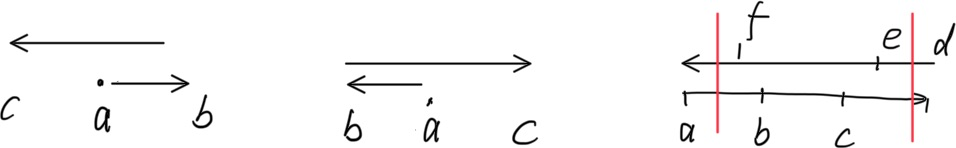

# The 2025 ICPC Asia Xi'an Regional Contest

qoj 链接：[https://qoj.ac/contest/2562](https://qoj.ac/contest/2562)

如果代码是我写的或者是后来补的，我会贴一下我这儿留着的代码，如果是我参与的我会写一下思路。

过了 F, G, J, L 四道题，罚时 268，大概是铜牌水平。

## G. Grand Voting

第一道签到题一般是给我写的，从大小小排序就是最低的，从小到大就是最高的。

```cpp
#include <iostream>
#include <algorithm>

using namespace std;

const int N = 100010;

int a[N];

int main() {
    ios::sync_with_stdio(0);
    cin.tie(0), cout.tie(0);
    int n;
    cin >> n;
    for (int i = 1; i <= n; ++i) {
        cin >> a[i];
    }
    sort(a + 1, a + n + 1);
    int s = 0;
    for (int i = 1; i <= n; ++i) {
        if (s >= a[i]) s++;
        else s--;
    }
    cout << s << ' ';
    s = 0;
    for (int i = n; i; --i) {
        if (s >= a[i]) s++;
        else s--;
    }
    cout << s << endl;
    return 0;
}
```

## J. January's Color

我们一起想到的树形 DP 两轮，首先从叶子到根更新 c 值为获得这个点的最小 c 值。然后从根到叶子在做一遍求从任意结点走到根的花费，然后作差。两轮 DP 都是通过维护一个最小值和一个次小值转移状态。

样例很良心，本来我们没有发现 c 要做第一轮 DP，但是样例把我们 hack 了。

```cpp
#include <iostream>
#include <cstring>

using namespace std;
typedef long long LL;
const int N = 300010;
int head[N], ver[N * 2], ne[N * 2], tot;
int dep[N], f[N][20];
int c[N];
LL g[N]; // total cost

void add(int x, int y) {
    ver[++tot] = y;
    ne[tot] = head[x];
    head[x] = tot;
}

void dfs1(int x, int fa) {
    LL zx = 0x3f3f3f3f, cx = zx;
    for (int i = head[x]; i; i = ne[i]) {
        int y = ver[i];
        if (y == fa) continue;
        dfs1(y, x);
        if (c[y] < zx) cx = zx, zx = c[y];
        else if (c[y] < cx) cx = c[y];
    }
    c[x] = min((LL)c[x], zx + cx);
}

void dfs(int x) {
    // cout << x << ": ";
    for (int i = 1; i < 20; ++i) {
        f[x][i] = f[f[x][i - 1]][i - 1];
        // cout << f[x][i] << ' ';
    }
    // cout << endl;
    LL zx = 0x3f3f3f3f, cx = zx;
    for (int i = head[x]; i; i = ne[i]) {
        int y = ver[i];
        if (y == f[x][0]) continue;
        f[y][0] = x;
        dep[y] = dep[x] + 1;
        if (c[y] < zx) cx = zx, zx = c[y];
        else if (c[y] < cx) cx = c[y];
    }
    for (int i = head[x]; i; i = ne[i]) {
        int y = ver[i];
        if (y == f[x][0]) continue;
        if (c[y] == zx) g[y] = g[x] + cx;
        else g[y] = g[x] + zx;
        dfs(y);
    }
}

bool check(int x, int y) {
    if (dep[x] < dep[y]) return false;
    else {
        for (int i = 19; i >= 0; --i) {
            if (dep[f[x][i]] >= dep[y]) x = f[x][i];
        }
        return x == y;
    }
}

void solve() {
    int n, m;
    cin >> n >> m;
    tot = 0;
    memset(head, 0, sizeof(int) * (n + 1));
    memset(g, 0, sizeof(LL) * (n + 1));
    for (int i = 1; i <= n; ++i) cin >> c[i];
    for (int i = 1; i < n; ++i) {
        int x, y;
        cin >> x >> y;
        add(x, y), add(y, x);
    }
    dfs1(1, 0);
    dep[1] = 1;
    // g[1] = c[1];
    dfs(1);
    // for (int i = 1; i <= n; ++i) cout << g[i] << ' ';
    // cout << endl;
    while (m--) {
        int x, y;
        cin >> x >> y;
        if (!check(x, y)) cout << -1 << endl;
        else cout << g[x] - g[y] << endl;
    }
}

int main() {
    ios::sync_with_stdio(0);
    cin.tie(0), cout.tie(0);
    int T;
    cin >> T;
    while (T--) {
        solve();
    }
    return 0;
}
```

## L. Let's Make a Convex!<sup style="color: blue">(未参与)</sup>

我只检查了一下二分框架，过的还比较顺利。

## F. Follow the Penguins

这道就不是特别顺了，我参与了调试和推结论。计算企鹅最后停下的位置在推时间，结论大概是这样的，企鹅之间的追逐关系可以表示成一个**基环树森林**

- 如果有下面的前两种情况的话，a 企鹅直接就能找到停下的位置；
- 否则就往一侧递归找下一只企鹅停下的位置；
- 如果一路都没有这种特殊性质的话最后会变成第三种情况，正好构成一个环，这种情况左行的企鹅和右行的企鹅会分别停在最左边两个和最右边两个的中点。



## I. Imagined Holly<sup style="color: red">(补题)</sup>

这题最后研究了好久好久，放弃了之后一看题解发现完全不占边。实际操作下来很容易，只要想到了立刻就能做出来，我们都往怎么删边和如何利用 $a_i < 2^{11}$ 这块想了，有点可惜。看了题解，发现三个人的题都读错了（我们原来认为点权是随机的，但是实际上点权是 indices，下标！！），恍然大悟……

不妨钦定 $1$ 为根，任取两点 $x$, $y$，设 $lca(x, y) = p$，有

$$
a_{p, p} = a_{1, p} \oplus a_{1, x} \oplus a_{1, y}
$$

又因为下标一定不重复，于是可以 $O(n^2)$ 检查 $a_{x, x}$ 是否等于 $a_{p, p}$ 找到祖先关系，然后用**差分约束**的思路**拓扑排序**找到所有的边。

```cpp
#include <iostream>
#include <cstring>

using namespace std;

const int N = 2010;
int a[N][N];
int head[N], ver[N * N / 2], ne[N * N / 2], tot;
int deg[N], dep[N], pre[N];
int q[N];

void add(int x, int y) {
    ver[++tot] = y;
    ne[tot] = head[x];
    head[x] = tot;
}

int main() {
    ios::sync_with_stdio(0);
    cin.tie(0), cout.tie(0);
    int n;
    cin >> n;
    for (int i = 1; i <= n; ++i) {
        for (int j = i; j <= n; ++j) {
            cin >> a[i][j];
            a[j][i] = a[i][j];
        }
    }
    for (int i = 1; i <= n; ++i) {
        for (int j = 1; j <= n; ++j) {
            if (i == j) continue;
            if (a[i][i] == (a[i][j] ^ a[1][i] ^ a[1][j])) add(i, j), deg[j]++;
        }
    }
    int hh = 0, tt = -1;
    q[++tt] = 1;
    dep[1] = 1;
    while (hh <= tt) {
        int x = q[hh++];
        if (x != 1) cout << pre[x] << ' ' << x << endl;
        for (int i = head[x]; i; i = ne[i]) {
            int y = ver[i];
            if (dep[y] < dep[x] + 1) {
                dep[y] = dep[x] + 1;
                pre[y] = x;
            }
            if (--deg[y] == 0) q[++tt] = y;
        }
    }
    return 0;
}
```

## B. Beautiful Dangos<sup style="color: red">(补题)</sup>

有点榜偏了的感觉，这道题其实很简单但是被我们忽略了。后来我读完题，没看题解就有想法了。这就是个**二分+字符串模拟**。

- 首先一个显然的结论是从左往右找到第一对相邻相等的位置，从右往左也找到第一对这样的位置，这个区间一定是答案的子集；
- 接着不难发现固定了一个端点只移动另一个端点，**答案是单调的**，假定一个小的区间可以满足要求，区间变大无非就是不挪动新增的几个，不会影响合法性；
- 这个时候就顺理成章的想到二分了，检查是否合法也相当容易
  - 最多的元素严格小于区间长度的一半一定可行；
  - 如果等于了区间长度的一半，需要和外面的两端的进行一个简单的分类讨论（详见代码，我的思维比较简单，我是分奇偶讨论的，这些条件可能还能合并）；
- 找到一个合法的答案之后就涉及构造这个序列，也很容易
  - 先只考虑左侧第一个外面的元素，贪心的选能选的中最多的，先保证能构造出来
  - 然后检查里面最后一个和右边的第一个是否相等，如果相等就从里面找一个合法的挪出来，前面的二分保证了区间的合法性，按照贪心的逻辑，如果出了这样的问题，那么序列里面一定有大量的 `PWCPWCPWC` 这样的循环节为 3 的循环，一定能找到一个能挪出来的


```cpp
#include <iostream>
#include <vector>
#include <map>
#include <algorithm>

using namespace std;

const int N = 2000010;
const char color[] = {'C', 'W', 'P'};
map<char, int> idx = {{'C', 0}, {'W', 1}, {'P', 2}, {' ', 3}};
int ps[3][N]; // C W P

bool check(int l, int r, vector<int> c) {
    // cout << l << ' ' << r << ' ' << c[0] << ' ' << c[1] << ' ' << c[2] << endl;
    int tot = c[0] + c[1] + c[2], p;
    if (c[0] > c[1] && c[0] > c[2]) p = 0;
    else if (c[1] > c[0] && c[1] > c[2]) p = 1;
    else p = 2;
    if (tot & 1) return (l == p || r == p) ? c[p] < (tot + 1) / 2: c[p] <= (tot + 1) / 2;
    if (l != 3 && l == r && c[l] == tot / 2) return false;
    else return c[p] <= tot / 2;
}

string work(char lc, char rc, vector<int> c) {
    string res = "";
    res += lc;
    int tot = c[0] + c[1] + c[2];
    while (tot--) {
        int p = -1;
        for (int i = 0; i < 3; ++i) {
            if ((res.empty() && color[i] != lc || !res.empty() && color[i] != res.back()) && c[i] && (p == -1 || c[i] > c[p])) p = i;
        }
        c[p]--;
        res += color[p];
    }
    if (res.back() == rc) {
        for (int i = 1; i < res.length() - 1; ++i) {
            if (res[i] != res.back() && res[i] != res.back() && res[i - 1] != res[i + 1]) {
                return res.substr(0, i) + res.substr(i + 1) + res[i];
            }
        }
    }
    return res;
}

void solve() {
    int n;
    string s;
    cin >> n >> s;
    s = " " + s + " ";
    // 找上下界
    int L = -1, R = -1;
    for (int i = 1; i < n; ++i) {
        if(s[i] == s[i + 1]) {
            L = i;
            break;
        }
    }
    if (L == -1) {
        cout << "Beautiful" << endl;
        return;
    }
    for (int i = n - 1; i; --i) {
        if (s[i] == s[i + 1]) {
            R = i;
            break;
        }
    }

    for (int i = 1; i <= n; ++i) {
        for (int j = 0; j < 3; ++j) {
            ps[j][i] = ps[j][i - 1] + (s[i] == color[j]);
        }
    }

    // 不可行
    for (int i = 0; i < 3; ++i) {
        if (ps[i][n] > (n + 1) / 2) {
            cout << "Impossible" << endl;
            return;
        }
    }

    cout << "Possible" << endl;
    pair<int, int> res = {1, n};
    for (int i = R; i <= n; ++i) {
        int l = -1, r = L;
        while (l < r) {
            int mid = l + r + 1 >> 1;
            if (mid < i && check(idx[s[mid]], idx[s[i + 1]], {ps[0][i] - ps[0][mid], ps[1][i] - ps[1][mid], ps[2][i] - ps[2][mid]})) l = mid;
            else r = mid - 1;
        }
        if (l != -1 && res.second - res.first + 1 > i - l) res = {l + 1, i};
    }
    auto &[l, r] = res;
    cout << l << ' ' << r << endl;
    for (int i = 1; i < res.first; ++i) cout << s[i];
    // cout << "(";
    string t = work(s[l - 1], s[r + 1], {ps[0][r] - ps[0][l - 1], ps[1][r] - ps[1][l - 1], ps[2][r] - ps[2][l - 1]});
    for (int i = 1; i < t.length(); ++i) cout << t[i];
    // cout << ")";
    for (int i = res.second + 1; i <= n; ++i) cout << s[i];
    cout << endl;
}

int main() {
    // freopen("input", "r", stdin);
    ios::sync_with_stdio(0);
    cin.tie(0), cout.tie(0);
    int T;
    cin >> T;
    while (T--) {
        solve();
    }
    return 0;
}
```