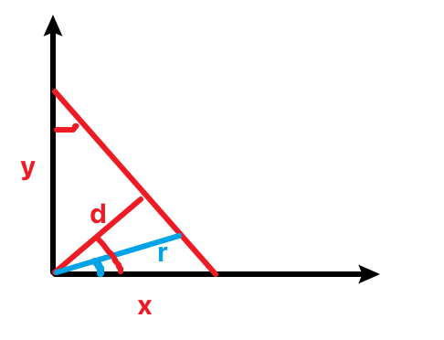

# 2025春训第十五场

## A. Lucky 7

一道签到题。

```cpp
#include <iostream>

using namespace std;

bool cont(int n) {
    for (char c : to_string(n)) {
        if (c == '7') return true;
    }
    return false;
}

int main() {
    int n;
    cin >> n;
    bool c1 = cont(n), c2 = n % 7 == 0;
    if (!c1 && !c2) cout << 0 << endl;
    else if (!c1 && c2) cout << 1 << endl;
    else if (c1 && !c2) cout << 2 << endl;
    else cout << 3 << endl;
    return 0;
}
```

## B. We Want You Happy!

两道签到题。

```cpp
#include <iostream>
#include <algorithm>

using namespace std;

struct Customer
{
    int id, s, d, t;
} a[1010];

int main() {
    int n;
    cin >> n;
    for (int i = 1; i <= n; ++i) {
        cin >> a[i].id >> a[i].s >> a[i].d >> a[i].t;
    }
    sort(a + 1, a + n + 1, [](Customer a, Customer b) {
        return a.s < b.s;
    });
    int curt = 0;
    for (int i = 1; i <= n; ++i) {
        if (curt > a[i].s + a[i].t) continue;
        if (curt < a[i].s) curt = a[i].s;
        curt += a[i].d;
        cout << a[i].id << endl;
    }
    return 0;
}
```

## **C. Snailography**

生成一个下标矩阵然后对着矩阵输出。

```cpp
#include <iostream>

using namespace std;

int t[30][30];

int main() {
    int n;
    string s;
    cin >> n >> s;
    int x = 0, y = 1;
    int cur = n * n;
    while (cur > 0) {
        while (x + 1 <= n && t[x + 1][y] == 0) t[++x][y] = cur--;
        while (y + 1 <= n && t[x][y + 1] == 0) t[x][++y] = cur--;
        while (x - 1 > 0 && t[x - 1][y] == 0) t[--x][y] = cur--;
        while (y - 1 > 0 && t[x][y - 1] == 0) t[x][--y] = cur--;
    }
    for (int i = 1; i <= n; ++i) {
        for (int j = 1; j <= n; ++j) {
            if (t[i][j] <= s.length()) cout << s[t[i][j] - 1];
        }
    }
    cout << endl;
    return 0;
}
```

## **D. Good Goalie**

* 肯定不行的情况，原点到直线的距离大于 r；
    
* 肯定是 0 的情况 $|x|$ ≤ r；
    
* 其余情况，先把 x, y 取一下绝对值，对称变换不会影响答案
    
    
    
    答案是蓝色的角 $\arctan \frac{x}{y} - \arccos \frac{d}{r}$
    

```cpp
#include <iostream>
#include <cmath>
#include <iomanip>

using namespace std;

int main() {
    double y, x, r;
    while (cin >> y >> x >> r) {
        double d = fabs(x * y) / sqrt(x * x + y * y);
        if (d <= r) {
            if (fabs(r) >= fabs(x)) cout << 0 << endl;
            else {
                x = fabs(x), y = fabs(y);
                double theta = atan(x / y) - acos(d / r);
                cout << fixed << setprecision(6) << theta * 180 / acos(-1) << endl;
            }
        }
        else cout << -1 << endl;
    }
    return 0;
}
```

## **E. Most Valuable Pez**

分组背包。

```cpp
#include <iostream>

using namespace std;

int f[12010], s[13];

int main() {
    int n, m;
    scanf("%d%d", &n, &m);
    for (int i = 1; i <= n; ++i) {
        for (int j = 1; j <= 12; ++j) {
            scanf("%d", &s[j]);
            s[j] += s[j - 1];
        }
        for (int j = m; j; --j) {
            for (int k = 1; k <= 12 && k <= j; ++k) {
                f[j] = max(f[j], f[j - k] + s[k]);
            }
        }
    }
    printf("%d\n", f[m]);
    return 0;
}
```

## **G. Not So Close**

经典的状压dp，用一个二进制数 mask 表示一行的状态。只考虑当前行合法状态需要满足 mask » 1 & mask == 0，因为不能相邻；相邻两行的状态 i，j 需要满足 i « 1 & j == 0 and i & j == 0 and i » 1 & j == 0。

```cpp
#include <iostream>

using namespace std;

const int MOD = 1000000007;

long long f[1010][1 << 10];

int main() {
    int r, n;
    cin >> r >> n;
    f[0][0] = 1;
    for (int i = 1; i <= n; ++i) {
        for (int j = 0; j < (1 << r); ++j) {
            if (j >> 1 & j) continue;
            for (int k = 0; k < (1 << r); ++k) {
                if ((k >> 1 & k) || (k & j) || (k >> 1 & j) || (k << 1 & j)) continue;
                f[i][j] = (f[i][j] + f[i - 1][k]) % MOD;
            }
        }
    }
    long long res = 0;
    for (int mask = 0; mask < (1 << r); ++mask) {
        res = (res + f[n][mask]) % MOD;
    }
    cout << res << endl;
    return 0;
}
```

## **H. The Duel of Smokin’ Joe**

统计逆序对数量，如果是奇数就是 `Smokin Joe!`，否则就是 `Oh No!`.

原理是一次交换一定会改变逆序对数量的奇偶性，如果原来是奇数，那一定需要奇数次，先手必胜；反之后手必胜。

```cpp
#include <iostream>

using namespace std;

const int N = 1000010;
int tr[N], a[N], n;

void add(int u) {
    for (; u <= n; u += u & -u) {
        tr[u]++;
    }
}

int query(int u) {
    int res = 0;
    for (; u; u -= u & -u) {
        res += tr[u];
    }
    return res;
}

int main() {
    scanf("%d", &n);
    for (int i = 1; i <= n; ++i) {
        scanf("%d", &a[i]);
    }
    long long cnt = 0;
    for (int i = n; i; --i) {
        cnt += query(a[i]);
        add(a[i]);
    }
    if (cnt & 1) printf("Smokin Joe!\n");
    else printf("Oh No!\n");
    return 0;
}
```

<s>归并排序是什么，感觉不如树状数组（）</s>

## **J. Grow Measure Cut Repeat**

因为每次 cut 都是**单调不增**的，所以不会发生第一次 cut 过的树第二次不 cut 的情况，这就好办了。维护两个线段树，一个维护忽略所有裁剪的前提下的高度，一个维护只考虑最后一次裁剪的情况下的高度。

说起来简单，但是实际上非常不好写，毕竟用线段树维护等差数列本来就比较复杂。具体的，第一颗树需要两个懒标记一个是**首项**，一个是**公差**；第二棵树需要三个懒标记，一个首项，一个公差，还有一个**覆盖标记**（因为裁剪之后要把所有的数覆盖成新的H），同时需要**注意边界**，我就因为边界快调死了😭。

```cpp
#include <iostream>

using namespace std;

const int N = 500000;

int seq[N];

struct SemgentTree {
    long long a[N], tag[N];
    bool cover[N];

    void pushdown(int u, int l, int r) {
        if (cover[u]) {
            int mid = (l + r) >> 1;
            a[u << 1] = a[u], a[u << 1 | 1] = a[u] + tag[u] * (mid - l + 1);
            tag[u << 1] = tag[u], tag[u << 1 | 1] = tag[u];
            tag[u] = 0;
            a[u] = 0;
            cover[u << 1] = cover[u << 1 | 1] = true;
            cover[u] = 0;
        }
        if (a[u] || tag[u]) {
            int mid = (l + r) >> 1;
            a[u << 1] += a[u], a[u << 1 | 1] += a[u] + tag[u] * (mid - l + 1);
            tag[u << 1] += tag[u], tag[u << 1 | 1] += tag[u];
            tag[u] = 0;
            a[u] = 0;
        }
    }

    void reset(int u, int l, int r, long long val) {
        cover[u] = true;
        a[u] = val, tag[u] = 0;
    }

    void modify(int u, int l, int r, int ql, int qr, int a1, int d) {
        if (ql > qr) return; // !!!!!
        if (ql <= l && r <= qr) {
            a[u] += a1 + (l - ql) * d; // 首项
            tag[u] += d; // 公差
        }
        else {
            pushdown(u, l, r);
            int mid = (l + r) >> 1;
            if (ql <= mid) modify(u << 1, l, mid, ql, qr, a1, d);
            if (qr > mid) modify(u << 1 | 1, mid + 1, r, ql, qr, a1, d);
        }
    }

    long long query(int u, int l, int r, int p) {
        if (l == r) return a[u];
        else {
            pushdown(u, l, r);
            int mid = (l + r) >> 1;
            if (p <= mid) return query(u << 1, l, mid, p);
            else return query(u << 1 | 1, mid + 1, r, p);
        }
    }
} smt, limt;

void print(int t) {
    for (int i = 1; i <= t; ++i) {
        printf("%lld ", min(limt.query(1, 1, 100000, i), smt.query(1, 1, 100000, i)));
    }
    printf("\n");
}

int main() {
    int q, n = 100000;
    scanf("%d", &q);
    while (q--) {
        char s[2];
        scanf("%s", s);
        if (s[0] == 'A') {
            int l, k;
            scanf("%d%d", &l, &k);
            smt.modify(1, 1, n, max(1, l - k + 1), l, max(1, k - l + 1), 1);
            smt.modify(1, 1, n, l + 1, min(n, l + k - 1), k - 1, -1);
            limt.modify(1, 1, n, max(1, l - k + 1), l, max(1, k - l + 1), 1);
            limt.modify(1, 1, n, l + 1, min(n, l + k - 1), k - 1, -1);
        }
        else if (s[0] == 'B') {
            int p;
            scanf("%d", &p);
            printf("%lld\n", min(smt.query(1, 1, n, p), limt.query(1, 1, n, p)));
        }
        else {
            int H;
            scanf("%d", &H);
            limt.reset(1, 1, n, H);
        }
    }
    return 0;
}
```

## K. **Bad Bunny**

点双联通分量缩点，然后树上倍增求路径上**割点的个数**，如果**端点**不是割点，就额外加上端点。

说着很简单，调的时候也是很折磨，因为我是现学的点双联通分量缩点，之前只学过强联通和边双联通。点双的缩点更复杂，把双联通分量缩点，同时还需要**把割点复制一份单独拎出来连接**，第一次写的时候容易挂。

```cpp
#include <iostream>
#include <vector>
#include <stack>

using namespace std;

const int N = 200010;

int head[N], head2[N], ver[N * 4], ne[N * 4], tot = 1;
int dfn[N], low[N], id[N], t, bcc_cnt, rt;
vector<int> bcc[N];
int cut[N], cut_id[N];
int f[N][20], g[N][20], dep[N];
stack<int> st;

void add(int head[], int x, int y) {
    ver[++tot] = y;
    ne[tot] = head[x];
    head[x] = tot;
}

void tarjan(int x, int from) {
    dfn[x] = low[x] = ++t;
    st.push(x);
    int cnt = 0;
    for (int i = head[x]; i; i = ne[i]) {
        if (i == (from ^ 1)) continue;
        int y = ver[i];
        if (!dfn[y]) {        
            cnt++;
            tarjan(y, i);
            low[x] = min(low[x], low[y]);
            if (dfn[x] <= low[y]) {
                bcc_cnt++;
                int tp;
                if (x != rt || cnt >= 2) cut[x] = true;
                do {
                    tp = st.top();
                    st.pop();
                    id[tp] = bcc_cnt;
                    bcc[bcc_cnt].push_back(tp);
                } while (tp != y);
                bcc[bcc_cnt].push_back(x);
                id[x] = bcc_cnt;
            }
        }
        else {
            low[x] = min(low[x], dfn[y]);
        }
    }
}

void dfs(int x) {
    g[x][0] = cut_id[x];
    for (int i = 1; i < 20; ++i) {
        f[x][i] = f[f[x][i - 1]][i - 1];
        g[x][i] = g[x][i - 1] + g[f[x][i - 1]][i - 1];
    }
    for (int i = head2[x]; i; i = ne[i]) {
        int y = ver[i];
        if (y == f[x][0]) continue;
        f[y][0] = x;
        dep[y] = dep[x] + 1;
        dfs(y);
    }
}

int main() {
#ifndef ONLINE_JUDGE
    freopen("input", "r", stdin);
#endif // !ONLINE_JUDGE
    int n, m;   
    scanf("%d%d", &n, &m);
    for (int i = 1; i <= m; ++i) {
        int x, y;
        scanf("%d%d", &x, &y);
        add(head, x, y);
        add(head, y, x);
    }
    rt = 1;
    tarjan(1, 0);
    for (int i = 1; i <= n; ++i) {
        if (cut[i]) {
            id[i] = ++bcc_cnt;
            cut_id[bcc_cnt] = true;
        }
    }
    for (int i = 1; i <= bcc_cnt; ++i) {
        for (int y : bcc[i]) {
            if (cut[y]) {
                add(head2, id[y], i);
                add(head2, i, id[y]);
            }
        }
    }

    dep[1] = 1;
    dfs(1);
    int q;
    scanf("%d", &q);
    while (q--) {
        int x, y;
        scanf("%d%d", &x, &y);
        int res = !cut[x] + !cut[y];
        x = id[x], y = id[y];
        if (dep[x] < dep[y]) swap(x, y);
        for (int i = 19; i >= 0; --i) {
            if (dep[f[x][i]] >= dep[y]) {
                res += g[x][i];
                x = f[x][i];
            }
        }
        if (x != y) {
            for (int i = 19; i >= 0; --i) {
                if (f[x][i] != f[y][i]) {
                    res += g[x][i] + g[y][i];
                    x = f[x][i], y = f[y][i];
                }
            }
            res += g[x][0] + g[y][0];
            x = f[x][0];
        }
        if (cut_id[x]) res++;
        printf("%d\n", res);
    }
    return 0;
}
```