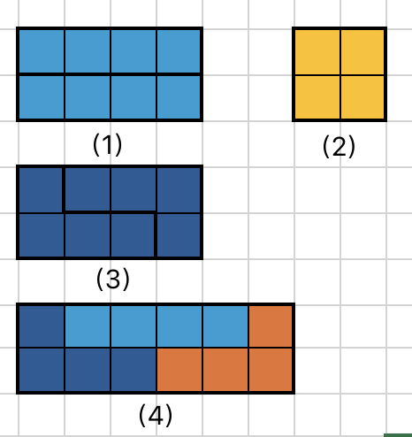

# 2025春训第八场

这次训练赛主打一个特殊情况 RE，不细心一点有一万个坑能让程序炸掉……

## **A. 能量传输**

不难<s>（不容易）</s>发现，k 越小聚集到的位置越多，操作次数越小，所以做法是

* 统计 1 的个数，找到除了 1 以外的最小的约数作为 k；
    
* 每 k 个 1 分成一组，各组独立计算最小操作次数；
    
* 使得操作数最小的位置一定是中位数，所以把到位置中位数的距离求和即可。
    

**注意特判 0 个，会炸掉！！！**

```cpp
#include <iostream>
#include <cmath>
#include <vector>
#define int long long

using namespace std;

int a[100010], b[100010];
int len;

signed main() {
    ios::sync_with_stdio(0);
    cin.tie(0), cout.tie(0);
    int n, s = 0, l;
    cin >> n;
    for (int i = 1; i <= n; ++i) {
        cin >> a[i];
        s += a[i];
    }
    if (s == 0) {
        cout << 0 << endl;
        return 0;
    }
    l = sqrt(s);
    int t = s;
    for (int i = 2; i <= l; ++i) {
        if (s % i == 0) {
            t = i;
            break;
        }
    }
    long long res = 0;
    for (int i = 1; i <= n; ++i) {
        if (a[i]) b[++len] = i;
        if (len == t) {
            int pos = b[(len + 1) / 2];
            for (int j = 1; j <= len; ++j) {
                res += abs(b[j] - pos);
            }
            len = 0;
        }
    }
    cout << res << endl;
    return 0;
}
```

## **B. 能源危机**

<s>你说的对，但是我可以用 Python</s>，用 C++ 写高精的话大概思路就是除数后面补零直到最高位和被除数对齐，减到不能再减，然后除数删一个零继续减，[高精全家桶传送门](https://invalidname.hashnode.dev/high-precision)。

```python
import sys
sys.set_int_max_str_digits(300000)
a = int(input())
b = int(input())
print(a // b)
```

## C. **鲁星救援**

没什么技术含量，来来回回搜的很恶心。先从 s 搜到 p，把路上的点全都标记上；然后，把标记上的点都加到一个新队列里，搜 t 即可。

* ps：注意按照题目说的顺序搜。
    

```cpp
#include <iostream>
#include <queue>
#include <cstring>

using namespace std;

/*
上代表 1，右代表 2，下代表 3，左代表 4
*/
const int dx[] = {-1, 0, 1, 0}, dy[] = {0, 1, 0, -1};
int a[1010][1010];
int dis[1010][1010];
bool vis[1010][1010];
pair<int, int> pre[1010][1010];

int main() {
    ios::sync_with_stdio(0);
    cin.tie(0), cout.tie(0);
    int n, m, sx, sy, tx, ty, px, py;
    cin >> n >> m >> sx >> sy >> tx >> ty >> px >> py;
    for (int i = 1; i <= n; ++i) {
        for (int j = 1; j <= m; ++j) {
            cin >> a[i][j];
        }
    }
    // 边界全都堵上，防止搜出去数组越界 RE
    for (int i = 1; i <= n; ++i) a[i][0] = a[i][m + 1] = 1;
    for (int i = 1; i <= m; ++i) a[0][i] = a[n + 1][i] = 1;
    queue<pair<int, int>> q;
    q.push({sx, sy});
    vis[sx][sy] = true;
    bool f = false;
    while (!q.empty()) {
        auto x = q.front();
        q.pop();
        if (x == make_pair(px, py)) {
            f = true;
            while (!q.empty()) {
                q.pop();
            }
            memset(vis, 0, sizeof(vis));
            if (pre[x.first][x.second] == make_pair(0, 0)) {
                vis[sx][sy] = true;
                dis[sx][sy] = 1;
                q.push({sx, sy});
                break;
            }
            do {
                q.push(x);
                dis[x.first][x.second] = 1;
                vis[x.first][x.second] = true;
                x = pre[x.first][x.second];
            } while (x != make_pair(sx, sy));
            vis[sx][sy] = true;
            dis[sx][sy] = 1;
            q.push(make_pair(sx, sy));
            break;
        }
        for (int i = 0; i < 4; ++i) {
            auto y = x;
            y.first += dx[i], y.second += dy[i];
            if (a[y.first][y.second] || vis[y.first][y.second]) continue;
            pre[y.first][y.second] = x;
            vis[y.first][y.second] = true;
            q.push(y);
        }
    }
    if (!f) {
        cout << -1 << endl;
        return 0;
    }
    while (!q.empty()) {
        auto x = q.front();
        q.pop();
        for (int i = 0; i < 4; ++i) {
            auto y = x;
            y.first += dx[i], y.second += dy[i];
            if (dis[y.first][y.second] || a[y.first][y.second]) continue;
            dis[y.first][y.second] = dis[x.first][x.second] + 1;
            q.push(y);
        }
    }
    cout << dis[tx][ty] - 1 << endl;
    return 0;
}
```

## E. **俄罗斯方块 (tetris)**

简化版：[覆盖墙壁](https://www.luogu.com.cn/problem/P1990).

我做这道题的时候用线性的 dp 打表找规律做的，实际上是可以直接推出来的。

最后三个方块只要放进去一定会堵死，直接忽略；枚举最后一个完整的矩形块的形状，只有以下四种形状

1. 两个 1 × 4 的方块并排；
    
2. 一个 2 × 2 的方块；
    
3. 两个相同 L 形方块，**中间可以夹多个 1 × 4 的方块**；
    
4. 两个不同 L 形方块 + 一个 1 × 4 的方块，**中间同样可以夹多个 1 × 4 的方块**。
    

如下图



计 $f_i$ 为 2 × i 时的方案数，不难得出

$$
f_i = f_{i - 4} + f_{i - 2} + 2 (f_{i - 4} + f_{i - 8} + \dots) + 2 (f_{i - 6} + f_{i - 10} + \dots)
$$

维护一个 f 数组的前缀和即可得到线性的做法。

```cpp
#include <iostream>
#include <cmath>

using namespace std;

const int MOD = 1000000007;

int f[10000010];
int s[10000010], s2[10000010];

int main() {
    int n;
    while (cin >> n) {
        f[0] = 1;
        s[0] = 1;
        for (int i = 1; i <= n; ++i) {
            f[i] = 0;
            if (i - 2 >= 0) f[i] = (f[i] + f[i - 2]) % MOD;
            if (i - 4 >= 0) f[i] = (f[i] + f[i - 4]) % MOD;
            if (i >= 4) f[i] = (f[i] + 2 * s[i - 4] % MOD) % MOD;
            if (i >= 6) f[i] = (f[i] + 2 * s[i - 6] % MOD) % MOD;
            if (i >= 4) s[i] = (f[i] + s[i - 4]) % MOD;
            else s[i] = f[i];
        }
        cout << f[n] << endl;
    }
    return 0;
}
```

显然这还不够，数据范围是 1e18 还需要再优化，于是又到了喜闻乐见的矩阵快速幂环节。

显然奇数是不可能的，对于偶数的情况重新编号一下（好看）

$$
f_i = f_{i - 1} + f_{i - 2} + 2 (f_{i - 2} + f_{i - 4} + \dots) + 2 (f_{i - 3} + f_{i - 5} + \dots)
$$

后面两项可以合并

$$
f_i = f_{i - 1} + f_{i - 2} + 2 \sum_{j = 0}^{i - 2}{f_j}
$$

这样就好构造矩阵了，其中 $s_i = \sum_{j = 0}^i{f_j}$

$$
\begin{pmatrix} f_{i - 2} & f_{i - 1} & s_{i - 2} \end{pmatrix} \begin{pmatrix} 0 & 1 & 0\\ 1 & 1 & 1\\ 0 & 2 & 1\\ \end{pmatrix} = \begin{pmatrix} f_{i - 1} & f_{i} & s_{i - 1} \end{pmatrix}
$$

累乘可以得到

$$
\begin{pmatrix} 1 & 1 & 1 \end{pmatrix} \begin{pmatrix} 0 & 1 & 0\\ 1 & 1 & 1\\ 0 & 2 & 1\\ \end{pmatrix} ^{n - 1} = \begin{pmatrix} f_{n - 1} & f_{n} & s_{n - 1} \end{pmatrix}
$$

```cpp
#include <iostream>
#include <vector>

using namespace std;

const int MOD = 1000000007;
vector<vector<int>> mul(vector<vector<int>> a, vector<vector<int>> b) {
    vector<vector<int>> res(3, vector<int>(3, 0));
    for (int k = 0; k < 3; ++k) {
        for (int i = 0; i < 3; ++i) {
            for (int j = 0; j < 3; ++j) {
                res[i][j] = (res[i][j] + (long long)a[i][k] * b[k][j] % MOD) % MOD;
            }
        }
    }
    return res;
}

int main() {
    long long n;
    while (cin >> n) {
        if (n & 1) cout << 0 << endl;
        else {
            n >>= 1;
            n--;
            vector<vector<int>> mat = {
                {0, 1, 0},
                {1, 1, 1},
                {0, 2, 1}
            },
            res = {
                {1, 0, 0},
                {0, 1, 0},
                {0, 0, 1}
            };
            while (n) {
                if (n & 1) res = mul(res, mat);
                mat = mul(mat, mat);
                n >>= 1;
            }
            cout << ((long long)res[1][0] + res[1][1] + 2 * res[1][2]) % MOD << endl;
        }
    }
    return 0;
}
```