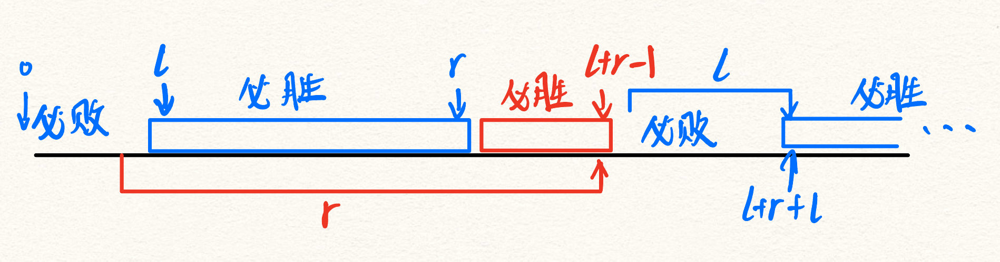

# 2025夏季个人训练赛第十场

## A. 分割数组

又是我最喜欢的 dp，$f_{i, j}$ 表示前 i 个数分成 j 段的方案数

$$
f_{i, j} = \sum_{\sum_{l=k}^{j - 1}a_l\ mod\ j = 0 \land k < j}f_{k, j - 1}
$$

把 $f_{i, j}$ 和按照对 j + 1 的模数分类前缀和可以优化一层循环，之后时间复杂度是 $\Theta(n^2)$ 恰好就能过了。

```cpp
#include <iostream>

using namespace std;

const int N = 3010;
const int MOD = 1000000007;
long long s[N], f[N][N], g[N][N];

int main() {
    int n;
    scanf("%d", &n);
    g[0][0] = 1;
    f[0][0] = 1;
    for (int i = 1; i <= n; ++i) {
        scanf("%lld", &s[i]);
        s[i] += s[i - 1];
    }
    for (int i = 1; i <= n; ++i) {
        for (int j = 1; j <= n; ++j) {
            f[i][j] = g[s[i] % j][j - 1];
        }
        for (int j = 1; j < n; ++j) {
            g[s[i] % (j + 1)][j] += f[i][j];
            g[s[i] % (j + 1)][j] %= MOD;
        }
    }
    long long res = 0;
    for (int i = 1; i <= n; ++i) {
        res = (res + f[n][i]) % MOD;
    }
    printf("%lld\n", res);
    return 0;
}
```

## B. 超电磁炮

按说答案就是 $\lceil\log_2{n}\rceil$ 但是好像精度出了点问题，那就二分答案。

```cpp
#include <iostream>
#include <cmath>

using namespace std;

int main() {
    long long n;
    cin >> n;
    long long l = 0, r = 64;
    while (l < r) {
        long long mid = l + r >> 1;
        if ((1ll << mid) >= n) r = mid;
        else l = mid + 1;
    }
    cout << l << endl;
    return 0;
}
```

## C. 为美好的世界献上爆炎

先从小到大一点一点试



l + r 一循环，一个循环内，小于 l 的必败，其余必胜。

```cpp
#include <iostream>

using namespace std;

int main() {
    int T;
    scanf("%d", &T);
    while (T--) {
        int n, l, r;
        scanf("%d%d%d", &n, &l, &r);
        if (l <= (n % (l + r))) printf("yes\n");
        else printf("no\n");
    }
    return 0;
}
```

## D. 八进制小数

高精硬算，之前做过所以直接复制过来了。

```cpp
#include <iostream>
#include <vector>
#include <cmath>
 
using namespace std;
 
struct Hipre {
    vector<int> a;
 
    void mv(int t) {
        vector<int> b(t, 0);
        b.insert(b.end(), a.begin(), a.end());
        a = b;
    }
    Hipre() {
        a = vector<int>(1, 0);
    }
 
    Hipre(int n) {
        if (!n) {
            a = vector<int>(1, 0);
        }
        else
            while (n) {
                a.push_back(n % 10);
                n /= 10;
            }
    }
 
    int length() const {
        return a.size();
    }
 
    int to_int() {
        int res = 0, mul = 1;
        for (int i = 0; i < a.size(); ++i) {
            res += a[i] * mul;
            mul *= 10;
        }
        return res;
    }
 
    int &operator [](const int &p) {
        return a[p];
    }
 
    friend istream &operator >>(istream &cin, Hipre &a) {
        static string s;
        cin >> s;
        a.a = vector<int>(s.length());
        for (int i = 0; i < s.length(); ++i) {
            a.a[i] = s[s.length() - i - 1] - 48;
        }
        while (a.length() > 1 && a.a.back() == 0) a.a.pop_back();
        return cin;
    }
 
    friend ostream &operator <<(ostream &cout, const Hipre &a) {
        for (int i = a.length() - 1; i >= 0; --i)
            cout << a.a[i];
        return cout;
    }
 
    bool operator <(const Hipre &c) const {
        if (length() != c.length()) return length() < c.length();
        else {
            for (int i = length() - 1; i >= 0; --i) {
                if (a[i] != c.a[i]) return a[i] < c.a[i];
            }
            return false;
        }
    }
 
    bool operator ==(const Hipre &c) const {
        if (length() != c.length()) return false;
        else {
            for (int i = length() - 1; i >= 0; --i) {
                if (a[i] != c.a[i]) return false;
            }
            return true;
        }
    }
 
    Hipre operator +(const Hipre &c) {
        auto &b = c.a;
        Hipre res;
        res.a = vector<int>(max(a.size(), b.size()) + 1, 0);
        for (int i = 0; i < res.length(); ++i) {
            if (i < a.size() && i < b.size()) res[i] += a[i] + b[i];
            else if (i < a.size()) res[i] += a[i];
            else if (i < b.size()) res[i] += b[i];
            if (res[i] > 9) res.a[i + 1] += 1, res[i] -= 10;
        }
        while (res.length() > 1 && res.a.back() == 0) res.a.pop_back();
        return res;
    }
 
    Hipre operator -(const Hipre &c) {
        Hipre res = *this;
        for (int i = 0; i < res.length(); ++i) {
            if (i < c.length()) res[i] -= c.a[i];
            if (res[i] < 0) res[i] += 10, res.a[i + 1] -= 1;
        }
        while (res.length() > 1 && res.a.back() == 0) res.a.pop_back();
        return res;
    }
 
    Hipre operator *(const Hipre &c) {
        auto &b = c.a;
        Hipre res;
        res.a = vector<int>(a.size() + b.size(), 0);
        for (int i = 0; i < a.size(); ++i) {
            for (int j = 0; j < b.size(); ++j) {
                res.a[i + j] += a[i] * b[j];
            }
        }
        for (int i = 0; i < res.length() - 1; ++i) {
            res.a[i + 1] += res[i] / 10;
            res[i] %= 10;
        }
        while (res.length() > 1 && res.a.back() == 0) res.a.pop_back();
        return res;
    }
 
    Hipre operator *=(const int &c) {
        if (c)
            a.resize(a.size() + (int)floor(log10(c)) + 1);
        for (int i = 0; i < a.size(); ++i) {
            a[i] *= c;
        }
        for (int i = 0; i < a.size() - 1; ++i) {
            if (a[i] > 9) a[i + 1] += a[i] / 10, a[i] %= 10;
        }
        while (a.size() > 1 && a.back() == 0) a.pop_back();
        return *this;
    }
 
    Hipre operator *(const int &c) {
        Hipre t = *this;
        return t *= c;
    }
 
    Hipre operator /(const int &c) {
        Hipre res;
        res.a = vector<int>(a.size());
        int t = 0;
        for (int i = a.size() - 1; i >= 0; --i) {
            t = t * 10 + a[i];
            if (t >= c) res[i] = t / c;
            t %= c;
        }
        while (res.length() > 1 && res.a.back() == 0) res.a.pop_back();
        return res;
    }
 
    Hipre operator /(Hipre c) {
        Hipre res, b = *this;
        int l = b.length() - c.length();
        res.a = vector<int>(l + 1, 0);
        c.mv(b.length() - c.length());
        for (int i = l; i >= 0; --i) {
            while (!(b < c)) {
                b = b - c;
                res[i]++;
            }
            c.a.erase(c.a.begin());
        }
        while (res.length() > 1 && res.a.back() == 0) res.a.pop_back();
        return res;
    }
 
    Hipre operator %(Hipre c) {
        Hipre b = *this;
        int l = b.length() - c.length();
        c.mv(b.length() - c.length());
        for (int i = l; i >= 0; --i) {
            while (!(b < c)) {
                b = b - c;
            }
            c.a.erase(c.a.begin());
        }
        while (b.length() > 1 && b.a.back() == 0) b.a.pop_back();
        return b;
    }
};
 
 
int main() {
    ios::sync_with_stdio(0);
    cin.tie(0), cout.tie(0);
    string s;
    Hipre ans(0), base(125);
    cin >> s;
    for (auto i : s) {
        ans = ans * 1000 + base * (i - 48);
        base *= 125;
    }
    vector<int> t = ans.a;
    int i = 3 * s.length() - t.size();
    while (i--) cout << 0;
    i = 0;
    while (t[i] == 0 && i < t.size()) i++;
    for (int j = t.size() - 1; j >= i; --j) cout << t[j];
    cout << endl;
    return 0;
}
```

## E. 愿此行终抵群星

按照字典序排序，记 $f_i$ **为不经过反物质军团到达第 i 个的点的方案数**，统计方案数的一大问题就是怎么不重不漏，可以先求从起点到 i 的总方案数，然后减掉不合法的。统计不合法的方案时，可以**枚举第一个经过的反物质军团坐标**，只要第一个不一样，那么一定不会重复，后面直接用组合数算就可以正好覆盖所有方案。

$$
f_i = \text{way}\left(p_0, p_i\right) - \sum_{1 \le j < i} f_j * way(p_j, p_i)
$$

其中 p_i 表示排序后第 i 个点的坐标，way(a, b) 表示坐标 a 和坐标 b 之间没有限制情况下的路径数。

<p style="color: red">预处理的数组别开小了，最坏的情况 10 个维度每个维度 10<sup>5</sup> 要开 1e6！</p>

```cpp
#include <iostream>
#include <vector>
#include <algorithm>

using namespace std;

const int MOD = 998244353;
const int N = 5010, M = 1000010;

int power(int n, int p) {
    long long res = 1, base = n;
    while (p) {
        if (p & 1) res = res * base % MOD;
        base = base * base % MOD;
        p >>= 1;
    }
    return res;
}

int jc[M], inv[M];
int f[N];
vector<int> p[N];

int c(int n, int m) {
    return 1LL * jc[n] * inv[m] % MOD * inv[n - m] % MOD;
}

int way(vector<int> a, vector<int> b) {
    long long res = 1;
    int k = a.size(), n = 0;
    for (int i = 0; i < k; ++i) {
        res = (res * c(n + (b[i] - a[i]), n)) % MOD;
        n += b[i] - a[i];
    }
    return res;
}

bool le(vector<int> a, vector<int> b) {
    int n = a.size();
    for (int i = 0; i < n; ++i) {
        if (a[i] > b[i]) return false;
    }
    return true;
}

int main() {
    jc[0] = inv[0] = 1;
    for (int i = 1; i <= 1000000; ++i) {
        jc[i] = 1LL * jc[i - 1] * i % MOD;
        inv[i] = power(jc[i], MOD - 2);
    }
    int k, n;
    scanf("%d%d", &k, &n);
    for (int i = 0; i <= n + 1; ++i) {
        p[i] = vector<int>(k, 0);
    }
    for (int i = 0; i < k; ++i) {
        scanf("%d", &p[n + 1][i]);
    }
    for (int i = 1; i <= n; ++i) {
        for (int j = 0; j < k; ++j) {
            scanf("%d", &p[i][j]);
        }
    }
    sort(p + 1, p + n + 1);
    f[0] = 1;
    for (int i = 1; i <= n + 1; ++i) {
        f[i] = way(p[0], p[i]);
        for (int j = 1; j < i; ++j) {
            if (le(p[j], p[i])) {
                f[i] = (f[i] - (1LL * f[j] * way(p[j], p[i]) % MOD) + MOD) % MOD;
            }
        }
    }
    printf("%d\n", f[n + 1]);
    return 0;
}
```