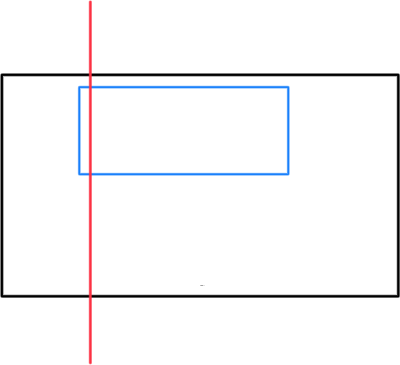

# 2025夏季个人训练赛第二十八场

没题补了于是再来一场。

## A. 染色

一道水题，差分前缀和数标记。

```cpp
#include <iostream>

using namespace std;

const int N = 1000000;
int a[N];

int main() {
    int n, m;
    scanf("%d%d", &n, &m);
    for (int i = 1; i <= n; ++i) {
        int l, r;
        scanf("%d%d", &l, &r);
        a[l]++, a[r + 1]--;
    }
    int res = 0;
    for (int i = 0; i <= m; ++i) {
        if (i > 0) a[i] += a[i - 1];
        if (a[i]) res++;
    }
    printf("%d\n", res);
    return 0;
}
```

## B. 油滴扩展2

数据很小，直接暴力枚举全排列。

```cpp
#include <iostream>
#include <algorithm>
#include <cmath>

using namespace std;

const int N = 10;
const double PI = acos(-1);
int x[N], y[N];
double R[N];
int p[N];

int main() {
    int n, t = 1;
    int x1, y1, x2, y2;
    scanf("%d%d%d%d%d", &n, &x1, &y1, &x2, &y2);
    for (int i = 1; i <= n; ++i) {
        scanf("%d%d", &x[i], &y[i]);
        p[i] = i;
        t *= i;
    }
    double res = abs(x1 - x2) * abs(y1 - y2);
    while (t--) {
        double s = abs(x1 - x2) * abs(y1 - y2);
        for (int i = 1; i <= n; ++i) {
            double r = 1e9;
            r = min(r, (double)min(min(abs(x1 - x[p[i]]), abs(x2 - x[p[i]])), min(abs(y1 - y[p[i]]), abs(y2 - y[p[i]]))));
            for (int j = 1; j < i; ++j) {
                r = min(r, sqrt(pow(x[p[i]] - x[p[j]], 2) + pow(y[p[i]] - y[p[j]], 2)) - R[j]);
            }
            if (r <= 0) r = 0;
            s -= PI * r * r;
            R[i] = r;
        }
        next_permutation(p + 1, p + n + 1);
        res = min(res, s);
    }
    printf("%.0lf\n", res);
    return 0;
}
```

## C. 取最大值<sup style="color: red">补</sup>

因为调这个差点中午没睡了觉，就是他害我下午差点迟到的，不是我睡过头了😭

逻辑还比较简单，核心思想是正着跑一遍最大子段和，倒着再跑一遍最大子段和，加上中间的一段得到答案。中间这一段可以在着最大子段和的过程中 dp 维护，比如我是先倒着预处理的，记 f<sub>i, j</sub> 是维护到第 i 个位置，最后一段取了第 j 行的最大和，做到第 i - 1 位时，用第 i 位的最大子段和和第 i 位的 f 数组更新状态。

然后从左到右做一遍最大子段和和 f 拼接一下取 max 就是答案。



第一遍预处理的是红线右边的部分，第二遍顺着遍历的时候处理的是红线左边的部分。

最气人的就是下午 XCPC 系统测试赛打完之后我发现我睡觉前最后调了一半的代码直接就是对的😡😡😡

```cpp
#include <iostream>
#include <climits>

using namespace std;
typedef long long LL;
const int N = 1000010;
LL a[N][2], f[N][2];

int main() {
    int n;
    scanf("%d", &n);
    for (int i = 1; i <= n; ++i) {
        scanf("%lld", &a[i][0]);
    }
    for (int i = 1; i <= n; ++i) {
        scanf("%lld", &a[i][1]);
    }
    LL s = 0, mn = 0;
    for (int i = n - 1; i; --i) {
        s += a[i + 1][0] + a[i + 1][1];
        for (int j = 0; j < 2; ++j) {
            f[i][j] = max(f[i + 1][j], s - mn) + a[i][j];
        }
        mn = min(mn, s);
    }
    s = 0, mn = 0;
    LL res = LLONG_MIN;
    for (int i = 1; i <= n - 2; ++i) {
        s += a[i][0] + a[i][1];
        res = max(res, s - mn + max(f[i + 1][0], f[i + 1][1]));
        mn = min(mn, s);
    }
    printf("%lld\n", res);
    return 0;
}
```

## D. 玩具车 <sup style="color: red">补</sup>

当时没想到就真是直接贪心就可以，每次需要抉择的时候都直接找一个地上距离下一次使用最远的玩具拿回去就是最优的，最终只需要开一个优先队列维护一下当前地上下一次出现距离最远的玩具。

```cpp
#include <iostream>
#include <queue>

using namespace std;

const int N = 100010, M = 500010;
int a[M], ne[M], pre[N];
bool f[N];

int main() {
    int n, k, p;
    scanf("%d%d%d", &n, &k, &p);
    for (int i = 1; i <= p; ++i) {
        scanf("%d", &a[i]);
        if (pre[a[i]]) ne[pre[a[i]]] = i;
        pre[a[i]] = i;
    }
    for (int i = 1; i <= n; ++i) {
        ne[pre[i]] = 0x3f3f3f3f;
    }
    priority_queue<pair<int, int>> q;
    int siz = 0, res = 0;
    for (int i = 1; i <= p; ++i) {
        if (f[a[i]]) q.push({ne[i], i});
        else if (siz < k) {
            q.push({ne[i], i});
            f[a[i]] = true;
            siz++, res++;
        }
        else {
            pair<int, int> tp;
            do {
                tp = q.top();
                q.pop();
            } while (!f[a[tp.second]]);
            f[a[tp.second]] = false;
            q.push({ne[i], i});
            f[a[i]] = true;
            res++;
        }
    }
    printf("%d\n", res);
    return 0;
}
```

## E. 翻转 (开关问题)

这一定是有简单一点的做法的，我是树状数组莽过去的……可能就是因为我这样莽过去了，所以才是首 A。

```cpp
#include <iostream>
#include <cstring>

using namespace std;
const int N = 5010;
int tr[N], s[N], n;

void add(int x, int v) {
    for (; x <= n; x += x & -x) {
        tr[x] ^= v;
    }
}

int query(int x) {
    int res = 0;
    for (; x; x -= x & -x) {
        res ^= tr[x];
    }
    return res;
}

int main() {
    ios::sync_with_stdio(0);
    cin.tie(0), cout.tie(0);
    cin >> n;
    for (int i = 1; i <= n; ++i) { 
        char c;
        cin >> c;
        s[i] = c == 'B';
    }
    int m = __INT_MAX__, kk = -1;
    for (int k = n; k; --k) {
        int t = 0;
        bool f = true;
        memset(tr, 0, sizeof(int) * (n + 2));
        for (int i = 1; i <= n; ++i) {
            add(i, s[i] ^ s[i - 1]);
        }
        for (int i = 1; i <= n; ++i) {
            if (query(i)) {
                if (i <= n - k + 1) {
                    t++;
                    add(i, 1), add(i + k, 1);
                }
                else {
                    f = false;
                    break;
                }
            }
        }
        if (f && t <= m) {
            m = t;
            kk = k;
        }
    }
    cout << kk << ' ' << m << endl;
    return 0;
}
```

## G. 工厂 (factory) <sup style="color: red">补</sup>

查询次数很少，直接暴力操作每次暴力重算有关键点那棵树的直径就能过。

```cpp
#include <iostream>
using namespace std;
const int N = 30010;

int head[N], ne[N * 4], ver[N * 4], tot = 1;
int a[N];
int d1[N], d2[N];
bool del[N * 4];

void add(int x, int y) {
    ver[++tot] = y;
    ne[tot] = head[x];
    head[x] = tot;   
}

void dfs(int x, int fa, int *d) {
    for (int i = head[x]; i; i = ne[i]) {
        int y = ver[i];
        if (y == fa || del[i]) continue;
        d[y] = d[x] + 1;
        dfs(y, x, d);
    }
}

int main() {
    int n, m, q, d;
    scanf("%d%d%d%d", &n, &m, &q, &d);
    for (int i = 1; i <= m; ++i) {
        scanf("%d", &a[i]);
    }
    for (int i = 1; i < n; ++i) {
        int x, y;
        scanf("%d%d", &x, &y);
        add(x, y), add(y, x);
    }
    while (q--) {
        int op;
        scanf("%d", &op);
        if (op == 1) {
            int p, x, y;
            scanf("%d%d%d", &p, &x, &y);
            del[p * 2] = del[p * 2 ^ 1] = true;
            add(x, y), add(y, x);
        }
        else {
            d1[a[1]] = 0;
            dfs(a[1], 0, d1);
            int p1 = 0, p2 = 0;
            for (int i = 1; i <= m; ++i) {
                if (d1[a[i]] > d1[p1]) p1 = a[i];
            }
            d2[p1] = 0;
            dfs(p1, 0, d2);
            for (int i = 1; i <= m; ++i) {
                if (d2[a[i]] > d2[p2]) p2 = a[i];
            }
            d1[p2] = 0;
            dfs(p2, 0, d1);
            int res = 0;
            for (int i = 1; i <= n; ++i) {
                if (d1[i] <= d && d2[i] <= d) res++;
            }
            printf("%d\n", res);
        }
    }
    return 0;
}
```