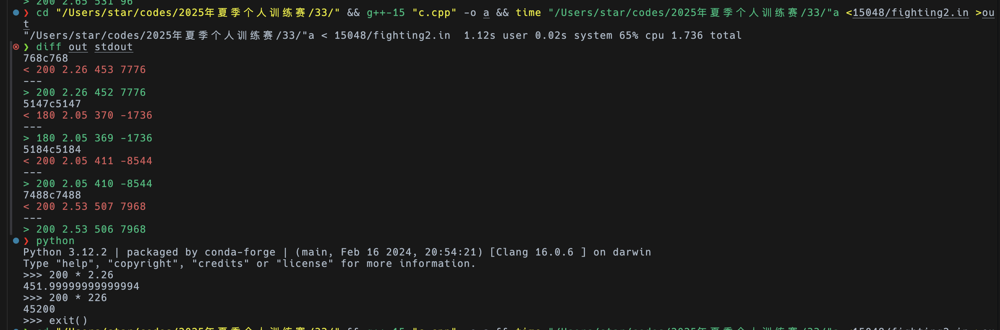

# 2025夏季个人训练赛第三十三场

又是没有牛客打的一天～～

## A. 矩阵转换

一个大的矩形的变换一定可以由多个 2 * 2 的矩形拼出来，2 * 2 的矩形是最小的可以操作的单位，直接遍历一遍矩阵，贪心的变换 2 * 2 的矩阵，如果能成 B 就是 Yes，不能就是 No。

```cpp
#include <iostream>

using namespace std;

const int N = 510;
int a[N][N], b[N][N];

int main() {
    int T;
    scanf("%d", &T);
    while (T--) {
        int n, m;
        scanf("%d%d", &n, &m);
        for (int i = 1; i <= n; ++i) {
            for (int j = 1; j <= m; ++j) {
                scanf("%1d", &a[i][j]);
            }
        }
        bool f = true;
        for (int i = 1; i <= n; ++i) {
            for (int j = 1; j <= m; ++j) {
                scanf("%1d", &b[i][j]);
                if (a[i][j] != b[i][j])
                    if (i < n && j < m) {
                        a[i][j] ^= 1, a[i + 1][j] ^= 1, a[i][j + 1] ^= 1, a[i + 1][j + 1] ^= 1;
                    }
                    else {
                        f = false;
                    }
            }
        }
        if (f) printf("Yes\n");
        else printf("No\n");
    }
    return 0;
}
```

## B. 胖虎的菜品

我刚开始写了一个 $O\left(n \cdot n!\right)$ 的暴力，竟然自以为能过，被自己蠢哭了……

正解应该是状压dp，记录对于每一个 bitmask 最后一步走到 j 时的最短路径长度，枚举下一步的移动转移状态，答案是 2<sup>n</sup> - 1 对应的 bitmask 下所有状态的 min.

```cpp
#include <iostream>
#include <algorithm>
#include <cmath>

using namespace std;

const int N = 20;
double x[N], y[N];
double f[1 << 13][N];

int main() {
    int n;
    scanf("%d", &n);
    for (int i = 0; i < n; ++i) {
        scanf("%lf%lf", &x[i], &y[i]);
    }
    for (int i = 0; i < n; ++i) {
        for (int msk = 0; msk < (1 << n); ++msk) {
            f[msk][i] = 1e18;
        }
    }
    for (int i = 0; i < n; ++i) {
        f[1 << i][i] = sqrt(pow(x[i], 2) + pow(y[i], 2));
    }
    for (int i = 1; i < n; ++i) {
        for (int msk = 0; msk < (1 << n); ++msk) {
            for (int j = 0; j < n; ++j) {
                if (msk >> j & 1)
                    for (int k = 0; k < n; ++k) {
                        if (!(msk >> k & 1)) {
                            f[msk | (1 << k)][k] = min(f[msk | (1 << k)][k], f[msk][j] + sqrt(pow(x[j] - x[k], 2) + pow(y[j] - y[k], 2)));
                        }
                    }
            }
        }
    }
    double res = 1e18;
    for (int i = 0; i < n; ++i) {
        res = min(res, f[(1 << n) - 1][i]);
    }
    printf("%.2f\n", res);
    return 0;
}
```

## C. 胖虎的攻沙 <sup style="color: blue">fixed</sup>

~~疑似数据出问题了，我的代码删了点条件之后过洛谷上的[(疑似)母题](https://www.luogu.com.cn/problem/P5322)能过。~~

数据就是出问题了，而且已经被我修正了，虽然对拍的时候验证过我应该没问题，但是重判的时候就我一个过了……

目测大家都被**卡精度**了，看这张图，我依次输出了所有的 $a_{i, j}$, $k_i$, $\lfloor a_{i, j} k_i \rfloor + 1$, $j \cdot p1_i - \left(s - j\right) \cdot p2_i$ 上面是我的输出，下面是原来 std 的输出，根据 python 的验证，确实是浮点数精度出了问题，而且我是对的。



刚开始没发现，写到最后回头一看，其实是一个分组背包问题，f<sub>i, j</sub> 表示前 i 个沙城使用 m 个士兵的最大得分，对每个 i 对应的 s 个数从小到大排序，只需要考虑所有能刚好能拿到前 l 个的分时的士兵数，其他值取了只会浪费士兵，没有其他收益，时间复杂度是 $O\left(nsm\right)$，按说没问题。

疑似正确的代码 (目前新数据的 std，**欢迎 hack**)

```cpp
#include <iostream>
#include <vector>
#include <algorithm>
#include <cstring>
#include <cmath>

using namespace std;

const int N = 110, M = 20010;
int a[N][N], f[N][M], p1[N], p2[N];
double k[N];
vector<pair<int, int>> t[N];

int main() {
    int s, n, m;
    scanf("%d%d%d", &s, &n, &m);
    for (int i = 1; i <= s; ++i) {
        for (int j = 1; j <= n; ++j) {
            scanf("%d", &a[j][i]);
        }
    }
    memset(f, -0x3f, sizeof(f));
    for (int i = 1; i <= n; ++i) scanf("%lf", &k[i]);
    for (int i = 1; i <= n; ++i) scanf("%d", &p1[i]);
    for (int i = 1; i <= n; ++i) scanf("%d", &p2[i]);
    f[0][0] = 0;
    for (int i = 1; i <= n; ++i) {
        sort(a[i] + 1, a[i] + s + 1);
        for (int j = 1; j <= s; ++j) {
            int l = j + 1;
            while (l <= s && a[i][l] == a[i][j]) l++;
            j = l - 1;
            t[i].emplace_back((int)floor((double)a[i][j] * k[i] + 1e-8) + 1, j * p1[i] - (s - j) * p2[i]);
        }
    }
    for (int i = 1; i <= n; ++i) {
        for (int j = 0; j <= m; ++j) {
            f[i][j] = f[i - 1][j] - p2[i] * s; // 全不选
            for (auto [u, v] : t[i]) {
                if (j < u) break;
                f[i][j] = max(f[i][j], f[i - 1][j - u] + v);
            }
        }
    }
    int res = -0x3f3f3f3f;
    for (int i = 0; i <= m; ++i) res = max(res, f[n][i]);
    if (res >= 0) printf("%d\n", res);
    else printf("Run Away\n");
    return 0;
}
```

## E. 不知道该叫啥 (noname)	

先看一下暴力 $O\left(nm\right)$ 的做法，记 f<sub>i, j</sub> 第 i 个数选 j 的方案数, g<sub>i, j</sub> 是 f<sub>i</sub> 数组的前缀和。

```cpp
for (int i = 1; i <= n; ++i) {
    for (int j = 1; j <= m; ++j) {
        if (i == 1) f[i][j] = 1;
        else f[i][j] = g[i - 1][m / j];
        g[i][j] = (g[i][j - 1] + f[i][j]) % MOD;
    }
}
printf("%d\n", g[n][m]);
```

关键点在于每一个 j 的前置状态是 $\lfloor\frac{m}{j}\rfloor$ 这就意味着所有 $\lfloor\frac{m}{j}\rfloor$ 相等的 j 的 f 都是一样的，考虑除法分块，对于每一个块只存一次答案就行，优化完时间复杂度为 $O\left(n\sqrt{m}\right)$，就可以过了。

```cpp
#include <iostream>
#include <vector>
#include <tuple>

using namespace std;
typedef long long LL;
const int N = 110, M = 100010;
const int MOD = 1000000007;

int f[N][M], g[N][M];
vector<tuple<int, int, int>> v;

int main() {
    int n, m;
    scanf("%d%d", &n, &m);
    for (int l = 1, r; l <= m; l = r + 1) {
        r = m / (m / l);
        v.emplace_back(l, r, m / l);
    }
    int k = v.size();
    for (int i = 1; i <= n; ++i) {
        for (int j = 1; j <= k; ++j) {
            auto &[l, r, t] = v[j - 1];
            if (i == 1) {
                f[i][j] = 1;
            }
            else {
                // 这里其实是可以用双指针的，需要用到的 L 一定是单调不增的，同时反向遍历 g[i - 1] 可以省掉这个 log
                int L = 0, R = k - 1;
                while (L < R) {
                    int mid = L + R + 1 >> 1;
                    if (get<0>(v[mid]) <= t) L = mid;
                    else R = mid - 1;
                }
                f[i][j] = (g[i - 1][L] + (LL)f[i - 1][L + 1] * (t - get<0>(v[L]) + 1)) % MOD;
            }
            g[i][j] = (g[i][j - 1] + (LL)f[i][j] * (r - l + 1)) % MOD;
        }
    }
    printf("%d\n", g[n][k]);
    return 0;
}
```

## F. 双端队列 × LIS 问题 (dequexlis)

翻译一下题意，其实就是问你从同一个点开始的单调上升子序列和单调下降子序列的长度和的最大值 - 1，正常用树状数组维护即可。

```cpp
#include <iostream>
#include <vector>
#include <algorithm>
#include <cstring>

using namespace std;

const int N = 100010;
int a[N], tr[N], f[N], m;
vector<int> values;

void add(int x, int v) {
    for (; x <= m; x += x & -x) {
        tr[x] = max(tr[x], v);
    }
}

int query(int x) {
    int res = 0;
    for (; x; x -= x & -x) {
        res = max(res, tr[x]);
    }
    return res;
}

int main() {
    int n;
    scanf("%d", &n);
    for (int i = 1; i <= n; ++i) {
        scanf("%d", &a[i]);
        values.emplace_back(a[i]);
    }
    sort(values.begin(), values.end());
    auto t = unique(values.begin(), values.end());
    for (int i = 1; i <= n; ++i) {
        a[i] = lower_bound(values.begin(), t, a[i]) - values.begin() + 1;
    }
    m = values.size();
    for (int i = n; i; --i) {
        f[i] = query(a[i] - 1) + 1;
        add(a[i], f[i]);
    }
    fill(tr + 1, tr + m + 1, 0);
    int res = 0;
    for (int i = n; i; --i) {
        a[i] = m - a[i] + 1; // 我把他反过来就不用开线段树了，我真是个天才
        res = max(res, query(a[i] - 1) + f[i]);
        add(a[i], query(a[i] - 1) + 1);
    }
    printf("%d\n", res);
    return 0;
}
```

## I. 树的统计

[题面/双倍经验](https://www.luogu.com.cn/problem/P2590)

我发现我 22 年 10 月和 8 月各 A 了一次，所以我没双倍经验了……

裸的树剖 + 线段树板子，看我 30min 手搓一个。

> 我: 嗯？怎么 query_mx 比最大值还大。
> 
> 我: 哎，我复制下来之后 tr_s 没改成 tr_mx！！
> 
> 手: backspace M X control+option+N
> 
> 手: command+C 提交button.click() command+V 提交button.click()
> 
> OJ: Accepted
> 
> 我: ……

温馨提示：复制粘贴的时候记得仔细检查变量名！！

```cpp
#include <iostream>

using namespace std;

const int N = 30010;

int head[N], ver[N * 2], ne[N * 2], tot;
int w[N], n;

int cnt[N], dep[N], son[N], fa[N];
int dfn[N], rnk[N], top[N], t;

int tr_s[N * 4], tr_mx[N * 4];

void add(int x, int y) {
    ver[++tot] = y;
    ne[tot] = head[x];
    head[x] = tot;
}

void dfs(int x) {
    cnt[x] = 1;
    for (int i = head[x]; i; i = ne[i]) {
        int y = ver[i];
        if (y == fa[x]) continue;
        fa[y] = x;
        dep[y] = dep[x] + 1;
        dfs(y);
        cnt[x] += cnt[y];
        if (cnt[y] > cnt[son[x]]) son[x] = y;
    }
}

void dfs(int x, int tp) {
    dfn[x] = ++t;
    rnk[t] = x;
    top[x] = tp;
    if (son[x]) dfs(son[x], tp);
    for (int i = head[x]; i; i = ne[i]) {
        int y = ver[i];
        if (y == fa[x] || y == son[x]) continue;
        dfs(y, y);
    }
}

void pushup(int u) {
    tr_s[u] = tr_s[u << 1] + tr_s[u << 1 | 1];
    tr_mx[u] = max(tr_mx[u << 1], tr_mx[u << 1 | 1]);
}

void build(int u, int l, int r) {
    if (l == r) tr_s[u] = tr_mx[u] = w[rnk[l]];
    else {
        int mid = l + r >> 1;
        build(u << 1, l, mid), build(u << 1 | 1, mid + 1, r);
        pushup(u);
    }
}

void modify(int u, int l, int r, int p, int v) {
    if (l == r) tr_s[u] = tr_mx[u] = v;
    else {
        int mid = l + r >> 1;
        if (p <= mid) modify(u << 1, l, mid, p, v);
        else modify(u << 1 | 1, mid + 1, r, p, v);
        pushup(u);
    }
}

int query_s(int u, int l, int r, int ql, int qr) {
    if (ql <= l && r <= qr) return tr_s[u];
    else {
        int mid = l + r >> 1;
        int res = 0;
        if (ql <= mid) res = query_s(u << 1, l, mid, ql, qr);
        if (qr > mid) res += query_s(u << 1 | 1, mid + 1, r, ql, qr);
        return res;
    }
}

int query_mx(int u, int l, int r, int ql, int qr) {
    if (ql <= l && r <= qr) return tr_mx[u];
    else {
        int mid = l + r >> 1;
        int res = -0x3f3f3f3f;
        if (ql <= mid) res = query_mx(u << 1, l, mid, ql, qr);
        if (qr > mid) res = max(res, query_mx(u << 1 | 1, mid + 1, r, ql, qr));
        return res;
    }
}

int query_s(int x, int y) {
    int res = 0;
    while (top[x] != top[y]) {
        if (dep[top[x]] < dep[top[y]]) swap(x, y);
        res += query_s(1, 1, n, dfn[top[x]], dfn[x]);
        x = fa[top[x]];
    }
    if (dfn[x] > dfn[y]) swap(x, y);
    res += query_s(1, 1, n, dfn[x], dfn[y]);
    return res;
}

int query_mx(int x, int y) {
    int res = -0x3f3f3f3f;
    while (top[x] != top[y]) {
        if (dep[top[x]] < dep[top[y]]) swap(x, y);
        res = max(res, query_mx(1, 1, n, dfn[top[x]], dfn[x]));
        x = fa[top[x]];
    }
    if (dfn[x] > dfn[y]) swap(x, y);
    res = max(res, query_mx(1, 1, n, dfn[x], dfn[y]));
    return res;
}

int main() {
    scanf("%d", &n);
    for (int i = 1; i < n; ++i) {
        int x, y;
        scanf("%d%d", &x, &y);
        add(x, y), add(y, x);
    }
    for (int i = 1; i <= n; ++i) {
        scanf("%d", &w[i]);
    }
    dep[1] = 1;
    dfs(1);
    dfs(1, 1);
    build(1, 1, n);
    char s[20];
    int a, b, q;
    scanf("%d", &q);
    while (q--) {
        scanf("%s%d%d", s, &a, &b);
        if (s[0] == 'C') {
            modify(1, 1, n, dfn[a], b);
        }
        else if (s[1] == 'M') {
            printf("%d\n", query_mx(a, b));
        }
        else if (s[1] == 'S') {
            printf("%d\n", query_s(a, b));
        }
        else {
            cout << "qwq" << endl;
            return 123;
        }
    }
    return 0;
}
```

## J. 棋盘制作II

[题面/双倍经验](https://www.luogu.com.cn/problem/P1169)

我被他卡了好久，首先他这个可以转化一下，奇数行，奇数列 (都选偶数也一样) 都 xor 1 之后问的就是全 0 或者全 1 的最大矩形。

正方形好做，直接枚举右下角，然后二分一个边长就可以解决，然而这并没什么用……

根据题意，不难想到需要维护最长连续相同数字的长度，我被卡在了后面怎么处理，后来想了亿会儿，又睡了一觉回来突然茅塞顿开。其实之前做过类似的，但是没有和几何联系起来。比如，我维护了第 i 行前 j 个必须包含 j 的最长连续相同数字的长度 f<sub>i, j</sub>，因为求的是一个矩形，不妨就把**右端对齐**，考虑其他的边界，首先，他要是个合法的矩形，硬性要求就是连续的 i 的值必须一样，对于每一个这样的值相等的小段单独抽出来考虑；现在想想**区间最大值求和**是怎么做的，这个就是怎么做的， 枚举矩形的宽 w，用**单调栈**维护上面第一个比他小的和下面第一个比他小的，中间夹的长度就是最大的高度 h，把所有这样的 w * h 取 max 就是第一个答案，min(w, h)<sup>2</sup> 取 max 就是第二个答案。

```cpp
#include <iostream>

using namespace std;

const int N = 2010;
int a[N][N], f[N][N];
int st[N];

int main() {
    int n, m;
    scanf("%d%d", &n, &m);
    for (int i = 1; i <= n; ++i) {
        for (int j = 1; j <= m; ++j) {
            scanf("%d", &a[i][j]);
        }
    }
    for (int i = 1; i <= n; i += 2) {
        for (int j = 1; j <= m; ++j) {
            a[i][j] ^= 1;
        }
    }
    for (int i = 1; i <= n; ++i) {
        for (int j = 1; j <= m; j += 2) {
            a[i][j] ^= 1;
        }
    }
    for (int i = 1; i <= n; ++i) {
        int pre = -1;
        for (int j = 1; j <= m; ++j) {
            if (a[i][j] == pre) f[i][j] = f[i][j - 1] + 1;
            else f[i][j] = 1; 
            pre = a[i][j];
        }
    }
    int s1 = 0, s2 = 0;
    for (int i = 1; i <= m; ++i) {
        int tp = 1;
        st[tp] = 0;
        f[0][i] = -1;
        for (int j = 1; j <= n; ++j) {
            if (tp != 1 && a[j][i] != a[st[tp]][i]) {
                while (tp > 1) {
                    int w = f[st[tp]][i], h = j - st[tp - 1] - 1;
                    s2 = max(s2, h * w);
                    s1 = max(s1, min(h, w) * min(h, w));
                    tp--;
                }
                f[j - 1][i] = -1, st[tp] = j - 1;
            }
            while (tp && f[j][i] <= f[st[tp]][i]) {
                int w = f[st[tp]][i], h = j - st[tp - 1] - 1;
                s2 = max(s2, h * w);
                s1 = max(s1, min(h, w) * min(h, w));
                tp--;
            }
            st[++tp] = j;
        }
        while (tp > 1) {
            int w = f[st[tp]][i], h = n - st[tp - 1];
            s2 = max(s2, h * w);
            s1 = max(s1, min(h, w) * min(h, w));
            tp--;
        }
    }
    printf("%d\n%d\n", s1, s2);
    return 0;
}
```