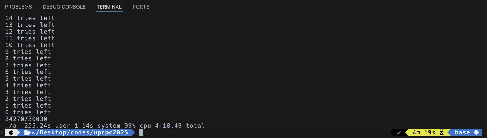

# UPCPC2025正式赛

## 更新记录

本人实力有限，有一些题至今还没做出来，之后会时不时填坑，故把填坑记录加到最上面了，目前还差 I, K, L。

* 2025/03/11 更新了 J 题的解法。
    
* 2025/03/16 更新了 J 题解法的解释。
    

## Problem A. 精准切割

这里提供一种暴力的方法，以左下角为原点，长边为 x 轴，短边为 y 轴建立平面直角坐标系（为保证精度，所有坐标乘 n，因为 n 是分母），暴力尝试主对角线在一列格子左侧和右侧的截距，记为 $y_1,y_2$记 $t = \lfloor \frac{y_1}{n} \rfloor \times n$，如果 $(y_1 - t) + (y_2 - t) = n$ 表明切割是对称的，该块被均分。

我感觉一定有不暴力的办法，欢迎计算几何大佬的新点子。

**参考代码**

```cpp
#include <iostream>

using namespace std;

int f(int n, int m) {
    if (n < m) swap(n, m);
    int res = 0;
    for (int i = 1; i <= n; ++i) {
        int t = (i - 1) * m / n * n;
        if ((i * m - t) + ((i - 1) * m - t) == n) res++;
    }
    return res;
}

int main() {
    cout << f(22, 38) << endl << f(21, 36) << endl;
    return 0;
}
```

## Problem B. 让时间走走停停

<s>这道才是真签到题，下面那道签到题学学啊😭</s>

记初始状态为 0，平年 +365，闰年 +366，对 7 取模，如果是 0，就是福利年。

**参考代码**

```cpp
#include <iostream>

using namespace std;

int main() {
    int i, t = 1, cur = 0;
    for (i = 2001; t < 8; ++i) {
        cur += 365;
        if (i % 100 == 0 && i % 400 == 0 || i % 4 == 0) cur++;
        cur %= 7;
        if (cur == 0) t++;
    }
    cout << i - 1 << endl;
    return 0;
}
```

## Problem C. 大力出奇迹

看题目好像就是让暴力的（<s>孩子只会暴力</s>），赛后我在本地跑我的 O(n²) 暴力程序只跑了 4min 19s，思考下一道题的时候挂上暴力，下一道敲完了就跑完了。答案是 809/1001.

**暴力的代码**

```cpp
#include <iostream>

using namespace std;

int gcd(int a, int b) {
    return b ? gcd(b, a % b) : a;
}

int main() {
    long long a = 0, b = 1;
    int n = 111111;
    for (int i = 2; i <= n; ++i) {
        int t = 0;
        for (int j = 2; j <= i; ++j) {
            if (gcd(i, j) != 1) t++;
        }
        if (a * i < t * b) a = t, b = i;
        printf("%d tries left\n", n - i);
    }
    int g = gcd(a, b);
    a /= g, b /= g;
    printf("%lld/%lld\n", a, b);
    return 0;
}
```

有图有真相（第一次跑的时候忘了约分了，但是无伤大雅，运行时间大致是准的）



## Problem D. 时左时右

直接按照题目的要求模拟即可，时间复杂度是 O(nm)，完全够用。维护 ne\[i\]\[j\] 表示当前在第 i 个通道，在第 j 次移动时移动到的下一个点，默认为 i；然后遍历 \[1, n\]，分别模拟一遍并记录答案即可。

**参考代码**

```cpp
#include <iostream>

using namespace std;

int ne[110][1010], res[110];

int main() {
    int n, m;
    cin >> n >> m;
    for (int i = 1; i <= n; ++i) {
        for (int j = 1; j <= m; ++j) {
            ne[i][j] = i;
        }
    }
    for (int i = 1; i <= m; ++i) {
        int t;
        cin >> t;
        ne[t][i] = t + 1, ne[t + 1][i] = t;
    }
    for (int i = 1; i <= n; ++i) {
        int t = i;
        for (int j = 1; j <= m; ++j) t = ne[t][j];
        res[t] = i;
    }
    for (int i = 1; i <= n; ++i) cout << res[i] << endl;
    return 0;
}
```

## Problem E. “合作”

从资质最弱的艾比这里考虑很困难，因为不好确定谁会和它合作，谁会攻击它。不妨从资质最强的艾比开始考虑。

* 资质最强的艾比一定会活下来，并且持续攻击资质比他弱的艾比；
    
* 考虑资质次强的艾比，为了留下来，它会选择帮助一定数量的艾比防御（这个数量尽可能小），直到这一个区间内的艾比的资质和大于或者等于资质最强的艾比。如此，一个区间内的艾比都能活下来；活下来之后他们会选择尽可能赶走其他艾比，因此会和最强的合作，攻击其他更弱的艾比；
    
* 循环往复，直到剩下的所有艾比合作都无法抵御攻击者，至此攻击者全部留下来，剩下的艾比全部被赶走。
    

接下来模拟这个过程即可。

**参考代码**

```cpp
#include <iostream>
#include <algorithm>

using namespace std;

const int N = 500010;
int s[N];

int main() {
    int n;
    scanf("%d", &n);
    for (int i = 1; i <= n; ++i) {
        scanf("%d", &s[i]);
    }
    sort(s + 1, s + n + 1);
    long long rs = s[n], ls = 0;
    int p = n;
    for (int i = n - 1; i; --i) {
        ls += s[i];
        if (ls >= rs) {
            rs += ls;
            ls = 0;
            p = i;
        }
    }
    printf("%d\n", n - p + 1);
    return 0;
}
```

## Problem F. 未完待续

这道题非常的坑人，挖坑挖的非常巧妙，如果题面能加一句“通过旋转可以等价的情况视为多种”就更完善了。

### 一般情况

考虑线性dp，记 f\[i\]\[0\] 为第 i 列不放牌的方案个数，f\[i\]\[1\] 为第 i 列放牌的方案个数，显然有

$$
f_{i, 0} = f_{i - 1, 0} + f_{i - 1, 1}
$$

$$
f_{i, 1} = 2f_{i - 1, 0}
$$

这个递推式可以用矩阵加速，构造递推式如下

$$
\begin{pmatrix} f_{i - 1, 0} & f_{i - 1, 1} \end{pmatrix} * \begin{pmatrix} 1 & 2\\ 1 & 0 \end{pmatrix} = \begin{pmatrix} f_{i, 0} & f_{i, 1} \end{pmatrix}
$$

初始状态 $\begin{pmatrix} 1 & 0 \end{pmatrix}$，用矩阵快速幂求 $\begin{pmatrix} 1 & 2\\ 1 & 0 \end{pmatrix}^n$，然后相乘，就能得到 $\begin{pmatrix} f_{n, 0} & f_{n, 1} \end{pmatrix}$. 这样就得到了 O(log n) 的做法。

### 特殊情况

考虑 3 × 3 的情况，因为题目说平行于长度为 3 的边，此时平行于哪条边都是可以的，原来有 11 种情况，顺时针旋转 90°，还有 10 种情况，另外还有以下四种情况，共计 25 种，特判 n = 3 时输出 25 即可。

```plaintext
**_  __*  *__  _**
__*  __*  *__  *__
__*  **_  _**  *__
```

**参考代码**

```cpp
#include <iostream>
#include <vector>

using namespace std;

const int MOD = 1000000007;

vector<vector<int>> mul(vector<vector<int>> a, vector<vector<int>> b) {
    vector<vector<int>> res(2, vector<int>(2, 0));
    for (int k = 0; k < 2; ++k) {
        for (int i = 0; i < 2; ++i) {
            for (int j = 0; j < 2; ++j) {
                res[i][j] = (res[i][j] + (long long)a[i][k] * b[k][j] % MOD) % MOD;
            }
        }
    }
    return res;
}

int solve(unsigned long long p) {
    if (p == 3) return 25;
    vector<vector<int>> res = {{1, 0}, {0, 1}}, base = {{1, 2}, {1, 0}};
    while (p) {
        if (p & 1) res = mul(res, base);
        base = mul(base, base);
        p >>= 1;
    }
    return (res[0][0] + res[0][1]) % MOD;
}

int main() {
    unsigned long long n; // 注意数据范围，别把 long long 爆了
    cin >> n;
    cout << ((solve(n * 2) - solve(n)) % MOD + MOD) % MOD << endl;
    return 0;
}
```

## Problem G. 这里一定发生过什么

> XXX，G 题有一份……不，是 26 份提交，没有通过。<s>没错，这就是我</s>

拼音，不可战胜的。

**豆包写的代码（一遍秒了，我不如豆包😭）**

```cpp
#include <iostream>
#include <string>
#include <vector>

int main() {
    std::vector<std::string> pinyinTexts = {
        "you ren shuo zhao ge ge zhu ban dan wei de yi ju jian jie zai qian mian jia shang you ren shuo zai hou mian jia shang ye you ren ren wei bu jin ru ci ni zen me kan jiu ke yi chu cheng ben ci xiao sai de qian dao ti ye you ren ren wei bu jin ru ci ni zen me kan",
        "ACM ju le bu shi gao xin jiu ye ming xiao shen zao de yao lan",
        "ji suan ji xue yuan shuang chuang zhong xin lang chao ju le bu zhuan zhu yu pei yang xue sheng chuang xin neng li",
        "wu xian dian xie hui ju jiao yu dian zi ji shu yu chuang xin shi jian",
        "shu xue jian mo xie hui duo ci bei ping wei you xiu she tuan",
        "zen me kan jiu shi wei le zhe dian cu cai bao de zhe dun jiao zi"
    };

    int n;
    std::cin >> n;
    if (n >= 1 && n <= 6) {
        std::cout << pinyinTexts[n - 1] << std::endl;
    }

    return 0;
}
```

## Problem H. 数对

遍历一遍字符串（字符串记为s），开一个数组 vis 记录每一种小写字母上次出现的位置，对于每一个位置 i，遍历 $\text{j} \in [\text{'a', 'z'}]$，IF vis\[j\] &gt; vis\[i\] THEN 答案++ 即可。

**参考代码**

```cpp
#include <iostream>
#include <cstring>

using namespace std;

int vis[26];

int main() {
    memset(vis, -1, sizeof(vis));
    string s;
    int res = 0;
    cin >> s;
    for (int i = 0; i < s.length(); ++i) {
        for (int j = 0; j < 26; ++j) {
            if (~vis[j] && vis[j] > vis[s[i] - 'a']) res++;
        }
        vis[s[i] - 'a'] = i;
    }
    cout << res << endl;
    return 0;
}
```

## Problem J. 木板放置

看着无从下手<s>（实际上也无从下手）</s>。

这题可以用贪心做，具体做法是

* 对于**合法**的情况，做法是先把长度都设成 R，枚举每一个间距优先保证左侧的板子长度为 R，对于不满足要求的间距优先缩短右侧，如果右侧缩到 L，仍然不合法，就继续缩短左侧。
    
* 对于**不合法**情况，在遍历间距的时候判断间距是否小于 L 即可。
    

**证明（数学归纳法）**：

* 显然，n = 1 的时候满足；
    
* 假设 n = k 的时候是最优的，那么在最后面再加一个长度为 R 的木板
    
    * 如果放得下，那一定还是最优；
        
    * 如果放不下，缩短最后一个木板和缩短第 k 个木板是等价的。
        

所以这个做法是可行的。

```cpp
#include <iostream>
#include <algorithm>

using namespace std;

const int N = 100010;

int a[N], s[N];

int main() {
    int n, l, r;
    scanf("%d%d%d", &n, &l, &r);
    for (int i = 1; i <= n; ++i) {
        scanf("%d", &a[i]);
        s[i] = r;
    }
    a[0] = -0x3f3f3f3f, a[n + 1] = 0x3f3f3f3f;
    sort(a + 1, a + n + 1);
    for (int i = 1; i <= n; ++i) {
        if (a[i] - a[i - 1] < l) {
            printf("-1\n");
            return 0;   
        }
        else if ((s[i - 1] + l) <= (a[i] - a[i - 1]) * 2) s[i] = min(r, (a[i] - a[i - 1]) * 2 - s[i - 1]);
        else s[i] = l, s[i - 1] = (a[i] - a[i - 1]) * 2 - l;
    }
    int res = 0;
    for (int i = 1; i <= n; ++i) {
        res += s[i];
    }
    printf("%d\n", res);
    return 0;
}
```

## Problem M. 删数

这道题相对正常，<s>比 G 简单 ♾️ 倍。</s>

简单变换一下，剩下的总和为 m，等价于删除的一段的总和为 $\sum_{i = 1}^{n}{a_i} - m$；只需维护一个前缀和数组 s，对于每一次查询，遍历数组，对于每一个位置 i，是否存在 $j \in [0, i]$, $s_i - s_j = s_n - m$即可；查询的方法有很多种，我给出的参考代码用的二分查找，也可以用 unordered\_set，unordered\_map 等 STL 容器维护。

**参考代码**

```cpp
#include <iostream>
#include <algorithm>

using namespace std;

long long s[1000010];

int main() {
    int n, q;
    scanf("%d%d", &n, &q);
    for (int i = 1; i <= n; ++i) {
        scanf("%lld", &s[i]);
        s[i] += s[i - 1];
    }
    while (q--) {
        int m;
        scanf("%d", &m);
        m = s[n] - m;
        bool f = false;
        for (int i = 1; i <= n; ++i) {
            int l = 0, r = i;
            while (l < r) {
                int mid = l + r >> 1;
                if (s[mid] >= s[i] - m) r = mid;
                else l = mid + 1;
            }
            if (s[i] - s[l] == m) {
                f = true;
                break;
            }
        }
        if (f) printf("Yes\n");
        else printf("No\n");
    }
    return 0;
}
```

## 获奖感言

**观前提醒：胡言乱语，请不要信以为真！！！**

我感谢 G 题的出题人，让我认识到了自己作为中国人应该有点文化素养仍有欠缺；我佩服 J 题的出题人，ta 很会坑人（我明年也一定会向 ta 学习）。小米保温杯很好用，比手环实用多了，这一定是 G 题出题人无意间给我安排好的吧。

实话说，这次校赛基本上都没对到我的强项上，计算几何，数学题，博弈，汉语拼音正好完美包括了我的弱项。给了数学语文基础好的人很大的发挥空间，对于我这种只会基本的 DP，图论，数据结构的人简直是灾难级的😭，做不动，根本做不动，最后 7 分钟的时候调拼音调得心态彻底崩了。