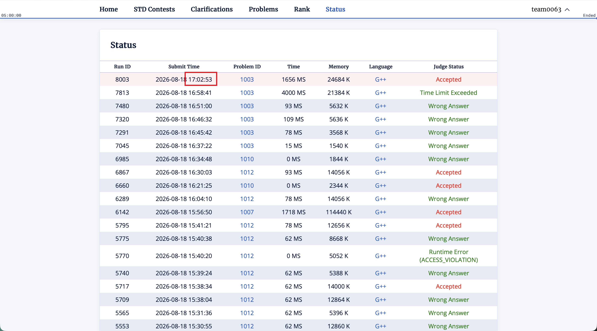

## 1001. 歪歪巧克力

<!-- algorithm-tags: sorting, greedy, arithmetic -->

```cpp
#include<bits/stdc++.h>
using namespace std;
int main()
{
    ios::sync_with_stdio(0);
    cin.tie(0);
    int t;
    cin>>t;
    while(t--)
    {
        int n;
        cin>>n;
        vector<int> a(n);
        for(int i=0;i<n;i++)cin>>a[i];
        sort(a.begin(),a.end());
        long long ans=0;
        for(int i=0;i<n;i++)ans+=a[i];
        ans+=a[n-1];
        cout<<ans<<"\n";
    }
}
```

## 1003. Secluded Sensei

<!-- algorithm-tags: shortest_path, bitset, dp -->

经过的具体的点集只和路径最后两个点有强绑定，继续走的话不可能走到前面的点集里的点，分层图最短路 + bitset 暴力维护。

```cpp
#include <bits/stdc++.h>

using namespace std;

typedef long long LL;
const int N = 510;
const int MOD = 998244353;
int dis[N][N], vis[N][N];
LL cnt[N][N];
bitset<N> f[N][N], msk[N];
vector<int> adj[N];

int main() {
    ios::sync_with_stdio(0);
    cin.tie(0), cout.tie(0);
    int T;
    cin >> T;
    while (T--) {
        int n, m, s, t;
        cin >> n >> m >> s >> t;
        for (int i = 1; i <= n; ++i) msk[i] = bitset<N>(1) << i, adj[i].clear();
        for (int i = 1; i <= n; ++i) {
            for (int j = 1; j <= n; ++j) {
                dis[i][j] = 0x3f3f3f3f;
                f[i][j] = vis[i][j] = cnt[i][j] = 0;
            }
        }
        for (int i = 1; i <= m; ++i) {
            int x, y;
            cin >> x >> y;
            msk[x][y] = 1;
            msk[y][x] = 1;
            adj[x].emplace_back(y);
            adj[y].emplace_back(x);
        }
        dis[s][s] = 0;
        cnt[s][s] = 1;
        f[s][s] = msk[s];
        queue<tuple<int, int, int>> q;
        q.emplace(dis[s][s], s, s);
        while (!q.empty()) {
            auto [_, pre, x] = q.front();
            q.pop();

            if (vis[pre][x]) continue;
            vis[pre][x] = true;

            for (int y = 1; y <= n; ++y) {
                if (msk[x][y] && y != x) {
                    if (dis[x][y] > dis[pre][x] + 1) {
                        dis[x][y] = dis[pre][x] + 1;
                        f[x][y] = f[pre][x] | msk[y];
                        cnt[x][y] = cnt[pre][x];
                        q.emplace(dis[x][y], x, y);
                    }
                    else if (dis[x][y] == dis[pre][x] + 1) {
                        int c1 = f[x][y].count(), c2 = (f[pre][x] | msk[y]).count();
                        if (c1 == c2) {
                            cnt[x][y] += cnt[pre][x];
                            if (cnt[x][y] >= MOD) cnt[x][y] -= MOD;
                        }
                        else if (c1 > c2) f[x][y] = f[pre][x] | msk[y], cnt[x][y] = cnt[pre][x];
                    }
                }
            }
        }
        int mn1 = 0x3f3f3f3f, mn2 = 0x3f3f3f3f;
        for (int i = 1; i <= n; ++i) {
            if (dis[i][t] < mn1) {
                mn1 = dis[i][t];
                mn2 = f[i][t].count();
            }
            else if (dis[i][t] == mn1) {
                mn2 = min(mn2, (int)f[i][t].count());
            }
        }
        LL res = 0;
        for (int i = 1; i <= n; ++i) {
            if (dis[i][t] == mn1 && f[i][t].count() == mn2) {
                res += cnt[i][t];
                if (res >= MOD) res -= MOD;
            }
        }
        cout << mn2 << ' ' << res << '\n';
    }
    return 0;
}
```


> [!NOTE]
>
> 

## 1004. 歪歪01串

<!-- algorithm-tags: xor_basis, bitmask, math -->

算签到吧，每一段都只有操作和不操作两种选择，把所有的长度为 len 的段的异或和加到一个线性基里，然后和 x 求最大异或就行。

```cpp
#include <bits/stdc++.h>

using namespace std;

struct LB {
    uint64_t b[64]{};

    void insert(uint64_t x) {
        for (int i = 63; i >= 0; --i) {
            if (x >> i & 1) {
                if (b[i]) x ^= b[i];
                else {
                    b[i] = x;
                    return;
                }
            }
        }
    }

    uint64_t query(uint64_t x) {
        uint64_t res = 0;
        for (int i = 63; i >= 0; --i) {
            if (x >> i & 1) {
                if (b[i]) x ^= b[i], res ^= b[i];
            }
        }
        return res;
    }
};

const int N = 100010;
uint64_t a[N];

int main() {
    ios::sync_with_stdio(0);
    cin.tie(0), cout.tie(0);
    int T;
    cin >> T;
    while (T--) {
        int n, l, q;
        cin >> n >> l >> q;
        uint64_t cur = 0;
        LB lb;
        for (int i = 1; i <= n; ++i) {
            cin >> a[i];
            cur ^= a[i];
            if (i >= l) {
                cur ^= a[i - l];
                lb.insert(cur);
            }
        }
        while (q--) {
            uint64_t x;
            cin >> x;
            cout << (lb.query(~x) ^ x) << '\n';
        }
    }
    return 0;
}
```

## 1005. Cartesian Sensei

<!-- algorithm-tags: kmp, stack, cartesian_tree, string -->

```cpp
#pragma GCC optimize("O2")
#include <bits/stdc++.h>
#include <numeric>
using namespace std;
#define int long long
#define i64 int64_t
#define db long double
#define pii pair<int, int>
#define tiii tuple<int, int, int>
#define ull unsigned long long
#define vi vector<int>
using i128 = __int128;
#define vpii vector<pii>
#define vvpii vector<vector<pii>>
#define vvi vector<vi>
#define pqpii priority_queue<pii, vector<pii>, greater<pii>>
#define pqi priority_queue<int, vi, greater<int>>
#define f first
#define s second
#define all(x) (x).begin(), (x).end()
#define pb push_back
#define eb emplace_back
#define sz(x) (x).size()
#define mp make_pair
#define endl '\n'
const int mod = 998244353;
const int INF = 1e18;
const int N = 5e3 + 5;
void init() {}
vector<int> prefix_function(const vi &s) {
    auto check=[&](int i,int j){
        // cout<<i<<" "<<j<<endl;
        if(s[i]==s[j])return true;
        if((s[i]>j||s[i]==-1)&&s[j]<0)return true;
        return false;
    };
    int n = s.size();
    vector<int> pi(n);
    for (int i = 1; i < n; i++) {
        int j = pi[i - 1];
        while (j && !check(i,j)) j = pi[j - 1];
        if (check(i,j))
            j++;
        pi[i] = j;
    }
    return pi;
}
void solve() {
    int n;
    cin >> n;
    vi a(n);
    for (int i = 0; i < n; i++)
        cin >> a[i];
    stack<int> s;
    vi prev(n, -1);
    for (int i = 0; i < n; i++) {
        while (!s.empty() && a[s.top()] > a[i])
            s.pop();
        if (!s.empty())
            prev[i] = i-s.top();
        s.push(i);
    }
    // for(int i=0;i<n;i++)cout<<prev[i]<<" ";
    // cout<<endl;
    vi ans=prefix_function(prev);
    for (int i = 0; i < n; i++) {
        cout << ans[i] << " ";
    }
    cout << endl;
}
signed main() {
    ios::sync_with_stdio(false);
    cin.tie(nullptr);

    init();

    int t = 1;
    cin >> t;
    while (t--)
        solve();

    return 0;
}
```

## 1007. 小乖的在益起

<!-- algorithm-tags: hashing, data_structures, bitmask, randomization -->

频率哈希，对于每个可能成功的 (编号，口味) 对定一个随机哈希值，保证一个编号对应的所有口味的值的 sum 为 0，然后检查区间和是否为 0，区间求和可以用 BIT 维护.

```cpp
#include <bits/stdc++.h>

using namespace std;

typedef __int128_t i128;

uint64_t splitmix64(uint64_t x) {
    x += 0x9e3779b97f4a7c15ULL;
    x = (x ^ (x >> 30)) * 0xbf58476d1ce4e5b9ULL;
    x = (x ^ (x >> 27)) * 0x94d049bb133111ebULL;
    return x ^ (x >> 31);
}

uint64_t rnd() {
    static uint64_t seed =
        chrono::steady_clock::now().time_since_epoch().count();
    return splitmix64(seed++);
}

struct BIT {
    vector<i128> tr;
    int n;

    BIT(int n) : tr(vector<i128>(n + 1, 0)), n(n) {}

    void add(int x, i128 v) {
        for (; x <= n; x += x & -x) {
            tr[x] += v;
        }
    }

    i128 query(int x) {
        i128 res = 0;
        for (; x; x -= x & -x) {
            res += tr[x];
        }
        return res;
    }

    i128 query(int l, int r) {
        if (l > r) return 0;
        return query(r) - query(l - 1);
    }
};

int main() {
    ios::sync_with_stdio(0);
    cin.tie(0), cout.tie(0);
    int T;
    cin >> T;
    while (T--) {
        unordered_map<int, int> mp;
        int n, q, k, m = 0;
        cin >> n >> q >> k;
        vector<int> a(n + 1), c(n + 1);
        vector<vector<int>> qs(q);
        for (int i = 1; i <= n; ++i) {
            cin >> a[i];
            mp[a[i]]++;
        }
        for (int i = 1; i <= n; ++i) cin >> c[i];
        for (auto &vi : qs) {
            int op;
            cin >> op;
            if (op == 1) {
                int p, x, c;
                cin >> p >> x >> c;
                mp[x]++;
                vi = {p, x, c};
            }
            else {
                int l, r;
                cin >> l >> r;
                vi = {l, r};
            }
        }
        for (auto &[c, d] : mp) {
            if (d < k) d = -1;
            else d = ++m;
        }
        vector<vector<i128>> val(m + 1, vector<i128>(k));
        for (int i = 1; i <= m; ++i) {
            i128 s = 0;
            for (int j = 0; j < k - 1; ++j) {
                val[i][j] = rnd();
                s += val[i][j];
            }
            val[i][k - 1] = -s;
        }
        BIT tr1(n), tr2(n);
        for (int i = 1; i <= n; ++i) {
            int x = mp[a[i]];
            if (x != -1) tr1.add(i, val[x][c[i]]);
            else tr2.add(i, 1);
        }
        for (auto &vi : qs) {
            if (vi.size() == 3) {
                int p = vi[0], x = vi[1], nc = vi[2];

                int tx = mp[a[p]];
                if (tx != -1) tr1.add(p, -val[tx][c[p]]);
                else tr2.add(p, -1);

                tx = mp[x];
                if (tx != -1) tr1.add(p, val[tx][nc]);
                else tr2.add(p, 1);

                a[p] = x;
                c[p] = nc;
            }
            else {
                int l = vi[0], r = vi[1];
                if (tr2.query(l, r) == 0 && tr1.query(l, r) == 0) cout << "YES\n";
                else cout << "NO\n";
            }
        }
    }
    return 0;
}
```

## 1010. 合法括号

<!-- algorithm-tags: constructive, greedy, string -->

```cpp
#include <bits/stdc++.h>
using namespace std;
using ll = long long;

#define debug(x) cout << #x << '=' << x << ' ';
#define DL cout << '\n';

void solve() {
	int n, k;
	cin >> n >> k;

	int ori = k;

	string s;
	cin >> s;

	int pos_l = 0, pos_r = n - 1;
	int pre = 0, suc = 0;
	while (s[pos_l] != '?') {
		if (s[pos_l] == '(') pre ++;
		else k -= pre, pre --;
		pos_l ++;
	}
	while (s[pos_r] != '?') {
		if (s[pos_r] == ')') suc ++;
		else k -= suc, suc --;
		pos_r --;
	}

	bool rev = 0;
	if (pre < suc) {
		reverse(s.begin(), s.end());
		for (auto &c : s) {
			if (c == '(') c = ')';
			else if (c == ')') c = '(';
		}

		k = ori;
		pos_l = 0, pos_r = n - 1;
		pre = 0, suc = 0;
		while (s[pos_l] != '?') {
			if (s[pos_l] == '(') pre ++;
			else k -= pre, pre --;
			pos_l ++;
		}

		while (s[pos_r] != '?') {
			if (s[pos_r] == ')') suc ++;
			else k -= suc, suc --;
			pos_r --;
		}
		rev = 1;
	}

	int len = (pos_r - pos_l + 1);
	int left = (len - (pre - suc)) / 2;

	k -= (pre + 1) * pre / 2;

	//debug(left) debug(left) debug(k) debug(pos_l) DL
	k -= left;
	int cnt = pre;
	while (left) {
		if (k >= cnt) {
			//debug(pos_l) DL
			k -= cnt;
			cnt ++;
			s[pos_l ++] = '(';
			left --;
		} else {
			s[pos_l ++] = ')';
			cnt --;
		}
	}
	for (auto &c : s) if (c == '?') c = ')';
	//while (cnt --) s[pos_l ++] = ')';

	if (rev) {
		reverse(s.begin(), s.end());
		for (auto &c : s) {
			if (c == '(') c = ')';
			else if (c == ')') c = '(';
		}
	}
	cout << s << '\n';
}

int main() {
	ios::sync_with_stdio(0);
	cin.tie(0);

	//freopen("in.txt", "r", stdin);

	int t;
	cin >> t;
	while (t --) solve();
}
```

## 1011. 奶龙和噜噜的糖豆

<!-- algorithm-tags: lca, sparse_table, trees, dfs -->

```cpp
#pragma GCC optimize("O2")
#include <bits/stdc++.h>
#include <numeric>
using namespace std;
#define int long long
#define i64 int64_t
#define db long double
#define pii pair<int, int>
#define tiii tuple<int, int, int>
#define ull unsigned long long
#define vi vector<int>
using i128 = __int128;
#define vpii vector<pii>
#define vvpii vector<vector<pii>>
#define vvi vector<vi>
#define pqpii priority_queue<pii, vector<pii>, greater<pii>>
#define pqi priority_queue<int, vi, greater<int>>
#define f first
#define s second
#define all(x) (x).begin(), (x).end()
#define pb push_back
#define eb emplace_back
#define sz(x) (x).size()
#define mp make_pair
#define endl '\n'
const int mod = 998244353;
const int INF = 1e18;
const int N = 5e3+ 5;
int inv[N];
void init() {}
int qp(int a,int b){
    int res = 1;
    while(b){
        if(b & 1) res = (res * a) % mod;
        a = (a * a) % mod;
        b >>= 1;
    }
    return res;
}
struct LCA {
    const vector<vector<int>> &g;
    vector<int> dep, first, eul, lg;
    vector<vector<int>> st;
    LCA(const vector<vector<int>> &g, int root = 1)
        : g(g), dep(g.size()), first(g.size()) {
        eul.push_back(0);
        dfs(root, 0);
        int m = (int)eul.size() - 1;
        lg.assign(m + 1, 0);
        for (int i = 2; i <= m; i++) lg[i] = lg[i / 2] + 1;
        st.assign(lg[m] + 1, vector<int>(m + 1));
        st[0] = eul;
        for (int k = 1; k < (int)st.size(); k++)
            for (int i = 1; i + (1 << k) - 1 <= m; i++) {
                int x = st[k - 1][i], y = st[k - 1][i + (1 << (k - 1))];
                 st[k][i] = dep[x] < dep[y] ? x : y;
            }
    }
    void dfs(int u, int p) {
        first[u] = (int)eul.size();
        eul.push_back(u);
        for (int v : g[u])
            if (v != p) {
                dep[v] = dep[u] + 1;
                dfs(v, u);
                eul.push_back(u);
            }
    }
    int lca(int u, int v) const {
        int l = first[u], r = first[v];
        if (l > r)
            swap(l, r);
        int k = lg[r - l + 1], x = st[k][l], y = st[k][r - (1 << k) + 1];
         return dep[x] < dep[y] ? x : y;
    }
    int dist(int u, int v) const {
        return dep[u] + dep[v] - 2 * dep[lca(u, v)];
    }
    bool on_path(int x, int u, int v) const {
        return dist(u, x) + dist(x, v) == dist(u, v);
    }
};
void solve() {
    int n;
    cin >> n;
    vvi g(n + 1);
    for (int i = 1; i < n; i++) {
        int u, v;
        cin >> u >> v;
        g[u].pb(v);
        g[v].pb(u);
    }
    LCA lca(g);
    pii mx = mp(1, 0);
    auto max=[&](pii a,pii b){
        return (a.s*b.f>a.f*b.s?a:b);
    };
    auto min=[&](pii a,pii b){
        return (a.s*b.f<a.f*b.s?a:b);
    };
    int ans=0;
    for(int i=2;i<=n;i++){
        pii mn={1,1e9};
        if(sz(g[i])>1) continue;
        for(int j=2;j<=n;j++){
            if(i==j) continue;
            if(sz(g[i])>1||sz(g[j])>1)continue;
            int la=lca.lca(i,j);
            int x1=(lca.dep[i]-lca.dep[la]);
            int x2=(lca.dep[j]-lca.dep[la]);
            // if(i==7)cout << i << " " << j << " " << la << " " << x1 << " " << x2 << endl;
            mn=min(mn,mp(x1,x2));
        }
        // pii tmp=mx;
        mx=max(mx,mn);
        // if(tmp!=mx){
        //     cout << i  << " " << mx.f << " " << mx.s << endl;
        // }
    }
    ans=mx.s*qp(mx.f+mx.s,mod-2)%mod;
    cout << ans << endl;
}
signed main() {
    ios::sync_with_stdio(false);
    cin.tie(nullptr);

    init();

    int t = 1;
    cin >> t;
    while (t--)
        solve();

    return 0;
}
```

## 1012. Grand Swap Master

<!-- algorithm-tags: data_structures, sweeping, offline_queries -->

```cpp
#pragma GCC optimize("O2")
#include <bits/stdc++.h>
#include <numeric>
using namespace std;
#define int long long
#define i64 int64_t
#define db long double
#define pii pair<int, int>
#define tiii tuple<int, int, int>
#define ull unsigned long long
#define vi vector<int>
using i128 = __int128;
#define vpii vector<pii>
#define vvpii vector<vector<pii>>
#define vvi vector<vi>
#define pqpii priority_queue<pii, vector<pii>, greater<pii>>
#define pqi priority_queue<int, vi, greater<int>>
#define f first
#define s second
#define all(x) (x).begin(), (x).end()
#define pb push_back
#define eb emplace_back
#define sz(x) (x).size()
#define mp make_pair
#define endl '\n'
const int mod = 998244353;
const int INF = 1e18;
const int N = 2e5 + 5;
void init() {}
struct BIT {
    int n;
    vector<long long> tr;

    BIT(int n) : n(n), tr(n + 1) {}

    void add(int x, long long v) {
        for (; x <= n; x += x & -x)
            tr[x] += v;
    }

    long long sum(int x) {
        long long res = 0;
        for (; x; x -= x & -x)
            res += tr[x];
        return res;
    }

    long long sum(int l, int r) {
        return sum(r) - sum(l - 1);
    }
};
void solve() {
    int n;
    cin >> n;
    vi a(n);
    for(int i = 0; i < n; i++)cin >> a[i];
    int ans = 0;
    auto get = [&](int x) {
        int res = 0;
        if (x) res += (a[x - 1] - a[x]) * (a[x - 1] - a[x]);
        if (x + 1 < n) res += (a[x + 1] - a[x]) * (a[x + 1] - a[x]);
        return res;
    };
    for (int i = 1; i < n; i++) {
        int tmp = get(0) + get(i);
        swap(a[0], a[i]);
        tmp -= get(0) + get(i);
        if (tmp < 0) ans++;
        swap(a[0], a[i]);
    }
    for (int i = 1; i < n - 1; i++) {
        int tmp = get(i) + get(n - 1);
        swap(a[i], a[n - 1]);
        tmp -= get(i) + get(n - 1);
        if (tmp < 0) ans++;
        swap(a[i], a[n - 1]);
    }
    BIT bit(N);
    vvi v(N);
    for (int i = 1; i < n - 1; i++)
        v[a[i]].pb(a[i - 1] + a[i + 1]);
    for (int x = 1; x < N; x++) {
        for (auto s : v[x])
            ans += bit.sum(s - 1);
        for (auto s : v[x])
            bit.add(s, 1);
    }
    for (int i = 1; i + 2 < n; i++) {
        int j = i + 1;
        int si = a[i - 1] + a[i + 1];
        int sj = a[j - 1] + a[j + 1];
        if ((a[i] - a[j]) * (si - sj) > 0)
            ans--;
        if ((a[i] - a[j]) * (a[i - 1] - a[j + 1]) > 0)
            ans++;
    }
    cout << ans << endl;
}
signed main() {
    ios::sync_with_stdio(false);
    cin.tie(nullptr);

    init();

    int t = 1;
    cin >> t;
    while (t--)
        solve();

    return 0;
}
```
