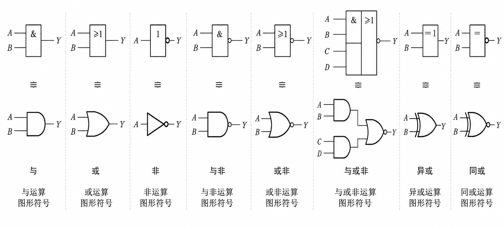
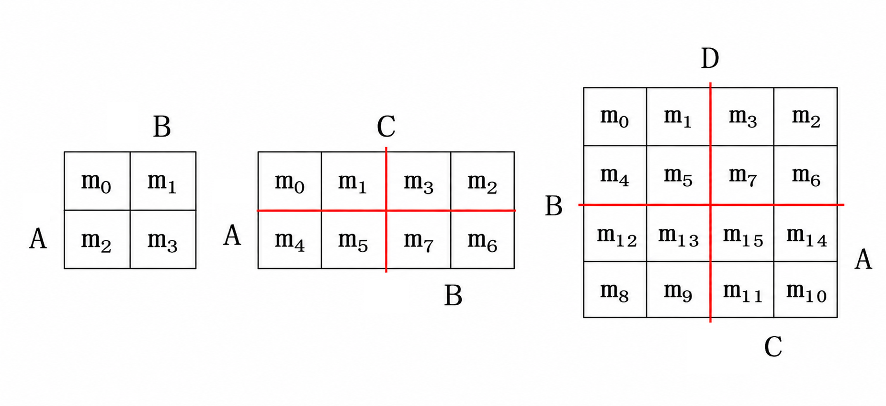

# 逻辑代数基础

> [!NOTE] 复习重点
> 1. 三种基本逻辑关系: 与 或 非 —— 运算规则、真值表和图形符号
> 2. 常用符合逻辑运算: 与非 或非 与或非 异或 同或 —— 运算规则、真值表和图形符号
> 3. 逻辑功能描述及其相互之间的转换
>    - 真值表、逻辑式、逻辑图、波形图、卡诺图
> 4. 逻辑代数的公式及函数化简
> 5. 卡诺图法化简逻辑函数
>
> **重点** （具无关项的）逻辑函数的卡诺图法化简

## 概述

- 逻辑: 事务的因果关系
- 逻辑运算的数学基础: 逻辑代数(乔治·布尔 1849 年提出，布尔代数)
- 变量取值: 0/1

## 基本运算

- 与 $Y = AB$
- 或 $Y = A + B$
- 非 $Y = A'$
- 与非 $Y = (AB)'$
- 或非 $Y = (A+B)'$
- 与或非 $Y = (AB + CD)'$
- 异或 $Y = A \oplus B$
- 同或 $Y = A \odot B$

## 公式

- **分配律**: $A \cdot (B + C) = A \cdot B + A \cdot C, A + B \cdot C = (A + B) \cdot (A + C)$

- **常用公式**
  - $$
    A + A'B = A + B
    $$
  - 冗余定理
    $$
    \begin{align*}
        AB + A'C + BC = AB + A'C\\
        AB + A'C + BCD = AB + A'C
    \end{align*}
    $$
  - 冗余定理推论（对偶式）
    $$
    (A + B)(A' + C)(B + C) = (A + B)(A' + C)
    $$

## 基本定理

- 代入定理
- 反演定理（德摩根定律扩展）
- 对偶定理: 逻辑式相等，那么对偶式($Y^D$)也相等

## 逻辑函数及其描述方法

- **逻辑函数**: $Y = F(A, B, C, \dots)$，逻辑变量为输入，运算结果为输出
  - 描述方法: 真值表、逻辑式、逻辑图、波形图、卡诺图、硬件描述语言
- **逻辑表达式的常用形式:** 与或式、或与式、与非式、或非式、与或非式
- **逻辑函数表达式的标准形式** 
  - 最小项标准表达式 $F = A'C + AB' = A'BC + A'B'C + AB'C + AB'C' = \sum m(1, 3, 4, 5)$

## 逻辑函数化简

<h3>公式化简法（非常抽象）</h3>

### 卡诺图法

- 卡诺图（只考到 4 变量）
  
  

- 依据: 相邻最小项可以合并
- 化简步骤:
  - 画出卡诺图
  - 画圈合并最小项
    - 每个圈尽量大
    - 圈的个数尽可能少
    - 覆盖卡诺图中的所有的 1
    - 每个圈至少有一个未用的 1
  - 将每个 **与项** 相 **或**

### 具有无关项的逻辑函数及其化简

- **约束:** 输入变量取值的限制称为约束，一组具有取值限制的数数变量称为**具有约束的逻辑变量**
- **约束项:** 某些取值不能出现时，用最小项恒等于 0 表示 $A'BC + AB'C = 0$，这些**恒等于 0 的最小项称为** Y 的约束项
- **任意项:** 输入变量某些取值下函数值为 1 或为 0 不影响逻辑带你的功能，这些最小项称为**任意项**。
- **逻辑函数中的无关项:**  **约束项**和**任意项**可以写入函数示也可以不写入函数式，统称无关项

$$
F = \sum m + \sum d \ \ \ \ 或\ \ \ \ \begin{cases}
  F = \sum m\\
  \text{约束条件:} \sum d = 0
\end{cases}
$$

- 在卡诺图中用 x 表示无关项，在化简逻辑函数时既可以认为它是 1，也可以认为它是 0