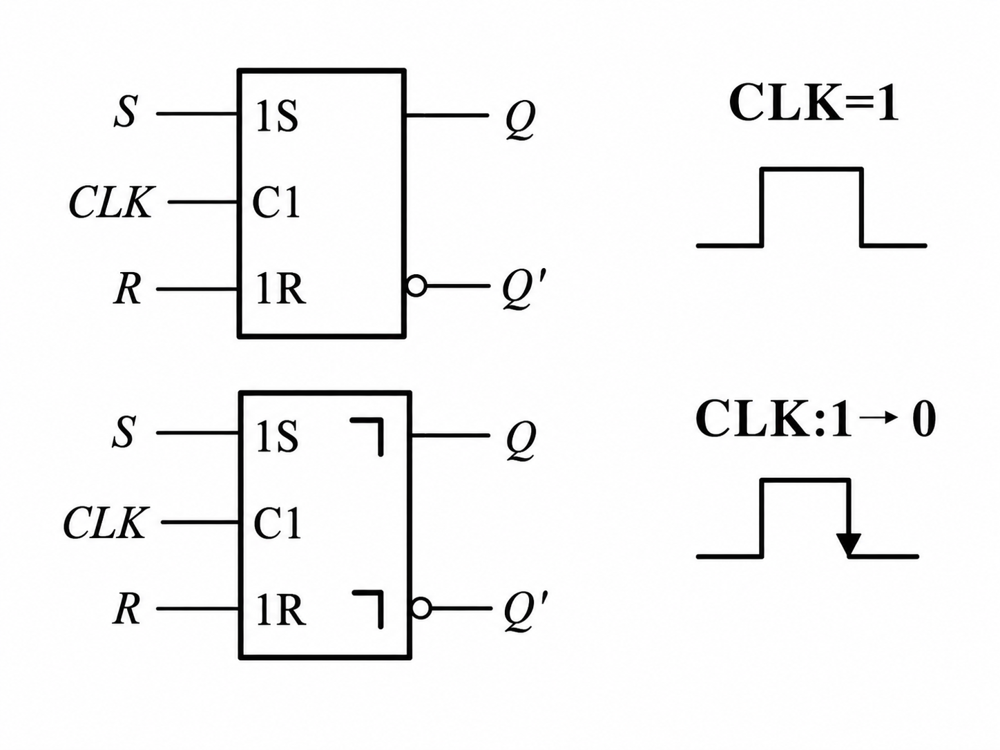
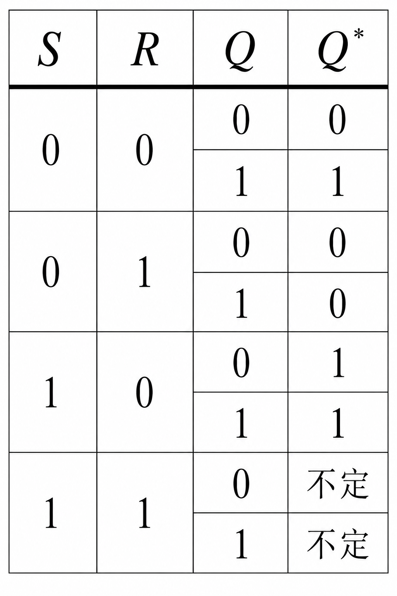
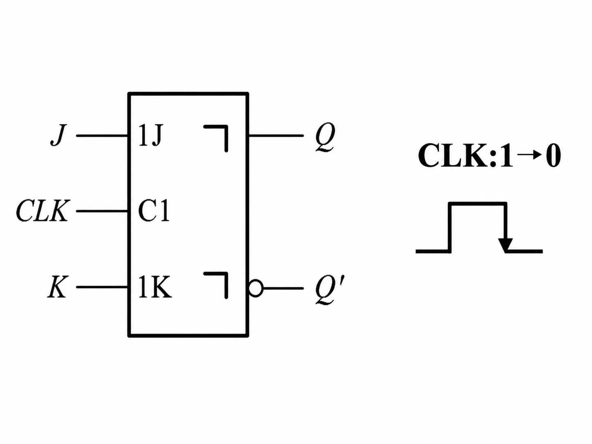
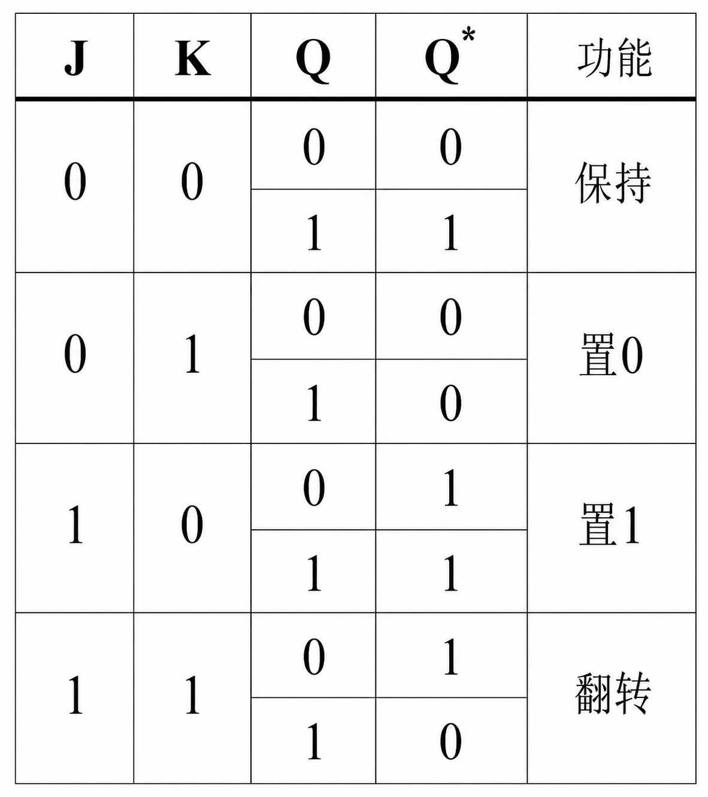
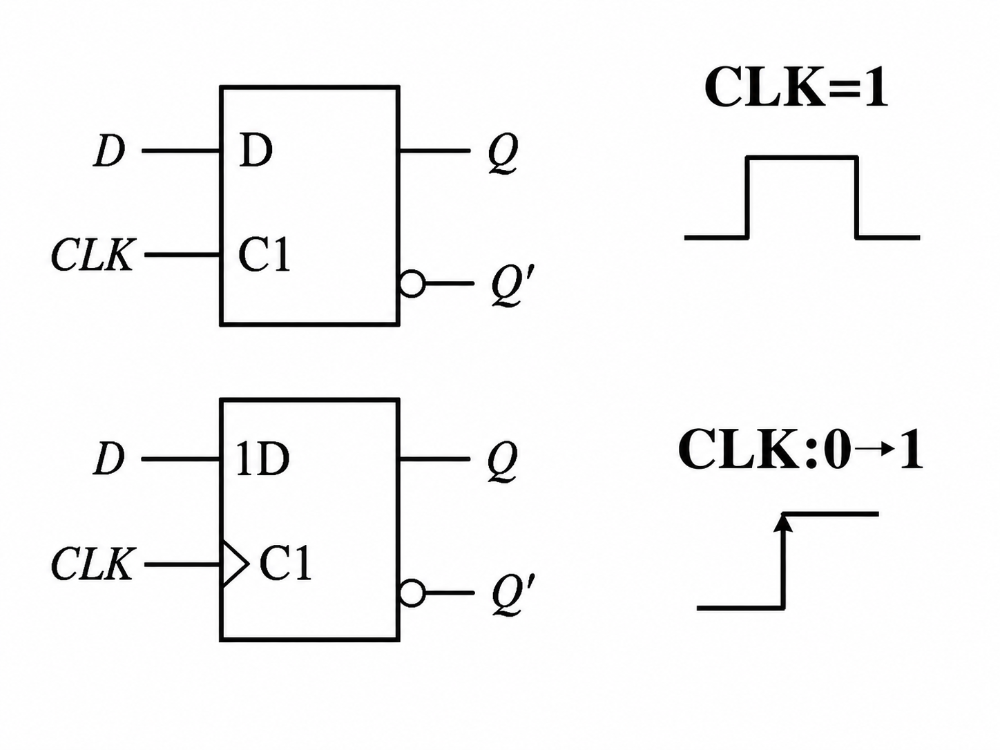
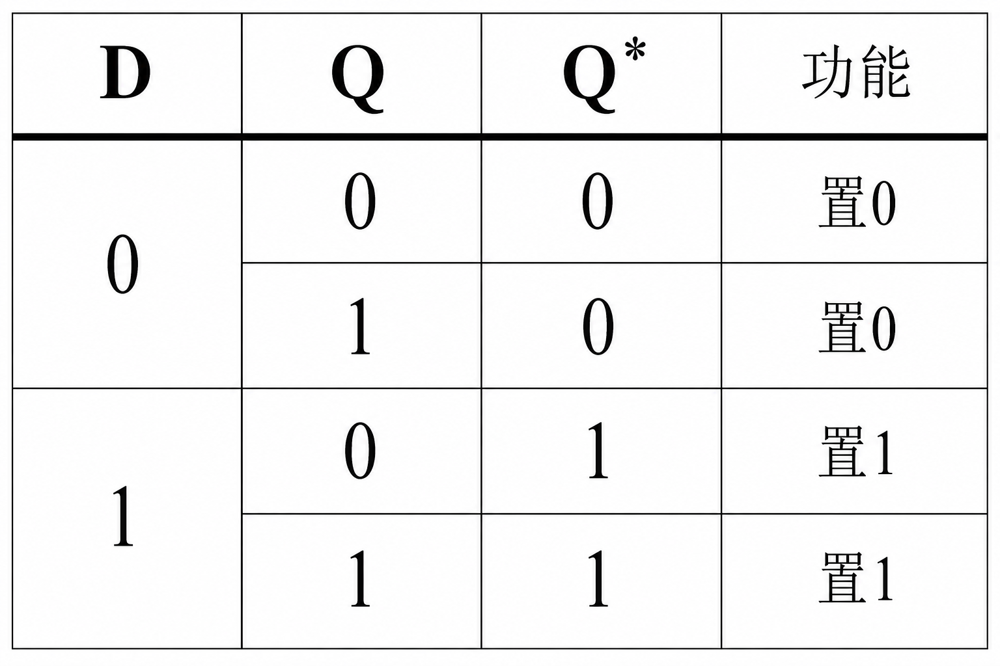
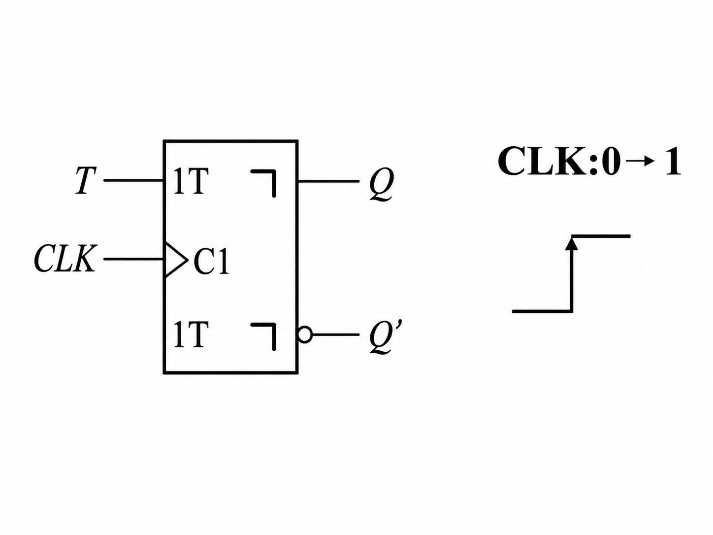
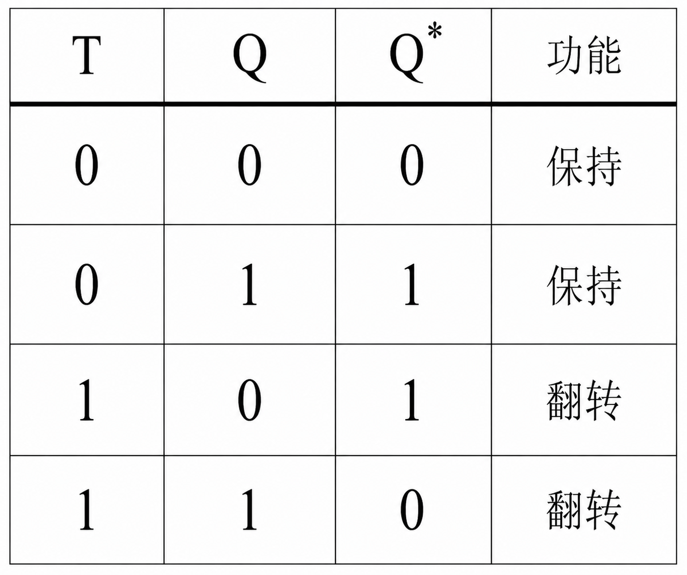
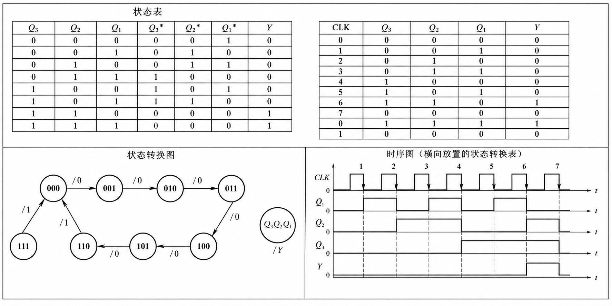

# 时序逻辑电路

## 时序电路功能描述

- 驱动方程、状态方程、输出方程
- 列真值表
- 电路逻辑功能

## 触发器

- 结构特点: 电平触发、脉冲触发、边沿触发
- 功能分类: SR 触发器、 JK 触发器、D 触发器、T 触发器

## 分析方法

- 三大方程
- 状态转换表、状态转换图和时序图
- 写电路逻辑功能

## 时序逻辑电路的设计方法

- 状态转换表 → 状态方程 → 驱动方程 → 电路图

## 常用时序逻辑电路

- 数码寄存器、移位寄存器
- 计数器
  - 同步二进制加法
  - 同步十进制加法
  - 任意进制计数器的构成方法

## 重点一 触发器的逻辑功能及其描述方法

| 触发器 | 逻辑符号 | 特性表 | 特征方程 |
| --- | --- | --- | --- |
| SR 触发器 |  |  | - |   
| JK 触发器 |  |  | $Q^* = JQ' + K'Q$ |
| D 触发器 |  |   | $Q^* = D$ |
| T 触发器 |  | | $Q^* = TQ' + T'Q$|

* **重点题型:** 电压波形

## 重点二 时序逻辑电路的分析方法

- 由给定电路写出驱动方程
- 将驱动方程代入触发器的特性方程，得到状态方程
- 从给定逻辑电路图写出输出方程
- 写出整个电路的状态转换表、状态转换图和时序图
  
- 由状态转换表或状态转换图得出电路的逻辑功能