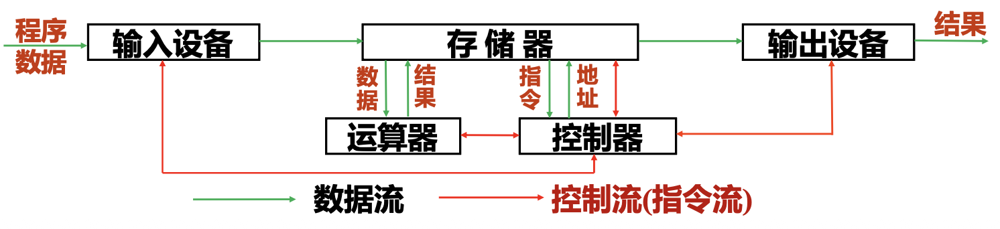

# 绪论

## 计算机的发展方向

- 巨型化: 速度快、容量大、功能强的巨型计算机
- 微型化: 体积小、功耗低、成本低
- 网络化: 计算机技术和通信技术紧密结合
- 智能化: 计算机具有人工智能和学习能力
- 异构化: 适应多种计算需求，未来不再是 CPU 一家独大，而是 CPU、GPU、NPU、DPU 协同工作的体系。

## 计算机的特点

- 运算速度快
- 计算精度高
- 存储能力和逻辑判断能力强
- 通用性强
- 工作自动化

## 冯·诺依曼结构

I/O 设备，存储器，运算器(算术逻辑运算部件 ALU)，控制器

## 存储程序原理

- 硬件构成: 计算机由运算器、控制器、存储器、输入设备和输出设备五部分构成
- 二进制原理: 指令和数据都以二进制的形式顺序存放在存储器中
- 程序控制原理: 机器自动顺序取出每条指令进行分析，执行其规定的操作

**核心思想:** 存储程序和程序控制

## 计算机的主要性能指标

机器字长、主存容量、运算速度（MIPS,MFLOPS,主频，CPI）、响应时间、吞吐量

- **机器字长:** CPU 一次最多处理的二进制数据位数。决定了寄存器、运算器、数据总线的位数
- **内存容量:**
  - 字节数（微机主存按字节编址）
  - 字数 $\times$ 字长（某些计算机按字编址）
- **运算速度:**
  - **主频:** CPU 内核工作的主时钟频率
  - **CPI (Cycle Per Instruction):** 执行一条指令所需的平均时钟数
  - 每秒执行指令的次数
    - MIPS 每秒执行百万条指令数
    - MFLOPS 每秒执行百万浮点运算
    - $E = 10^{18}, Z = 10^{21}$
  - **CPU 时间:** 执行程序花费的 CPU 时间，时钟周期 $\times$ 时钟数
  - **响应时间:** 发出请求到系统完成处理并给出响应经历的时间
    - 响应时间 = CPU 时间 + 访存等待时间 + I/O 耗时 + 操作系统开销 + 外部总线延迟
    - 是衡量机器性能最可靠的标准
  - **吞吐量:** 一定时间内完成的工作总量