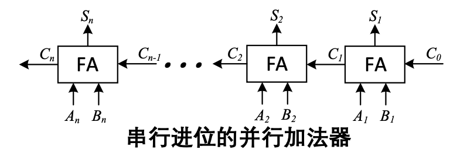
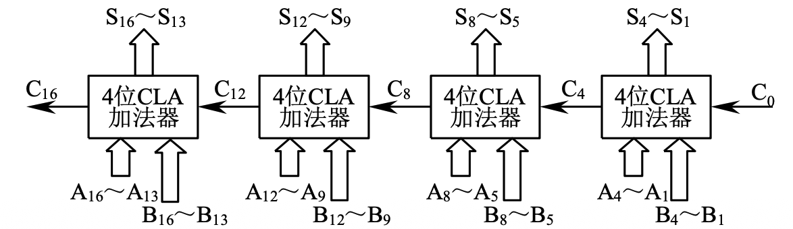
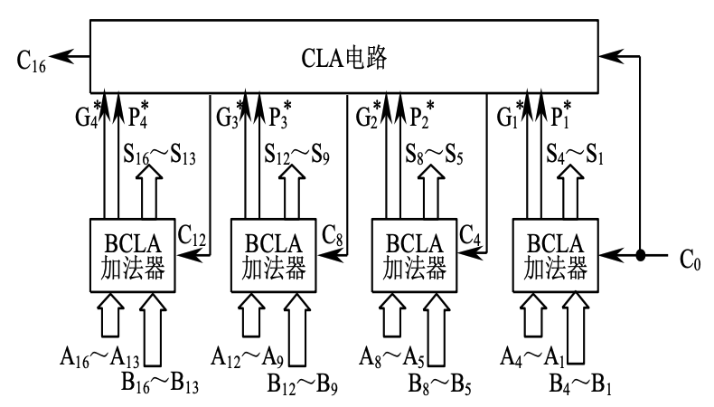

# 运算方法和运算器

## 溢出的产生及检测

- 单符号位检测方法
- 进位检测方法
- **变形补码检测方法**

## 补码（变形补码）的加减法运算

运算规则

$$
\begin{align*}
    [X + Y]_\text{补} &= [X]_\text{补} + [Y]_\text{补}\\
    [X - Y]_\text{补} &= [X]_\text{补} + [-Y]_\text{补}
\end{align*}
$$

$$
[Y]_\text{补} \xrightarrow{\text{各位（包括符号位）取反且末位 + 1}} [-Y]_\text{补}
$$

## 基本加减法运算器设计

> 串行加法器、并行加法器组成及其工作原理

- 串行加法器中，只有一个全加器
- 并行加法器由多个全加器组成，数据各位同时计算
  
### 进位的产生和传递

$$
C_I = A_iB_i + (A_I \oplus B_i) C_{i - 1}
$$

进位表达式可以表示为 $C_I = G_i + P_i C_{i - 1}$

- $G_i = A_i B_i$ 为进位产生函数
- $P_i = A_i \oplus B_i$ 为进位传递函数

 

- 串行进位链，又称行波进位链
    
  - $C_1 = G_1 + P_1 C_0, \dots C_n = G_n + P_n C_{n - 1}$
  - 设一级与门、或门的延迟定为 t_y$$ 不考虑 $G_i, P_i$ 的形成时间，每一级全加器都是进位延迟为 $2t_y$
  - 字长为 n 位的情况下，$C_0 \rightarrow C_n$ 最长延迟位 $2nt_y$
- 并行进位链，又叫先行进位、同时进位，特点是各级信号同时生成
- $$
  \begin{align*}
    C_1 &= G_1 + P_1 C_0\\
    C_2 &= G_2 + P_2 C_1 = G_2 + P_2 G_1 + P_2 P_1 C_0\\
    C_3 &= G_3 + P_3 C_2 = G_3 + P_3 G_2 + P_3 P_2 G_1 + P_3 P_2 P_1 C_0\\
    \vdots
  \end{align*}
  $$
  - 从 $C_0 \rightarrow C_n$ 的最长延迟时间仅为 $2t_y$
  - 随着金卫叔的增加 $C_i$ 的逻辑式会越来越长，使电路变得很复杂，完全采用并行进位是不显示的

### 实际应用的并行加法器加速进位方式

> 组内并行、组间串行的单级先行进位方式及其工作原理，组内并行组间并行的多级先行进位方式及其工作原理

- 单级先行进位方式（组内并行、组间串行）
  - **先行进位电路 CLA**，延迟时间是 $2t_y$

  
- 多级先行进位方式（组内并行、组间并行）
  $$
  \begin{align*}
    C_4 &= G_4 + P_4 + G_3 + P_4 P_3 G_2 + P_4 P_ 3 P_2 G_1 + P_4 P_3 P_2 P_1 C_0\\
    &= G_1^* + P_1^* C_0
  \end{align*}
  $$
  - $G_i^*$ 组进位产生函数，$P_i^*$ 组进位传递函数
  - **成组先行进位电路 BCLA** (Block Carry Look Ahead) 延迟时间是 $2t_y$
  - 进位产生和传递分三步，最长进位延迟时间是 $6t_y$
    - $C_0$ 产生第一小组的 $C_1 C_2 C_3$ 所有小组的 $G_i^*$ 和 $P_i^*$
    - CLA 电路产生 $C_4, C_8, C_{12}, C_{16}$
    - 产生 $C_5 \sim C_7, C_9 \sim C_{11}, C_{13} \sim C_{15}$
  
  
