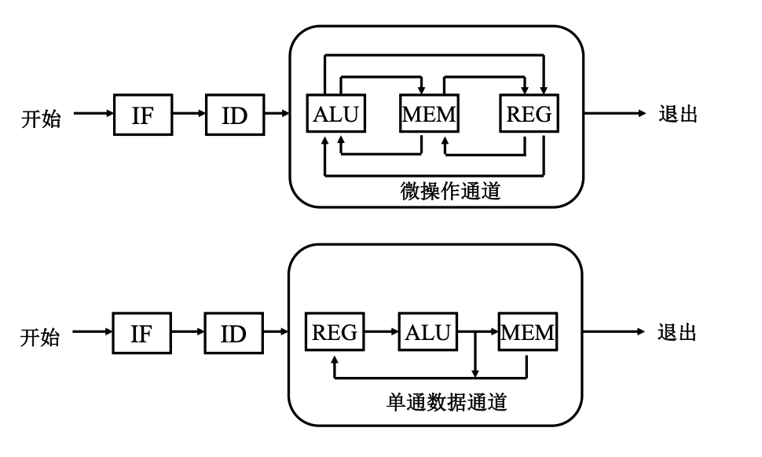

# 指令系统

> [!NOTE] 复习重点
> 1. 什么是指令系统，指令的格式及其各部分的含义
> 2. 操作数的寻址方式，每种寻址方式的有效地址的计算方法
> 3. 利用扩展操作码法进行变长操作码指令格式的设计
> 4. 什么是 CISC、RISC，各自的主要特点

## 概述

- 指令: 知识计算机执行某种操作的命令
- 指令系统 (指令集): 一台计算机中所有机器指令的集合

## 指令格式（重点）

- 一条指令由 **操作码** 和 **操作数地址码** 两部分组成
- 指令格式如下 
  <table><tbody><tr><td>操作码 OP</td><td>地址码 A</td></tr></tbody></table>
- 一条指令一般应包含如下信息
  - **操作码:** 规定指令的操作及功能
  - **地址码:** 操作对象，可以是具体的数也可以是存放具体数的地址
  - **操作结果存放地址:** 结果存放的位置
  - **下一条要执行指令的地址**

### 操作码

- 定长操作码
- 变长操作码

### 地址码

指出操作数的存贮位置。

- 四地址指令: $A_1\ \mathrm{OP}\ A_2 \rightarrow A_3,\ \text{下一条指令地址}$ <table><tbody><tr><td>$OP$</td><td>$A_1$</td><td>$A_2$</td><td>$A_3$</td><td>$A_4$</td></tr></tbody></table>
- 三地址指令: $A_1\ \mathrm{OP}\ A_2 \rightarrow A_3,\ (PC) + 1 \rightarrow PC\text{(隐含)}$ <table><tbody><tr><td>$OP$</td><td>$A_1$</td><td>$A_2$</td><td>$A_3$</td></tr></tbody></table>
- 二地址指令: $A_1\ \mathrm{OP}\ A_2 \rightarrow A_1,\ (PC) + 1 \rightarrow PC\text{(隐含)}$ <table><tbody><tr><td>$OP$</td><td>$A_1$</td><td>$A_2$</td></tr></tbody></table>
- 一地址指令: $A_1\ \mathrm{OP}\ ACC \rightarrow ACC\text{(累加器)},\ (PC) + 1 \rightarrow PC\text{(隐含)}$ <table><tbody><tr><td>$OP$</td><td>$A_1$</td></tr></tbody></table>
- 零地址指令: 无任何操作数，如 HALT, NOP 等，所需操作数由默认地址中，用在堆栈计算机中 <table><tbody><tr><td>$OP$</td></tr></tbody></table>

### 指令字长

考虑指令存取方便: 单字长指令、半字长指令、双字长指令

### 指令格式设计

变长操作码指令格式设计

## 寻址方式（BIG 重点）

### 指令的寻址方式

- 顺序寻址: PC
- 转移寻址: 下调指令的地址码由本条指令给出

### 操作数的寻址方式

**约定**

- EA 操作数的有效地址
- (X) X 中的内容，X 位寄存器时，表示寄存器中的内容；X 为存储器时，表示存储器中的内容
- R 寄存器
- M 存储器

 

- **立即寻址** 操作数由指令直接给出
- **直接寻址** $EA = A, S = (EA) = (A)$
- **间接寻址** 简称**间址** S = ((A)) <table><tbody><tr><td>操作码</td><td>@</td><td>一级间址</td></tr></tbody></table>
- **寄存器寻址** 寄存器直接寻址，寄存器间接寻址（同上），符号也一样
- **基址寻址方式** $EA = (R_b) + X$ <table><tbody><tr><td>操作码</td><td>$R_b$</td><td>偏移量 $X$</td></tr></tbody></table>
  - 逻辑地址 $\rightarrow$ 物理地址，面向系统
- **变址寻址方式** $EA = (R_x) + \text{形式地址}A$ <table><tbody><tr><td>操作码</td><td>$R_x$</td><td>形式地址 $A$</td></tr></tbody></table>
  - 数组、字符串元素读写，面向用户
- **相对寻址方式** $EA = PC + \text{形式地址}$
  - 相对当前指令的地址
- **堆栈寻址方式** SP 寄存器
  - 寄存器堆栈
  - 存储器堆栈
  
   

  - <table><tbody><tr><td>满递增</td><td>空递增</td></tr><tr><td>满递减</td><td>空递减</td></tr></tbody></table>

## 精简指令集计算机

数据通路

CISC 与 RISC 对比

| 类别 | CISC | RISC |
| --- | --- | --- |
| 指令系统 | 指令数量很多 | 较少 |
| 执行时间 | 有些指令执行时间很长，如整块的存储器内容复制，或将多个寄存器内容复制到存储器 | 没有较长执行时间的指令 |
| 编码长度 | 编码长度可变，1-15 字节 | 编码长度固定，通常为 4 个字节 |
| 寻址方式 | 寻址方式多样 | 简单寻址 |
| 操作 | 可以对存储器和寄存器进行算术和逻辑操作 | 只能对寄存器进行算术和逻辑操作，Load/Store 体系结构 |
| 编译 | 难以用优化编译器生成高效的目标代码程序 | 采用优化编译技术，生成高效的目标代码程序 |