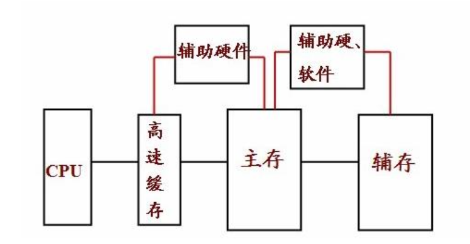
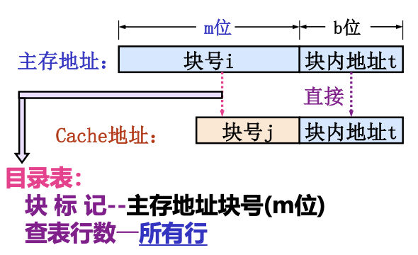
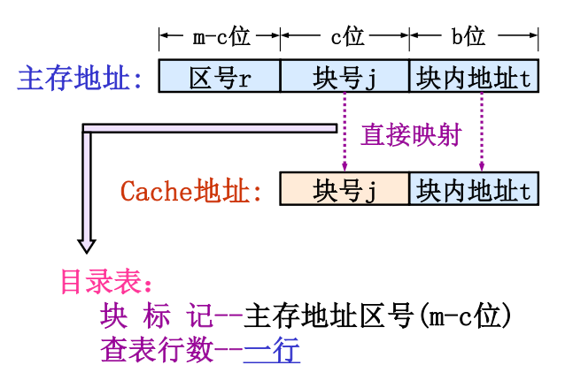
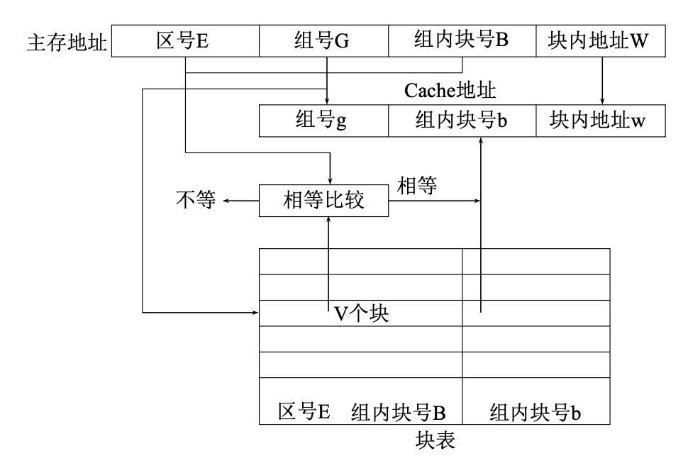

# 存储器

> [!NOTE] 复习重点
> 1. 存储系统的层次结构
> 2. SRAM 和 DRAM 的区别
> 3. DRAM 的刷新：为什么要刷新，刷新的特点，主要的刷新方式，刷新间隔，死区时间的计算等
> 4. SRAM 存储芯片与 CPU 的连接（位扩展、子扩展、子位同时扩展），每个芯片地址范围的计算
> 5. Cache 的原理，命中率，平均访问时间及访问效率
> 6. Cache 三种地址映射方式（全相联、直接、组相联）的地址结构
> 7. 虚拟存储器的概念

## 三级存储结构

- Cache 存储系统，Cache 硬件调度
- 虚拟存储系统，主要操作系统调度

## SRAM 和 DRAM 的区别

| | SRAM | DRAM |
| --- | --- | --- |
| 存储信息 | 触发器 | 电容 |
| 破坏性读出 | 非 | 单管是 |
| 需要刷新 | 不要 | 需要 |
| 运行速度 | 快 | 慢 |
| 集成度 | 低 | 搞 |
| 发热量 | 大 | 小 |
| 存储成本 | 高 | 低 |

- SRAM 读写快，成本高，多用于容量较小的高速缓冲存储器
- DRAM 读写速度较慢，集成度高，生产成本低，多用于容量大的主存储器

## DRAM 的刷新

- **刷新间隔** 一般器件的刷新周期为 2ms
- **刷新要点**
  - 间隔不允许超过 2ms
  - 刷新优先于访存，但不能打断访存周期
  - 刷新期间，不准访存
  - 以一行为单位进行，每刷新一行需要一个存储周期
- **刷新方式**
  - **集中式:** 存在死区
  - **分散式:** 存取周期长
  - **异步式:** 折中，使用较多，但是控制路线极其复杂

## 存储芯片和 CPU 的连接

- 数据线的连接（位扩展）: 并联片选线(CS)
- 地址线的连接（字扩展）: 高位用译码器
- 存储器芯片片选端连接
- 读/写控制信号的连接

## Cache

- **理论基础:** 程序的局部性原理
  - 时间上的局部性
  - 空间上的局部性
- **基本原理**
  - **容量及速度:** 工作速度是主存的 5 ~ 10 倍，但容量小，对整个存储系统的硬件线路复杂性和价格影响不大
  - **命中率:** $h = \frac{N_c}{N_c + N_m}$
  - **平均访问时间:** $T_a = hT_c + (1 - h)T_m$
  - **访问效率:** $e = \frac{T_c}{T_a}$

## 主存与缓存的地址映射

| 类型 | 图片 |
| --- | --- |
| 全相联映射 |  |
| 直接映射 |  |
| 组相联映射 |  |
  
## 虚拟存储器

<!-- todo 虚拟存储器 -->

