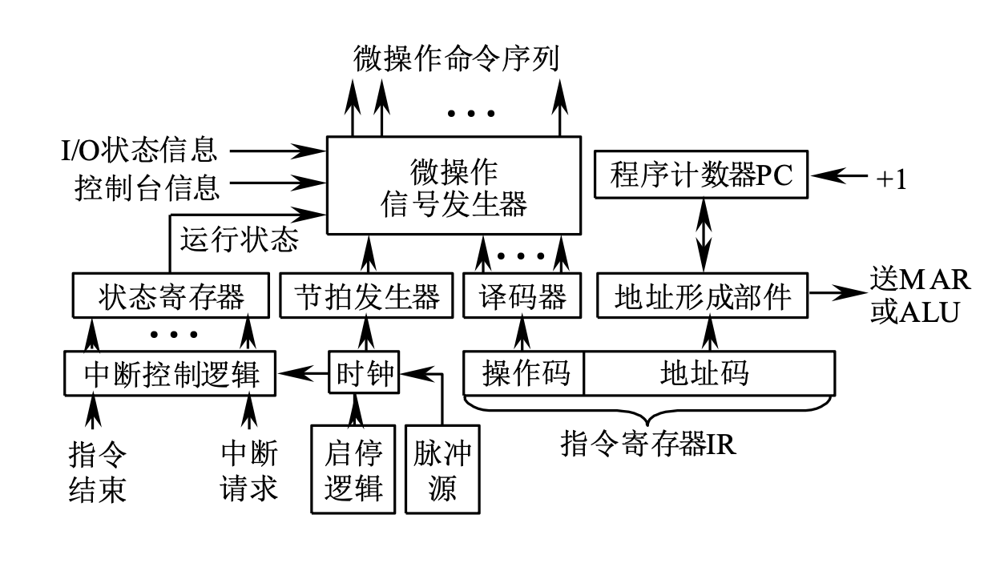

# 中央处理器

> [!NOTE] 复习重点
> 
> 1. 控制器的基本组成，包含哪些部件，核心部件是什么
> 2. 时序系统中的几个概念：指令周期、机器周期、节拍、节拍脉冲
> 3. CPU 中的专用寄存器有哪些（PC、IR、MDR、MAR、PSWR）
> 4. 根据 CPU 内部的数据通路写出指令的微操作流程
> 5. 组合逻辑控制器和微程序控制器的区分
> 6. 区分概念：微命令和微操作、指令和微指令、程序和微程序、存储器和控制存储器等
> 7. 微指令的设计，操作控制字段的编码方式（直接控制、最短编码、字段编码），后继微地址的断定方式

## 控制器的组成和功能

主要包括: 指令部件、时序部件、微操作信号发生器、中断控制逻辑



- **指令部件:** PC, IR, ID, PSWR
  - 程序计数器 PC
  - 指令寄存器 IR
  - 指令译码器 ID
  - 程序状态字寄存器 PSWR
- **时序部件**
  - 脉冲源
  - 启停控制逻辑
  - 节拍信号发生器: 又称脉冲分配器，脉冲源 $\xRightarrow{\text{节拍信号发生器}}$ 节拍信号
- **微操作序形成部件（核心）**
  - 微操作信号发生器，形成微操作命令序列
  - 可由**组合逻辑**控制电路或**微程序**控制电路来实现
- **中断控制逻辑:** 处理异常、特殊情况
- **地址形成部件:** 形成操作数有效地址
- **控制器的功能:** 对指令流在时间和空间上实现正确的控制
  - 取指令、分析指令、执行指令、控制主机与I/O设备交换信息、中断控制

## 时序系统

- **指令周期:** 从取指开始，到执行完该指令所需的全部时间
- **机器周期(CPU周期):** 一条指令可以分成一些基本操作，完成每个基本操作所需的时间，成为一个及其周期。常把访内一次所需的时间定位一个CPU周期
  - | 取指 | 执行 | 间址 | 处理中断 |
    | --- | --- | --- | --- |
    | CPU 取指周期 | CPU 执行周期 | CPU 间址周期 | CPU 中断周期 |
  - 每个周期设置一个周期状态触发器
- **节拍:** 计算机中最基本的（不能再分的）时间单位
  - 一个机器周期分成**若干个相等的节拍**，每一时间段完成一个或多个微操作，每个时间段对应一个电位线号，称为**节拍电位信号**
  - 很多微型机不设节拍，用时钟周期
- **工作脉冲(节拍脉冲):** 为了在一个节拍内产生几个不同的微操作控制信号，常在一个节拍内设置一个或多个工作脉冲，用以控制节拍内微操作的时序动作。也称为**打入脉冲**或**触发脉冲**

## CPU 中的寄存器设置

- **通用寄存器**
- **专用寄存器**
  - PC, IR, MDR, MAR, PSWR

## 指令执行的流程

- 取指令
  ```text
  (PC) → MAR
  Read
  M[MAR] → MDR
  (MDR) → IR
  (PC + 1) → PC
  ```
- 分析指令
- 执行阶段
  ```text
  ((R0)) + (R1) → (R0)
  ```

**例子**

```text
# 取指
(PC)→MAR, (PC)→Y, Read
M[MAR]→MDR, (MDR)→IR
(Y)+1→Z, (Z)→PC

# 取数
(R0)→MAR, Read
M[MAR]→MDR, (MDR)→Y

# 执行
(Y)+(R1)→Z
(Z)→MDR, Write
```

## 微程序的相关概念

- **微命令和微操作**
  - 控制命令叫微命令
  - 接受命令后的操作叫微操作（相容，相斥）
- **微指令与微地址**
  - 一组实现一定操作功能的微命令的集合，在控制存储器中存放时对应一个微地址
- **微周期**
  - 从控制存储器读出一条微指令并指定所需的全部时间
- **微程序**
  - 一系列微指令的有序集合
- **控制存储器与微地址**
  - 存放微指令的控制存储器的单元地址称为微地址

**区分概念**

- **机器指令和微指令**
  - 一条及其指令对应一个微程序，是若干条微指令组成的序列实现的
- **程序和微程序**
  - 微程序由微指令组成，用于描述机器指令，计算机设计者存放在控制存储器中
  - 程序由机器指令组成，软件设计人员存放在内存或外存中

## 微指令的编码方式

- 直接控制: 水平控制，不编码法
- 编码控制: 垂直控制，编码法

<br>

- **直接控制:** 每一位代表一个微命令，直接对应一种微操作
- **最短编码法:** 统一二进制编码
- **字段直接编码法:** 互斥的微命令划分在同一字段内，相容的划分在不同字段内。**一般每个子字段应留出一个状态，表示本字段不发出任何微命令**
- 字段间接编码法: 一个字段编码不能直接独立定义一个微命令，必须和其他字段的编码联合定义

**微程序的顺序控制方式**

- 初始地址形成
  - 一级功能转移: 直接用操作码作为微地址低位
  - **多级功能转移:** 按指令类型标志转移，区分哪一类指令
- 后继微地址形成
  - **增量方式:** （顺序—转移方式） 和及其指令顺序控制相似，设置微程序计数器 uPC
  - **断定方式:** 由设计者指定或由设计者指定的测试判定字段控制产生
    - 非因变分量，由设计者直接决定，一般是高位
    - 音变分量，根据判定条件产生，一般是低位