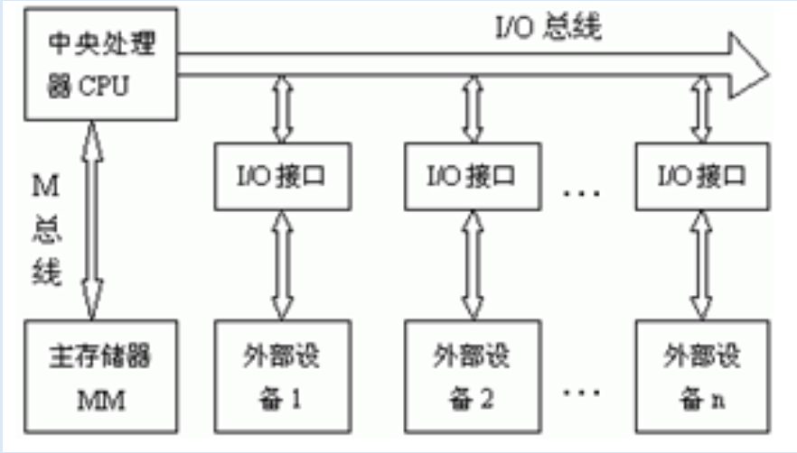
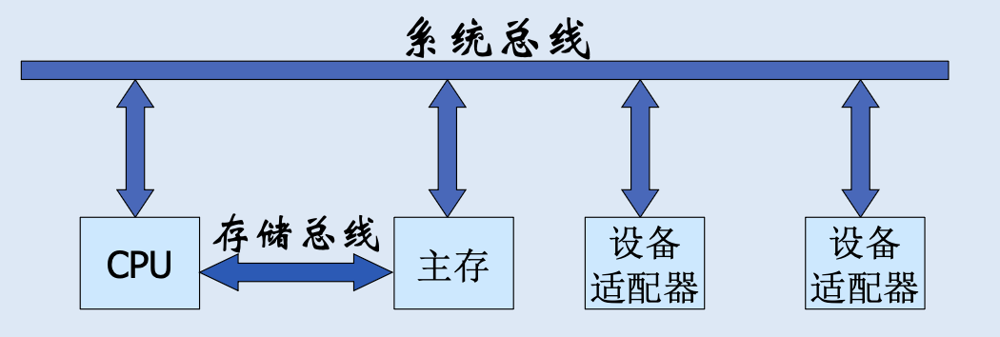
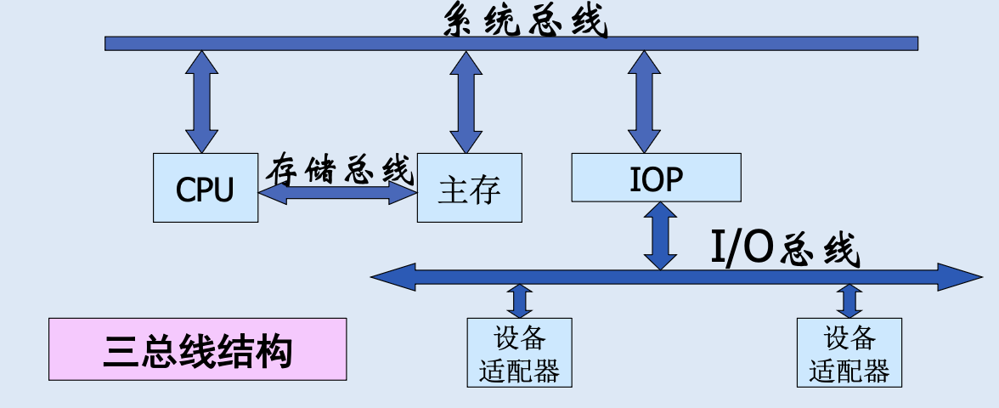
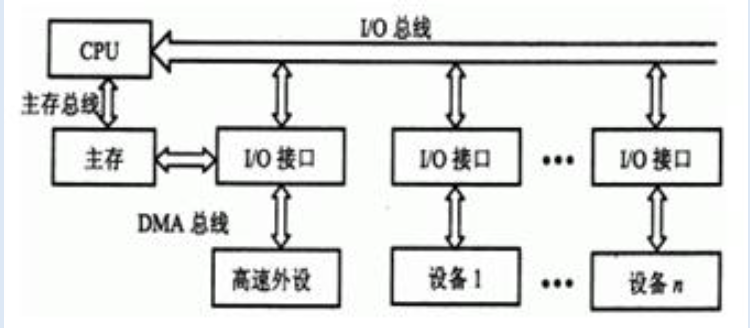

# 总线系统

> [!NOTE] 复习重点
> 1. 总线的概念及总线的分类
> 2. 总线的结构（单总线，双总线，三总线）
> 3. 总线带宽或数据传输率计算

## 基本概念

**总线:** 是构成计算机系统的互联机构，是多个系统功能组间之间进行数据传送的公共通路

**基本特征**

- 共享性: 多个部件连接在同一组总线上，各组件之间相互交换的信息都可以通过这组总线传送
- 分时性: 同一时刻总线只能在一对组间之间传送信息，系统中的多个部件不能同时传送信息

**分类**

- **按照总线传输的内容分类:** 数据总线、地址总线、控制总线
- **总线在单处理器系统中的位置:** 片内总线（片级总线）、系统总线（内部总线）、I/O 总线（外部总线）

**性能指标**

- **总线宽度:** 总线的条数，用 bit 表示，常用 32 位和 64 位
- **总线带宽:** 每秒能传输的最大字节量 MB/s
- **信号线数:** 地址、数据、控制总线的总和，信号线数与性能不成正比，但反应了总线的复杂程度
- **总线时钟频率:** 总线中各种信号的定时基准（同步总线和异步总线），总线的时钟周期: **总线周期**
- **多路复用技术:** 将数据总线与地址总线共用一组物理线路

<!-- **总线的组成**

- **信号线:** 包括地址线、数据线、控制、时序和中断信号线、电源线。
- **总线控制器:** 总线盘有控制逻辑和通信控制逻辑
- **接口电路:** -->

**传输方式**

- 串行传送
- 并行传送
- 并串传送
- 分时传送

## 总线结构

- 单总线结构
- 双总线结构
  - 以 CPU 为中心的双总线结构
    - 存储总线（M总线）用来连接 CPU 和主存
    - I/O 总线连接 CPU 和外部设备
      
  - 以存储器为中心的双总线结构
    - 由于 CPU 与主存交换数据机会多，增加了存储总线解决此问题
    - 
- 三总线结构
  - 
    通道的功能: 对外设统一管理；完成外设与主存，CPU 之间的数据传送

  - 