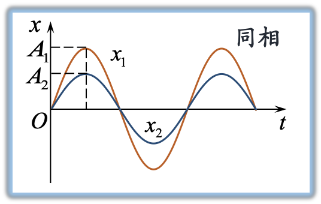
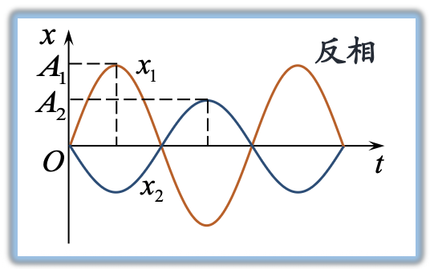
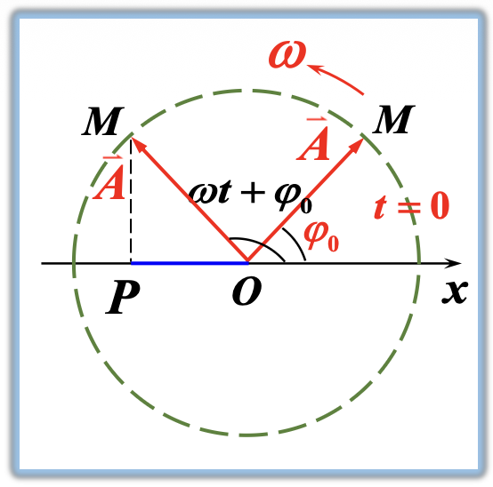
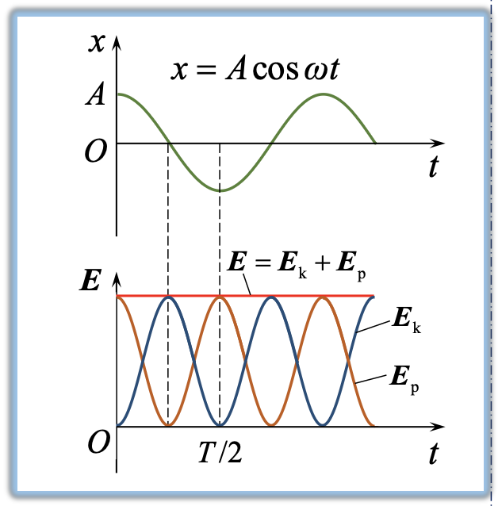
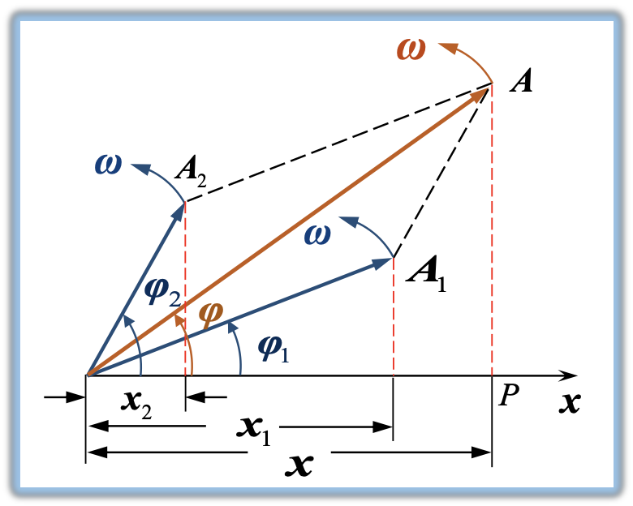
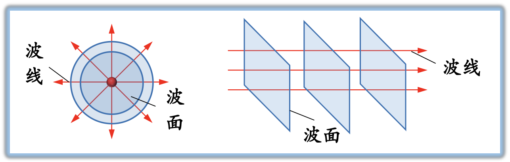
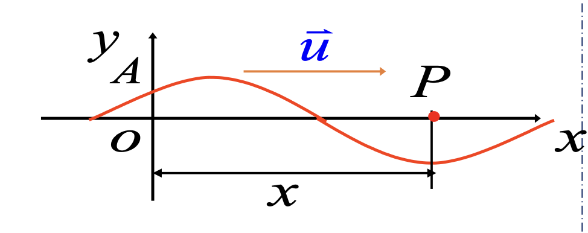
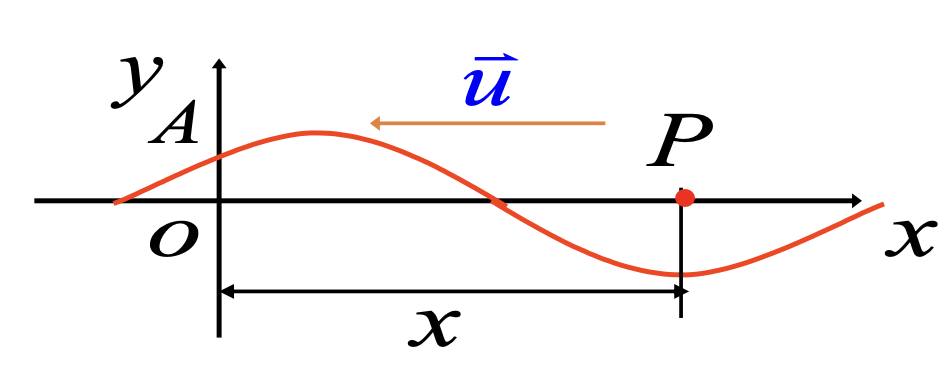
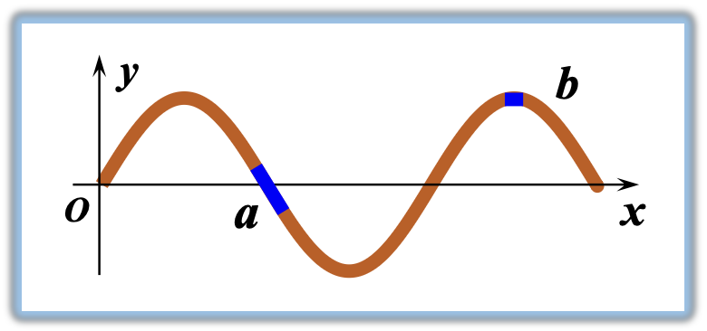
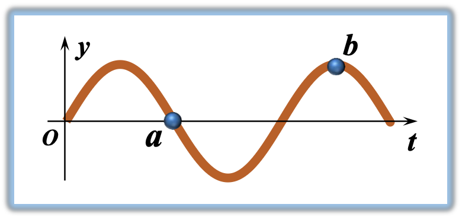

# 大物第三讲

板书内容：[点我跳转](#板书)

## 概念
<ul>
  <li><strong>振动:</strong> 描述物体状态的物理量在某一数值附近往复变化。</li>
  <li><strong>波动:</strong> 振动在空间或媒质中的传播过程，称为波动。</li>
  <li>机械振动在弹性媒质中的传播称为<strong>机械波</strong>。变化电场和变化磁场在空间的传播称为电磁波。</li>
</ul>

## 简谐振动

### 简谐运动的特征

#### 受力特征

$$F = -kx$$

物体在与偏离平衡位置的位移成正比、方向相反的<strong>回复力</strong>作用下围绕平衡位置的运动叫<strong>简谐振动</strong>。

#### 微分方程
<ul>
  <li><strong>弹簧振子:</strong> $$ \frac{d^2x}{dt^2} + \omega^2 x = 0 $$ 加速度与离开平衡位置的位移大小成正比，方向相反。</li>
  <li><strong>单摆在小角度摆动时的运动情况:</strong> $$\frac{d^2\theta}{dt^2} + \omega^2\theta = 0\quad (\text{其中},\ \omega = \sqrt{\frac{g}{l}})$$</li>
</ul>

#### 简谐振动的动力学定义

若物理量 $x$ 满足 $\frac{d^2x}{dt^2} + \omega^2 x = 0$，且 $\omega$ 由系统性质决定，则称 $x$ 作简谐振动。

### 简谐振动的运动学方程

#### 运动学方程 (振动表达式)

$$x = A\cos(\omega t + \varphi)$$

#### 描述简谐振动的物理量
<ul>
  <li><strong>振幅 $A$:</strong> 离开平衡位置的最大距离。</li>
  <li><strong>角频率 $\omega$:</strong>
    

      $$x = A\cos(\omega t + \varphi) = A\cos(\omega (t + T) + \varphi) = A\cos(\omega t + \omega T + \varphi)$$
      $$\omega T = 2 \pi\quad \omega = \frac{2\pi}{T} = 2\pi\nu$$
      $$T = 2 \pi \sqrt{\frac{m}{k}}\quad T = 2 \pi \sqrt{\frac{l}{g}}$$
    

  </li>
  <li><strong>相位 $\omega t + \varphi$:</strong> 描述运动状态的量。
    <ul>
      <li>$\omega t + \varphi$ 在 $0 \sim 2\pi$ 内与 $(x,\ \nu)$ 存在一一对应的关系。</li>
      <li>当相位变化了 $2\pi$ 时，质点恢复到原来的运动状态。</li>
      <li><strong>初相 $\varphi(t = 0)$:</strong> 描述质点初始时刻的运动状态。</li>
    </ul>
  </li>
  <li><strong>相位差:</strong> 两个同频率简谐运动。
    

      $$x_1 = A_1\cos(\omega_1 t + \varphi_1)$$
      $$x_2 = A_2\cos(\omega_2 t + \varphi_2)$$
      $$\Delta \varphi = (\varphi_2 - \varphi_1)$$
    

    
<strong>同相和反相:</strong>

    <ul>
      <li><strong>同相:</strong> $\Delta \varphi = \pm 2k\pi\ (k=0,1,2\dots)$ 振动步调相同。</li>
      <li><strong>反相:</strong> $\Delta\varphi = \pm(2k + 1)\pi\ (k=0,1,2\dots)$ 振动步调相反。</li>
    </ul>
    
    
  </li>
</ul>

### 简谐振动的表示方法

#### 解析法

$$x = A\cos(\omega t + \varphi_0)$$

#### 旋转矢量法

### 简谐振动旋转矢量法说明

  

    
作坐标轴 $Ox$，自 $O$ 点作一矢量 $\vec{OM}$，用 $\vec{A}$ 表示。

    <ul>
      <li><strong>振幅 $A$:</strong> $|\vec A| = A$。</li>
      <li><strong>初相 $\varphi_0$:</strong> $\vec A$ 在 $t = 0$ 时与 $x$ 轴的夹角。</li>
      <li><strong>角频率 $\omega$:</strong> $\vec A$ 以恒定角速度 $\omega$ 绕 $O$ 点作逆时针转动。</li>
      <li><strong>相位 $\omega t + \varphi_0$:</strong> $t$ 时刻 $\vec A$ 与 $x$ 轴的夹角。</li>
    </ul>
    
旋转矢量 $\vec{OM}$ 在 $x$ 轴上的投影 $P$ 点的坐标作简谐振动。

  

  

    
  

### 简谐振动的能量

  

    <ul>
      <li><strong>简谐运动的动能:</strong> $E_k = \frac{1}{2} m v^2 = \frac{1}{2} k A^2 \sin^2(\omega t + \varphi)$。</li>
      <li><strong>简谐振动的势能:</strong> $E_p = \frac{1}{2} k x^2 = \frac{1}{2} k A^2 \cos^2(\omega t + \varphi)$。</li>
      <li><strong>简谐振动的总能量:</strong> $E = E_k + E_p = \frac{1}{2} k A^2$。</li>
    </ul>
    
<strong>说明:</strong>

    <ul>
      <li>$E_p$ 与 $E_k$ 振幅相同，变化规律相同，周期相同，相位相反，系统总能量守恒。</li>
      <li>$E \propto A^2$，这是一切振动形式的共同性质。</li>
    </ul>
  

  

    
  

## 简谐运动的合成

### 同方向振动的合成

  

    

      $$x_1 = A_1\cos(\omega_1 t + \varphi_1)$$
      $$x_2 = A_2\cos(\omega_2 t + \varphi_2)$$
    

    
合振动的运动方程:
      $$x = x_1 + x_2 = A\cos(\omega t + \varphi)$$
      $$A = \sqrt{A_1^2 + A_2^2 + 2A_1A_2\cos(\varphi_2 - \varphi_1)}$$
      $$\varphi = \arctan \frac{A_1\sin\varphi_1 + A_2\sin\varphi_2}{A_1\cos\varphi_1 + A_2\cos\phi_2}$$
    

    

      合振动仍为简谐运动，与分振动在同一方向，且有相同频率。
    

  

  

    
  

<ul>
  <li>$\varphi_2 - \varphi_1 = 2k\pi,\ k = 0,\pm1,\pm2,\dots\quad A = A_1 + A_2$, 同相，合振幅最大。</li>
  <li>$\varphi_2 - \varphi_1 = (2k + 1)\pi,\ k = 0,\pm1,\pm2,\dots\quad A = |A_1 - A_2|$, 反相，合振幅最小。</li>
  <li>一般情况 (相位差任意) $\varphi_2 - \varphi_1 \neq k\pi\quad |A_1 - A_2| < A < A_1 + A_2$。</li>
</ul>

<strong>相位差</strong>在同频率简谐振动合成中起决定性作用。

## 机械波的产生与传播

### 机械波的产生

#### 机械波
机械震动在弹性介质中传播的过程。

#### 机械波产生条件
<ul>
  <li>波源。</li>
  <li>弹性介质 (由无数多的质元通过相互之间的弹性力组合在一起的连续介质)。</li>
</ul>

#### 机械波的类型
<ul>
  <li>
    <strong>横波 (S 波，Secondary, Shear):</strong>
    介质中质点振动方向与波的传播方向<strong>垂直</strong>，具有交替出现的<strong>波峰</strong>和<strong>波谷</strong>。
    <ul>
      <li>横波只能在固体中传播，例：绳波。</li>
    </ul>
  </li>
  <li>
    <strong>纵波 (P 波，Primary, Pressure):</strong>
    介质中质点振动方向与波的传播方向<strong>平行</strong>，具有交替出现的<strong>疏部</strong>和<strong>密部</strong>。
    <ul>
      <li>纵波在固、液和气体均可传播，例：声波。</li>
    </ul>
  </li>
</ul>

#### 波的几何描述——波线

  

    <ul>
      <li><strong>波线:</strong> 表示波的传播途径和方向的有向线段。</li>
      <li><strong>波面:</strong> 某时刻介质中<strong>振动相位</strong>相同的点所构成的空间面。</li>
    </ul>
    
根据波面的形状把波分为<strong>球面波、平面波</strong>等。

  

  

    
  

### 描述波动的物理量
<ul>
  <li><strong>波长:</strong> 同一波线上，相邻的相位差为 $2\pi$ 的两点间的距离，即一个完整波形的长度。($\lambda$)
    <ul>
      <li>波长反映波动空间的周期性。</li>
    </ul>
  </li>
  <li><strong>周期:</strong> 波传过一个波长所用的时间。
    <ul>
      <li>周期反映波动时间的周期性。</li>
    </ul>
  </li>
  <li><strong>频率:</strong> 波单位时间传播的距离中包含完整波的个数。</li>
  <li><strong>波速:</strong> 波动过程中，某一振动状态在单位时间内传播的距离，也称<strong>相速</strong>($u$)。
    

      波速 $u$ 与介质的性质有关，$\rho$ 为媒质的密度。
      $$u = \frac{\lambda}{T} = \lambda \nu$$
    <ul>
      <li>周期或频率只决定于波源的振动。</li>
      <li>波速只决定于媒质的性质。</li>
      <li>波长由波源和媒质共同决定。</li>
    </ul>
    

  </li>
</ul>

### 知识的对比与联系
<ul>
  <li>电磁波是横波。$\vec E, \vec B, \vec \nu$ 三矢量互相垂直，构成右手螺旋关系。</li>
  <li>电磁波的传播速度为:
    $$c = \frac{1}{\sqrt{\varepsilon_0 \mu_0}}$$
    $$\nu = \frac{1}{\sqrt{\varepsilon \mu}} = \frac{1}{\sqrt{\varepsilon_0 \varepsilon_r \mu_0 \mu_r}} =
    \frac{c}{\sqrt{\varepsilon_r \mu_r}} = \frac{c}{n}$$
  </li>
</ul>

### 平面简谐波的波函数

波的传播是振动的传播，是相位的传播，沿波的传播方向上各点相位依次落后。

<ul type="none">
  <li>$\Delta \varphi = \frac{2\pi}{\lambda}\Delta x$ <strong>推进单位长度的相位落后</strong>乘以波向前推进的距离。</li>
  <li>$= 2\pi\frac{\Delta x}{\lambda}$ <strong>推进一个周期 (波长) 的相位落后</strong>乘以波向前推进的完整波的个数。</li>
  <li>$\omega \frac{\Delta x}{u} = \frac{2\pi}{T} \frac{\Delta x}{u}$ <strong>推进单位时间的相位落后</strong>乘以波向前推进的时间。</li>
</ul>

### 波动表达式与相位落后法

<strong>相位落后法的要点:</strong> 波的传播过程即振动状态的传播，是相位的传播，沿着波的传播方向上相位是依次落后的。

#### 利用相位落后法建立平面简谐波波动表达式

若已知 $O$ 点振动表达式: $y_O = A\cos(\omega t + \varphi)$。

  

    <ul>
      <li>波沿 $x$ 轴正方向传播，$t$ 时刻，$P$ 点的振动方程写为$$y(x, t) = A\cos\left[\omega \left(t - \frac{x}{u}\right) + \varphi_0\right]$$</li>
      <li>波沿 $x$ 轴负方向传播，$t$ 时刻，$P$ 点的振动方程写为$$y(x, t) = A\cos\left[\omega \left(t + \frac{x}{u}\right) + \varphi_0\right]$$</li>
    </ul>
  

  

    
    
  

### 波函数的物理意义
<ul>
  <li>$x$ 确定时 ($x = x_0$) 为该处质元的振动方程, 对应曲线为该处质点<strong>振动曲线</strong>。</li>
  <li>$t$ 确定时 ($t = t_0$) 为该时刻各质元位移分布，对应曲线为该时刻<strong>波形图</strong>。</li>
  <li>$t$、$x$ 都变化时, 表示不同时刻，不同平衡位置处各质元的位移情况——行波。</li>
</ul>

### 波的能量

以横波为例，波函数为：$y = A\cos\left[\omega\left(t - \frac{x}{u}\right) + \varphi_0\right]$ ，在细绳上任取一线元 $\Delta x$，其质量 $\Delta m = \rho\Delta x$。

<ul>
  <li><strong>质元的动能</strong> $$v = \frac{\partial y}{\partial t} = -A\omega\sin\left[\omega\left(t - \frac{x}{u}\right) + \varphi_0\right]$$ $$\Delta E_k = \frac{1}{2}\Delta m v^2 = \frac{1}{2}\rho\Delta x A^2 \omega^2 \sin^2\left[\omega\left(t - \frac{x}{u}\right) + \varphi_0\right]$$</li>
  <li><strong>质元的势能</strong>$$\Delta E_p = \frac{1}{2}\rho\Delta x A^2 \omega^2 \sin^2\left[\omega\left(t - \frac{x}{u}\right) + \varphi_0\right]$$</li>
  <li><strong>总机械能</strong>$$\Delta E = \Delta E_k + \Delta E_p = \rho\Delta x A^2 \omega^2 \sin^2\left[\omega\left(t - \frac{x}{u}\right) + \varphi_0\right] = \rho A^2 \omega^2 \sin^2\left[\omega\left(t - \frac{x}{u}\right) + \varphi_0\right]\Delta x$$</li>
  <li>波在传播过程中，任意质元动能、势能的相位和量值均相同。
    

      <ul type="none" style="flex: 2;">
        <li>在平衡位置 ($y = 0$): 动能 $E_k$、势能 $E_p$ 最大。</li>
        <li>在振幅处 ($y = A$): 动能 $E_k$、势能 $E_p$ 为零。</li>
      </ul>
      
    

    

      <ul type="none" style="flex: 2;">
        <li>在平衡位置 ($y = 0$): 动能 $E_k$ 最大、势能 $E_p$ 为零。</li>
        <li>在振幅处 ($y = A$): 动能 $E_k$ 为零、势能 $E_p$ 最大。</li>
      </ul>
      
    

  </li>
  <li>介质中任意质元的总机械能不守恒，随时间 $t$ 作周期性的变化。</li>
  <li>能量以波速 $u$ 在介质中传播。</li>
</ul>

## 波的干涉

在一定条件下，两波相遇时，使某些点的振动始终加强，而另一些点的振动始终减弱或完全抵消的现象，称为<strong>波的干涉现象</strong>。

### 产生干涉的条件
<ul>
  <li>频率相同。</li>
  <li>振动方向相同。</li>
  <li>相位相同或相位差恒定。</li>
</ul>

### 干涉加强和减弱的条件
<ul>
  <li><strong>干涉加强的条件:</strong> $\Delta \varphi = \pm 2k\pi\ k = 0,1,2,3,\dots$, $A = A_{\max} = A_1 + A_2$。</li>
  <li><strong>干涉减弱的条件:</strong> $\Delta \varphi = \pm (2k + 1)\pi\ k = 0,1,2,3,\dots$, $A = A_{\min} = |A_1 - A_2|$。</li>
</ul>

## 半波损失

反射波在反射点有 $\pi$ 的相位突变,等效于波多走或少走半个波长的波程,这种现象称为<strong>半波损失</strong>。

弹性波: $\rho u$较大的媒质称为<strong>波密媒质</strong>；较小的为<strong>波疏媒质</strong>。

<ul>
  <li>波密介质 $\stackrel{无半波损失}{\longrightarrow}$ 波疏媒质。</li>
  <li>波疏媒质 $\stackrel{半波损失}{\longrightarrow}$ 波密介质。</li>
</ul>

## 板书

这里是 PPT 中没有或者不全的板书。

### 简谐运动的判据

1. 受线性回复力(矩)。
2. $x'' + \omega^2 x = 0$。

$\omega$:
- 单位时间相位改变。
- $2\pi$ 秒内完成全振动次数。

### 单摆和复摆

- 刚体: 复摆。
- 质点: 单摆。

### 横波纵波的根本原因

- 横波的根本原因是剪切形变的弹性力。
- 纵波具有容变弹性的媒质都可以传播 (媒质 == 介质)。

### 两个方法

- 振动——旋转矢量法。
- 波动——相位落后法。

### 电磁波

- $c = \frac{1}{\sqrt{\varepsilon_0 \mu_0}}$, $\nu = \frac{1}{\sqrt{\varepsilon \mu}} = \frac{c}{n}$。
- $\varepsilon_0$ 真空电容率，真空中某点容纳电场的能力 (老叫法: 真空电介质常数)。
- $\mu_0$ 真空磁导率，容纳磁场的能力。
- $\varepsilon = \varepsilon_0 \varepsilon_r$ 介质电容率。
- $\mu = \mu_0 \mu_r$ 介质磁导率。
- 真空 $E = \frac{Q}{4\pi\epsilon_0 r^2}$, 介质 $E = \frac{Q}{4\pi\epsilon_0 \epsilon_r r^2}$。
- $\varepsilon_r$ 相对电容率，$\mu_r$ 相对磁导率。
- 光在介质传播速度取决于介质的电磁属性，机械波传播速度取决于介质的力学属性(力学弹性)。
- **LED**(light-emitting diode) 发光二极管 ~~不是 light electic deng~~。
- 发光原理 $\Delta E = E_3 - E_1 = h\nu$ (假设是从 3 能级跃迁到 1 能级)。