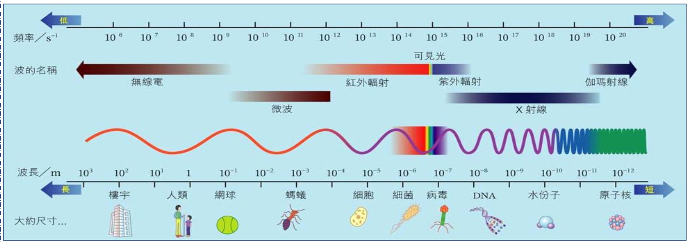
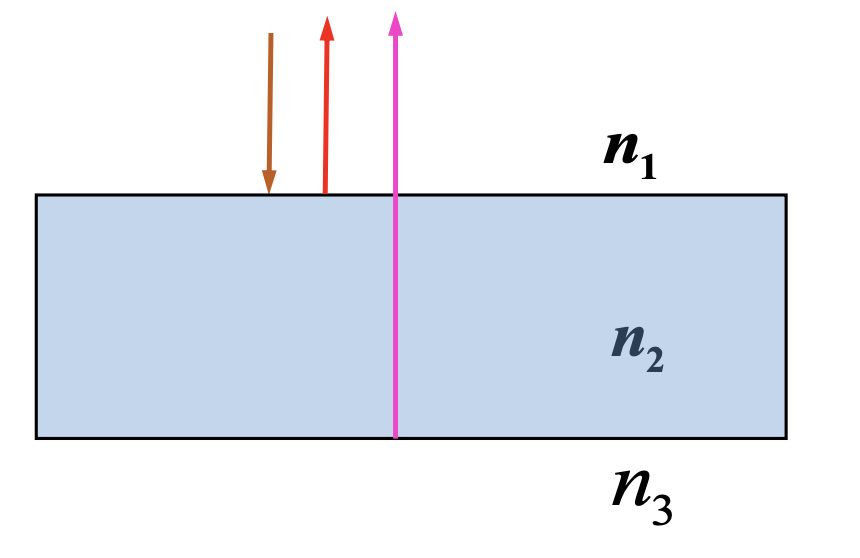
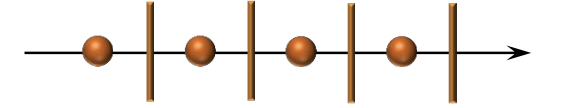
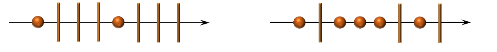
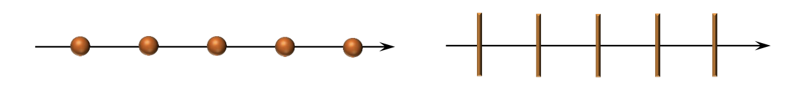
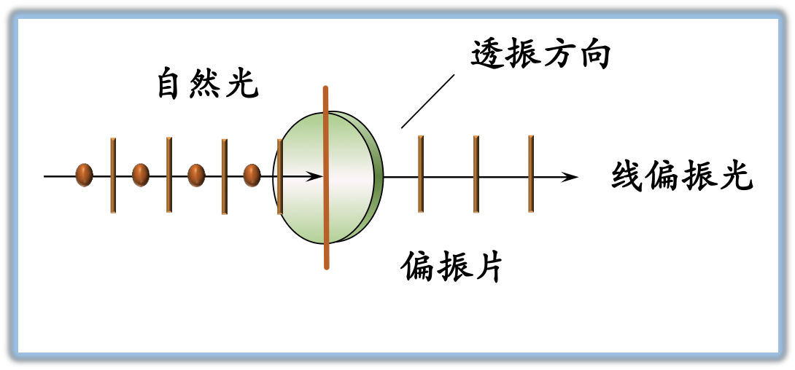
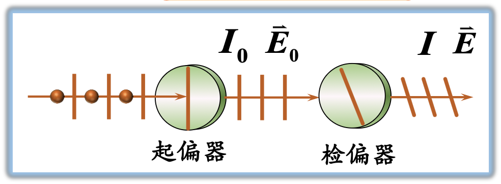
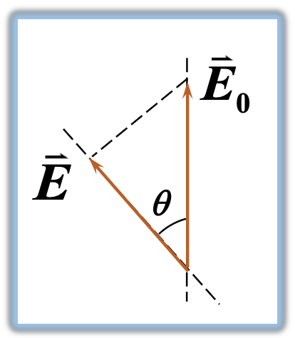

# 大物第四讲

板书内容和课堂彩蛋：[点我跳转](#板书)

## 电磁波谱

把电磁波按照波长或频率的顺序排列起来，就是电磁波谱。可分为无线电波、微波、红外线、可见光、紫外线、伦琴射线、伽玛射线。

## 光的单色性和相干性、光程

### 光源

#### 光
光（可见光）指真空中波长为 $4000 \sim 7600 \text{\AA}$ 的电磁波。

#### 普通光源发光机理
光由光源中大量原子或分子从高能激发态向低能级状态跃迁时产生。

**发光特点:** 频率不同、振动方向不同、无确定相位关系、长度有限的独立的波列。

### 光的单色性和相干性

#### 光的单色性
- **单色光:** 具有单一**频率 (波长)** 的光。
- **单色光的获得:** 单色光源（钠光灯）、利用三棱镜色散、通过滤光片、激光。

#### 光的相干性
**相干光的相干条件:**
- 同频率、同振动方向、在相遇点相位差恒定为相干光。
- 补充条件：两束光在相遇点的光强差不能太大。

### 光程 & 光程差

#### 定义
若光在折射率为 $n$ 的介质中传播的几何距离为 $r$，则光程为 $nr$。

物理意义：光在媒质中传播的路程 $r$ 等效于相同时间内在真空中能够传播 $nr$ 的路程。

#### 相位差与光程差的关系
$$
\Delta \varphi = \frac{2\pi}{\lambda_{\text{真空}}}\delta
$$
$\lambda$ 为真空中的波长，$\delta = n_2 r_2 - n_1 r_1$。

### 光波的干涉
在一定条件下，两光波相遇时，使某些点的振动始终加强，而另一些点的振动始终减弱或完全抵消的现象，称为光的干涉现象。

#### 产生干涉的条件
- 频率相同。
- 振动方向相同。
- 相位相同或相位差恒定。

#### 产生明暗干涉条纹的条件
> 这里 PPT 有点混乱，我自己改了一下

- 干涉增强的条件: $\Delta \varphi = \pm 2k\pi,\ k = 0,1,2,3,\dots$, $A = A_{\max} = A_1 + A_2$。
- 干涉减弱的条件: $\Delta \varphi = \pm (2k + 1)\pi,\ k = 0,1,2,3,\dots$, $A = A_{\min} = |A_1 - A_2|$。

用**相位差**表示为
$$
\Delta \varphi = \frac{2\pi}{\lambda_{\text{真空}}}\delta =
\begin{cases}
    \pm 2k\pi & \text{干涉增强}\\
    \pm (2k + 1) \pi & \text{干涉减弱}
\end{cases}
\quad k = 0,\pm 1,\pm 2, \dots
$$

用**光程差**表示为
$$
\Delta \delta =
\begin{cases}
    \pm k\lambda\pi & \text{干涉增强}\\
    \pm (2k + 1)\frac{\lambda}{2} \pi & \text{干涉减弱}
\end{cases}
\quad \delta = n_2 r_2 - n_1 r_1,\ \ k = 0,\pm 1,\pm 2, \dots
$$

## 薄膜干涉

### 薄膜干涉
光波经薄膜两表面反射或透射后相互叠加所形成的干涉现象。

  

    <ul>
      <li>反射光光程差$$\delta = 2n_2e + \frac{\lambda}{2}$$$e$ 是薄膜厚度。</li>
      <li>薄膜干涉加强与减弱的条件$$\delta = 2n_2e + \frac{\lambda}{2} =\begin{cases}k\lambda\ (k = 1,2,\dots) & \text{加强}$2k + 1)\frac{\lambda}{2}\ (k = 0,1,2,\dots) & \text{减弱}\end{cases}$$</li>
    </ul>
  

  

    
  

### 薄膜干涉的应用——增透膜与增反膜

#### 定义
- 增加透射率的薄膜叫做**增透膜**。
- 增加反射率的薄膜叫做**增反膜**。

#### 条件
$$
\delta = 2n_2e + \frac{\lambda}{2} =
\begin{cases}
(2k + 1)\frac{\lambda}{2}\ (k = 0,1,2,\dots) & \text{干涉减弱（增透）}\\
k\lambda\ (k = 1,2,\dots) & \text{干涉增强（增反）}
\end{cases}
$$

## 光的偏振 马吕斯定律

### 光的偏振态
光是横波，光具有偏振现象。

### 常见的偏振态

#### 自然光
包含各个方向的光振动，在所有可能的方向上的振幅都相等的光。

**表示:** 

#### 部分偏振光
某一方向的光振动比与之相垂直方向的光振动占优势的光。

**表示:**

#### 偏振光
只含有单一方向光振动的光叫做偏振光。也称为**线偏振光、平面偏振光、完全偏振光**。

**表示:**

#### 偏振片及透振方向
- **偏振片:** 能吸收某一方向的光振动，只允许与之垂直方向上的光振动通过的一种光学元件。
  
- **透振方向:** 偏振片上允许通过的光振动方向称为偏振片的偏振化方向。

#### 马吕斯定律

  

    
一束光强为 $I_0$ 的<strong>线偏振光</strong>，透过<strong>检偏器</strong>以后，透射光强为: $$I = I_0\cos^2\theta$$

    <ul>
      <li>一束光强为 $I_0$ 的自然光透过起偏器，透射光强为: $I = \frac{I_0}{2}$。</li>
      <li>$\theta = 0$ 时，$I = I_0$。</li>
      <li>$\theta = 90\degree$ 时，$I = 0$。</li>
    </ul>
  

  

    

      
$$E = E_0 \cos \theta$$$$\frac{I}{I_0} = \frac{E^2}{E_0^2}$$

      
    

    
$\theta$ 为线偏光的振动方向与透振方向的夹角。

  

## 板书
- X 射线: 拍片，CT，XRD（X 射线衍射），消融术。
- $1 \text{nm} = 10 \text{\AA} = 1 \times 10^{-10}\text{m}$。
- 可见光范围: $4000 \sim 7600 \text{\AA}$。
- 镀膜 $e_{\min} = \frac{\lambda_{\text{介质}}}{4}$。
- 偏振片是二向色性物质。

## 课堂彩蛋
- 研究生面试时，一考生被问到如何测纳米材料的间距，他思考了数秒后，表示用**游标卡尺**，当场被 pass（实际上应该用 X 射线衍射法）。
- 有一种手机叫 wāi wāi cào[?]。