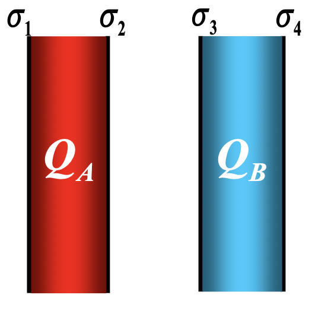

# 大物公式结论汇总

## 观前提醒

- **不全！不全！不全！不全！**
- 每个人容易忘的不一定一样。
- 大物系列 (包括之前的) 所有插图转自徐老师的 PPT。

## 动力学

### 万有引力公式

$$
\begin{align}
  \vec{F} = -G_0\frac{m_1 m_2}{r^2}\vec{e}_r&,\ \ G_0 = 6.67 \times 10^{-11} N·m^2/kg^2
\end{align}
$$

### 功 & 功率

$$
\begin{align}
  \mathrm{d}A = \vec{F} \cdot \mathrm{d}\vec{r} &= F \left|\mathrm{d}\vec{r}\right| \cos \theta = F \mathrm{d}s \cos \theta = F_t\mathrm{d}s\\
  A &= \int \mathrm{d}A\\
  \bar{P} &= \frac{\Delta A}{\Delta t}\\
  P &= \frac{\mathrm{d}A}{\mathrm{d}t}
\end{align}
$$

### 势能

#### 定义式

$$
\begin{align}
  E_p(a) = \int_{a}^{\text{势能零点}}\vec{F}\cdot\mathrm{d}\vec{l}
\end{align}
$$

#### 引力势能

$$
\begin{align}
  E_p(r) = -G\frac{Mm}{r}
\end{align}
$$

#### 弹性势能

$$
\begin{align}
  E_p(x) = \frac{1}{2}kx^2
\end{align}
$$

### 动量定理

$$
\begin{align}
  \mathrm{d}\vec{I} &= \vec{F}\mathrm{d}t = \mathrm{d}p\\
  \vec{I} &= \int_{t_1}^{t_2}\vec{F}\mathrm{d}t = \Delta{\vec{p}}
\end{align}
$$

### 角动量

注意 **合·外力矩** 和 **合外力·矩**

$$
\begin{align}
  \vec{L} &= \vec{r} \times \vec{p} = \vec{r} \times m \vec{v}\\
  \vec{M} &= \vec{r} \times \vec{F}\\
  J &= \begin{cases}
      \int_V r^2 \mathrm{d} m & \text{连续}\\
      \sum_{i = 1}^{n} \Delta{m_i} r_i^2 & \text{离散}
  \end{cases}\\
  \vec{L} &= J\vec{\omega}
\end{align}
$$

## 振动和波动

### 简谐振动

$$
\begin{align}
  &\frac{d^2x}{dt^2} + \omega^2 x = 0\\
  E_k &= \frac{1}{2} m v^2 = \frac{1}{2} k A^2 \sin^2(\omega t + \varphi)\\
  E_p &= \frac{1}{2} k x^2 = \frac{1}{2} k A^2 \cos^2(\omega t + \varphi)
\end{align}
$$

### 机械波

$$
\begin{align}
  \text{右行波}\ y(x, t) = A\cos\left[\omega \left(t - \frac{x}{u}\right) + \varphi_0\right]
\end{align}
$$

## 波动光学

可见光范围: $4000 \sim 7600 \text{\AA}$。

## 热学

### 理想气体状态方程

$$
\begin{align}
  pV &= \nu RT\\
  pM_{mol} &= \rho RT\\
  p &= nkT
\end{align}
$$

### 微观热力学

$$
\begin{align}
  p &= \frac{2}{3}\bar{\varepsilon}_k\\
  \bar{\varepsilon}_k &= \frac{3}{2}kT\\
  T &= \frac{2\bar{\varepsilon}_k}{3k}\\
  E_{\text{内}} &= \nu \frac{i}{2}RT\\
  E_{\text{内}} &= \nu N_A \frac{i}{3} \bar{\varepsilon}_k
\end{align}
$$

### 宏观热力学

$$
\begin{align}
  Q_{\color{red}{\text{吸}}} &= \Delta E_{\text{内}} + A_{\color{red}{\text{对外}}}\\
  C_{V, m} &= \frac{i}{2} R\\
  C_{p, m} &= \frac{i}{2} R + R
\end{align}
$$

| 
重要表格
 | 过程特征 | 过程方程 | 吸收热量 | 对外做功 | 内能增量 |
| --- | --- | --- | --- | --- | --- |
| 等容过程 | $V = C$ | $\frac{p}{T} = C$ | $\nu C_{V, m}\Delta T$ | $0$ | $\nu C_{V, m}\Delta T$ |
| 等压过程 | $p = C$ | $\frac{V}{T} = C$ | $\nu C_{p, m}\Delta T$ | $p(V_2 - V_1)$ | $\nu C_{V, m}\Delta T$ |
| 等温过程 | $T = C$ | $pV = C$ | $\nu RT \ln \frac{V_2}{V_1}$ | $\nu RT \ln \frac{V_2}{V_1}$ | $0$ |

## 静电场

### 高斯定理

$$
\begin{align}
  \varPhi &= \oiint_S \vec{E} \cdot \mathrm{d} \vec{S} = \frac{1}{\varepsilon_0} \sum_{S\text{内}} q  
\end{align}
$$

### 场强 & 电势 (能)

$$
\begin{align}
  W_a = q_0 \int_a^{\text{零点}}\vec{E} \cdot \mathrm{d} \vec{l}\\
  U_a = \frac{W_a}{q_0} = \int_a^\infty \vec{E} \cdot \mathrm{d} \vec{l}
\end{align}
$$

| | 无限大均匀带电平面 | 均匀带电球面 | 均匀带电球体 | 静电平衡下的导体 |
| --- | --- | --- | --- | --- |
| 电场强度 | $$E = \frac{\sigma}{2\varepsilon_0}$$ | $$E = \begin{cases}0 & r < R\\\frac{Q}{4\pi\varepsilon_0 r^2} & r > R\end{cases}$$ | $$E = \begin{cases}\frac{\rho r}{3\varepsilon_0} & r < R\\\frac{Q}{4\pi\varepsilon_0 r^2} & r > R\end{cases}$$ | $$E = \begin{cases}\vec{0} & \text{内部}\\\frac{\sigma}{\varepsilon_0} & \text{表面} \end{cases}$$  |
| 电势 | | $$U = \begin{cases}\frac{Q}{4\pi\varepsilon_0 R} & r < R\\\frac{Q}{4\pi\varepsilon_0 r} & r > R\end{cases}$$ | | 导体是等势体 导体表面是等势面 |

静电平衡下实心导体 $\rho = 0$

### 导体空腔

#### 第一类导体空腔

- 在静电平衡状态下，空腔导体的内表面上无电荷或内表面上面电荷密度处处为零；电荷只分布在外表面。
- 空腔内无电场，腔体是等势体，空腔表面是等势面。

#### 第二类导体空腔

- 在静电平衡状态下，导体壳的内表面上所带电荷的代数和与空腔内电荷的代数和等值反号。

#### 静电屏蔽

- 导体空腔可以保护腔内空间不受腔外电荷和电场的影响；
- 接地的导体空腔可保护腔外空间不受腔内电荷和电场的影响。

### 两个无限长带电平面

 

$$
\begin{align}
  \sigma_1 = \sigma_4&,\ \sigma_2 = -\sigma_3\\
  \sigma_1 = \sigma_4 = \frac{Q_A + Q_B}{2S}&,\ \sigma_2 = -\sigma_3 = \frac{Q_A - Q_B}{2S}
\end{align}
$$

### 电容器

$$
\begin{align}
  C &= \frac{q}{U} = \frac{\varepsilon_0 S}{d}\\
  W &= \frac{1}{2}CU^2 = \frac{Q^2}{2C} = \frac{1}{2}QU
\end{align}
$$

- **并联:** 各电容器 U 相等
  $$
  C = \sum_{i = 1}^{n}C_i
  $$
- **串联:** 各电容器 q 相等
  $$
  \frac{1}{C} = \sum_{i = 1}^{n}\frac{1}{C_i}
  $$

## 稳恒磁场

### 电流的磁场

$$
\begin{align}
  \mathrm{d}\vec{B} &= \frac{\mu_0}{4\pi}\frac{I\mathrm{d}\vec{l}\times\vec{e}_r}{r^2}\\
  \mathrm{d}B &= \frac{\mu_0}{4\pi}\frac{I\mathrm{d}l\sin\theta}{r^2}
\end{align}
$$

| 载流直导线 | 无限长载流直导线 | 半无限长载流直导线 | 无限长载流圆柱形导体 |
| --- | --- | --- | --- |
| $$B = \frac{\mu_0 I}{4\pi a}\left(\cos\theta_1 - \cos\theta_2\right)$$ | $$B = \frac{\mu_0 I}{2\pi a}$$ | $$B = \frac{\mu_0 I}{4\pi a}$$ |  $$B = \begin{cases}\frac{\mu_0 I}{2\pi r} & r > R\\\frac{\mu_0 I}{2\pi R^2}r & r < R \end{cases}$$ |

| 圆环圆心 | 半圆环圆心 | 圆弧圆心 |
| --- | --- | --- |
| $$B = \frac{\mu_0 I}{2 R}$$ | $$B = \frac{\mu_0 I}{4 R}$$ | $$B = \frac{\mu_0 I}{2 R}\frac{\theta}{2\pi}$$ |

- 直线有 $\pi$，圆环反而没有 $\pi$

### 安培环路定理

$$
\begin{align}
  \oint_L \vec{B}\cdot\mathrm{d}\vec{l} &= \mu_0\sum_{L\text{内}}I_i
\end{align}
$$

### 安培力

$$
\begin{align}
  \mathrm{d}\vec{F} &= I \mathrm{d}\vec{l} \times B
\end{align}
$$

与均匀磁场垂直的平面内任意形状的载流导线受的力等效于弯曲导线起点到终点的直线电流在磁场中所受的力。

## 电磁感应

### 法拉第电磁感应定律

$$
\begin{align}
  \mathcal{E} &= -\frac{\mathrm{d}\varPhi}{\mathrm{d}t}
\end{align}
$$

### 电动势

$$
\begin{align}
  \mathcal{E} &= \frac{A}{q_0} = \int_-^+\vec{E}_\text{非}\cdot\mathrm{d}\vec{l}
\end{align}
$$

#### 动生电动势

$$
\begin{align}
  \vec{E}_K &= \frac{\vec{F}_m}{-e} = \vec{v} \times \vec{B}\\
  \mathcal{E} &= \int_-^+\vec{E}_k\cdot\mathrm{d}\vec{l} = \int_a^b(\vec{v}\times\vec{B}) \cdot \mathrm{d}\vec{l}
\end{align}
$$

#### 感生电动势 & 感应电场

产生感生电动势的非静电力是感应电场力。

$$
\begin{align}
  \mathcal{E} &= -\frac{\mathrm{d}\varPhi}{\mathrm{d}t} = -\frac{\mathrm{d}}{\mathrm{d}t}\int_S\vec{B}\cdot\vec{S}\\
  \mathcal{E} &= -\int_S\frac{\partial \vec{B}}{\partial \vec{t}}\cdot\mathrm{d}\vec{s}
\end{align}
$$

感应电场环路定理

$$
\begin{align}
  \oint_L \vec{E}_\text{感}\cdot\mathrm{d}\vec{l} = -\int_S\frac{\partial \vec{B}}{\partial \vec{t}}\cdot\mathrm{d}\vec{s}
\end{align}
$$