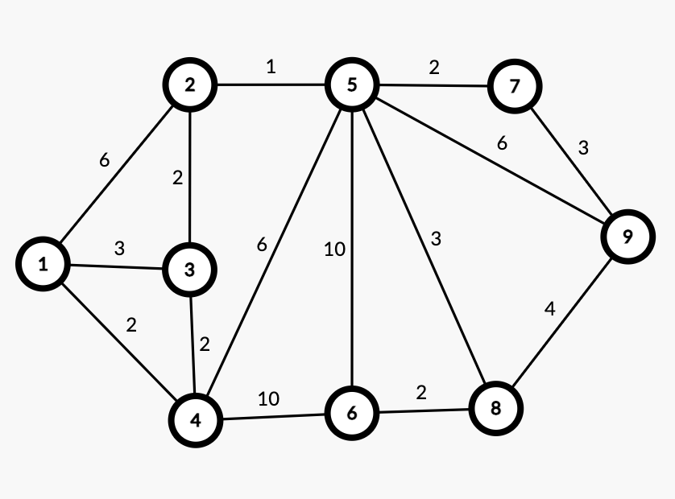

众所周知离散课本 204 页 17 题让用 Dijkstra 和 Floyd 求一个 9 个结点的图的最短路径。2025 年 3 月 18 日上午，我抄了一节史纲课的 Dijkstra 过程和 Floyd 的邻接矩阵，心中愤懑不平。于是中午回宿舍猛敲代码零点几秒就把全部都过程都输出出来了，遂把代码打包跟离散作业一起交上去了。

但是这样还不够，写的代码还能再水一篇博客（虽然不会有人看😭）

## 图的存储



### 手敲

最好是把边一条一条敲出来，格式如 x y w，表示 x 和 y 间有一条边权为 w 的边(这道题是无向边).

*dat.txt*

```plaintext
9 15
1 2 6
1 3 3
1 4 2
2 3 2
3 4 2
2 5 1
4 5 6
4 6 10
5 6 10
5 7 2
6 8 2
5 8 3
7 9 3
5 9 6
8 9 4
```

标出来点数和边数方便程序读。

### 电脑存

* Dijkstra 最好用邻接表——说白了就是开 n 个单链表，可以用 C++ 的 vector 或者 Python 的 list 模拟，好处是占用相对邻接矩阵较小，而且遍历方便，适合不那么稠密的图。
    
* Floyd 只能用邻接矩阵，因为 Floyd 算法就是在矩阵上定义的。
    

## 算法实现

这里暂时以书上的描述为准，方便理解。本地有 C++ 环境的话可以自己跑一下玩玩。实际上 Floyd 比 Dijkstra 好写很多，和直觉是相反的。

### Dijkstra

*dijkstra.cpp*

```cpp
#include <iostream>
#include <cstring>
#include <vector>

using namespace std;

const int N = 10;
vector<pair<int, int>> ed[N]; // 边表，存边
int d[N];
bool inP[N]; // 标记是否在 P 集合中

int main() {
    // 从 dat.txt 中读取数据
    freopen("dat.txt", "r", stdin);
    freopen("out_dij.txt", "w", stdout);
    int n, m;
    cin >> n >> m;
    for (int i = 1; i <= m; ++i) {
        int x, y, z;
        cin >> x >> y >> z;
        // 两条有向边模拟无向边
        ed[x].push_back({z, y});
        ed[y].push_back({z, x});
    }

    // 初始化距离为无穷大
    memset(d, 0x3f, sizeof(d));
    d[1] = 0;
    
    for (int i = 1; i <= n; ++i) {
        // 寻找加入 P 集合的点
        int x = 0;
        for (int j = 1; j <= n; ++j) {
            if (d[j] < d[x] && !inP[j]) x = j;
        }
        inP[x] = true;

        // 用这个点更新其他相连的 T 集合中的点
        for (auto [v, y] : ed[x]) {
            if (!inP[y]) d[y] = min(d[y], d[x] + v);
        }

        // 输出过程中的 P 集合，T 集合和 d 数组
        cout << "round " << i << endl;
        cout << "*****************************" << endl;
        cout << "P : ";
        for (int i = 1; i <= n; ++i) {
            if (inP[i]) cout << i << ' ';
        }
        cout << endl;
        cout << "T : ";
        for (int i = 1; i <= n; ++i) {
            if (!inP[i]) cout << i << ' ';
        }
        cout << endl;
        cout << "d : ";
        for (int i = 1; i <= n; ++i) {
            if (d[i] == 0x3f3f3f3f) cout << "inf" << ' ';
            else cout << d[i] << ' ';
        }
        cout << endl << "*****************************" << endl;
    }
    return 0;
}
```

### Floyd

*floyd.cpp*

```cpp
#include <iostream>
#include <cstring>
#include <iomanip>

using namespace std;

const int N = 10;
int D[N][N][N];

int main() {
    // 从 dat.txt 中读取数据
    freopen("dat.txt", "r", stdin);
    freopen("out_floyd.txt", "w", stdout);
    // 读取 & 预处理数据
    int n, m;
    cin >> n >> m;
    // 全部初始化成无穷大
    memset(D, 0x3f, sizeof(D));
    // 邻接矩阵主对角线初始化成 0
    for (int i = 1; i <= n; ++i) D[0][i][i] = 0;
    for (int i = 1; i <= m; ++i) {
        int x, y, z;
        cin >> x >> y >> z;
        D[0][x][y] = D[0][y][x] = z;
    }

    // 输出邻接矩阵
    cout << "A" << endl;
    for (int i = 1; i <= n; ++i) {
        for (int j = 1; j <= n; ++j) {
            if (D[0][i][j] == 0x3f3f3f3f) cout << " inf";
            else cout << setw(4) << D[0][i][j];
        }
        cout << endl;
    }
    cout << endl;

    // FLoyd 并输出 D_k
    for (int k = 1; k <= n; ++k) {
        cout << "D_" << k << endl;
        for (int i = 1; i <= n; ++i) {
            for (int j = 1; j <= n; ++j) {
                D[k][i][j] = min(D[k - 1][i][j], D[k - 1][i][k] + D[k - 1][k][j]);
                if (D[k][i][j] == 0x3f3f3f3f) cout << " inf";
                else cout << setw(4) << D[k][i][j];
            }
            cout << endl;
        }
        cout << endl;
    }
    return 0;
}
```

## 补充说明

1. Dijkstra 可以用堆优化，优化后的 Dijkstra 可以应对结点数和边数都在十万级别的数据。
    
    * 上面的代码没有写堆优化一方面是时间复杂度的瓶颈在输出过程上，另一方面是保证对初学者的可读性。
        
    * 在同时带边权和点权的无向图上跑堆优化的 Dijkstra 详见[我的另一篇 article](https://invalidname.hashnode.dev/tianti2025cd#heading-l22)，欢迎🎉🎉🎉。
        
2. Floyd 一般实现的时候不会开三维数组（可能是因为空间占用太大），不难发现如果不输出 D\_k 的话第一维是多余的，直接在原邻接矩阵上操作不会影响结果， `d[i][j] = min(d[i][j], d[i][k] + d[j][k])` 即可。
    

## 附录：代码输出

#### *out\_dij.txt*

```plaintext
round 1
*****************************
P : 1 
T : 2 3 4 5 6 7 8 9 
d : 0 6 3 2 inf inf inf inf inf 
*****************************
round 2
*****************************
P : 1 4 
T : 2 3 5 6 7 8 9 
d : 0 6 3 2 8 12 inf inf inf 
*****************************
round 3
*****************************
P : 1 3 4 
T : 2 5 6 7 8 9 
d : 0 5 3 2 8 12 inf inf inf 
*****************************
round 4
*****************************
P : 1 2 3 4 
T : 5 6 7 8 9 
d : 0 5 3 2 6 12 inf inf inf 
*****************************
round 5
*****************************
P : 1 2 3 4 5 
T : 6 7 8 9 
d : 0 5 3 2 6 12 8 9 12 
*****************************
round 6
*****************************
P : 1 2 3 4 5 7 
T : 6 8 9 
d : 0 5 3 2 6 12 8 9 11 
*****************************
round 7
*****************************
P : 1 2 3 4 5 7 8 
T : 6 9 
d : 0 5 3 2 6 11 8 9 11 
*****************************
round 8
*****************************
P : 1 2 3 4 5 6 7 8 
T : 9 
d : 0 5 3 2 6 11 8 9 11 
*****************************
round 9
*****************************
P : 1 2 3 4 5 6 7 8 9 
T : 
d : 0 5 3 2 6 11 8 9 11 
*****************************
```

#### *out\_floyd.txt*

```plaintext
A
   0   6   3   2 inf inf inf inf inf
   6   0   2 inf   1 inf inf inf inf
   3   2   0   2 inf inf inf inf inf
   2 inf   2   0   6  10 inf inf inf
 inf   1 inf   6   0  10   2   3   6
 inf inf inf  10  10   0 inf   2 inf
 inf inf inf inf   2 inf   0 inf   3
 inf inf inf inf   3   2 inf   0   4
 inf inf inf inf   6 inf   3   4   0

D_1
   0   6   3   2 inf inf inf inf inf
   6   0   2   8   1 inf inf inf inf
   3   2   0   2 inf inf inf inf inf
   2   8   2   0   6  10 inf inf inf
 inf   1 inf   6   0  10   2   3   6
 inf inf inf  10  10   0 inf   2 inf
 inf inf inf inf   2 inf   0 inf   3
 inf inf inf inf   3   2 inf   0   4
 inf inf inf inf   6 inf   3   4   0

D_2
   0   6   3   2   7 inf inf inf inf
   6   0   2   8   1 inf inf inf inf
   3   2   0   2   3 inf inf inf inf
   2   8   2   0   6  10 inf inf inf
   7   1   3   6   0  10   2   3   6
 inf inf inf  10  10   0 inf   2 inf
 inf inf inf inf   2 inf   0 inf   3
 inf inf inf inf   3   2 inf   0   4
 inf inf inf inf   6 inf   3   4   0

D_3
   0   5   3   2   6 inf inf inf inf
   5   0   2   4   1 inf inf inf inf
   3   2   0   2   3 inf inf inf inf
   2   4   2   0   5  10 inf inf inf
   6   1   3   5   0  10   2   3   6
 inf inf inf  10  10   0 inf   2 inf
 inf inf inf inf   2 inf   0 inf   3
 inf inf inf inf   3   2 inf   0   4
 inf inf inf inf   6 inf   3   4   0

D_4
   0   5   3   2   6  12 inf inf inf
   5   0   2   4   1  14 inf inf inf
   3   2   0   2   3  12 inf inf inf
   2   4   2   0   5  10 inf inf inf
   6   1   3   5   0  10   2   3   6
  12  14  12  10  10   0 inf   2 inf
 inf inf inf inf   2 inf   0 inf   3
 inf inf inf inf   3   2 inf   0   4
 inf inf inf inf   6 inf   3   4   0

D_5
   0   5   3   2   6  12   8   9  12
   5   0   2   4   1  11   3   4   7
   3   2   0   2   3  12   5   6   9
   2   4   2   0   5  10   7   8  11
   6   1   3   5   0  10   2   3   6
  12  11  12  10  10   0  12   2  16
   8   3   5   7   2  12   0   5   3
   9   4   6   8   3   2   5   0   4
  12   7   9  11   6  16   3   4   0

D_6
   0   5   3   2   6  12   8   9  12
   5   0   2   4   1  11   3   4   7
   3   2   0   2   3  12   5   6   9
   2   4   2   0   5  10   7   8  11
   6   1   3   5   0  10   2   3   6
  12  11  12  10  10   0  12   2  16
   8   3   5   7   2  12   0   5   3
   9   4   6   8   3   2   5   0   4
  12   7   9  11   6  16   3   4   0

D_7
   0   5   3   2   6  12   8   9  11
   5   0   2   4   1  11   3   4   6
   3   2   0   2   3  12   5   6   8
   2   4   2   0   5  10   7   8  10
   6   1   3   5   0  10   2   3   5
  12  11  12  10  10   0  12   2  15
   8   3   5   7   2  12   0   5   3
   9   4   6   8   3   2   5   0   4
  11   6   8  10   5  15   3   4   0

D_8
   0   5   3   2   6  11   8   9  11
   5   0   2   4   1   6   3   4   6
   3   2   0   2   3   8   5   6   8
   2   4   2   0   5  10   7   8  10
   6   1   3   5   0   5   2   3   5
  11   6   8  10   5   0   7   2   6
   8   3   5   7   2   7   0   5   3
   9   4   6   8   3   2   5   0   4
  11   6   8  10   5   6   3   4   0

D_9
   0   5   3   2   6  11   8   9  11
   5   0   2   4   1   6   3   4   6
   3   2   0   2   3   8   5   6   8
   2   4   2   0   5  10   7   8  10
   6   1   3   5   0   5   2   3   5
  11   6   8  10   5   0   7   2   6
   8   3   5   7   2   7   0   5   3
   9   4   6   8   3   2   5   0   4
  11   6   8  10   5   6   3   4   0
```