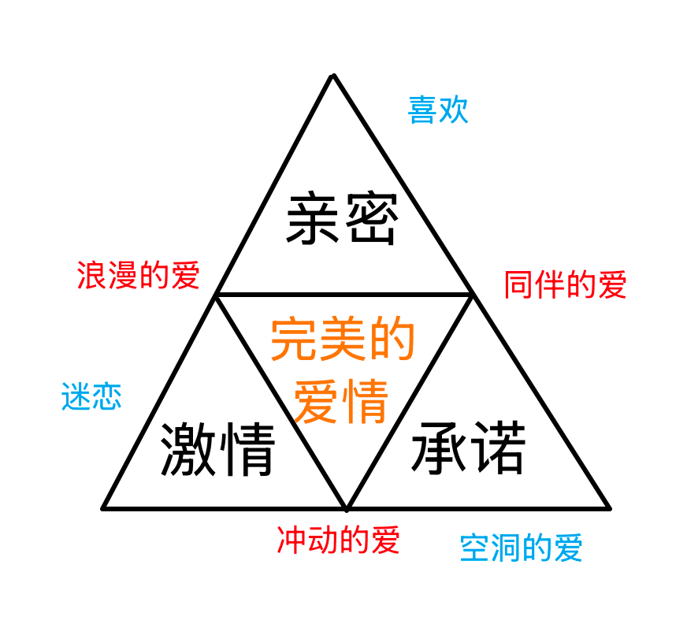
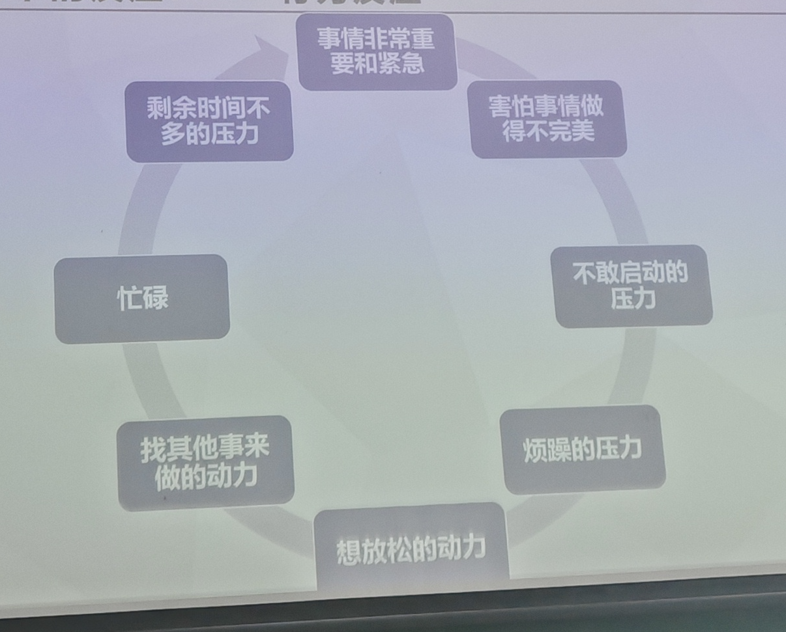
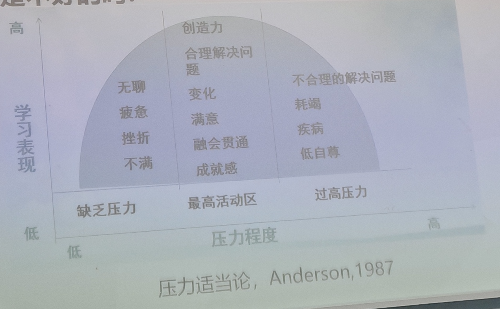
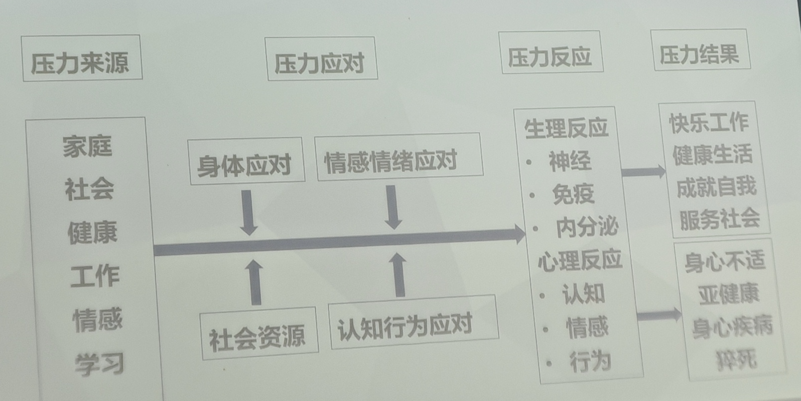

错别字有点多，敬请谅解qwq

## 心理咨询预约

### 预约方式:

1. **电话预约:** 86981525(预约时需告知自己所在校区)
2. **网上预约:** 关注“石大心理”公众号，点击“心理咨询”预约。
3. **现场预约:** 校医院三楼 **333-9** 心理咨询值班室(仅限唐岛湾校区)

### 接待时间: 

- 唐岛湾校区：周一至周日上午8:30-11:40，下午2:30-5:40，晚上19:00-20:50
- 古镇口校区：周一至周五同上，周六上午8:30-11:40

### 接待地点: 

- 唐岛湾校区: **校医院三楼333-9**
- 古镇口校区：3号公寓楼144(古镇口校区仅接受电话和网络预约)

## 心理学绪论

### 心理学的概念

又称心理科学，研究心理现象及其规律的科学

### 心理现象

- 感知觉
- 记忆
- 想象，思维
- 情感
- 意志
- 行为

### 心理学诞生的标志

1879 年冯德特在德国莱比锡建立第一个心理学实验室，标志着心理学诞生

### 心理问题的概念

所有各种心理行为异常的情形

### 心理问题的类型

- 心理困扰
- 心理障碍
- 精神疾病

### 心理健康

- 认知
- 情感意志
- 行为
- 人格协调

### 心理健康的标志

- 对生活充满爱，充满向往，觉得生活充满乐趣
- 稳定的情绪
- 有较强的适应能力

### 解决心理问题的关键是认知态度

1. 具有允许心理问题存在的态度
2. 认识到心理问题是无法彻底消除的

允许自己不完美的你才能更完美。

## 自我意识

### 概念

人对自己身心状态及对自己同世界关系的意识

### 内容

- 生理自我
- 心理自我
- 社会自我

### 偏差

- 自我中心
- 自负
- 自卑
- 从众

### 相关效应

- 焦点效应
- 透明效应
- 自我妨碍效应

## 积极心理学

### 什么是幸福

- 愉悦感
- 价值感
- 满意感

### 没有幸福感

- 活在过去
- 活在未来

### 提升幸福感，公式 H = S + C + V

- C 生活环境(10%～15%)
- S 先天决定的幸福水平 幸福的感知能力(50%)
- V 自我可控制的因素 积极心理学的核心(35～40%)

### 培养乐观的 ABCDE 模式

- **A**(adversity) 代表不好的事
- **B**(belief) 代表事情发生时自动出现的念头、想法
- **C**(consequence) 代表这想法产生的后果
- **D**(disputation) 代表反驳
- **E**(energization) 代表你成功进行反驳后收到的激发

### 幸福感

- **愉悦**：感官(克服习惯化，品味正念)
- **满意**：自己优势的发挥(挑战性……)

## 爱情

> 亟待补充

### q2-问世间情为何物

  **斯滕伯格爱情三角理论**

  如图所示

  

### q3-人们为什么要谈恋爱，不谈行不行？

  - **马斯洛需求层次理论**，其中爱情、性亲密属于归属需求

  - **埃里克森八阶段人格发展理论**

    | **阶段** | **大致年龄** | **心理社会性发展阶段** | **正性结果**                     | **负性结果**             |
    | -------- | ------------ | ---------------------- | -------------------------------- | ------------------------ |
    | 青少年期 | 12-18岁      | 同一性对角色混乱       | 意识到自我独特性，清晰自己的角色 | 不能识别生命中适当角色   |
    | 成年早期 | 18·25岁      | 亲密对孤独             | 建立性爱关系和亲密的友谊         | 对与他人建立关系感到恐惧 |

    我们处于成年早期

### q4-人际关系影响因素

  **“始于颜值，忠于人品”**

  - **外表** 50% 与外表有关；40% 与声音有关； 10% 与言语举止有关
  - **才能**
  - **人格特质** 最稳定的，最重要的因素之一
  - **时间和空间**
    - **时间因素** 交往的机会、频率。一般来说，交往频率越高，越容易相互了解
    - **空间因素** 指交往双方距离的远近。“近水楼台先得月”“远亲不如近邻”。
  - **态度相似性** 在理想，信念，价值观，兴趣爱好方面有不同的态度
  - **互补性** 相似性的作用 >> 互补性

### q5-要不要表白，什么时候表白？(表达爱的能力)

#### 约翰·范·埃普提出关系依恋模型 R.A.M. 在建立恋爱关系时应依次经历

- **了解对方(Know)**
  - 家庭背景
  - 道德感
  - 匹配潜能
  - **过去行为模式**
  - **关系技能**
- 建立信任(Trust)
- 产生依赖(Rely)
- 给出承诺(Commit)
- 身体接触(Touch)

五个阶段。

#### 学会表达爱

- 表白有风险(确定对方心意)
- 切忌道德绑架，作秀请谨慎
- 照顾到对方的情绪与感受
- 原则：真诚、尊重、适度

### q6-接受爱的能力

### q7-如何婉拒别人的爱意(拒绝爱的能力)

委婉而坚定的拒绝一份不想要的感情是一件需要勇气的事情！

1. 感谢对方爱的表达
2. 温和而坚定地说明自己没有意愿
3. 不进行人身攻击

### q10-阶段

- 共存(甜蜜期)
- 反依赖(矛盾潜伏期)
- 怀疑(矛盾突发期)

### q11-安全感

### q13-如何吵架让我们的感情“越吵越好”(解决冲突的能力)

- 吵架不隔夜
- 摆正态度，以解决问题为目的吵架
- 平等
- **先解决情绪，再解决问题！！！**
- **关注情绪的正确表达**

#### 正向表达

1. 看到/听到的现实是什么
2. 你的想法是什么
3. 你的感受
4. 你的期待 or 需求

#### 守护爱

- **共生(稳定期)** 时间久了，吵累了，新的相处之道也就形成了，两个人开始意
识到感情的不易，相互珍惜，牵手走完一生。

### q14-爱情如何保鲜？——爱的五种语言

- **肯定的言词** 需要赞美鼓励、安慰、甜言蜜语
- **精心的时刻** 精心的时刻是给予对方全部的注意力，让对方感受到你专注于他/她
- **接受的礼物** 爱，给予，礼物是我们表达和传递爱的媒介，是爱的视觉象征
- **服务的行动** 爱需要落实的行动
- **身体的接触** 身体的接触是亲密关系的表现与升华

### q15-如何面对并走出失恋

1. 你努力了吗？认真对待了吗？
2. 接纳事实，接纳感受，允许自己痛苦
3. 转移注意力
4. 向外求助(朋友、父母、犀利咨询机构等)

失恋一定会痛苦，并不意味着你不好，过去的美好是真实的，未来的美好也是会来的

### q16-如何看待恋爱的开始和结束，正确的恋爱观？

- 你好不好，ta 好不好？
- ta 对你好不好，你对 ta 好不好？
- ta 对你的好是不是你需要的好？你对 ta 的好是不是 ta 需要的好？

### q17-存在完美的爱情吗，存在天造地设的一对吗？

**爱情陷阱：完美伴侣**

这世上从来没有天造地设的爱情，有的不过是在相互磨合中越来越坚定的两颗心。白头偕老的秘密，也从来不是“我们相爱就行了”，还包括各退一步、相互服软、轮流低头，以及允许“你是你，我是我”。

### q18-？？？

### 爱人要爱己

**弗洛姆:** 先要具备创造性的健全人格，使自己成为成熟的人，才有谈爱的能力。因为成熟的爱，是在保留自身完整性和独立性的情况下，与他人的结合。——《爱的艺术》

- 创造性的健全人格，最重要的一个标准在于: **自爱**
- 我们要先学会爱自己，而后才有能力去爱别人
- 并且要记得：爱自己是一生的！

**爱情陷阱:** 有你，我才完整

健康的关系应该是无论自己有没有伴侣，你都是完整的。

坚持自己的立场，不会因为害怕被拒绝，被抛弃而退缩。

## 压力

### 大学生常见的压力来源

1. 学习
   - 难度大、负担重
   - 专业不满意
   - 效能低
2. 人际
   - 个人情感
   - 同学关系
   - 师生关系
3. 家庭
   - 父母关系
   - 教养方式
   - 经济状况
4. 事件
   - 失恋、丧亲
   - 灾害
5. 发展
   - 完美倾向
   - 目标不清
   - 理想和现实的差距

### 什么是压力

也叫应激，是一种反应模式，当刺激时间打破了有机体的平衡和符合能力，或者超过了个体能力所及，就会表现为压力。

通俗的来讲，就是面对挑战、威胁，所拥有的资源与要求有所差距时内在的感受。

### 压力下的反应

#### 生理反应(长期压力下身体会报警)

- 汗流量增加，恶心，胸闷，头痛
- 身体疲劳，肌肉紧张，尤其是头、颈、肩、背的紧张
- 心率加快，血压增高
- 皮肤干燥，有斑点和刺痛(皮肤对压力特别敏感)
- 消化系统问题，如胃痛、消化不良、腹泻、便秘
- 睡眠不好，精神萎靡，注意力很难集中

#### 心理反应

> **焦虑**
>
> - 身体应对压力的反应；压力会发展成焦虑。
> - 焦虑是一种过分担心和害怕的情绪状态，通常来自对未来的担心、错误的认知、外部突发事件、躯体疾病等。
> - 短暂的焦虑对人体没有危害，可以作为一种警示信号，帮助人体应对当前或将要出现的危险状况

- 焦虑、紧张、迷惑、烦躁、敏感、喜怒无常
- 精神疲劳，错觉和思维混乱增加
- 感情压抑，兴趣和热情减少，厌倦工作
- 意志消沉，自信心不足，出现悲观失望和无助的心理
- 短期和长期记忆力减退
- 到的和情感准则削弱

#### 行为反应

**拖延**

- 特别越难的事情越想拖，不胜任感，不知道如何做
- 害怕失败
- **后果:** 自责、懊悔、难受、痛苦，影响任务完成的实际效果。夜不能寐，食之无味。

- 工作懈怠、能力降低，错误率增加。
- 放纵自己，自暴自弃
- 没胃口，吃得少，体重迅速下降
- 孤僻、抑郁、自闭、烦躁不安
- 冒险行为增加，包括不顾后果的驾车和赌博
- 攻击、侵犯他人，破坏公共财产
- 与家庭和朋友的关系恶化
- 自杀或企图自杀

**战斗**

- 努力学习，拼绩点，关注他人
- 努力融入充满挑战的新环境
- 努力和同学建立关系
- **主动分析压力源:** 明确问题所在，指定解决方案
- **寻求外部支持:** 向他人求助或获取资源
- **情绪宣泄:** 通过合理方式释放压力

### 压力本身不是问题，如何看待压力才是问题

把压力看作助力的话，生理会发生变化

- **压力适当理论**，Anderson，1987

  

- 一个概念：习得性无助

- **压力应对模型**

  

#### 情感情绪应对

1. 冲动第一步：识别
2. 冲动第二步：看看周围有什么物品可以让自己抓住
3. 冲动第三部：做出选择(立足此时此刻)

**正念 STOP:** 停止 - 呼吸 - 觉察(开放/聚焦) - 继续

#### 认知行为应对

**ABCDEF 认知管理技术**

- A. 事件
- B. 旧认识
- C. 不良情绪
- D. 辩驳
- E. 新认识
- F. 情绪改善

ABC 是一种”惯性”

**调整认知评估方式**

1. **改变你与应激源评价的关系**
  - 我们越是认同这个标签，越是无法区分彼此，也就越不可能认为自己能够超越这个标签。因此标签经过了验证我是失败的，也成了不去进行一系列重要而有意义活动的理由。
  - 明确目标是什么
2. **建立对应激源的知觉控制**
  - 你对于改变事件或经历的进程或结果的信念
  - 摒弃非理性信念
  - 不要高估或者低估目己的能力
  - 认识自己的限制、长处及弱点
  - 保持开放性评价
  - 处理事情保持弹性
  - 形成正确的归因方式

**具体有效的行动才能缓解压力**

- 控制自己的行动，做那些让自己的生活尽可能美好的事情

#### 建立并持续改善社会支持系统

**社会资源**

- **第一层:** 近亲
- **第二层:** 知己好友
- **第三层:** 一般朋友、社会机构

1. 主动求助，善于求助：自助是一种能力
2. 维护现有的社会支持系统
3. 加深支持性人际关系：学习从良好的人际关系中获得温暖、爱、归属、安全感

#### 放松训练

**身体应对**

- **呼吸调解法** 腹式呼吸
- **肌肉松弛法** 渐进式肌肉放松
- **运动** 40min有氧运动 1w步 快走、爬楼
- **睡眠调节** 7～9h 有条件午休 15～30min 将**压力转化成创造力的最好方式**

## 大学生人际交往和沟通

### 大学生人际交往中的常见问题

- 不敢交往
- 不会交往
- 不想交往
- 不良交往

### 概念

- **人际交往:** 社会生活、活动过程中，人与人之间的信息交流、心理交流及相互作用的过程，一般认为是动态过程。
- **人际关系:** 通过人际交往而形成的人与人之间的稳定的在心理或行为产生相互影响的过程，一般认为是静态过程。

### 为什么有人际关系

- 埃里克森人格八阶段发展理论
- 我们处于成年早期，任务是建立亲密关系(矛盾是亲密对孤独)
- 如果一个人不能与他人分享快乐与痛苦，不能与他人进行思想情感的交流，不互相关心与帮助，就会陷入孤独寂寞的苦恼情境之中

### 良好人际关系的意义

大学生正处在一种渴求交往，渴求理解的心理发展时期。

1. **大学生身心健康的需要**

    - “人际剥夺”实验

2. **是获得安全感和幸福的需要**

     - 马斯洛需求层次理论
     - 哈佛大学研究院的实验
       - 孤独有害健康，良好的人际关系让人更长寿，更幸福
       - 人际关系更在于质量，配偶关系(最重要)

3. **是人发展与成功的重要保证**

    人一生成长、发展和成功，无不与同他人的交往相联系，并且通过从人际关系中得到信息、机遇，帮助人们走上一条成功之路。

### 人际关系的建立与发展的过程

定向阶段 - 情感探索阶段 - 情感交流阶段 - 稳定交流阶段

1. 顺序不可逆
2. 时间可能长短不一
3. 能到情感交流阶段已经非常好了

### 人际交往中的心理学效应

- **首因效应:** 也称第一印象，是指初次见面时对人形成的鲜明印象，这种由先前的信息而形成的最初的印象及其对后来信息的影响即为首因效应。有先入为主的作用。
  - 要懂得通过现象看本质，不要被对方的第一印象所迷惑。
- **近因效应:** 也称最近印象，是指最近获得的信息对人的知觉和认识产生的强烈影响，主要发生在与熟悉的人的交往之中。最后留下的印象，往往是最深刻的印象。
  - 与人交往不能进根据一时一事去评价他人，被暂时的、个别的行为所迷惑。
- **晕轮效应:** 也称光环效应，是指在人际交往中仅仅依据某人身上一种或几种特征来概括其他一些未曾了解的人格特征的心理倾向。
  - 不可以以偏概全，不仅要听从心的声音，也要听从大脑的声音。
- **刻板效应:** 刻板效应又称定型效应，是指人们用刻印在自己头脑中的关于某人、某事物的固定印象，以此作为判断和评价人依据的心理现象。在人际交往中，刻板效应常使人们对他人的认知固定化。
  - “人心不同，各如其面”，刻板印象是一种概括而笼统的看法，并不能代替活生生的个体，与人交往不能“以偏概全，不能戴着“有色眼镜”去看人。
- **投射效应:** 是指以己度人，认为自己具有某种特性，他人也一定会有与自已相同的特性，把自己的感情、意志、特性投射到他人身上并强加于人的一种认知障碍。
  - 感情投射：即认为别人的喜好与自己相同，将自己的思维方式强加给对方
  - 认知缺乏客观性：把自己的感情投射到他人或事物之上，认为自己喜欢的人或物都是美好的，自己厌恶的都是丑陋的，“以小人之心度君子之腹”
- **皮革马利翁效应(罗森塔尔效应):** 亦称“罗森塔尔效应”或“期待效应”，你期望什么，你就会得到什么，你得到的不是你想要的，而是你期待的。由美国著名心理学家罗森塔尔提出。

> **练习题**
>
>
> 
>
> **答案是:**  马斯洛 亲密对孤独 晕轮效应 晕轮效应 首因效应 要分清自己的想法和他人的想法

### 人际交往的原则

- 真诚守信原则
- 尊重平等原则
  - 你好我也好
- 互助互惠原则
- 尊重距离原则
  - 公共距离区 > 4m
  - 社交距离区 1.3 ~ 4m
  - 个体距离区 0.5 ~ 1.3m
  - 亲密距离区 0 ~ 0.5m

### 人际交往的法则

- **黄金法则:** 你想别人怎么对你，你就怎么对别人
- **白金法则:** 别人希望你怎么样对待他们，你就怎么对待他们
- **反黄金法则:** 我怎么对别人，别人就应该怎么对我

### 技巧

- **技巧一：不拿自己的标准要求别人**
  - “应该、必须、一定要的绝对化要求”
  - 不管这些规则在大多数时候有多精准，我们必须意识到，它只是我们单方面的期待，有时候甚至是幻想。
  - 你可以打破规则，不必遵守别人对你的「预期」。你无需要求自己按别人期待的反应方式区反应。
- **技巧二：做好核对(处理情绪内耗最好的方式)**
  - 核对不仅能够避免误会，还能有效促成良好沟通。
  - 尊重自己感受，减少自己的不舒服
  - 沟通间的核对，是核对对方的想法是否和你猜测的一致
  - 沟通中尽力做到开放、不评判、以及表达真实感受

### 人际交往的核心——沟通

#### 接纳 沟通的前提

#### 学会倾听

**以自己为中心的假倾听者**

- **智者** 你应该按我的做
- **乐观者** 这没有那么早，至少你还没和他绝交
- **乌鸦嘴** 那可惨了，他会不会去说你坏话啊
- **八卦者** 快和我说说，你们是怎么吵的
- **主角** 你这不算什么，以前我和人吵架……

**段位？层次？**

- **第一层:** 心不在焉
- **第二层:** 消极地听
- **第三层:** 选择性听
- **第四层:** 专注聆听
- **第五层:** 积极聆听

**共情**

- **关注情绪:** 把强迫性建议改成与对方情绪同步的话语。

  | 强迫性建议          | 与对方情绪同步的话语       |
  | ------------------ | ------------------------------------ |
  | 这算什么           | 你经历了那么多，你已经很勇敢了       |
  | 不要消极           | 痛苦是生活的一部分，是个人都要经历   |
  | 没有什么过不去的   | 这段经历对你来说确实很难             |
  | 你开心点，别太担心 | 我看你最近压力很大，有什么我可以帮你 |
  | 你得乐观点         | 无论好坏我都会支持你                 |

**提升倾听技巧的 3F 模型**

- **事实 Fact**

  **分清事实** 对方陈述了什么事实

- **情绪 Feel**

  **感受情绪** 对方表达了什么情绪

- **期待 Focus**

  **理解意图** 对方期待我做什么行动

**反向使用 3F**

- **情绪 Feel**

  **响应情绪** 接纳对方的情绪

- **事实 Fact**

  **确认事实** 通过复述确认事实或得到信息补充

- **意图 Focus**

  **明确意图** 把对方的期待翻译成可实施的行动

**好的倾听 = 心里听进去 + 愿意听的姿态 + 恰到好处的反馈**

- 60分 复读机
- 70分 情感镜子
- 80分 支出希望和期待
- 90分 表达关心，共同解决

#### 学会表达

1. 描述事实(观察)——我看到……
2. 表达感受(感受)——我觉得……
3. 表达需求(需要)——我希望得到……
4. 提出请求(请求)——你可以……吗

表达自己的情感就是让别人“看见”自己内心活动的过程。

**学习说话的艺术**

- **第一件事**

  急事，慢慢的说

  大事，清楚的说

  小事，幽默的说

- **第二件事**

  没把握的事，谨慎的说

  没发生的事，不要胡说

  做不到的事，别乱说

  伤害人的事，不能说

- **第三件事**

  讨厌的事，对事不对人的说

  开心的事，看场合说

  伤心的事，不要见人就说

  别人的事，小心的说