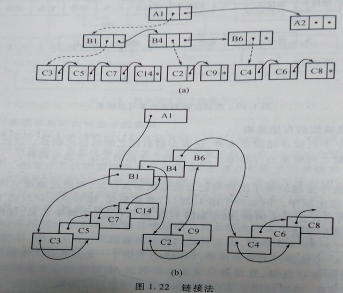

# 绪论

## 1.1 数据库系统概述

### 1.1.1 数据库的地位

- 数据库技术产生于 **二十世纪六十年代末**，是数据管理的核心技术，是计算机科学与技术的重要分支。
- 造就了 **五位图灵奖获得者**：C.W.Bachman、E.F.Codd、James Gray、M.R.Stonebraker、Jeffrey.D.Ullman。
- 数据库技术是现代信息系统的核心和基础，极大地促进了计算机应用向各行各业的渗透。
- 大数据应用、云计算技术的迅猛发展，越来越凸显出数据库技术的重要性。

### 1.1.2 四个基本概念

#### 一、数据（Data）

- **定义**：数据是数据库中存储的基本对象，是描述事物的符号记录。
- **种类**：数字、文字、图形、图像、声音、视频等。
- **特点**：数据与其语义是不可分的。数据的语义即数据的含义。
- **举例**：学生记录 `（李明，男，199706，山东，计算机系，2015）` 需要结合语义才能理解其含义。

#### 二、数据库（DB — Database）

- **定义**：数据库是**长期储存在计算机内、有组织的、可共享的大量数据集合**。
- **基本特征**：
  - 数据按一定的**数据模型**组织、描述和储存
  - 可为各种用户**共享**
  - **冗余度较小**
  - **数据独立性较高**
  - **易扩展**

#### 三、数据库管理系统（DBMS — Database Management System）

- **定义**：位于用户应用与操作系统之间的**一层数据管理软件**，是基础软件，是一个大型复杂的软件系统。
- **用途**：科学地组织和存储数据、高效地获取和维护数据。
- **主要功能**：
  1. **数据定义功能** — 提供 DDL（数据定义语言），定义数据对象的组成与结构
  2. **数据操纵功能** — 提供 DML（数据操纵语言），实现对数据的基本操作：查询、插入、删除、修改
  3. **数据库的事务管理和运行管理** — 保证事务的正确运行，保证数据的安全性、完整性、并发使用和故障恢复
  4. **数据库的建立和维护功能** — 数据装载和转换、数据库转储、介质故障恢复、数据库重组织、性能监视分析
  5. **数据组织、存储和管理** — 分类组织存储数据（数据字典、用户数据等），确定文件结构和存取方式，提供多种存取方法
  6. **其他功能** — 网络通信、数据转换、异构数据库互访互操作

#### 四、数据库系统（DBS — Database System）

- **定义**：在计算机系统中引入数据库后的**系统构成**。在不混淆的情况下常简称为数据库。
- **构成**：由**数据库**、**数据库管理系统（及其应用开发工具）**、**应用系统**、**数据库管理员（DBA）** 组成的存储、管理、处理和维护数据的系统。

### *1.1.3 数据管理技术的产生与发展

**数据管理**：对数据进行分类、组织、编码、存储、检索和维护，是数据处理的中心问题。

#### 三个阶段

| 阶段 | 时间 | 应用背景 | 硬件 | 软件 | 处理方式 |
|---|---|---|---|---|---|
| **人工管理** | 20世纪40年代中~50年代中 | 科学计算 | 无直接存取存储设备 | 无操作系统 | 批处理 |
| **文件系统** | 20世纪50年代后~60年代中 | 科学计算、管理 | 磁盘、磁鼓 | 有文件系统 | 联机实时处理、批处理 |
| **数据库系统** | 20世纪60年代后至今 | 大规模数据管理 | 大容量磁盘 | 有DBMS | 联机实时处理、分布处理、批处理 |

#### 人工管理阶段特点

- **数据的管理者**：应用程序，数据**不保存**
- **数据面向的对象**：某一应用程序
- **共享程度**：无共享，**冗余度极大**
- **独立性**：不独立，完全依赖于程序
- **结构化**：**无结构**
- **数据控制能力**：应用程序自己控制

#### 文件系统阶段特点

- **数据的管理者**：文件系统，数据**可长期保存**
- **数据面向的对象**：某一应用程序
- **共享程度**：共享性差，**冗余度大**
- **结构化**：记录内有结构，**整体无结构**
- **独立性**：独立性差，数据的逻辑结构改变必须修改应用程序
- **数据控制能力**：应用程序自己控制
- **数据存取方式**：按文件名访问，按记录存取

#### 数据库系统阶段特点

- **数据的管理者**：**DBMS**
- **数据面向的对象**：现实世界
- **共享程度**：**共享性高**
- **独立性**：**高度的物理独立性和一定的逻辑独立性**
- **结构化**：**整体结构化**（数据库的主要特征之一）
- **数据控制能力**：由**DBMS统一管理和控制**

##### 数据高共享性的好处
- 降低数据冗余度，节省存储空间
- 避免数据间的不一致性与不相容性
- 使系统易于扩充

##### 数据独立性
- **物理独立性**：用户的应用程序与存储在磁盘上的数据库数据相互独立。物理存储改变，应用程序不用改变。
- **逻辑独立性**：用户的应用程序与数据库的逻辑结构相互独立。逻辑结构改变，应用程序可以不变。
- 数据独立性由 DBMS 的**二级映像功能**保证。

##### 数据结构化（主要特征）
- 不再仅针对某一应用，而是面向全组织的多种应用需求
- 不仅数据内部结构化，而且整体结构化，数据之间具有联系
- 数据的结构用**数据模型**描述，无需程序定义和解释
- 数据可以变长
- 数据的最小存取单位是**数据项**

##### DBMS对数据的控制功能
1. **数据安全性（Security）保护** — 防止非法使用造成的数据泄密和破坏
2. **数据完整性（Integrity）检查** — 将数据控制在有效范围内，保证数据之间满足一定关系
3. **并发（Concurrency）控制** — 对多用户的并发操作加以控制和协调
4. **数据库恢复（Recovery）** — 将数据库从错误状态恢复到某一已知的正确状态

## 1.2 数据模型

**数据模型**是对现实世界数据特征的抽象，是数据库系统的**核心和基础**。

数据模型应满足三方面要求：
1. 能比较真实地模拟现实世界
2. 容易为人所理解
3. 便于在计算机上实现

### 1.2.1 两类数据模型

| 类型 | 别称 | 依据 | 用途 |
|---|---|---|---|
| **概念模型** | 信息模型 | 用户的观点 | 用于数据库设计 |
| **逻辑模型和物理模型** | — | 计算机系统的观点 | 用于DBMS实现 |

- **概念模型**：现实世界到机器世界的一个**中间层次**
- **逻辑模型**：包括网状模型、层次模型、关系模型、面向对象模型等
- **物理模型**：描述数据在系统内部的表示方式和存取方法

**客观对象的抽象过程**（两步抽象）：
1. 现实世界中的客观对象 → **概念模型**
2. 概念模型 → 某一DBMS支持的**数据模型**

### 1.2.2 概念模型

#### 1. 概念模型的用途
- 用于信息世界的建模
- 是现实世界到机器世界的中间层次
- 是数据库设计的有力工具
- 是数据库设计人员和用户之间进行交流的语言

#### 2. 信息世界中的基本概念

| 概念 | 定义 | 说明 |
|---|---|---|
| **实体（Entity）** | 客观存在并可相互区别的事物 | 可以是具体的人、事、物或抽象概念 |
| **属性（Attribute）** | 实体所具有的某一特性 | 一个实体可由若干个属性刻画 |
| **码（Key）** | **唯一标识**实体的属性集 | 如学号、身份证号 |
| **域（Domain）** | 属性的取值范围 | 如性别的域为`{男，女}` |
| **实体型（Entity Type）** | 用实体名及其属性名集合来抽象刻画同类实体 | 如学生（学号，姓名，性别） |
| **实体集（Entity Set）** | 同一类型实体的集合 | 如全体学生 |
| **联系（Relationship）** | 实体内部的联系和实体之间的联系 | — |

#### 实体型间的联系

**两个实体型之间**：
- **一对一联系（1:1）**：实体集A中每个实体，B中至多有一个实体与之联系，反之亦然。如：班级与班长。
- **一对多联系（1:n）**：实体集A中每个实体，B中有n个实体（n≥0）与之联系，反之A中至多一个。如：班级与学生。
- **多对多联系（m:n）**：实体集A中每个实体，B中有n个实体与之联系，反之亦然。如：课程与学生。

**多个实体型之间**：同样存在一对多、一对一、多对多联系。

**同一实体集内**：也存在联系，如职工实体集内部的"领导-被领导"关系（一对多）。

#### 3. 概念模型的表示方法 — E-R图

**E-R方法（Entity-Relationship Approach）**：用E-R图来描述现实世界的概念模型，也称E-R模型。

**E-R图的表示符号**：
| 元素 | 图形 | 说明 |
|---|---|---|
| 实体型 | **矩形** | 框内写实体名 |
| 属性 | **椭圆形** | 用无向边与实体连接 |
| 联系 | **菱形** | 框内写联系名，用无向边连接实体并标注联系类型（1:1、1:n、m:n） |
| 联系的属性 | 椭圆形 | 用无向边与该联系连接 |

**E-R图实例**：工厂物资管理的概念模型涉及仓库、零件、供应商、项目、职工等实体，包含多种联系类型。

### 1.2.3 数据模型的组成要素

1. **数据结构**
   - 描述数据库的组成对象及对象之间的联系
   - 描述的内容
     - 与对象的数据类型、内容、性质有关
     - 与数据之间联系有关
  - 是对系统**静态特性**的描述
2. **数据操作**
   - 对数据库中各种对象（型）的实例（值）允许执行的操作集合，包括**操作**及有关的**操作规则**
   - 数据操作的类型
     - 查询
     - 更新（插入、删除、修改）
   - 数据模型对操作的定义
     - 操作的确切含义
     - 操作符号
     - 操作规则（如优先级）
     - 实现操作的语言
   - 是对系统**动态特性**的描述
3. **数据的完整性约束条件**
   - 一组完整性规则的集合
   - 完整新规则：给定的数据模型中数据及其练习所具有的制约和依存规则
   - 用以限定数据状态及状态的变化，保证数据正确、有效、相容

### 1.2.4 常用数据模型

| 数据模型 | 数据结构 | 说明 |
|---|---|---|
| **层次模型（Hierarchical Model）** | 基本层次联系 | 格式化模型 |
| **网状模型（Network Model）** | 基本层次联系 | 格式化模型 |
| **关系模型（Relational Model）** | **表（Table）** | 最重要、最常用 |
| **面向对象模型（Object Oriented Model）** | 对象 | — |
| **对象关系模型（Object Relational Model）** | 表+对象 | — |

### 1.2.5 层次模型

#### 1. 数据结构
满足以下两个条件的基本层次联系的集合：
1. **有且只有一个结点无双亲**（根结点）
2. **根以外的其他结点有且只有一个双亲结点**

**表示方法**：
- 实体型：用**记录类型**描述，每个结点表示一个记录类型
- 属性：用**字段**描述
- 联系：用结点之间的连线表示一对多联系

**特点**：
- 结点的双亲是**唯一**的
- 只能直接处理**一对多**的实体联系
- 每个记录类型定义一个排序字段（码字段）
- 任何记录值只有按其路径查看才能显出全部意义
- 没有子女记录值能够脱离双亲记录值而独立存在

**多对多联系的表示**：需分解为一对多联系，方法有冗余结点法和虚拟结点法。

#### 2. 数据操纵
查询、插入、删除、更新

#### 3. 完整性约束
- 无双亲结点值就不能插入子女结点值
- 删除双亲结点值时，子女结点值也被同时删除
- 更新时应更新所有相应记录以保证一致性

#### 4. 存储结构
- **邻接法**：按层次树前序遍历顺序邻接存放
- **链接法**：用指引元反映数据之间的层次联系（子女-兄弟链接法、层次序列链接法）

#### 5. 优缺点
**优点**：
- 模型简单，对一对多层次关系描述自然、直观、易懂
- 性能优于关系模型，不低于网状模型
- 提供良好的完整性支持

**缺点**：
- 多对多联系表示不自然
- 对插入和删除操作限制多
- 查询子女结点必须通过双亲结点
- 层次命令趋于程序化

#### 6. 典型系统
**IMS（Information Management System）** — 第一个大型商用DBMS，1968年由IBM公司研制。

### 1.2.6 网状模型

#### 1. 数据结构
满足以下两个条件的基本层次联系的集合：
1. **允许一个以上的结点无双亲**
2. **一个结点可以有多于一个的双亲**

**表示方法**（与层次模型相同）：
- 实体型：记录类型
- 属性：字段
- 联系：结点之间的连线表示一对多联系

**特点**：
- 只能直接处理一对多实体联系
- 每个记录类型定义一个排序字段（码字段）
- 任何记录值只有按其路径查看才能显出全部意义

**与层次模型的区别**：
1. 网状模型允许多个结点没有双亲结点
2. 网状模型允许结点有多个双亲结点
3. 网状模型允许两个结点之间有多种联系（复合联系）
4. 网状模型可以更直接地描述现实世界
5. **层次模型实际上是网状模型的一个特例**

**多对多联系的表示**：直接分解成一对多联系。

#### 2. 数据操纵
查询、插入、删除、更新

#### 3. 完整性约束
- 码：唯一标识记录的数据项的集合
- 双亲与子女之间是一对多联系
- 允许插入尚未确定双亲结点值的子女结点值
- 允许只删除双亲结点值

#### 4. 存储结构
常用方法：单向链接、双向链接、环状链接、向首链接

#### 5. 优缺点
**优点**：
- 能更直接地描述现实世界（一个结点可有多个双亲）
- 具有良好的性能，存取效率较高

**缺点**：
- 结构复杂，随应用环境扩大而越来越复杂
- DDL、DML语言复杂，用户不易使用
- 记录间联系通过存取路径实现，用户必须了解系统结构细节

#### 6. 典型系统
**DBTG系统（CODASYL系统）** — 由DBTG提出的系统方案，奠定了数据库系统的基本概念、方法和技术。实际系统包括：IDMS、DMS1100、IDS/2、IMAGE等。

### 1.2.7 关系模型

**最重要的一种数据模型**，是目前主要采用的数据模型。1970年由IBM公司San Jose研究室的 **E.F.Codd** 提出，是本课程的重点。

#### 1. 数据结构
在用户观点下，关系模型中数据的逻辑结构是一张**二维表**，由行和列组成。

**基本概念**：
| 术语 | 定义 | 通俗理解 |
|---|---|---|
| **关系（Relation）** | 一张二维表 | 对应通常说的**表** |
| **元组（Tuple）** | 表中的一行 | — |
| **属性（Attribute）** | 表中的一列 | 每个属性有属性名 |
| **主码（Key）** | 唯一确定一个元组的属性组 | — |
| **域（Domain）** | 属性的取值范围 | — |
| **分量** | 元组中的一个属性值 | — |
| **关系模式** | 对关系的描述 | 关系名（属性1，属性2，…） |

**实体及联系的表示**：
- 实体型：直接用**关系（表）** 表示
- 属性：用属性名表示
- 一对一联系：隐含在实体对应的关系中
- 一对多联系：隐含在实体对应的关系中
- 多对多联系：直接用**关系**表示

**规范化要求**：关系必须规范化，最基本的是**每个分量必须是不可分的数据项**。

#### 2. 数据操纵
查询、插入、删除、更新

**特点**：
- 数据操作是**集合操作**，操作对象和结果都是关系
- **存取路径对用户透明**，用户只需说明"干什么"，不必说明"怎么干"

#### 3. 完整性约束
- **实体完整性**
- **参照完整性**
- **用户定义的完整性**

#### 4. 存储结构
表以文件形式存储。有的DBMS一个表对应一个操作系统文件，有的自己设计文件结构。

#### 5. 优缺点

**优点**：
- 建立在**严格的数学概念**基础上
- 概念单一，数据结构简单、清晰，用户易懂易用
- 实体和各类联系都用关系表示，检索结果也是关系
- 存取路径对用户**透明**
- 具有更高的**数据独立性**，更好的安全保密性
- 简化了程序员的工作和数据库开发建立的工作

**缺点**：
- 存取路径透明导致查询效率往往不如非关系数据模型
- 为提高性能必须对查询请求进行优化，增加了开发DBMS的难度

#### 6. 典型系统
ORACLE、SYBASE、INFORMIX、SQL Server、DB/2等。

国内自主研发的：COBASE（北大/人大/中软）、PBASE（人大）、EasyBase（人大）、DM/2（华中科技大学）、OpenBase（东大阿尔派）。

## 1.3 数据库系统结构

### 1.3.1 数据库系统内部的模式结构

#### 型与值
- **型（Type）**：对某一类数据的结构和属性的说明
- **值（Value）**：型的一个具体赋值
- **模式（Schema）**：数据库逻辑结构和特征的描述，是型的描述，不涉及具体值，是**相对稳定**的
- **实例（Instance）**：模式的一个具体值，反映数据库某一时刻的状态，**随数据的更新而变动**。同一模式可以有多个实例。

#### 三级模式结构

1. **模式（Schema）/逻辑模式**
   - 数据库中**全体数据**的逻辑结构和特征的描述
   - 所有用户的公共数据视图
   - **一个数据库只有一个模式**
   - 是模式结构的**中间层**
   - 与数据的物理存储细节和硬件环境无关
   - 与具体的应用程序、开发工具、高级程序设计语言无关
   - 定义内容：数据的逻辑结构、数据之间的联系、安全性/完整性要求

2. **外模式（External Schema）/子模式/用户模式**
   - 数据库用户使用的**局部数据**的逻辑结构和特征的描述
   - 数据库用户的数据视图
   - **模式与外模式的关系：一对多**
   - 外模式通常是模式的子集
   - **一个数据库可以有多个外模式**
   - 同一外模式可为多个应用系统使用，但一个应用程序只能使用一个外模式
   - **用途**：保证数据库安全性的有力措施，用户只能看见和访问所对应的外模式中的数据

3. **内模式（Internal Schema）/存储模式**
   - 数据**物理结构**和**存储方式**的描述
   - 是数据在数据库内部的组织方式
   - **一个数据库只有一个内模式**
   - 包括：记录的存储方式（顺序/B树/hash）、索引的组织方式、数据压缩/加密等

#### 二级映像功能与数据独立性

1. **外模式／模式映像**
   - 定义外模式与模式之间的对应关系
   - 每个外模式都有一个映像
   - **保证数据的逻辑独立性**：模式改变时，修改映像使外模式不变，应用程序不必修改

2. **模式／内模式映像**
   - 定义数据全局逻辑结构与存储结构之间的对应关系
   - **数据库中唯一的**
   - **保证数据的物理独立性**：存储结构改变时，修改映像使模式不变，应用程序不受影响

> **数据与程序的独立性**使得数据的定义和描述可从应用程序中分离出去，数据的存取由DBMS管理，用户不必考虑存取路径等细节，大大减少了应用程序的维护和修改。

### 1.3.2 数据库系统外部的体系结构

1. **单用户结构**
   - 整个数据库系统装在一台计算机上，为一个用户独占
   - 不同机器之间不能共享数据
   - 早期最简单的数据库系统

2. **主从式结构**
   - 一个主机带多个终端的**多用户**结构
   - 所有处理任务由主机完成
   - **优点**：易于管理、控制与维护
   - **缺点**：主机易成为性能瓶颈；系统可靠性依赖主机

3. **分布式结构**
   - 数据在逻辑上是一个整体，但物理地分布在计算机网络的不同结点上
   - 每个结点可独立处理本地数据（局部应用），也可存取异地数据（全局应用）
   - **优点**：适应地理上分散的应用需求
   - **缺点**：数据处理、管理与维护困难；访问远程数据时受网络传输制约

4. **客户/服务器（C/S）结构**
   - DBMS功能和应用分开：服务器专门执行DBMS功能，客户机安装外围应用开发工具
   - 种类：集中式服务器结构、分布式服务器结构
   - **优点**：减少数据传输量，数据库更开放，跨平台运行
   - **缺点**："胖客户"问题——安装复杂，维护困难，安全性差，浪费系统资源

5. **浏览器/应用服务器/数据库服务器（B/S）结构**
   - 客户端：浏览器软件，界面统一，易掌握
   - 服务器端：Web服务器、应用服务器、数据库服务器
   - **优点**：大大减少开发和维护代价，能支持数万甚至更多用户

## *1.4 数据库系统的组成

数据库系统由以下四部分组成：
1. **数据库**
2. **数据库管理系统（及其开发工具）**
3. **应用程序**
4. **数据库管理员**

### 一、硬件平台及数据库

对硬件资源的要求：
- **足够大的内存** — 用于操作系统、DBMS核心模块、数据缓冲区、应用程序
- **足够大的外存** — 磁盘或磁盘阵列（存放操作系统、DBMS、应用程序、数据库及备份）、光盘和磁带（数据备份）
- **较高的通道能力** — 提高数据传送率

### 二、软件

- DBMS
- 操作系统
- 与数据库接口的高级语言及其编译系统
- 以DBMS为核心的应用开发工具
- 为特定应用环境开发的数据库应用系统

### 三、人员

1. **数据库管理员（DBA）**
   - 决定数据库中的信息内容和结构
   - 决定数据库的存储结构和存取策略
   - 定义数据的安全性要求和完整性约束条件
   - 监控数据库的使用和运行（周期性转储数据库、系统故障恢复、介质故障恢复、监视审计文件）
   - 数据库的改进和重组重构（性能监控和调优、定期重组织、需求变化时重构造）

2. **系统分析员**
   - 负责应用系统的需求分析和规范说明
   - 与用户及DBA协商确定系统软硬件配置
   - 参与数据库系统的概要设计

3. **数据库设计人员**
   - 参加用户需求调查和系统分析
   - 确定数据库中的数据
   - 设计数据库各级模式

4. **应用程序员**
   - 设计和编写应用系统的程序模块
   - 进行调试和安装

5. **最终用户**
   - **偶然用户**：不经常访问数据库，每次需不同信息（高中级管理人员）
   - **简单用户**：主要工作是查询和更新数据库（银行职员、机票预订人员）
   - **复杂用户**：直接使用数据库语言访问数据库，甚至基于API编制自己的应用程序（工程师、科学家等）

## 本章小结

本章围绕数据库系统的基本概念、数据模型和系统结构展开，是学习数据库原理的基础。

### 关键内容

- **基本概念**：数据、数据库（DB）、数据库管理系统（DBMS）、数据库系统（DBS）的定义、特点和区别。
- **数据管理发展**：人工管理、文件系统、数据库系统三个阶段及其特点对比。
- **数据库系统特点**：整体数据结构化，高共享、低冗余，物理独立性和逻辑独立性较高，并由 DBMS 统一管理安全性、完整性、并发控制和恢复。
- **数据模型**：掌握数据结构、数据操作、完整性约束三要素；理解概念模型与 E-R 图；比较层次模型、网状模型和关系模型。
- **系统结构**：理解三级模式结构（模式、外模式、内模式）和二级映像，明确二级映像分别支撑逻辑独立性和物理独立性。
- **系统组成**：数据库系统由硬件、软件和人员共同构成，其中 DBA 负责数据库的规划、设计、运行与维护。

### 核心要点

- 数据库系统相对文件系统的核心优势在于数据共享、数据独立性和统一的数据控制。
- 概念模型面向信息世界，关系模型面向机器世界，是数据库逻辑设计的主要基础。
- 三级模式和二级映像是理解数据库系统数据独立性的关键。

### 关键术语

Data, DB, DBMS, DBS, DBA, 数据模型, E-R 图, 层次模型, 网状模型, 关系模型, 模式, 外模式, 内模式, 物理独立性, 逻辑独立性。
