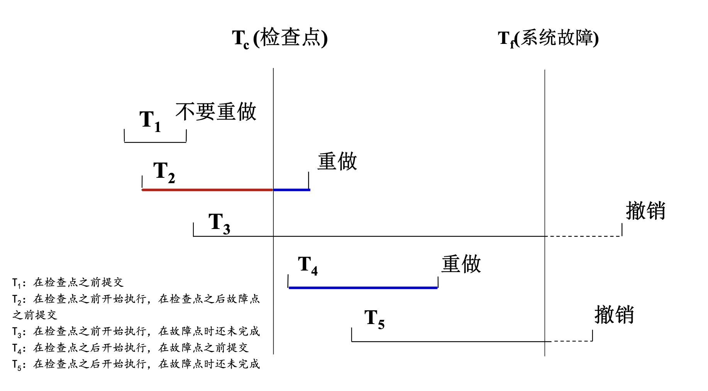

# 数据库恢复技术

## 一、事务的基本概念（11.1）

### 1.1 为什么需要事务

银行转账问题：假定资金从账户A转到账户B，至少需要两步——账户A的资金减少，然后账户B的资金相应增加。

### 1.2 事务（Transaction）定义

- **定义**：用户定义的一个数据库操作序列，这些操作要么全做，要么全不做，是一个不可分割的工作单位
- 事务是**恢复和并发控制的基本单位**
- 事务和程序比较：
  - 在关系数据库中，一个事务可以是一条或多条SQL语句，也可以包含一个或多个程序
  - 一个程序通常包含多个事务

### 1.3 事务的定义方式

**显式定义方式**：
```
START TRANSACTION; 或 BEGIN;
   SQL语句1
   SQL语句2
   ...
COMMIT;         -- 正常提交
ROLLBACK;       -- 异常回滚
```

**隐式方式**：当用户没有显式地定义事务时，DBMS按缺省规定自动划分事务。

### 1.4 事务的结束

| 结束方式 | 说明 |
|----------|------|
| **COMMIT** | 事务正常结束；提交事务的所有操作（读+更新）；事务中所有对数据库的更新写回到磁盘上的物理数据库中 |
| **ROLLBACK** | 事务异常终止；事务运行过程中发生故障不能继续执行；系统将事务中对数据库的所有已完成的更新操作全部撤销；事务滚回到开始时的状态 |

### 1.5 事务的ACID特性

| 特性 | 英文 | 含义 |
|------|------|------|
| **原子性** | Atomicity | 事务是数据库的逻辑工作单位，事务中的操作要么都做，要么都不做 |
| **一致性** | Consistency | 事务执行的结果使数据库从一个一致性状态变到另一个一致性状态。一致性状态：数据库中只包含成功事务提交的结果。不一致状态：数据库中包含未完成事务的结果 |
| **隔离性** | Isolation | 一个事务的执行不能被其他事务干扰；一个事务内部的操作及使用的数据对其他并发事务是隔离的；并发执行的各个事务之间不能互相干扰 |
| **持续性** | Durability | 也称永久性，一个事务一旦提交，它对数据库中数据的改变就应该是永久性的；接下来的其他操作或故障不应该对其执行结果有任何影响 |

**银行转账示例**（体现原子性和一致性）：
```sql
-- 事务定义
A = A - 10000;
B = B + 10000;
-- 两个操作要么全做，要么全不做
-- 全做或全不做 → 数据库处于一致性状态
-- 只做一个操作 → 数据库处于不一致性状态
```

> 一致性与原子性是密切相关的。

**隔离性示例**：
```
事务1：A=A-10000, B=B+10000
事务2：C=C-100000, B=B+100000
事务1和事务2并发执行，结束之后，B的余额应该增加11万。
```

### 1.6 事务特性的保证

- 保证事务ACID特性是事务处理的任务
- 破坏事务ACID特性的因素：
  1. 多个事务并行运行时，不同事务的操作交叉执行
  2. 事务在运行过程中被强行停止

## 二、数据库恢复概述（11.2）

### 2.1 故障的不可避免性

- **系统故障**：计算机软、硬件故障
- **人为故障**：操作员的失误、恶意的破坏等

### 2.2 故障的影响

- 运行的事务非正常中断，影响数据库中数据的正确性
- 破坏数据库，全部或部分丢失数据

### 2.3 数据库恢复

- DBMS提供**恢复子系统**
- **数据库恢复**：把数据库从错误状态恢复到某一已知的正确状态（一致状态/完整状态）
- 恢复子系统是DBMS的一个重要组成部分
- 恢复技术是衡量DBMS优劣的重要指标

## 三、故障的种类（11.3）

```
故障的种类：
  ├── 事务内部的故障
  ├── 系统故障（软故障）
  └── 介质故障（硬故障）
```

### 3.1 事务内部的故障

**定义**：某个事务在运行过程中由于种种原因未运行至正常终止点就夭折了。

**分类**：
- **可预期的**：可以通过事务程序本身发现
  - 例：银行转账中账户余额不足，程序通过 `IF(BALANCE < 0)` 发现并用ROLLBACK撤销
- **非预期的**：不能由事务程序处理
  - 输入数据有误
  - 运算溢出
  - 并发事务发生死锁而被选中撤销该事务
  - 违反了某些完整性限制等

> 后续提及"事务故障"仅指非预期的故障。

**事务故障的影响**：
- 事务没有达到预期的终点（COMMIT或显式的ROLLBACK）
- 数据库可能处于不正确状态

**事务故障的恢复**：事务撤销（**UNDO**）
- 强行回滚（ROLLBACK）该事务，撤销该事务已经做出的任何对数据库的修改，使得该事务像根本没有启动一样

### 3.2 系统故障（软故障）

**定义**：造成DBMS系统停止运转的任何事件，使得系统需要重新启动。

**常见原因**：
- 特定类型的硬件错误（如CPU故障）
- 操作系统故障
- DBMS代码错误
- 系统断电
- 导致系统崩溃的计算机病毒

**系统故障的影响**：
- 整个系统的正常运行突然被破坏
- 所有正在运行的事务都非正常终止（所有活跃事务都只运行了一部分，没有全部完成）
- 内存中数据库缓冲区的信息全部丢失（部分已完成事务的更新数据还在缓冲区中，没来得及刷新到磁盘上就丢失了）
- **不破坏数据库**（磁盘数据还在）

**系统故障的恢复**（系统重新启动时自动执行）：

| 情况 | 恢复策略 |
|------|----------|
| 故障时事务**未提交** | 强行撤销（**UNDO**）所有未完成事务 |
| 故障时事务**已提交**，但缓冲区数据未写回磁盘 | 重做（**REDO**）所有已提交的事务 |

### 3.3 介质故障（硬故障）

**定义**：外存故障，破坏性最大。

**常见原因**：
- 磁盘损坏
- 磁头碰撞
- 瞬时强磁场干扰
- 破坏硬盘数据的计算机病毒

**影响**：
- 破坏数据库或部分数据库，并影响正在存取这部分数据的所有事务。
- 介质故障比前两类故障的可能性小得多，但破坏性大。

**恢复方法**：
- 需要借助存储在其他地方的数据备份来恢复数据库
- 装入数据库发生介质故障前某个时刻的数据副本
- 重做自此时始的所有成功事务，将这些事务已提交的结果重新记入数据库

### 3.4 故障小结

| 影响类型 | 涉及的故障 |
|----------|-----------|
| **数据库本身被破坏** | 介质故障、计算机病毒 |
| **数据库未被破坏但数据可能不正确**（事务运行被非正常终止） | 事务内部故障、系统故障、计算机病毒 |

## 四、恢复的实现技术（11.4）

### 4.0 恢复操作的基本原理：冗余

利用存储在系统其它地方的冗余数据来重建数据库中已被破坏或不正确的那部分数据。

**恢复机制涉及的关键问题**：

1. **如何建立冗余数据**：
   - 数据转储（Dump）- mysqldump
   - 登记日志文件（Logging）

2. **如何利用这些冗余数据实施数据库恢复**

#### Dump 与 Backup 的区别

| 维度 | 数据转储（Dump） | 备份（Backup） |
|------|-------------------|----------------|
| 概括 | 一个创建数据副本的技术工具 | 一套保证数据可恢复的完整策略 |
| 核心关注点 | 数据的"导出" | 数据的"恢复" |
| 关系 | Backup 可以使用 Dump 作为其实现的一部分 | Backup 是目标，Dump 是达成目标的方法之一 |

### 4.1 数据转储（11.4.1）

#### 4.1.1 什么是数据转储

- **转储**：DBA将整个数据库复制到其他存储介质上保存起来的过程，备用的数据称为**后备副本**或**后援副本**
- **使用方式**：
  - 数据库遭到破坏后可以将后备副本重新装入
  - 重装后备副本只能将数据库恢复到转储时的状态
  - 要恢复到故障发生时的状态，必须重新运行自转储以后的所有更新事务

**转储和恢复的时间线**：
```
正常运行 ─┼───────┼─────────────────
         Ta       Tb               Tf
         转储     运行事务      故障发生点
恢复    ─┴───────┴----------------→
         重装后备副本   重新运行事务
```
- Ta：停止运行事务，进行转储
- Tb：转储完毕，得到一致性副本
- Tf：故障发生

#### 4.1.2 转储方法

##### 1. 静态转储与动态转储

| | 静态转储 | 动态转储 |
|------|----------|----------|
| **操作方式** | 在系统中无运行事务时进行 | 转储操作与用户事务并发进行 |
| **优点** | 实现简单，得到的一定是数据一致性的副本 | 不用等待正在运行的用户事务结束；不会影响新事务的运行 |
| **缺点** | 降低了数据库的可用性；<br>转储必须等待正运行的用户事务结束；<br>新的事务必须等转储结束 | 不能保证副本中的数据正确有效 |
| **一致性** | 保证 | 不保证 |

##### 2. 海量转储与增量转储

| | 海量转储 | 增量转储 |
|------|----------|----------|
| **操作** | 每次转储全部数据库 | 只转储上次转储后更新过的数据 |
| **恢复** | 恢复更方便 | 如果数据库很大且事务频繁，更实用有效 |

##### 3. 转储方法分类小结

:::markmap
# 转储方法分类

## 静态转储
### 静态海量转储
### 静态增量转储

## 动态转储
### 动态海量转储
### 动态增量转储
:::

#### 4.1.3 转储策略示例

- 应经常进行数据转储，制作后备副本。
- 但转储又是十分耗费时间和资源的，不能频繁进行。
- DBA应该根据数据库使用情况确定适当的转储周期和转储方法。

例

- 每天晚上进行**动态增量转储**
- 每周进行一次**动态海量转储**
- 每月进行一次**静态海量转储**

### 4.2 登记日志文件（11.4.2）

#### 4.2.1 日志文件的格式和内容

- **日志文件（Log File）**：用来记录事务对数据库的更新操作的文件

**两种格式**：

##### 以记录为单位的日志文件

每条日志记录（log record）包含：

| 字段 | 说明 |
|------|------|
| 事务标识 | 标明是哪个事务 |
| 操作类型 | 插入、删除或修改 |
| 操作对象 | 记录内部标识 |
| 更新前数据的旧值 | 用于UNDO |
| 更新后数据的新值 | 用于REDO |

日志内容包括：
- 各个事务的开始标记（BEGIN TRANSACTION）
- 各个事务的结束标记（COMMIT或ROLLBACK）
- 各个事务的所有更新操作

##### 以数据块为单位的日志文件

每条日志记录包含：
- 事务标识
- 被更新的数据块

#### 4.2.2 日志文件的作用

| 恢复场景 | 是否需要日志文件 |
|----------|:----------------:|
| 事务故障恢复 | **必须** |
| 系统故障恢复 | **必须** |
| 动态转储 + 介质故障恢复 | **必须** |
| 静态转储 + 介质故障恢复 | 也可用 |

**利用静态转储副本和日志文件进行介质故障恢复的时间线**：
```
正常运行   ─┼──────┼─────────────
            Ta     Tb            Tf
            静态转储  运行事务   故障发生点
                     └──登记日志文件──┘

介质故障恢复:
  重装后备副本 → 利用日志文件恢复事务 → 继续运行
```
- Ta：停止运行事务，进行数据库转储
- Tb：转储完毕，得到Tb时刻的数据库一致性副本
- Tf：系统故障发生
- 恢复过程：重装Tb后备副本 → 重新运行Tb~Tf所有更新事务

#### 4.2.3 登记日志文件的基本原则

1. 登记的次序严格按并行事务执行的时间次序
2. **必须先写日志文件，后写数据库**
   - 写日志文件操作：把表示这个修改的日志记录写到日志文件
   - 写数据库操作：把对数据的修改写到数据库中

**为什么必须先写日志文件？**
- 写数据库和写日志文件是两个不同的操作，在这两个操作之间可能发生故障
- 如果**先写了数据库修改**，而日志文件中没有登记 → 以后无法恢复这个修改
- 如果**先写日志**，但没有修改数据库 → 按日志文件恢复时只不过多执行一次不必要的UNDO操作，不影响数据库正确性

## 五、恢复策略（11.5）

### 5.1 事务故障的恢复（11.5.1）

- 事务故障：事务在运行至正常终止点前被终止
- 恢复方法：由恢复子系统利用日志文件撤销（**UNDO**）此事务已对数据库进行的修改
- 事务故障的恢复由**系统自动完成**，对用户透明，不需要用户干预

**恢复步骤**：

1. **反向扫描**文件日志（从最后向前扫描），查找该事务的更新操作
2. 对该事务的更新操作执行**逆操作**，即将日志记录中"更新前的值"写入数据库：

   | 原操作 | 逆操作 |
   |--------|--------|
   | 插入操作（"更新前的值"为空） | 相当于做删除操作 |
   | 删除操作（"更新后的值"为空） | 相当于做插入操作 |
   | 修改操作 | 用修改前值代替修改后值 |

3. 继续反向扫描日志文件，查找该事务的其他更新操作，并做同样处理
4. 直至读到此事务的**开始标记**，事务故障恢复完成

### 5.2 系统故障的恢复（11.5.2）

**系统故障造成数据库不一致状态的原因**：
1. 未完成事务对数据库的更新已写入数据库
2. 已提交事务对数据库的更新还留在缓冲区没来得及写入数据库

**恢复方法**：
1. **UNDO** 故障发生时未完成的事务
2. **REDO** 已完成的事务

系统故障的恢复由系统在重新启动时**自动完成**，不需要用户干预。

**恢复步骤**：

**步骤1**：正向扫描日志文件（从头扫描）
- **Redo队列**：在故障发生前已经提交的事务（有BEGIN 也有COMMIT）→ T1, T3, T8...
- **Undo队列**：故障发生时未完成的事务（有BEGIN，无COMMIT）→ T2, T4, T5, T6, T7, T9...

**步骤2**：对Undo队列事务进行**UNDO处理**
- 反向扫描日志文件，对每个UNDO事务的更新操作执行逆操作
- 处理顺序：T9, T7, T6, T5, T4, T2...

**步骤3**：对Redo队列事务进行**REDO处理**
- 正向扫描日志文件，对每个REDO事务重新执行登记的操作
- 处理顺序：T1, T3, T8...

### 5.3 介质故障的恢复（11.5.3）

**恢复方法**：利用数据库后备副本和日志文件进行恢复。

- 需要**DBA介入**，具体的恢复操作仍由DBMS完成
- DBA的工作：
  - 重装最近转储的数据库副本和有关的各日志文件副本
  - 执行系统提供的恢复命令

**恢复步骤**：

**步骤1**：装入最新的后备数据库副本（离故障发生时刻最近的转储副本），使数据库恢复到最近一次转储时的一致性状态：
- 对于**静态转储**的数据库副本：装入后数据库即处于一致性状态
- 对于**动态转储**的数据库副本：还须同时装入转储时刻的日志文件副本，利用 REDO+UNDO 将数据库恢复到一致性状态

**步骤2**：装入有关的日志文件副本（转储结束时刻的日志文件副本），重做已完成的事务：
- 首先扫描日志文件，找出故障发生时已提交的事务的标识，将其记入重做队列
- 然后正向扫描日志文件，对重做队列中的所有事务进行重做处理，即将日志记录中"更新后的值"写入数据库

## 六、具有检查点的恢复技术（11.6）

### 6.1 问题的提出

- 搜索整个日志将耗费大量的时间
- 重做处理重新执行，浪费了大量时间
- 日志越来越庞大，总有一天会耗尽磁盘空间

### 6.2 解决方案：检查点（Checkpoint）技术

**目标**：将已提交事务的更新Flush到磁盘上。

**技术要点**：

| 问题 | 解决方案 |
|------|----------|
| 如何识别已提交事务 | 在日志文件中增加**检查点记录**（checkpoint），标识已提交事务 |
| 让系统快速找到最新的检查点记录 | 增加**重新开始文件**，在此文件中建立当前检查点记录的索引 |
| 将已提交事务的更新Flush到磁盘上 | 已提交事务的日志、数据Flush到磁盘 |

### 6.3 检查点记录

**内容**：
- 建立检查点时刻所有正在执行的事务清单
- 这些事务最近一个日志记录的地址

### 6.4 重新开始文件

**内容**：记录各个检查点记录在日志文件中的地址。

### 6.5 动态维护日志文件

周期性地执行如下操作（建立检查点，保存数据库状态）：

1. 将当前日志缓冲区中的所有日志记录写入磁盘的日志文件中
2. 在日志文件中写入一个检查点记录
3. 将当前数据缓冲区的所有数据记录写入磁盘的数据库中
4. 把检查点记录在日志文件中的地址写入一个重新开始文件

### 6.6 建立检查点的时间

- **定期**：按照预定的一个时间间隔，如每隔一小时建立一个检查点
- **不定期**：按照某种规则，如日志文件已写满一半建立一个检查点

### 6.7 利用检查点的恢复策略

#### 事务恢复原则

| 事务状态 | 恢复策略 |
|----------|----------|
| 事务T在检查点**之前**提交 | 修改已写入数据库，**不需要重做** |
| 事务T在检查点时**还没完成** | 修改部分已写入、部分没写入，如果需要重做T，重做起始点是**检查点** |

#### 系统故障时各事务的恢复策略



| 事务 | 状态 | 恢复策略 |
|:----:|------|:--------:|
| T1 | 在检查点之前提交 | **不要重做** |
| T2 | 在检查点之前开始执行，在检查点之后故障点之前提交 | **重做** |
| T3 | 在检查点之前开始执行，在故障点时还未完成 | **撤销** |
| T4 | 在检查点之后开始执行，在故障点之前提交 | **重做** |
| T5 | 在检查点之后开始执行，在故障点时还未完成 | **撤销** |

> T3和T5 → 撤销 | T2和T4 → 重做（修改可能还在缓冲区中未写入数据库） | T1 → 不需要重做

### 6.8 利用检查点的具体恢复步骤

1. 从**重新开始文件**中找到最后一个检查点记录在日志文件中的地址，由该地址在日志文件中找到最后一个检查点记录
2. 由该检查点记录得到检查点建立时刻所有正在执行的事务清单 **ACTIVE-LIST**：
   - 建立两个事务队列：**UNDO-LIST** 和 **REDO-LIST**
   - 把 ACTIVE-LIST 暂时放入 UNDO-LIST 队列，REDO队列暂为空
3. 从检查点开始**正向扫描**日志文件，直到日志文件结束：
   - 如有新开始的事务 Ti，把 Ti 暂时放入 UNDO-LIST 队列
   - 如有提交的事务 Tj，把 Tj 从 UNDO-LIST 队列移到 REDO-LIST 队列
4. 对 UNDO-LIST 中的每个事务执行**UNDO**操作，对 REDO-LIST 中的每个事务执行**REDO**操作（REDO操作的起始点可以是Tc时刻）

## 七、数据库镜像（11.7，自学）

### 7.1 背景

- 介质故障是对系统影响最为严重的一种故障，严重影响数据库的可用性
- 介质故障恢复比较费时
- 为预防介质故障，DBA必须周期性地转储数据库

### 7.2 数据库镜像（Mirror）

- DBMS自动把整个数据库或其中的关键数据复制到另一个磁盘上
- DBMS自动保证镜像数据与主数据库的一致性
- 每当主数据库更新时，DBMS自动把更新后的数据复制过去

### 7.3 数据库镜像的用途

**出现介质故障时**：
- 可由镜像磁盘继续提供使用
- DBMS自动利用镜像磁盘数据进行数据库的恢复
- 不需要关闭系统和重装数据库副本

**没有出现故障时**：
- 可用于并发操作：一个用户对数据加排他锁修改数据，其他用户可以读镜像数据库上的数据，不必等待该用户释放锁

### 7.4 注意事项

- 频繁地复制数据自然会降低系统运行效率
- 在实际应用中往往只选择对**关键数据和日志文件**镜像，而不是对整个数据库进行镜像

## 本章小结

1. **数据库一致性状态**：数据库只包含成功事务提交的结果。保证数据一致性是对数据库的最基本的要求。
2. **事务**是数据库的逻辑工作单位，DBMS保证系统中一切事务的**原子性、一致性、隔离性和持续性（ACID）**。
3. DBMS必须对**事务故障、系统故障和介质故障**进行恢复。
4. 恢复中最经常使用的技术：**数据库转储**和**登记日志文件**。
5. 恢复的基本原理：利用存储在后备副本、日志文件和数据库镜像中的**冗余数据**来重建数据库。

### 常用恢复技术总结

| 故障类型 | 恢复技术 | 执行者 |
|----------|----------|:------:|
| 事务故障 | **UNDO** | 系统自动 |
| 系统故障 | **UNDO + REDO** | 系统自动 |
| 介质故障 | 重装备份并恢复到一致性状态 + **REDO** | DBA介入 |

### 提高恢复效率的技术

| 技术 | 效果 |
|------|------|
| **检查点技术** | 提高系统故障恢复效率；一定程度上提高利用动态转储备份进行介质故障恢复的效率 |
| **镜像技术** | 改善介质故障恢复效率 |
