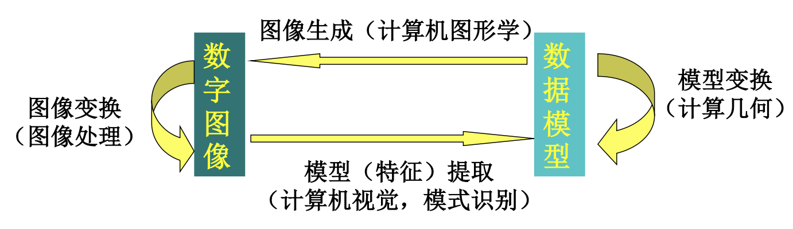
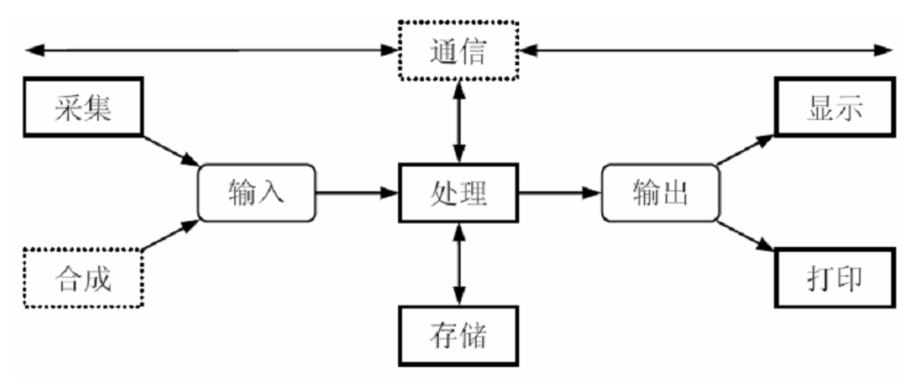

# 绪论

## Untitled

**人类信息的主要传递手段**

- 视觉（60%+），听觉，味觉，触觉

**人机交互**

- 字符、图形

**图像处理量大撒应用需求**

- 对图像信息改进
- 机器自动理解，使计算机具有视觉

**数字图像处理简史**

- **1920s: 报纸业**: 图像的编码与重构技术
- **1964: 航天技术**: 图像增强和复原技术
- **1970s：要干卫星和医学**
  1. 图像增强和图像识别 (sasclouds.com)
  2. 图像重构
- **1980s末~1990s: 多媒体技术**: 高速计算机和大规模集成电路的发展
  - 图像压缩和多媒体技术
  - 文本图像的分析和理解，文字的识别取得重大进展
  - 图像通讯和传播的广泛应用
- **2000s+**: 图像分析，计算机视觉
  - 机器爱学习、嵌入式技术和计算机网络的发展
  - 图像分割，无人驾驶……

## 图像概述

### 图像

- **定义**
- **表示** 对物体或场景的一种表现形式
  - 抽象定义：二维函数 $f(x, y)$
    - $(x, y)$: 点的空间坐标（实数）
    - $f$: 点 $(x, y)$ 的幅度（亮度、强度或灰度）

### 数字图像

- 数字化: 对 $x, y$ 和 $f$ 进行离散化
- 数字图像: 离散化了的图像
- 数字化过程
  - 采样: 坐标离散化
  - 量化: 函数值的离散化
  - 模拟图像
- 分类（根据 f 的性质）
  - 二值图像（黑白图像）: 像素编码通常为 {0, 1}
  - 灰度图像: 每个像素的信息由一个量化的灰度级描述
  - 索引图像: 每个像素值是图像颜色表的索引地址
  - 彩色图像: 每个像素的信息由颜色构成，颜色分类由不同灰度级描述
- 根据信息来源分类（电磁波谱-不同波段的图像）
  - $\gamma$ 射线成像
    - 医学领域: $\gamma$ 射线骨骼，$PET$(正电子放射断层) 成像
    - 天文观测: 宇宙 $\gamma$ 射线成像，核反应堆真空管
  - X 射线成像
    - 医学: 胸部 X 射线成像，主动脉照影成像，头部 CT 成像
    - 工业: 电路板成像
    - 天文: 天鹅星座环
  - 紫外线波段成像
    - 荧光显微镜: 玉米图像(普通玉米、患黑穗病玉米)
    - 天鹅星座环
  - 可见光及红外波段成像
    - 不同光照图像
    - 光显微镜: 紫衫酚 250，胆固醇 40，微处理器 60，镍氧化物 600，CD表面 1750，有机超导体 450
    - 摇杆
    - 自动视觉检测: 电路控制板，药丸胶囊，瓶子页面检测，塑料中气泡检测，谷物质量检测，盘质量检测
    - 检测: 指纹检测，纸币识别检测，车牌识别
    - 军事: 最后一名离开阿富汗的美国士兵
  - 微波波段成像
    - 雷达: 星载雷达 西藏东南山区
    - 医学: MRI 图像(膝盖，脊椎)
    - 天文: 蟹状脉冲星
  - 声波成像
    - 地质勘探（石油）: 地震剖面图像
    - 医学: 胎儿，甲状腺，肌肉损伤
  - 诱射电子显微镜
    - 工业检测: 钨丝（过热损坏），集成电路（热破坏形成白色纤维）

### 不同类型的图像

图像新扩展类型

- 多光谱图像: 包含多个频谱段的一组图像，每幅图像对应一个频谱段
- 纹理图像
- 立体图像: 双目立体视觉，用两台照相机拍摄的
- 深度图像: 记录静物和摄像机之间距离信息的图像
- 3D 图像: 坐标是三维的，用三元函数表达，可看作多个 2D 图像叠加而成
- 序列图像: 时间上有序，内容上相关
- 投影重建图像: 从景物的投影出发，重建原来的图像
- 合成图像
- 事件图像

## 图像工程概述

### 数字图像处理

- 狭义（输入和输出）: 对图像进行加工，改善图像都是视觉效果或突出目标，强调图像之间进行的变换，是一个从图像到图像的过程
- 广义: 与图像相关的处理（图像分析、理解和机器视觉）
- 广义上分三种类型
  - 低级处理：输入输出都是图像（增强，复原，编码，压缩）
  - 中级处理：图像分割及目标的描述，输出是目标的特征数据（检测，分割）
  - 高级处理：目标物体及相互关系的理解，输出是更抽象的数据（分类，识别，解释）
- 图像处理主要是地基处理及部分中级处理

### 主要相关学科

- 计算机图形学: 原指用图形、图标、绘图等形式表达数据信息的科学，而计算机图形学研究的就是如何利用计算机技术来产生这些形式
- 模式识别: 试图把图像分解成可用符号较抽象地描述的类别
- 计算机视觉: 主要强调用计算机实现人都是视觉功能，目前的研究主要与图像理解相结合

- 相关学科间的关系
- 
- 发展特点: 交叉、接线模糊、相互渗透

### 系统引例

- 图书馆书的统计
- 运动会跳远检测离线的距离

- 系统构成框图
- 

## 图像的表示和显示

### 图像和像素的表示

#### 图像和表示

- **表示:** 2D 函数 $f(x, y)$
  - $(x, y)$ 点的空间坐标（实数）
  - $f$: 点 $(x, y)$ 的幅度（亮度、强度或灰度）
- **广义:** 辐射能量的空间分布 $T(x, y, z, t, \lambda)$ 5D 有限函数
  - $x, y, z$ 空间位置向量
  - $t$ 时间
  - $\lambda$ 频谱相关变量，如波长
  - $T$ 能量值，标量

#### 像素和表示

- 光栅图像像素表示
  - 函数: 2-D 函数 $f(x, y)$
  - 矩阵: 
  $$ 
  \mathbf{F} = \begin{bmatrix}
    f_{11} & f_{12} & \cdots & f_{1N}\\
    f_{21} & f_{22} & \cdots & f_{2N}\\
    \vdots & \vdots & \ddots & \vdots\\
    f_{M1} & f_{M2} & \cdots & f_{MN}
    \end{bmatrix}
  $$
  - 矢量
  $$
  \begin{gather*}
    \mathbf{F} = \begin{bmatrix}
      \mathbf{f}_1 & \mathbf{f}_2 & \cdots \mathbf{f}_N
    \end{bmatrix}\\
    \mathbf{f}_i = \begin{bmatrix}
      f_{1i} & f_{2i} & \cdots & f_{Mi}
    \end{bmatrix}^T,  i = 1, 2, \cdots, N
  \end{gather*}
  $$

## 补充

- 相关学术机构和期刊
- 相关工具
- 《魔鬼终结者》