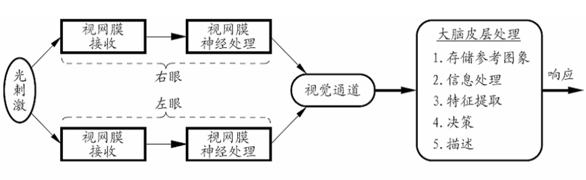
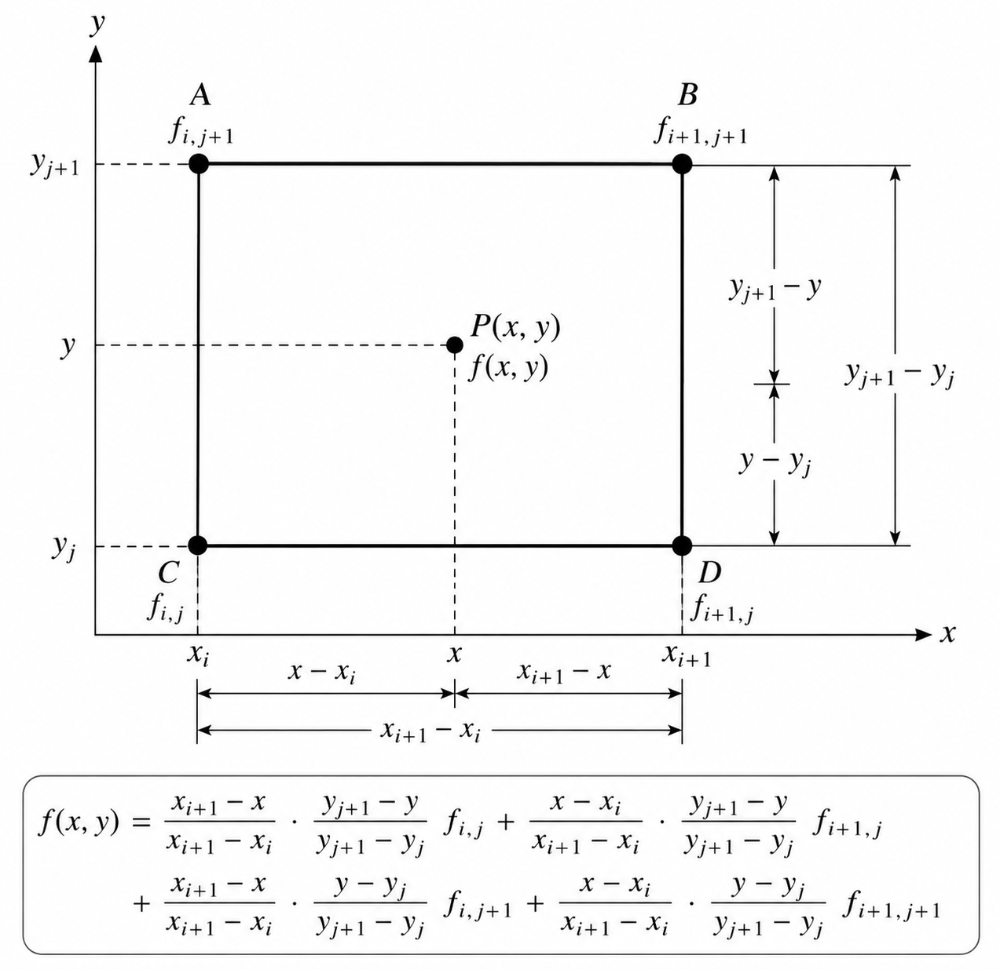

# 数字图像基础

## 视觉原理

### 视觉过程

- 物体在视网膜上成像
  - 锥状细胞: 感受力强 (约 2M 个) 亮视觉
  - 杆状细胞: 感受力弱 暗视觉
- 主观亮度，亮度适应 ($\log_k^X$)
  - 统一时刻能分辨的灰度 40 ~ 50 级
- 错觉
  - 马赫带效应
  - 同时对比

#### Slides 里没有的

- 指标 (SS, NM)
- 主观, 人给图像打分
- Conv —— 细胞侧抑制

### 整体视觉过程



## 亮度成像模型

- 2-D 亮度函数: $f(x, y)$
  - 亮度是能量的量度，一定不为 0 而且为有限值 $f(x, y) \in (0, \infty)$
- 光辐射形成物体上能量分布
  - 入社到可见场景上的光量: 照度 $i(x, y)$
  - 场景中目标对入射光的反射比率: 反射成分 $r(x, y)$
- $f(x, y) = i(x, y)r(x, y)$
  - $i(x, y) \in (0, \infty)$ 由光源决定
  - $r(x, y) \in (0, 1)$ 由场景中目标特性决定
    - 典型值: 黑天鹅绒 0.01，不锈钢 0.65，粉刷的白墙平面 0.80，白雪 0.93

## 图像感知与获取

### 图像数字化

- 将代表图像的连续（模拟）信号转换为离散（数字）信号的过程
- 步骤：采样，量化
- 主要技术
  - 成像：光信号 → 电信号
  - 模数转换 (A/D Converter)

<h3 style="color:grey">数字化采集设备</h3>

<h3 style="color:grey">关键部件：固体成像设备</h3>

## 图像采样和量化

### 采样

- 空间坐标的离散化，确定了不像的空间分辨率
- 方式: 点阵采样: 直接对图像的二维函数值进行采样，结果是一个样点值矩阵

### 量化

- 对采样点亮度（灰度）值的离散数啊过程，确定了图像的灰（幅）度分辨率。
- 两种量化
  - 均匀量化：等间隔分档取整
  - 非均匀量化：不等间隔分档取整

### 采样和量化的级数

- 假定图像取 $M \times N$ 个采样点，对样本点灰度值进行 $G$ 级分档取整
- $M, N, G$ 一般取 2 的整数次幂

### 图像都是坐标表示
- opencv 中坐标
- ```text
  (0,0) ─────────────→ x
    │
    │
    │
    ↓
    y
  ```
### 可视方式
- 像素区域中心
- 像素区域
- 幅度（灰度）值

### 空间分辨率和灰度分辨率

- 数字图像 $f(x, y) = \begin{bmatrix}f(0, 0) & f(0, 1) & \cdots & f(0, M - 1)\\f(1, 0) & f(1, 1) & \cdots & f(1, M - 1)\\\vdots & \vdots & \ddots & \vdots\\ f(N - 1, 0) & f(N - 1, 1) & \cdots & f(N - 1, M - 1)\end{bmatrix}$
- 图像水平尺寸 M: $M = 2^m$
- 图像垂直尺寸 N: $N = 2^n$
- 像素灰度级数 G(k-bit): $G = 2^k$
- 图像所需位数 b: $b = M \times N \times k = N^2k(M = N)$

## 像素空间的关系

### 像素的邻域与连接

- 像素的邻域
  - 4 邻域 $N_4(p)$
  - 对角邻域 $N_D(p)$
  - 8-邻域 $N_8(p)$
- 连接
  - 空间连接 && 像素灰度值相似
  - 两个像素是否连接
    - 接触（邻接）
    - 灰度值满足某个特定的相似准则（灰度值相等 || 同在一个灰度值集合中）
  - 分类
    - 4-连接
    - 8-连接
    - m-连接: 混合连接。
      - 两个像素 p 和 r 在 V 中取值 && (r 在 $N_4(p)$ 中 || r 在 $N_D(p)$ 中且集合 $N_4(p) \cap N_4(r)$ 是空集)
      - （优先 4-连接）

### 连通性

- 像素的连通
  - 反映两个像素间的空间关系
  - 通路: 4-通路 8-通路
  - 连通: 通路上所有像素灰度值满足相似准则
    - 4-连通 8-连通 m-连通
  
### 距离度量

- 距离: 对于像素 $p, q, z$ 分别有坐标 $(x, y), (s, t), (u, v)$ 如果
  - $D(p, q) \ge 0$，$D(p, q) = 0$ 当且仅当 $p = q$
  - $D(p, q) = D(q, p)$
  - $D(p, z) \le D(p, q) + D(q, z)$
  
  则 $D$ 是距离函数或度量。
- 欧氏距离 D_e$
  - $$
    D_e(p, q) = [(x - s)^2 + (y - t)^2]^{\frac{1}{2}}
  - $$
  - 距点 $(x, y)$ 的 $D_e$ 距离小于等于某一值 $r$ 的像素形成一个中心在 $(x, y)$ 的半径为 $r$ 的圆平面
- $D_4$ 距离（城市距离）
  - $$
    D_4(p, q) = \lvert x - s \rvert + \lvert y - t \rvert
  - $$
  - 距点 $(x, y)$ 的 $D_4$ 距离小于等于某一值 $r$ 的像素形成一个中心在 $(x, y)$ 的菱形
- $D_8$ 距离（棋盘距离）
  - $$
    D_8(p, q) = \max(\lvert x - s \rvert, \lvert y - t \rvert)
  - $$
  - 距点 $(x, y)$ 的 $D_8$ 距离小于等于某一值 $r$ 的像素形成一个中心在 $(x, y)$ 的正方形

## 图像坐标变换和应用

### 基本坐标变换

- 齐次坐标 $\begin{bmatrix}x & y & 1\end{bmatrix}^T$
  - 平移 $\begin{bmatrix}1 & 0 & T_x\\ 0 & 1 & T_y\\ 0 & 0 & 1\end{bmatrix}$
  - 旋转 $\begin{bmatrix}\cos\theta & -\sin\theta & 0\\ \sin\theta & \cos\theta & 0\\ 0 & 0 & 1\end{bmatrix}$
  - 缩放 $\begin{bmatrix}S_x & 0 & 0\\ 0 & S_y & 0\\ 0 & 0 & 1\end{bmatrix}$

### 仿射变换

- 欧式变换 $E = \begin{bmatrix}\cos\theta & -\sin\theta & t_x\\ \sin\theta & \cos\theta & t_y\\ 0 & 0 & 1\end{bmatrix}$
- 相似变换 $E = \begin{bmatrix}S\cos\theta & -S\sin\theta & t_x\\ S\sin\theta & S\cos\theta & t_y\\ 0 & 0 & 1\end{bmatrix}$
- 仿射变换 $A = \begin{bmatrix}a_{11} & a_{12} & t_x\\a_{21} & a_{22} & t_y\\ 0 & 0 & 1\end{bmatrix}$

### 几何失真校正

- 本质：原始场景中各个部分之间的空间关系和图像中各个对应像素间的空间关系不一致
- 使用几何变换将失真图像中各个像素位置进行转换，以重新得到正确的空间关系
- 原始图像 $f(x, y)$ 失真图像 $g(x', y')$
- 空间变换: 根据 $(x', y')$ 确定 $(x, y)$
  - 线性失真
    - $s(x, y) = k_1 x + k_2 y + k_3$
    - $t(x, y) = k_4 x + k_5 y + k_6$
  - 双线性失真
    - $s(x, y) = k_1 x + k_2 y + k_3 xy + k_4$
    - $t(x, y) = k_5 x + k_6 y + k_7 xy + k_8$
  - 非线性
    - $s(x, y) = k_1 + k_2 x + k_3 y + k_4 x^2 + k_5 xy + k_6 y^2$
    - $t(x, y) = k_7 + k_8 x + k_9 y + k_10 x^2 + k_{11} xy + k_{12} y^2$
- 灰度插值: 根据 $g(x', y')$ 确定 $f(x, y)$
  - 最近邻插值
  - 双线性插值（4 个点）
  - 
  - 双三次插值（外面在加一圈 16 个点）