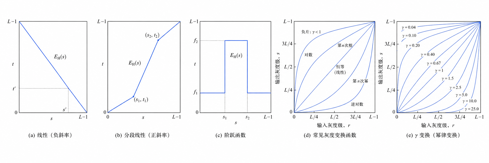

# 空域增强技术

**原因-图像降质**

- 传送和转换中，如成像、复制、扫描传输及限制中总要造成图像质量降低
- 改善：**图像增强**（降噪）和图像恢复（考虑质量下降的原因）

**图像增强**

- 不考虑质量下降的原因，只将感兴趣的特征有选择地突出（增强）而衰减其不需要的特征
- 改善后的图像不一定要去逼近原始图像

**目标**

- 从图像质量评价看: 提高可懂度
- 突出图像特征，便于处理

## 空域增强基础

- **空域**: 像素组成的空间
- **空域增强**: $g(x, y) = T[f(x, y)]$
  - $f(x, y)$ 是输入图像，$g(x, y)$ 是处理后图像，$T$ 是在点 $(x, y)$ 邻域上定义的关于 $f$ 的增强操作
  - 2 类: 灰度点操作，模板运算
- **邻域**: 包含点 $(x, y)$ 的小区域，中心点是 $(x, y)$
  - 邻域大小 << 图像尺寸
  - 通常是奇数行 / 列，基本是对称的
  - 形状主要是正方形
  - 其他: 原型，十字形，零星，环形，不规则形状
- **空域增强计算过程**: 遍历所有像素 → 每个像素处用 $T$ 跟以 $(x, y)$ 为中心的邻域进行计算
  - 边缘处理: 填零 (padding)
- **空域滤波**
  - 空域增强的过程也叫哦空域滤波
  - 小领域与预定义的操作合称空域滤波器，也称模板
- **灰度变换**
  - 模板大小为 $1 \times 1$ 时，输出图像 $g$ 只由 $(x, y)$ 处的 $f$ 值变换得到
  - $T$ 称为灰度变换函数 $s = T(r)$
  - 其中 $s$ 和 $r$ 是 $g$ 和 $f$ 在 $(x, y)$ 处的灰度

## 直接灰度映射

- 直接灰度映射是一种点操作: 将 $f(x, y)$ 中的每个像素灰度按 $T$ 操作直接变换以得到 $g(x, y)$
- **典型方法**
  - 图像求反
  - 增强对比度
  - 灰度切分
  - 对数变换 $s = c \log (r + 1)$
    - 压亮的拉伸暗的
  - 指数变换 $s = cr^\gamma$

  

## 直方图修正

- **直方图**
  - 数字图像中灰度级出现频数的统计
  - 提供了图像像素灰度值分布情况
- **计算方法**
  - 设一共有 L 个元素的数组，对原始图像灰度值进行统计
- **直方图的计算（频次）**
  - 设某种灰度 $r_k$ 的像素数为 $n_k$，$n$ 是图像中像素的总数，则灰度级 $r_k$ 对应的频数为:
  - $$
    p(r_k) = \frac{n_k}{n}\ k = 0,1,2,\dots L - 1
  - $$
- 不反应图像的空间信息，只展示具有一定灰度级的像素的数目或频数

> [!TIP] 思考
> 忽略了位置，怎么补回

### 直方图均衡化

- **直方图均衡化**
  - 指图像经过灰度变换后，使得灰度的概率密度分布变为常数，即均匀分布
  - **均衡化基本思想:** 扩大像素灰度值的动态范围，增强图像整体对比度（反差）
- **增强函数**
  - 归一化直方图 
  - $$
    p_r(r_k) = \frac{n_k}{n}\ \ \ \ \ 0 \le r_k \le 1, k = 0, 1, \dots, L - 1
  - $$
  - 增强函数 $E_H(r)$:
    - 在 $0 \le r \le L - 1$ 内为单增函数: 变换后仍保持排列次序
    - $0 \le E_H(r) \le L - 1$: 变换前后灰度值动态范围一致
- **累积分布函数 CDF**
  - **连续**
    - $$
      s = E_H(r) = \int_0^r p_r(w) dw
    - $$
    - 满足条件概率密度函数 PDF 永远为正，因为 r 在 $[0, 1]$ 时，$p_r$ 的总和为 1
    - 并能使 r 的分布转换为 s 的分布
    - s 的分布是均匀分布
    - >[!TIP] 概率积分变换（PIT）定理
      > 对于任意原始分布，$Y = G(x)$, G 为累积分布函数, Y 服从 $[0, 1]$ 上的均匀分布
  - **离散**
    - $$
      s_k = EH(r_k) = \sum_{i = 0}^k \frac{n_i}{n} = \sum_{i = 0}^k p_r(r_i)
    - $$
- opencv
  ```python
  cv2.calcHist(images, channels, mask, histSize, ranges[, hist[, accumulate]])
  cv2.equalizeHist(src[, dst])
  ```
- **完全自动**
- **优点:** 自动增强对比度
- **缺点:** 总是用均匀分布来近似目标的直方图
  - 增强效果不易控制，总是得到全局均衡化的直方图

### 直方图规定化

- **目的:** 将愿意图像的直方图转换为期望的直方图的形状
- **思路**
  - 已知 $p_r(r)$ 为原图的灰度密度函数，$p_z(z)$ 为希望得到的灰度密度函数
  - 分别对 $p_r(r), p_z(z)$ 均衡化
    $$
    \begin{align*}
    s &= T(r) = \int_0^r p_r(r)dr\ \ \ \ 0 \le r \le 1\\
    v &= G(z) = \int_0^z p_z(z)dr\ \ \ \ 0 \le z \le 1
    \end{align*}
    $$
    s = v
  - 求 G 的逆变换
    $$
    z = G^{-1}(v) = G^{-1}(s)
    $$
  - 建立 r → s 联系，有
    $$
    z = G^{-1}(v) = G^{-1}(s) = G^{-1}(T(r))
    $$

### 局部直方图处理

在一个像素的邻域总根据灰度级分布设计变换函数进行局部增强
- 定义一个邻域，该区域中心在某个像素点
- 计算直方图，得到变换函数
- 用该函数映射该区域中心像素的灰度
- 重复

## 空域滤波

利用像素本身以及其邻域像素的灰度关系进行增强的方法常称为滤波

**分类**

<div style="display: flex">

<div style="flex: 40">

- 线性：如邻域平均
- 非线性：如中值滤波

</div>

<div style="flex: 60">

- 平滑：模糊，消除噪声
- 锐化：增强边缘的细节

</div>
</div>

**滤波器实现**: 邻域计算（conv）

**噪声**

- 加性
  - 椒（黑）盐（白）
  - 高斯
- 乘性

### 平滑滤波器

#### 线性平滑滤波器

- 邻域平均 $z = \frac{1}{M}\sum_{i = 0}^{M - 1}k_i s_i$
  - 例 $\begin{bmatrix}1 & 1 & 1\\1 & 1 & 1\\1 & 1 & 1\end{bmatrix}$
- 加权平均
  - 例 $\begin{bmatrix}1 & 2 & 1\\2 & 4 & 2\\1 & 2 & 1\end{bmatrix}$
- 双边滤波
  - 核心思想
    - 对平坦区域强平滑去噪
    - 对边缘区域弱平滑保边
  - **相关因素:** 同时考虑空间域相似性和像素值域相似性
  - 由两部分乘积构成
    - 空间域权重: 空间距离
    - 值域权重: 灰度值差异
  - $BF(I_p) = \frac{1}{W_p}\sum_{q \in S} G_{\sigma_S}(\lVert p - q \rVert) G_{\sigma_r}(\lvert I_p - I_q \rvert) I_q$
    - $G_{\sigma_S}$: space weight, $G_{\sigma_r}$: range weight
  

#### 非线性平滑滤波器

- **作用:** 既消除噪声又保持细节
- **中值滤波器**
  - 方法
    - 将模板中心与像素位置重合
    - 读取模板下各对应像素的灰度值
    - 从小到大排成一列
    - 找出排在中间的 1 个
    - 将这个中间值赋给中心位置的像素
  - 分类
    - 1D 和 2D
  - 小于模板尺寸一半的过亮或过暗的区域将会在滤波后被消除掉
- **百分比滤波器**
  - 最大值 $g_{\max} = \max_{(s, t) \in N(x, y)}[f(s, t)]$
  - 最小值 $g_{\min} = \min_{(s, t) \in N(x, y)}[f(s, t)]$
  - 中点滤波器 $g_{\mathrm{mid}} = \frac{1}{2}\lbrace g_{\max}(x, y) + g_{\min}(x, y)\rbrace$

### 锐化滤波器

利用微分锐化图像（积分平滑图像）

#### 线性锐化滤波器

- **梯度:** 对应一阶导数，最常用的微分矢量
  - $$
    \nabla f = \begin{bmatrix}
      \frac{\partial f}{\partial x} & \frac{\partial f}{\partial y}
    \end{bmatrix}^T
  - $$
- **离散空间**，微分用差分实现
  - 常用的模板
    - $$
      \begin{bmatrix}
        -1 & 0 & 1\\
        -1 & 0 & 1\\
        -1 & 0 & 1
      \end{bmatrix}
      \ 
      \begin{bmatrix}
        1 & 1 & 1\\
        0 & 0 & 0\\
        -1 & -1 & -1
      \end{bmatrix}
    - $$
  - 加权差分模板
    - $$
      \begin{bmatrix}
        -1 & 0 & 1\\
        -2 & 0 & 2\\
        -1 & 0 & 1
      \end{bmatrix}
      \ 
      \begin{bmatrix}
        -1 & -2 & -1\\
        0 & 0 & 0\\
        1 & 2 & 1
      \end{bmatrix}
    - $$
- **梯度替代计算方法**
  - 2范数（欧氏距离） $\lvert \nabla f_{(2)} \rvert = \mathrm{mag}(\nabla f) = \lbrack (\frac{\partial f}{\partial x})^2 + (\frac{\partial f}{\partial y})^2 \rbrack^{1/2}$
  - 1范数（城市距离）$\lvert \nabla f_{(1)} \rvert = \lvert \frac{\partial f}{\partial x} \rvert + \lvert \frac{\partial f}{\partial y} \rvert$
  - $\infty$ 范数（棋盘距离） $\lvert \nabla f_{(\infty)} \rvert = \max \lbrace\lvert \frac{\partial f}{\partial x} \rvert, \lvert \frac{\partial f}{\partial y} \rvert\rbrace$

- **Laplace 算子**（二阶导数）
  - $$
    \nabla^2 f = \frac{\partial^2 f}{\partial x^2} + \frac{\partial^2 f}{\partial y^2}
  - $$
  - **离散**
    - $$
      \nabla^2 f = f(x + 1, y) + f(x - 1, y) + f(x, y + 1) + f(x, y - 1) - 4f(x, y)
    - $$
  - **模板**
    - $$
      \begin{bmatrix}
        0 & -1 & 0\\
        -1 & 4 & -1\\
        0 & -1 & 0
      \end{bmatrix}

      \begin{bmatrix}
        -1 & -1 & -1\\
        -1 & 8 & -1\\
        -1 & -1 & -1
      \end{bmatrix}

      \begin{bmatrix}
        0 & 1 & 0\\
        1 & -4 & 1\\
        0 & 1 & 0
      \end{bmatrix}


      \begin{bmatrix}
        1 & 1 & 1\\
        1 & -8 & 1\\
        1 & 1 & 1
      \end{bmatrix}
    - $$
  - **应用**
    - 锐化 $g(x, y) = f(x, y) + c[\nabla^2 f(x, y)]$
  
#### 非线性锐化滤波器

最大-最小锐化变换

$$
S[f(x, y)] = \begin{cases}
  g_{\max}(x, y) & \mathrm{if}\ g_{\max}(x, y) - f(x, y) \le f(x, y) - g_{\min}(x, y)\\
  g_{\min}(x, y) & \mathrm{else}
\end{cases}
$$

迭代实现

$$
S^{n + 1} = \lbrack f(x, y) \rbrack = S\lbrace s^n\lbrack f(x, y) \rbrack \rbrace
$$

### 局部增强

- 对图像局部细节的增强处理
- 直接利用局部信息以达到局部增强的目的

**图像统计量**

<table>
<tbody>
<tr>
<td>灰度均值</td>
<td>

$m = \sum_{i = 0}^{L - 1} r_i p(r_i)$

</td>
</tr>
<tr>
<td>方差（二阶矩）</td>
<td>

$\mu_2(r) = \sum_{i = 0}^{L - 1}(r_i - m)^2 p(r_i)$

</td>
</tr>
<tr>
<td>

$r$ 的 $n$ 阶矩

</td>
<td>

$\mu_n(r) = \sum_{i = 0}^{L - 1}(r_i - m)^n p(r_i)$

</td>
</tr>
</tbody>
</table>

**方法**

$$
g(x, y) = A(x, y)[f(x, y) - m(x, y)] + m(x, y)
$$

- 局部增益函数

  $$
  A(x, y) = k \frac{M}{\sigma(x, y)} \ \ \ \ 0 < k < 1
  $$

- 其中 $M$ 是 $f(x, y)$ 的均值，$m(x, y), \sigma(x, y)$ 是以 $(x, y)$ 为中心的邻域内的灰度均值和均方差

**增强像素**

$$
g(x, y) = \begin{cases}
  E \cdot f(x, y) & \mathrm{if}\ m_{S_{x, y}} \le k_0 M_G\ \land\ k_1 D_G \le \sigma_{s_{xy}} \le k_2 D_G\\
  f(x, y) & \mathrm{others}
\end{cases}
$$

- $E. K_0, K_1, K_2$ 是特定参数
- $M_G$ 是输入图像的全局平均值
- $D_G$ 是输入图像的标准差

## 图像运算

算数运算

- 加法 $C(x, y) = A(x, y) + B(x, y)$
  - 主要应用: 去除叠加性噪声，生成图像叠加效果
- 减法 $C(x, y) = A(x, y) - B(x, y)$
- 乘法 $C(x, y) = A(x, y) * B(x, y)$
- 求反 $g(x, y) = 255 - f(x, y)$
- 异或 $g(x, y) = f(x, y) \oplus h(x, y)$
- 逻辑或 $g(x, y) + f(x, y) \lor h(x, y)$
  
**补充**

- Mixup
- 引导滤波