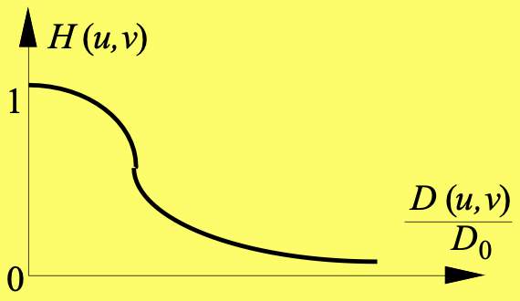

# 频域图像增强

## 背景

**傅立叶变换的提出**
- 傅立叶: 1768 出生
- 1822 年 “热分析理论“， 1878 翻译出英文，提出傅立叶级数
- 傅立叶级数: 周期函数表示为不同频率的正弦和/余弦和
- 傅立叶变换: 非周期函数表示为正弦和/或余弦乘以加权函数的积分
- 逆变换可以重建原函数

**应用**: 信号处理等 (FFT 的出现)

**傅立叶级数**

周期函数

$$
f(x) = \frac{a_0}{2} + \int_{k = 1}^{\infty}(a_k \cos kx + b_k \sin kx)
$$

$$
\begin{cases}
    a_n = \frac{1}{\pi}\int_{-\pi}^{\pi}f(x)\cos nx \mathrm{d}x & n = 0,1,2,\dots\\
    b_n = \frac{1}{\pi}\int_{-\pi}^{\pi}f(x)\sin nx \mathrm{d}x & n = 1,2,\dots
\end{cases}
$$

**函数分解**: 函数系数有重要意义，分解和合并的过程可逆

信号
- 在时域是一个周期且连续的函数
- 在频域是一个非周期离散的函数

## 傅立叶变换

### 傅立叶变换和频率域

#### 傅立叶变换

- 连续
  $$
  \begin{align*}
      \mathcal{F}\{f(x)\} &= F(u) = \int_{-\infty}^\infty f(x)e^{-j2\pi u x} \mathrm{d}x\\
      f(x) &= \int_{-\infty}^{\infty}F(u)e^{j2\pi u x}\mathrm{d}u
  \end{align*}
  $$
- 离散
  $$
  \begin{align*}
      \mathcal{F}\{f(x)\} &= F(u) = \sum_{x = 0}^{N - 1} f(x)e^{-j2\pi u x / N}\\
      f(x) &= \sum_{u = 0}^{N - 1}F(u)e^{j2\pi u x / N}
  \end{align*}
  $$
- 相关概念
  - 变换表达 $F(u) = R(u) + jI(u) = \lvert F(u) \rvert e^{-j \phi(u)}$
  - 频谱（幅度）$\lvert F(u) \rvert = [R^2(u) + I^2{u}]^{1/2}$
  - 相位角 $\phi(u) = \arctan \frac{I(u)}{R(u)}$
  - 功率谱 $P(u) = \lvert F(u) \rvert^2 = R^2(u) + I^2(u)$
- 窗函数傅立叶变换—辛克函数
  $$
  \begin{align*}
    f(x) &= \begin{cases}
        E & (-\frac{\tau}{2} \le x \le \frac{\tau}{2})\\
        0 & \mathrm{others}
    \end{cases}\\
    F(u) &= E\tau \frac{\sin(\pi u \tau)}{\pi u \tau} = Sinc(u)
  \end{align*}
  $$
- **二维:** x → (x, y), u → (u, v) 即可


#### 频率域

由傅立叶变换和频率变量 (u, v) 定义的空间

**基本性质**

- u = 0, v = 0，对应平均灰度
- 低频对应变化慢的
- 高频对应变化快的

**傅立叶谱和相位角**

$$
F(0, 0) = \sum_{x = 0}^{M - 1}\sum_{y = 0}^{N - 1} f(x, y) = MN \bar{f}(x, y)
$$

- $\lvert F(0, 0) \rvert$ 是频谱最大的分量

- 傅立叶变换共轭对称
  $$
  F^*(u, v) = F(-u, -v)
  $$
- 频谱关于原点偶对称
  $$
  \lvert F(u, v) \rvert = \lvert F(-u, -v) \rvert
  $$
- 相位角关于原点奇对称
  $$
  \varphi(u, v) = -\varphi(-u, -v)
  $$

#### 傅立叶变换的性质

变换对

$$
f(x, y) \iff F(u, v),\ \ \ \ M = N
$$

- 平移性质
  $$
  \begin{align*}
    f(x, y) e^{j2\pi (cx + dy) / N} &\iff F(u - c, v - d)\\
    f(x - c, y - d) &\iff F(u, v)e^{-j2\pi (cu + dv) / N}
  \end{align*}
  $$
- 旋转性质
  - 令 $x = r\cos \theta, y = r \sin \theta, u = w\cos \varphi, v = w \sin \varphi$
    $$
    f(r, \theta + \theta_0) \iff F(w, \varphi + \theta_0)
    $$
- 尺度定理
  $$
  \begin{align*}
    af(x, y) &\iff aF(u, v)\\
    f(ax, by) &\iff \frac{1}{\lvert ab \rvert}F(\frac{u}{a}, \frac{v}{b})
  \end{align*}
  $$
- 周期性
  $$
  \begin{align*}
    F(u) = F(u + kM)\\
    f(x) = f(x + kM)
  \end{align*}
  $$
  其中 $u, x = 0, 1, 2, \dots, M - 1$

  - **应用:** 把 f 挪到中心位置 $\frac{M}{2}$ 处
    $$
    \begin{align*}
    f(x)(-1)^x &\iff F(u - \frac{M}{2})\\
    f(x, y)(-1)^{x + y} &\iff F(u - \frac{M}{2}, v - \frac{N}{2})
    \end{align*}
    $$
  - 二维傅立叶变换及反变化在 u 方向和 v 方向都是无限周期的 
    $$
    \begin{align*}
      F(u, v) &= F(u + k_1 M, v + k_2 N)\\
      f(x, y) &= f(x + k_1M, y + k_2 N)
    \end{align*}
    $$

#### 相位谱

- 相位构成的矩阵
- 各个正弦分量关于原点的位移的度量
- 决定了图像中可辨别物体定位信息

#### 卷积定理

**卷积**

- 连续
  $$
  f(x) \circledast g(x) = \int_{-\infty}^{\infty}f(\tau)g(x - \tau)\mathrm{d}\tau
  $$
- 离散
  $$
  f(n) \circledast g(n) = \sum_{m =-\infty}^{\infty}f(m)g(n - m)
  $$
- 有限
  $$
  f(n) \circledast g(n) = \sum_{m =-M}^{M}f(m)g(n - m)
  $$

**卷积定理**

$$
\begin{align*}
  f(x) \circledast g(x) &\iff F(u)G(u)\\
  f(x)g(x) &\iff F(u) \circledast G(u)
\end{align*}
$$


**2D**

$$
f(x, y) \circledast g(x, y) = \int_{-\infty}^{\infty}\int_{-\infty}^{\infty}f(p, q)g(x - p, y - q) \mathrm{d}p \mathrm{d}q
$$

$$
\begin{align*}  
  f(x, y) \circledast g(x, y) &\iff F(u, v)G(u, v)\\
  f(x, y)g(x, y) &\iff F(u, v) \circledast G(u, v)
\end{align*}
$$

#### 相关定理

$$
f(x) \circ g(x) = \int_{-\infty}^{\infty}f^*(z)g(x + z) \mathrm{d}z
$$

- 互相关: $f(x) \neq g(x)$
- 自相关: $f(x) = g(x)$

$$
\begin{align*}
  f(x, y) \circ g(x, y) &\iff F^*(u, v)G(u, v)\\
  f^*(x, y)g(x, y) &\iff F(u, v) \circ G(u, v)
\end{align*}
$$

#### 可分离性

$$
F(u, v) = \sum_{y = 0}^{N - 1}f(x, y)e^{-j2\pi vy / N}
$$

<h4><a href="/acm/AcWing/math/#acwing-3123-%E9%AB%98%E7%B2%BE%E5%BA%A6%E4%B9%98%E6%B3%95ii" style="color: grey">快速傅立叶变换 (FFT)</a></h4>

### 离散余弦变换

$$
\begin{align*}
  F(u, v) &= \frac{2}{\sqrt{MN}}C(u)C(v)\sum_{x = 0}^{M - 1}\sum_{y = 0}^{N - 1}f(x, y)\cos(\frac{(2x + 1)u\pi}{2M})\cos(\frac{(2y + 1)v\pi}{2N})\\
  f(x, y) &= \frac{2}{\sqrt{MN}}\sum_{u = 0}^{M - 1}\sum_{v = 0}^{N - 1}C(u)C(v)F(u, v)\cos(\frac{(2x + 1)u\pi}{2M})\cos(\frac{(2y + 1)v\pi}{2N})
\end{align*}
$$

其中

$$
\begin{align*}
  C(u) = \begin{cases}
    \frac{1}{\sqrt{2}} & u = 0\\
    1 & u > 0
  \end{cases}\\
  C(v) = \begin{cases}
    \frac{1}{\sqrt{2}} & v = 0\\
    1 & v > 0
  \end{cases}\\
  x = 0, 1, \dots, M - 1\\
  y = 0, 1, \dots, N - 1
\end{align*}
$$


### 沃尔什变换

<!-- todo: 补一下吧，虽然不考 -->


### OpenCV 函数

```python
I = cv2.imread('lena.png')
gray = cv2.cvtColor(I, cv2.COLOR_BGR2GRAY)
J = np.fft.fft2(gray)
K = np.fft.ifft2(J)
np.fft.fft.shift(J) # 挪到中间
```

## 低通滤波器 (LPF)

$$
\begin{gather*}
  f(x, y) \iff F(u, v)\\
  H(u, v)F(u, v) = G(u, v) \iff g(x, y)
\end{gather*}
$$

- **理想低通滤波器 ILPF**
  $$
  H(u, v) = \begin{cases}
    1 & D(u, v) \le D_0\\
    0 & \mathrm{else}
  \end{cases}
  $$
  - $D_0$ 截断频率
  - $D(u, v) = (u^2 + v^2)^\frac{1}{2}$ 到原点的距离
  - **问题**
    - 模糊
    - 振铃: 在 2D 图像上表现为一系列同心圆环；半径反比于截断频率
- **巴特沃斯低通滤波器 BLPF**
  - 减少振铃，高频率间的过渡比较光滑
  - 阶为 n 的 BLPF
    $$
    H(u, v) = \frac{1}{1 + [D(u, v) / D_0]^{2n}}
    $$
    - 转移函数 $D(u, v) = D_0$ 时 $H(u, v) = \frac{1}{2}$
    
  - 振铃: 阶数越高越明显
- **高斯低通滤波器**
  $$
  H(u, v) = e^{-D^2(u, v) / (2D_0^2)}
  $$
- **其他低通滤波器**
  - 梯形
    $$
    H(u, v) = \begin{cases}
      1 & D(u, v) \le D'\\
      \frac{D(u, v) - D_0}{D' - D_0} & D' < D(u, v) < D_0\\
      0 & D(u, v) > D_0
    \end{cases}
    $$
  - 指数
    $$
    H(u, v) = \exp\lbrace -[D(u, v) / D_0]^n\rbrace
    $$
- **应用**: 消除伪轮廓, 字符识别前的增强处理, 人脸皱纹处理, 卫星图像伪影线消除

## 高通滤波器

$$
H_{hp} = 1 - H_{lp}
$$

- **理想高通滤波器 IHPF**
  $$
  H(u, v) = \begin{cases}
    0 & D(u, v) \le D_0\\
    1 & D(u, v) > D_0
  \end{cases}
  $$
- **巴特沃斯高通滤波器 BHPF**
  $$
  H(u, v) = \frac{1}{1 + [D_0 / D(u, v)]^{2n}}
  $$
- **高斯高通滤波器 GHPF**
  $$
  H(u, v) = 1 - e^{-D^2(u, v) / 2D_0^2}
  $$
- **高频强调滤波器**
  $$
  H_e(u, v) = k \times H(u, v) + c
  $$
  输出图的傅立叶变换
  $$
  G_e(u, v) = k \times G(u, v) + c \times F(u, v)
  $$
- **高频提升滤波器**
  - 原始图减去低通图得到的高通滤波器的效果
  - $$
    G_{HB}(u, v) = A \times F(u, v) - F_L(u, v) = (A - 1)F(u, v) + F_H(u, v)
    $$
  - A = 1, 高通滤波器
  - A > 1, 原始图的一部分与高通图像加，恢复了高通滤波丢失的低频分量

## 选择性滤波

- **带阻 & 带通**

<table>
<tbody>
<tr>
<td>理想</td>
<td>

$$
H_{BR} = \begin{cases}
  0 & D_0 - \frac{W}{2} \le D \le D_0 + \frac{W}{2}\\
  1 & \mathrm{other}
\end{cases}
$$

</td>
</tr>
<tr>
<td>巴特沃斯</td>
<td>

$$
H_{BR}(u, v) = \frac{1}{1 + \left(\frac{DW}{D^2 - D_0^2}\right)^{2n}}
$$

</td>
</tr>
<tr>
<td>高斯</td>
<td>

$$
H_{BR}(u, v) = 1 - \exp(-\lbrack\frac{D^2 - D_0^2}{DW}\rbrack^2)
$$

</td>
</tr>
</tbody>
</table>

$$
H_{BP}(u, v) = 1 - H_{BR}(u, v)
$$

- 陷波滤波器
  $$
  \begin{gather*}
    H_{NR} = \prod_{k = 1}^{K}[\frac{1}{1 + (D_{0k} / D_k(u, v))^{2n}}][\frac{1}{1 + (D_{0k} / D_{-k}(u, v))^{2n}}]\\
    D_k(u, v) = \sqrt{\left(u - \frac{P}{2} - u_k\right)^2 + \left(v - \frac{Q}{2} - v_k\right)^2}\\
    D_{-k}(u, v) = \sqrt{\left(u - \frac{P}{2} + u_k\right)^2 + \left(v - \frac{Q}{2} + v_k\right)^2}\\
  \end{gather*}
  $$
  
## 同态滤波

成像模型 $f(x, y) = i(x, y) r(x, y)$

- 取对数 $\ln f(x, y) = \ln i(x, y) + \ln r(x, y)$
- 两边傅立叶变换 $F(u, v) = I(u, v) + R(u, v)$
- 用 $H(u, v)$ 处理 $F(u, v)$: $H(u, v)F(u, v) = H(u, v)I(u, v) + H(u, v)R(u, v)$
- 反变换到空域 $h_f(x, y) = h_i(x, y) + h_r(x, y)$
- 取指数 $g(x, y) = \exp \lvert h_f(x, y) \rvert = \exp \lvert h_i(x, y) \rvert \cdot \exp \lvert h_r(x, y) \rvert$

- 低频对应照度，高频对应反射
- **特点:** 对高频和低频成分有不同的影响
- **应用:** 压缩图像的动态范围的同时增加对比度
  $$
  H(u, v) = (H_H - H_L)\lbrack1 - e^{-c(D^2(u, v) / D_0^2)}\rbrack + H_L,\ \ \ \ H_L\ < 1 \land\ H_H > 1
  $$

## 频域技术与空域技术

- 空间滤波器的工作原理可借助频域进行分析
- 空域中的平滑滤波器在频域里对应低通滤波器
  - 频域越宽，空域越窄，平滑作用越弱
- 空域中的锐化滤波器在频域里对应高通滤波器
  - 空域有正负值，模板中心系数较大