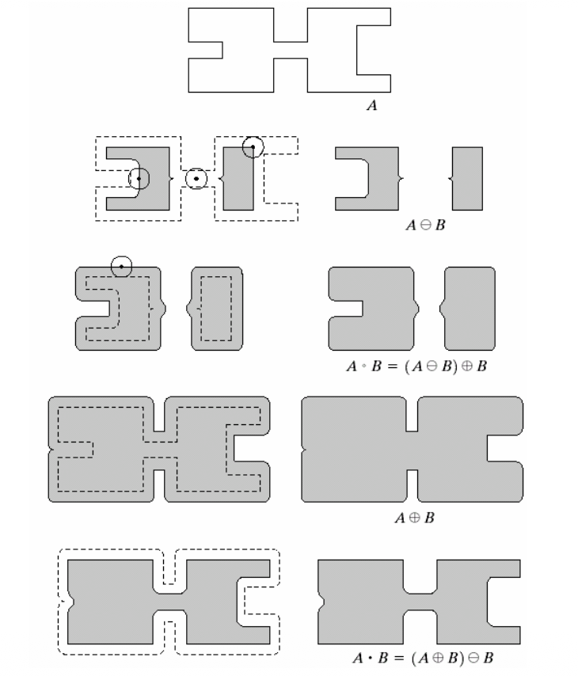
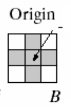
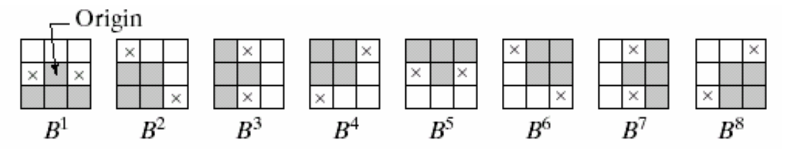
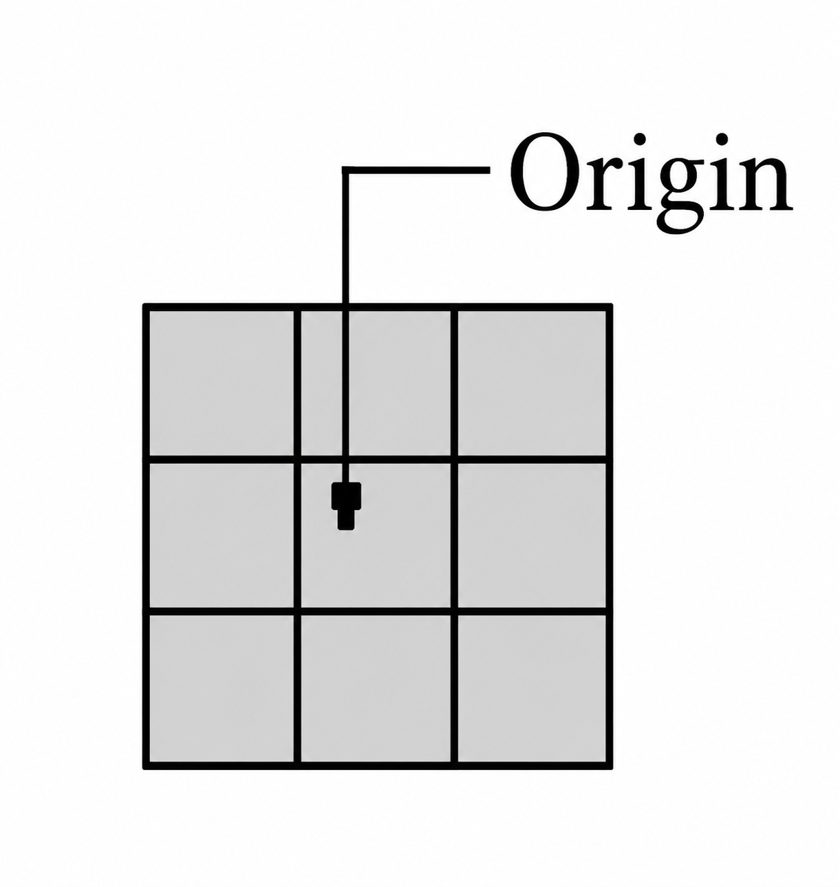
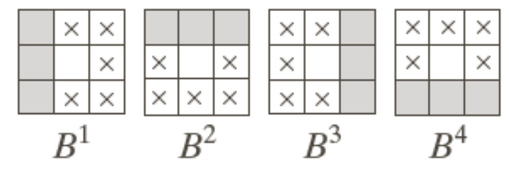

# 形态学图像处理

> [!TIP] 数学形态学 (1964)
> 铁矿 岩相定量分析 Hit or miss

## 基础知识

### 集合论中的概念

- 集合 $A, B$
- 元素 $a, b$
- 集合和元素的关系 $a \in A, b \notin A$
- 集合关系 
  - 子集 $\subseteq$
  - 并集 $\cup$
  - 交集 $\cap$
    - $A \cap B = \phi$(互斥 or 不相容)
  - 补集 $A^c = \lbrace w \vert w \notin A \rbrace$
  - 差集 $A - B = A \cap B^c$
- 位移 $A$ 用 $z = (z_1, z_2)$ 位移: $(A)_z$
  $$
  (A)_z = \lbrace y \vert y = a + z, a \in A \rbrace
  $$ 
- 映像 $A$ 的映像 $\hat{A}$
  $$
  \hat{A} = \lbrace w \vert w = -a, a \in A \rbrace
  $$

### 结构元

用于探测图像的小集合或子图
- 原点（可以包括在结构元中，也可以不）
- 对称且未显示原点，假定在对称中心
- 对图像操作时要求结构元素是矩阵，添加最少的背景元素实现

```python
# 1. 矩形结构元 (MORPH_RECT)
rectse = cv2.getStructuringElement(cv2.MORPH_RECT, (5, 5))
# 2. 十字/菱形结构元 (MORPH_CROSS)
crose = cv2.getStructuringElement(cv2.MORPH_CROSS, (5, 5))
# 3. 椭圆/圆形结构元 (MORPH_ELLIPSE)
ese = cv2.getStructuringElement(cv2.MORPH_ELLIPSE, (5, 5))
```

## 膨胀和腐蚀

**膨胀 dilate**

A 用 B 来膨胀: $A \oplus B$

$$
A \oplus B = \lbrace x \vert (\hat{B})_x \cap A \neq \phi \rbrace
$$

**腐蚀 erosion**

A 用 B 来腐蚀: $A \ominus B$

$$
A \ominus B = \lbrace x \vert (B)_x \subseteq A \rbrace
$$

**OpenCV**

```python
cv2.dilate(src, kernel, anchor=(-1,-1),iterations=1,borderType=cv2.BORDER_CONSTANT) # or erode
```

## 开操作和闭操作

**开操作 opening**

$$
A \circ B = (A \ominus B) \oplus B
$$

在边界内转动 $B$ 中的点能达到的 $A$ 的边界的最远点

**闭操作 close**

$$
A \bullet B = (A \oplus B) \ominus B
$$

在边界外转动



**OpenCV**

```python
cv2.morphologyEx(src, op, kernel, anchor=(-1,-1), iteration=1)
```

## 击中或击不中变换

$$
A \circledast B = (A \ominus B_1)\cap(A^c \ominus B_2)
$$

$B$ 目标和目标背景构成的集合

**要求:** 结构元对象间不相交

```python
cv2.morphologyEx(src,cv2.MORPH_HITMISS,kernel,anchor=(-1,-1))
```

- **kernel:** 前景1 背景-1 任意0 (np.int32)

## 基本的形态学算法

- **边界提取**: $\beta(A) = A - (A \ominus B)$
- **区域填充**: $X_k = (X_{k - 1} \oplus B) \cap A^c\ \ \ \ \ k = 1,2,3,\dots$
  - 给定区域内一点，采用种子填充
  - 对于多个区域填充时，需要指定初始点
  
    
- **细化**:
  $$
  \begin{gather*}
    A \otimes B = A - (A \circledast B) = A \cap (A \circledast B)^c\\
    B = \lbrace B^1, B^2, B^3, \dots, B^n \rbrace
  \end{gather*}
  $$
    
  - 执行一遍后还要继续细化，直到结果不发生变化
- **联通区域提取**
  $$
  \begin{gather*}
    X_k = (X_{k - 1} \oplus B) \cap A,\ \ \ k = 1, 2, 3\dots\\
    \mathrm{where}\ X_0 = \mathrm{seed\ pixel}\ p
  \end{gather*}
  $$

    
  - $X_k = X_{k - 1}$ 时迭代结束
- **凸壳 (Convex Hull)**
  - 任意集合 S 的凸壳是包含 S 的最小凸集
  $$
  \begin{gather*}
    X_k^i = \left(X_{k -1}^i \circledast B^i\right) \cup A,\ \ \ i = 1,2,3,4,\ k = 1,2,3\dots
  \end{gather*}
  $$
  
  - $X_k^i = X_{k - 1}^i$ 时迭代收敛，$D^i = X_k^i$
  - A 的凸壳 $C(A) = \bigcup_{i = 1}^{4}D^i$

## 灰度级图像扩展

- **表示**
  - 输入图像 $f(x, y)$
  - 结构元素 $b(x, y)$
- 膨胀
  $$
  f \oplus b(s, t) = \max \lbrace f(s - x, t - y) + b(x, y) \vert (s - x), (t - y) \in D_f; (x, y) \in D_b \rbrace
  $$
- 腐蚀
  $$
  f \ominus b(s, t) = \min \lbrace f(s + x, t + y) - b(x, y) \vert (s - x), (t - y) \in D_f; (x, y) \in D_b \rbrace
  $$
- 开操作: 球在下侧滚动，去除较小的明亮细节
- 闭操作: 球在上侧滚动，去除较小的暗细节


**基本形态学算法**

- 形态学平滑 $g = (f \circ b) \bullet b$
- 形态学梯度 $g = (f \oplus b) - (f \ominus b)$
- 顶帽变换 (亮背景上的暗物体) $T_{hat}(f) = f - (f \circ b)$
- 底帽变换 (亮背景上的暗物体) $B_{hat}(f) = (f \bullet b) - f$
- 粒度测定
  1. 采用尺寸逐渐增大的结构元素对图像进行开运算；
  2. 计算原始图像与各次开运算结果之间的差值图像；
  3. 对差值图像进行归一化处理，根据归一化结果绘制颗粒尺寸分布。
- 纹理分割


