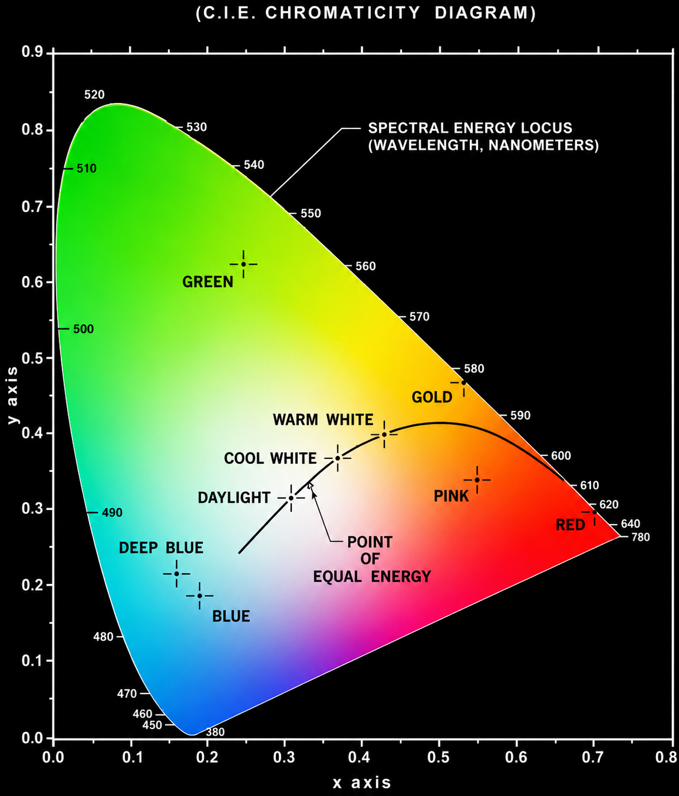
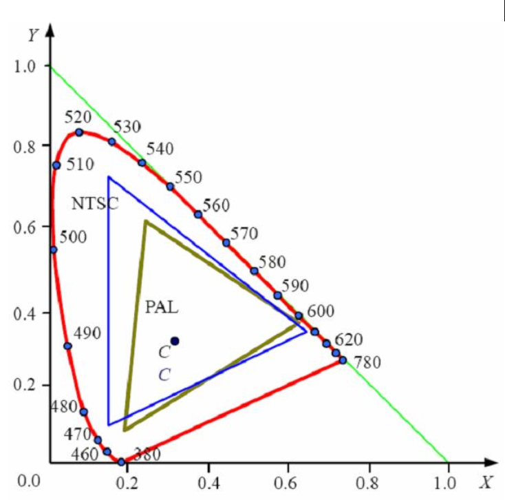
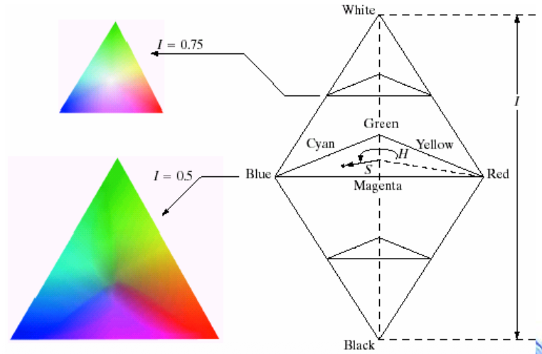
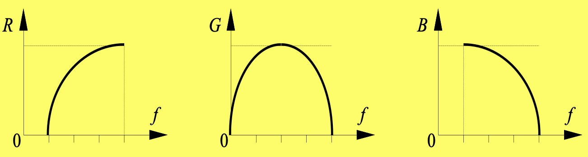
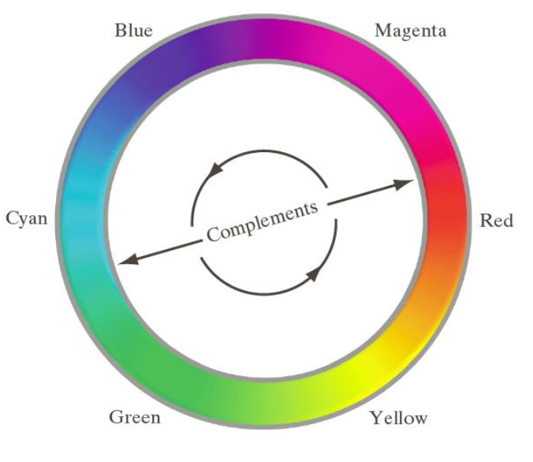

# 彩色图像处理

## 彩色基础

**颜色的本质**

- 牛顿 1666 三棱镜
- 可见 400～700 nm

**三基色 (三原色)**

- 国际照明组织定的
- 人眼对 RGB 最敏感
- 三种感光细胞（锥细胞）

**色度**

- 彩色三种基本特征量
  - 亮度: $\propto$ 反射率
  - 色调: 波长
  - 饱和度: 一定色调光的纯度
- 色度: 色调和饱和度的合称

**确定彩色的方法**

- 三色值系数
  - 设 R, G, B 的值分别为 X, Y, Z
  - 三个色系数分别为 (归一化) $x = \frac{X}{X + Y + Z}, y = \frac{Y}{X + Y + Z}, z = \frac{Z}{X + Y + Z}$
- 色度图
  - $z = 1 - (x + y)$
  - 三角形内的颜色的由三个顶点生成(由三种颜色不能得到所有的颜色)
    
  - PAL 和 NTSC 两种制式的色度三角形
    
    - 光栅扫描显示器
    - 打印机范围更小

## 彩色模型

- 面向硬设备 RGB, CMY
- 面向视觉感知 HSI, HSV

 

- **RGB** 笛卡尔坐标系 x → R, y → G, z → B
- **CMY** 蓝绿(Cyan), 品红(Magenta), 黄(Yellow)
  - $R = 1 - C, G = 1 - M, B = 1 - Y$
- **HSI** 色调(Hue), 饱和度(Saturation), 密度(Intensity)
  - **基本特点**
    - I 分量和彩色信息无关
    - H 和 S 分量与人感受颜色的方式紧密相连
  - **模型表示**
    
  - RGB → HSI 不用背

## 伪彩色处理

人眼对彩色比灰度有较大的分辨能力，对灰度几十，对彩色几千

- 亮度切割: 用平行于图像坐标平满的平面切割亮度函数
- 变换函数: 对灰度只用三个独立的变换处理
  
- 频域滤波: 傅立叶变换 → 三个滤波器 → 反变换 → 进一步处理 → 彩色图像

## 真彩色处理

  
- **补色** 色环上与色调直接相对的另一端
- **直方图处理** HS 不变, I 均衡化
- **彩色平滑**
  - RGB 同时平滑
  - I 单独平滑
- **彩色锐化** 同上
- **饱和度增强** 对 S 通道增强
- **色调增强** 对 H 通道微增一个常数 (可以用于数据增强)