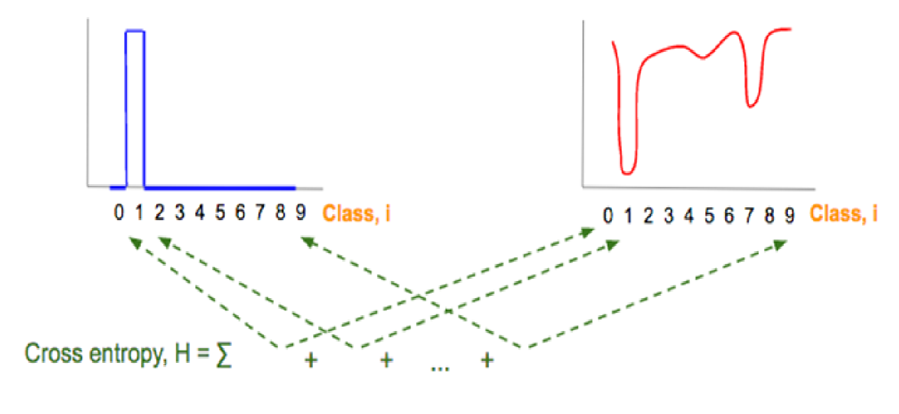

# 数学基础

## 线性代数

标量，向量运算 ...

### 向量

#### 向量范数

满足以下条件的函数 $f: \mathbb{R}^n \rightarrow \mathbb{R}, \operatorname{dom} f = \mathbb{R}^n$ 称为范数：

- 非负：$\forall \mathbf{x} \in \mathbb{R}^n, f(\mathbf{x}) \ge 0$
- 正定：$f(\mathbf{x}) = 0 \rightarrow \mathbf{x} = \mathbf{0}$
- 齐次：$\forall \mathbf{x} \in \mathbb{R}^n, t \in \mathbb{R}, f(t\mathbf{x}) = |t|f(\mathbf{x})$
- 三角不等式：$\forall \mathbf{x}, \mathbf{y} \in \mathbb{R}^n, f(\mathbf{x} + \mathbf{y}) \le f(\mathbf{x}) + f(\mathbf{y})$

向量 $\mathbf{x} \in \mathbb{R}^n$，则 $\mathbb{R}^n$ 上的 $\ell_1$-范数：

$$
\|\mathbf{x}\|_1 = |x_1| + \cdots + |x_n|
$$

$\ell_\infty$-范数：

$$
\|\mathbf{x}\|_\infty = \max\{|x_1|, \ldots, |x_n|\}
$$

更一般地：

$$
\|\mathbf{x}\|_p = (|x_1|^p + \cdots + |x_n|^p)^{\frac{1}{p}}
$$

### 矩阵

#### Hadamard 积

点积

$$
[A \odot B]_{mn} = a_{mn}b_{mn}
$$

#### 矩阵范数

**算子（诱导）范数**：

设：

$$
c = Ab
$$

则：

$$
\|c\| \le \|A\| \cdot \|b\|
$$

算子范数定义：

$$
\|A\| = \max_{x \ne 0}\frac{\|Ax\|}{\|x\|} = \max_{\|x\|=1}\|Ax\|
$$

一般的 $p$-范数诱导矩阵范数：

$$
\|A\|_p = \max_{x \ne 0}\frac{\|Ax\|_p}{\|x\|_p}
$$

**常见矩阵范数**：

- **$1$-范数（最大绝对列和）**：

$$
\|A\|_1 = \max_{1 \le j \le n}\sum_{i=1}^{m}|a_{ij}|
$$

- **$2$-范数（谱范数）**：

$$
\|A\|_2 = \sqrt{\lambda_{\max}(A^T A)}
$$

等价于 $A$ 的最大奇异值。

- **$\infty$-范数（最大绝对行和）**：

$$
\|A\|_\infty = \max_{1 \le i \le m}\sum_{j=1}^{n}|a_{ij}|
$$

**Frobenius 范数**：

$$
\|A\|_F = \sqrt{\sum_{i,j}A_{ij}^2}
$$

## 微积分

- 次导数：不可求导情况下的导数（左右导数之间的所有值）

| 输出 \ 输入 | 标量 $x\;(1,)$ | 向量 $\mathbf{x}\;(n,1)$ | 矩阵 $\mathbf{X}\;(n,k)$ |
|---|---|---|---|
| 标量 $y\;(1,)$ | $\dfrac{\partial y}{\partial x}\;(1,)$ | $\dfrac{\partial y}{\partial \mathbf{x}}\;(1,n)$ | $\dfrac{\partial y}{\partial \mathbf{X}}\;(k,n)$ |
| 向量 $\mathbf{y}\;(m,1)$ | $\dfrac{\partial \mathbf{y}}{\partial x}\;(m,1)$ | $\dfrac{\partial \mathbf{y}}{\partial \mathbf{x}}\;(m,n)$ | $\dfrac{\partial \mathbf{y}}{\partial \mathbf{X}}\;(m,k,n)$ |
| 矩阵 $\mathbf{Y}\;(m,l)$ | $\dfrac{\partial \mathbf{Y}}{\partial x}\;(m,l)$ | $\dfrac{\partial \mathbf{Y}}{\partial \mathbf{x}}\;(m,l,n)$ | $\dfrac{\partial \mathbf{Y}}{\partial \mathbf{X}}\;(m,l,k,n)$ |

## 数学优化

（最优化都学过）

## 概率论

（概率论都学过）

正态分布

$$
p(x) = \frac{1}{\sqrt{2\pi \sigma^2}}\exp\left(-\frac{(x - \mu)^2}{2\sigma^2}\right)
$$

## 信息论

### 熵（Entropy）

自信息（Self Information）

$$
I(x) = -\log(p(x))
$$

熵

$$
\begin{align*}
    H(X) &= \mathbb{E}_X [I(x)]\\
    &= \mathbb{E}_x[-\log p(x)]\\
    &= -\sum_{x \in X} p(x) \log p(x)
\end{align*}
$$

熵是理论最优平均编码长度，这种编码方式称为**熵编码**（Entropy Encoding）。

### 交叉熵（Cross Entropy）

交叉熵是按照概率分布 $q$ 的最优编码对真实分布为 $p$ 的信息进行编码的长度：

$$
\begin{align*}
    H(p, q) &= \mathbb{E}_p[-\log q(x)]\\
    &= -\sum_x p(x) \log q(x)
\end{align*}
$$

### KL 散度（K-L Divergence）

KL 散度是用概率分布 $q$ 来近似 $p$ 时所造成的信息损失量：

$$
D_{KL}(p, q) = H(p, q) - H(p) = \sum_x p(x) \log \frac{p(x)}{q(x)}
$$

连续形式：

$$
\int p(x) \log \frac{p(x)}{q(x)} \, dx
$$

### 交叉熵损失

$$
-\sum_{y=1}^{C} p_r(y \mid x) \log p_\theta(y \mid x)
$$



真实概率 $p_r(y \mid x)$ 与预测概率的负对数 $-\log p_\theta(y \mid x)$。

$$
\begin{align*}
D_{KL}(pr(y \mid x) \| p_\theta(y \mid x))
&= \int pr(y \mid x) \log \frac{pr(y \mid x)}{p_\theta(y \mid x)} \, dy \\
&= \sum_{y=0}^{k} pr(y \mid x) \log \frac{pr(y \mid x)}{p_\theta(y \mid x)} \\
&\propto - \sum_{y=0}^{k} pr(y \mid x) \log p_\theta(y \mid x) \quad \text{（$y$ 为 $x$ 的真实标签）} \\
&\propto - \sum_{y=0}^{k} y_i \log p_\theta(y_i \mid x)
\end{align*}
$$

> 负对数似然损失函数

$$
L(y, f(x, \theta)) = -\sum_{c=1}^{C} y_c \log f_c(x, \theta)
$$

关系（GPT）
```text
我们想让预测分布接近真实分布
↓
使用 KL 散度衡量分布差异
↓
去掉与参数无关项
↓
得到交叉熵
↓
one-hot 情况下变成负对数似然 loss。
```