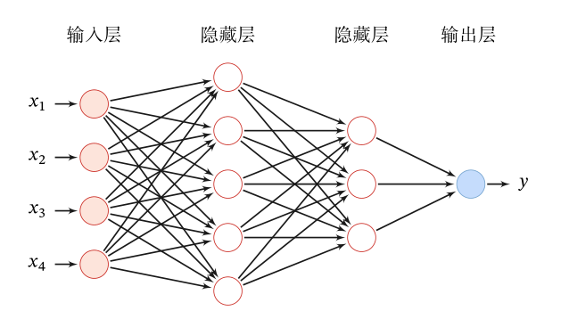

# 深度学习基础

新知识不太多，就看之前学的还记不记得了，主要还是一些概念。

## 相关概念

浅层学习（Shallow Learning）：不涉及特征学习，其特征主要靠人工经验或特征转换方法来抽取。

数据表示是机器学习的核心问题。

- 特征工程：需要借助人类智能
- 表示学习：如何自动从数据中学习好的表示
- 难点：没有明确的目标

一般而言，一个好的表示具有以下几个优点：

- 应该具有很强的表示能力。
- 应该使后续的学习任务变得简单。
- 应该具有一般性，是任务或领域独立的。

**表示形式**：

- 局部表示（知识库、规则）
  - 离散表示、符号表示
  - One-Hot 向量
- 分布式（distributed）表示（嵌入：压缩、低维、稠密向量）
  - 压缩、低维、稠密向量
  - 用 $O(N)$ 个参数表示 $O(2^k)$ 区间
  - $k$ 为非 0 参数，$k < N$

**传统的特征提取**：

- 特征提取
  - 线性投影（子空间）：PCA、LDA
  - 非线性嵌入：LLE、Isomap、谱方法
  - 自编码器
- 特征提取 VS 表示学习
  - 特征提取：基于任务或先验对去除无用特征
  - 表示学习：通过深度模型学习高层语义特征

一个好的表示学习策略必须具备一定的深度：

- 特征重用：指数级的表示能力
- 抽象表示与不变性：抽象表示需要多步的构造

深度学习：构建具有一定"深度"的模型，可以让模型来自动学习好的特征表示（从底层特征，到中层特征，再到高层特征），从而最终提升预测或识别的准确性。

## 人工神经网络

### 网络结构

| 记号 | 含义 |
| --- | --- |
| $L$ | 神经网络的层数 |
| $M_l$ | 第 $l$ 层神经元的个数 |
| $f_l(\cdot)$ | 第 $l$ 层神经元的激活函数 |
| $\boldsymbol{W}^{(l)} \in \mathbb{R}^{M_l \times M_{l-1}}$ | 第 $l-1$ 层到第 $l$ 层的权重矩阵 |
| $\boldsymbol{b}^{(l)} \in \mathbb{R}^{M_l}$ | 第 $l-1$ 层到第 $l$ 层的偏置 |
| $\boldsymbol{z}^{(l)} \in \mathbb{R}^{M_l}$ | 第 $l$ 层神经元的净输入（净活性值） |
| $\boldsymbol{a}^{(l)} \in \mathbb{R}^{M_l}$ | 第 $l$ 层神经元的输出（活性值） |

$$\boldsymbol{z}^{(l)} = \boldsymbol{W}^{(l)}\boldsymbol{a}^{(l-1)} + \boldsymbol{b}^{(l)}$$

### 通用近似定理

根据通用近似定理，对于具有线性输出层和至少一个使用"挤压"性质的激活函数的隐藏层组成的前馈神经网络，只要其隐藏层神经元的数量足够，它可以以任意的精度来近似任何从一个定义在实数空间中的有界闭集函数。

> 一个图像识别的案例，做过实验

### 使用步骤

- 建立模型
  - 选择什么样的网络结构
  - 选择多少层数，每层选择多少神经元
- 损失函数
  - 选择常用损失函数，平方误差，交叉熵….
- 参数学习
  - 梯度下降
  - 反向传播算法

#### 建立模型

**激活函数的性质**：

- 连续并可导（允许少数点上不可导）的非线性函数。
- 激活函数及其导函数要尽可能的简单
- 激活函数的导函数的值域要在一个合适的区间内
- 单调递增

**常见的激活函数**：

| 激活函数 | 函数 | 导数 |
| --- | --- | --- |
| Logistic | $f(x) = \dfrac{1}{1 + e^{-x}}$ | $f'(x) = f(x)(1 - f(x))$ |
| Tanh | $f(x) = \dfrac{e^x - e^{-x}}{e^x + e^{-x}}$ | $f'(x) = 1 - f(x)^2$ |
| ReLU | $f(x) = \max(0, x)$ | $f'(x) = I(x > 0)$ |
| ELU | $f(x) = \max(0, x) + \min(0, \gamma(e^x - 1))$ | $f'(x) = I(x > 0) + I(x \leq 0) \cdot \gamma e^x$ |
| SoftPlus | $f(x) = \log(1 + e^x)$ | $f'(x) = \dfrac{1}{1 + e^{-x}}$ |

#### 损失函数

常用：平方损失、交叉熵损失

#### 参数学习

> 主要是反向传播的公式推导

### 优化问题

- 非凸优化问题
- 梯度消失问题（Vanishing Gradient Problem）

难点：

- 参数过多，影响训练
- 参数解释起来比较困难
- 非凸优化问题：即存在局部最优而非全局最优解，影响迭代
- 梯度消失问题，下层参数比较难调

需求：

- 计算资源要大
- 数据要多
- 算法效率要好：即收敛快
