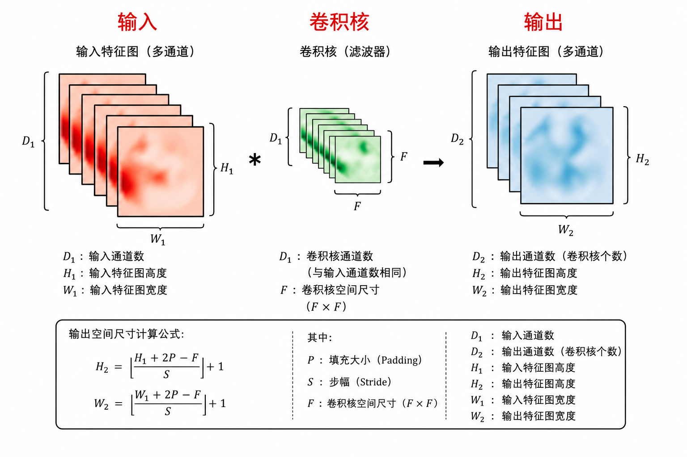
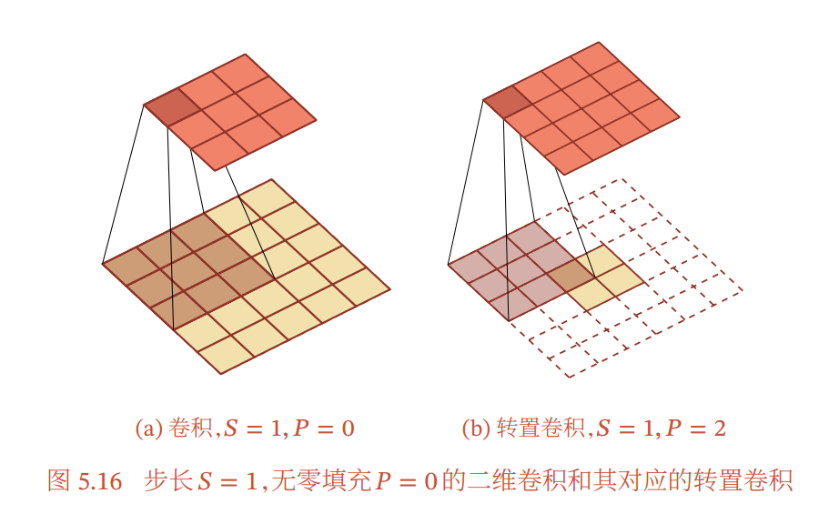
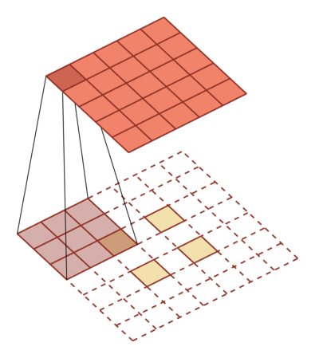
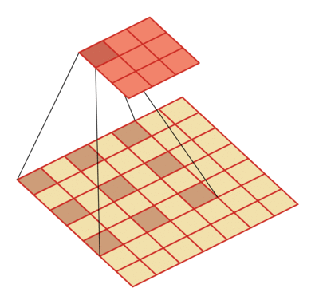

# 卷积神经网络

## 概述

### 卷积神经网络的诞生

- 卷积：平移不变模式
- 池化：下采样被检测物体不变模式

CNN 应用图像模式的一般框架：卷积层 + 激活函数 + 池化层 + 全连接层。

## 自己手动搭CNN

### 卷积层

#### 术语

1. $x$ ：输入，input，image
2. $w$ ：卷积核，filter，kernel
3. $s$ ：特征映射，feature map，activation map，convolved feature
4. 感受野：一个神经元连接到的输入区域，receptive field

#### 互相关

数学上的卷积运算是需要翻转卷积核的，CNN 中的卷积一般指"互相关"，不需要翻转。

#### 多卷积核

- 卷积核的个数 = 下一层数据的深度 = 下一卷积层 卷积核的深度
- 卷积核的个数 = 提取特征的数量 ， 超参数， 可以自己调节

#### 参数

- **stride**
  - stride 设置为超过1的参数，就相当于在stride=1的卷积结果中作了下采样
  - 实际上是跳过去不计算，能够成倍减少计算量
- **padding**
  - padding = valid，不补 0，每卷积一次宽和高维度下降 $F - 1$
  - padding = same，补 0 或者复制填充，卷积后宽高不变

#### 小结

参数量：

$$
(F \times F \times D_1 + 1)\times D_2
$$

其中：

- $F \times F \times D_1$：单个卷积核参数量
- $+1$：bias
- $\times D_2$：卷积核个数

计算量（MACs）：

$$
H_2 \times W_2 \times F \times F \times D_1 \times D_2
$$

即：每个输出元素都需要一次 $F \times F \times D_1$ 的卷积运算。

> 卷积导数就是正常求导，没什么。

#### 特殊的卷积

- 转置卷积
  
- 微步卷积
  - 低维特征映射到高维特征
  
- 空洞卷积
  - 通过给卷积核插入"空洞"来变相地增加感受野大小。
  

### 激活层

加入非线性元素

- sigmoid 和 tanh 指数运算，效率低
- relu 线性运算，效率高，最常用

### 池化层

- 在width和height维度上进行下采样，不改变depth的维度
- 该卷积核不是通过学习获得，而是人为定义的卷积核（不算做参数）
- 能够成倍减少计算量
- 相比stride，池化层可以选择进行下采样的方式。
- Max-Pooling, Mean-Polling

#### 小结

- 输入：$W_1 \times H_1 \times D_1$
- 超参数：
  - filters维度：$F$
  - 步长：$S$
- 输出：$W_2 \times H_2 \times D_2$

$$W_2 = \frac{W_1 - F}{S} + 1, \quad H_2 = \frac{H_1 - F}{S} + 1, \quad D_2 = D_1$$

- 参数：一些池化方式中是有参数的，max-pooling和mean-pooling没有参数

### 感受野计算

> 其实我感觉硬算就行

卷积层(conv)和池化层(pooling)都会影响感受野，而激活函数层通常对于感受野没有影响，当前层的步长并不影响当前层的感受野，感受野和padding没有关系, 计算当层感受野的公式如下:

$$RF_{i+1} = RF_i + (k - 1) \times S_i$$

其中, $RF_{i+1}$ 表示当前层的感受野，$RF_i$ 表示上一层的感受野，$k$ 表示卷积核的大小，$S_i$ 表示之前所有层的步长的乘积(不包括本层).

### 卷积神经网络搭建小结

卷积神经网络的一般结构

1. 卷积层+ReLU和 池化层 的组合多次出现： 提取特征
2. 多个全连接 或 特殊的CNN结构 作为输出层： 作分类器/检测器/分割器

### 网络训练

还是 SoftMax 归一化然后交叉熵损失，梯度下降

#### 梯度下降

**梯度下降（Gradient descent）**：
- 每次迭代时使用所有样本来进行梯度的更新

**随机梯度下降（Stochastic gradient descent）**：
- 每次迭代时使用一个样本来进行梯度的更新

**小批量梯度下降（Mini-batch gradient descent）**：
- 批量梯度下降和随机梯度下降的折中
- 每次迭代时使用batch-size个样本来进行梯度的更新

**梯度下降方式的优化**：

- Momentum法 — 动量项在梯度指向方向相同的方向逐渐增大，对梯度指向改变的方向逐渐减小
- Nesterov加速梯度法 — 给予梯度项上述「预测」功能的方法
- Adagrad法 — 对低频出现的参数进行大的更新，对高频出现的参数进行小的更新，适合处理稀疏数据
- Adadelta法
- RMSprop法
- Adam法

> GPT 生成的表格
> | 方法 | 主要思想 |
> |---|---|
> | Momentum | 利用历史方向加速 |
> | Nesterov | 提前预测再修正（观察两步的方向） |
> | Adagrad | 参数自适应学习率（不同的参数学习率不一样，并且自适应减小） |
> | Adadelta | 防止 Adagrad 学习率过小 |
> | RMSprop | 指数平均版 Adagrad |
> | Adam | Momentum + RMSprop |

#### 模型泛化

- **学习算法的基本假设** — 学习算法的基本假设用来训练模型的数据（训练集）和真实数据（测试集）间是独立同分布的
- **泛化能力**
  - 学到隐含在数据集背后的规律
  - 针对具有同一规律的训练集以外的数数据
  - 经过训练的网络也能给出合适的输出
- **如何提高学习算法效果**
  - 降低训练误差 — 欠拟合 — 实质：模型的表示能力不够
  - 缩小训练误差和测试误差的差距 — 过拟合 — 实质：模型模拟了训练数据独有的噪声
- **深度神经网络的泛化能力**
  - 高模型容量，高拟合能力，容易过拟合
  - 正则化，减少测试误差
- **正则化**
  - Early-stopping
  - 权重正则化 （L1， L2 正则）
  - 数据增强 / dropout

## 经典 CNN

### AlexNet

#### Group Convoution

- **最早出现于 AlexNet**
- 硬件资源有限，卷积操作不能放在同一个GPU进行处理
- 把feature maps分给多个GPU，对多个GPU的结果进行融合。

#### Dropout

- 引入概率的思想，训练时节点是否存在于网络中是由随机概率决定的
- 训练时加入随机性，进行反向传播算法。测试时，只是用训练好的参数

ensemble（集成学习） N个节点的网络， Dropout = 同时训练 $2^n$ 个网络

#### Data Augmentation

拟合自然界中常见的噪声，主要用于数据集较小的时候，可以丰富图像训练集、防止过拟合

常用的数据增强方式有：
- 对颜色的数据增强
- 色彩的饱和度、亮度、对比度
- 加噪声（高斯噪声）
- 水平翻转、垂直翻转
- 随机旋转、随机裁剪（crop）

### VGG

深度增加 + 小卷积核

#### Small Convolution filter

**最早用于VGG**，使用2个 $3\times3$ 的卷积核的组合比用1个 $5\times5$ 的卷积核**效果更佳 && 参数量降低**

### GoogLeNet/Inception

使用了Inception模块，并行执行多个具有不同尺度的卷积运算或池化操作将多个卷积核卷积的结果拼接成一个非常深的特征图

使用了大量的trick提高网络性能：
- Bottleneck $1 \times 1$ 卷积核
- 全局平均池化 GAP 代替全连接
- 在v2中，采用Batch Normalization（批归一化）
- 在v3中，采用非对称卷积降低运算量
- 在v4中，结合了ResNet中的思想，发现Residual Connections貌似只能加快网络收敛速度，是更大的网络规模提高了精度

#### Multi-size filters in one layer（Inception Block）

**最早出现于 Inception-v1/GoogleNet**

缺点 — 参数量比使用单个卷积核要多，庞大的计算量 = 模型效率低下

#### Bottleneck

**最早出现于Network in Network**

> 参数量评估

#### 使用全局平均池化GAP代替全连接

Advantage：可以实现任意图像大小的输入
Disadvantage：可能会导致收敛速度变慢

#### Batch Normalization

**最早出现于Inception v2**

在训练过程中强行将每一层的输入拉回到比较标准的相同的分布

可以防止梯度消失或爆炸，可以加快训练速度

### ResNet

#### 使用了恒等映射

传统神经网络训练的函数为 $F(x)$，添加恒等映射后，神经网络训练的函数变为 $F(x) + x$

对 $x$ 作修正，修正的幅度就是 $F(x)$，$F(x)$ 在数学上称为残差所以作者提出的网络称为残差网络

恒等映射下，虽然网络的深度加深，但是每层中都会有足够多的由梯度承载的信息量，梯度不会太小，加快了深层网络的收敛速度

### DenseNet

ResNet：短路连接，加强前后层信息流通，缓解梯度消失；
DenseNet：互相连接所有的层，特征在通道维度上的复用

过渡层：
- 通过 $1 \times 1$ 卷积层来减小通道数，
- 使用步幅为2的平均汇聚层减半高和宽。
从而进一步降低模型复杂度

### ResNext

split-transform-merge — 先将输入分配到多路，然后每一路进行转换，最后再把所有支路的结果融合

### 小结

| 网络 | 核心特点 |
| --- | --- |
| AlexNet | Group Convolution（分组卷积），Dropout，Data Augmentation（数据增强） |
| VGG | 深度，小卷积核 |
| Inception（Google-Net） | 同一层使用多个类型的卷积核，Bottleneck，Batch Normalization（批归一化） |
| ResNet | skip/identity connection 残差的引入 |

## 轻量化

### 空间可分离卷积

把卷积拆成两个向量乘法

### 深度可分离卷积（MobileNet）

MobileNet

每层只乘一个卷积核

### 轻量化（ShuffleNet）

分组卷积
