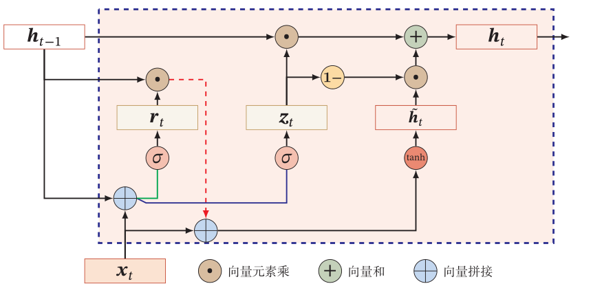
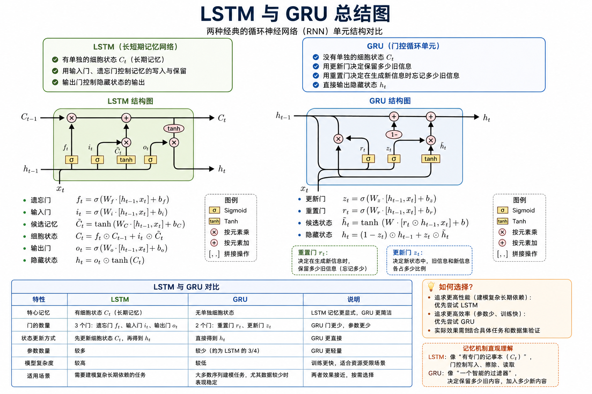
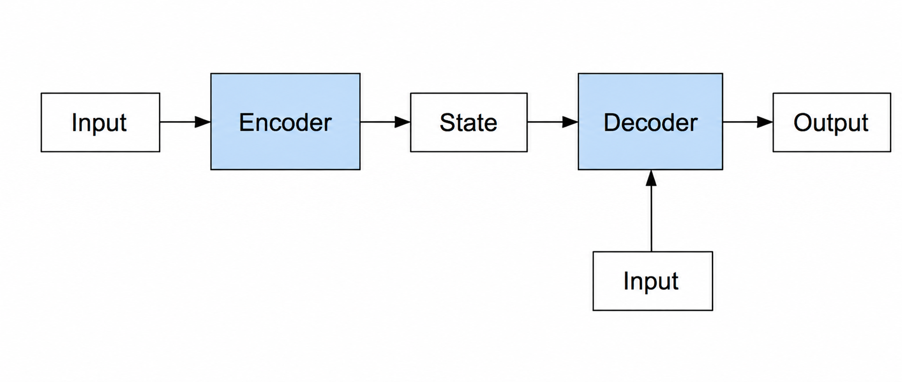
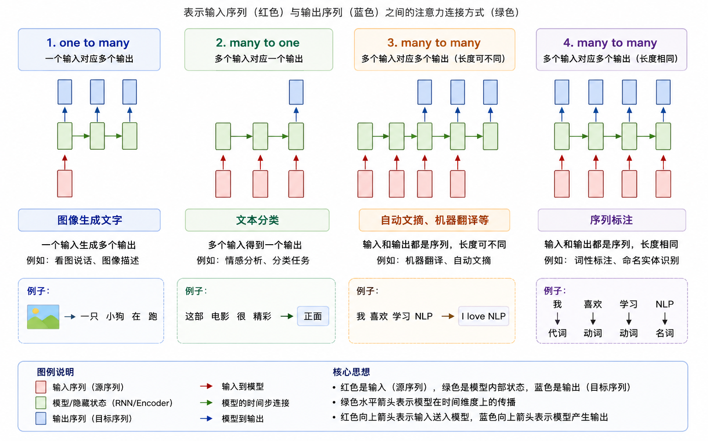

# 循环神经网络

## 语言处理技术

### 自然语言处理

三个阶段 — 基于规则的方法 → 基于统计学习的方法 → 基于深度学习的方法
由浅入深的四个层面分别是 — 形式、语义、推理和语用

### 研究内容

- 词法（Lexical）学：研究词的词素（morphemes）构成、词性等
- 句法（Syntax）学：研究句子结构成分之间的相互关系和组成句子序列的规则
- 语义（Semantics）学：研究如何从一个语句中词的意义，以及这些词在该语句的句法结构中的作用来推导出该语句的意义。
- 语用（Pragmatics）学：研究在不同上下文中的语句的应用，以及上下文对语句理解所产生的影响。

### 应用

- 文本分类
  - 基于机器学习的分类：朴素贝叶斯（Naive Bayes）、支持向量机（SVM）、最大熵分类器
  - 基于神经网络的方法：多层感知机（MLP）、卷积神经网络（CNN）、循环神经网络（RNN）
- 文本聚类
  - 基于距离的聚类：通过相似度函数计算语义关联度，然后根据语义关联度进行聚类，如 K-means
  - 基于概率模型的聚类：假设每篇文章是所有主题上的概率分布，典型的主题模型包括 PLSA 和 LDA 等

#### 情感分析

sentiment analysis

按粒度可分为**词汇级、句子级和篇章级**的情感分析，核心任务主要包含观点性及倾向性识别、观点要素抽取等任务。

- **基于词典的情感分析方法**：通过制定一系列的情感词典和规则，对文本进行拆句、分析及匹配词典，计算情感值进行文本的情感倾向判断。
- **基于机器学习的情感分析方法**：将情感分析作为一个分类问题来处理，基本流程与文本分类一致，采用支持向量机（SVM）、深度学习（CNN，RNN，LSTM）等模型方法。

#### 信息抽取

- 实体识别与抽取
  - 命名实体识别
  - 开放域实体识别
- 实体消歧
  - 同一个命名实体实体可能包含多种形式的表达（多对一），同时文档中的一个名词可能从字面意思上对应多种命名实体（一对多）。
- 关系抽取
  - (实体1, 关系类别, 实体2)
- 事件抽取
  - 非结构化文本中抽取事件信息，主要任务包括触发词和事件元素的提取等。

- 自动文摘
- 信息推荐
- 自动问答
- 机器翻译

## 词向量学习

### 词向量

- 深度学习应用于自然语言处理之前，传统的词表达通常采用 one-hot 方式表达
- 词向量可以将 one-hot 编码转化为低维度的连续值，也就是稠密向量

#### Word Embedding

解决了类比问题：

$$V_{king} - V_{queen} \approx V_{uncle} - V_{aunt}$$

#### 应用

- 计算相似度
- 作为神经网络输入
- 句子/文档表示

### 词向量学习模型

词向量是在训练语言模型的同时获得的，而语言模型就是判断给定字符串为自然语言的概率 $P(w_1, w_2, \dots, w_n)$，其中 $w_1, w_2, \dots, w_n$ 依次表示字符串中的各个词。如果 $P$ 大于某个阈值，就认为该字符串为自然语言。

**n-gram 语言模型**：抽取连续的 $n$ 个词判断属于自然语言的概率

#### CBOW

如果是用一个词的上下文作为输入，来预测这个词本身，则是 **CBOW 模型**。

如果是用一个词语作为输入，来预测它的上下文词，则这个模型叫做 **Skip-gram 模型**。

### 词向量学习模型的优化

#### 层次化softmax方法

- 对输出层进行优化的策略
- 输出层从原始模型单层计算概率值改用 Huffman 树计算概率值

#### 负采样方法

- 不再使用复杂的 Huffman 树，而是采用随机负采样策略，优化目标改为：最大化正样本的概率，同时最小化负样本的概率。

### 句子向量

- Bag-of-words：直接 sum
- Pooling：句子长度是词的三倍，max / min / mean
- CNN
- Variations：层级 CNN，在输入层引入字符向量
- LSTM / CNN-GRU

## 循环神经网络

前馈神经网络：

- 无法处理变长的序列数据。
- 无法对词序建模

处理任务：

- 变长输入
- 相互依赖
  - 视频由连续图片组成
  - 词义/情感取决于上下文

### 循环神经网络

循环神经网络通过使用带自反馈（隐藏层）的神经元，能够处理任意长度的序列。

$$
\begin{align*}
    \boldsymbol{h}_t &= f(\boldsymbol{U}\boldsymbol{h}_{t - 1} + \boldsymbol{W}\boldsymbol{x}_t + \boldsymbol{b})\\
    \boldsymbol{y}_t &= \text{softmax}(\boldsymbol{W}^{(S)}\boldsymbol{h}_t)
\end{align*}
$$

$f$ 通常为 sigmoid 或 tanh 函数。

#### 参数学习

随时间反向传播算法

### LSTM 和 GRU

解决长程依赖问题

- 梯度爆炸
  - 权重衰减
  - 梯度截断
- 梯度消失
  - 改进模型

#### 改进方法

- 循环变更为线性依赖：$\boldsymbol{h}_t = \boldsymbol{h}_{t-1} + g(x_t; \theta)$
- 增加非线性：$\boldsymbol{h}_t = \boldsymbol{h}_{t-1} + g(x_t, \boldsymbol{h}_{t-1}; \theta)$

#### 门控循环单元

- 重置门：$\boldsymbol{r}_t = \sigma(\boldsymbol{W}_r\boldsymbol{x}_t + \boldsymbol{U}_r\boldsymbol{h}_{t-1} + \boldsymbol{b}_r)$
- 更新门：$\boldsymbol{z}_t = \sigma(\boldsymbol{W}_z\boldsymbol{x}_t + \boldsymbol{U}_z\boldsymbol{h}_{t-1} + \boldsymbol{b}_z)$
- 候选状态：$\tilde{\boldsymbol{h}}_t = \tanh(\boldsymbol{W}_c\boldsymbol{x}_t + \boldsymbol{U}_h(\boldsymbol{r}_t \odot \boldsymbol{h}_{t-1}) + \boldsymbol{b}_n)$
- 最终状态：$\boldsymbol{h}_t = \boldsymbol{z}_t \odot \boldsymbol{h}_{t-1} + (1 - \boldsymbol{z}_t) \odot \tilde{\boldsymbol{h}}_t$

#### LSTM

LSTM 模型的关键是引入了一组记忆单元（Memory Units），允许网络可以学习何时遗忘历史。

**具有细胞结构，三个门**

- 遗忘门 $f_t$：$\boldsymbol{f}_t = \sigma(\boldsymbol{W}_f \cdot [\boldsymbol{h}_{t-1}, \boldsymbol{x}_t] + \boldsymbol{b}_f)$
- 输入门 $i_t$：
  - $\boldsymbol{i}_t = \sigma(\boldsymbol{W}_i \cdot [\boldsymbol{h}_{t-1}, \boldsymbol{x}_t] + \boldsymbol{b}_i)$
  - $\tilde{\boldsymbol{C}}_t = \tanh(\boldsymbol{W}_C \cdot [\boldsymbol{h}_{t-1}, \boldsymbol{x}_t] + \boldsymbol{b}_C)$
- 更新记忆：$\boldsymbol{C}_t = \boldsymbol{f}_t \cdot \boldsymbol{C}_{t-1} + \boldsymbol{i}_t \cdot \tilde{\boldsymbol{C}}_t$
- 输出门 $o_t$：
  - $\boldsymbol{o}_t = \sigma(\boldsymbol{W}_O \cdot [\boldsymbol{h}_{t-1}, \boldsymbol{x}_t] + \boldsymbol{b}_o)$
  - $\boldsymbol{h}_t = \boldsymbol{o}_t \cdot \tanh(\boldsymbol{C}_t)$

**LSTM缓解梯度爆炸/消失**

- RNN：$\frac{\partial h_t}{\partial h_{t-1}}$ 取值，要么总是大于 1，要么总是在范围 $[0, 1]$ 内；
- LSTM：$\frac{\partial C_t}{\partial C_{t-1}}$ 在任何时间步长都可以取大于 1 的值或范围 $[0, 1]$ 内的值。可以设置 $\boldsymbol{f}_t$ 等使得 $\frac{\partial C_t}{\partial C_{t-1}}$ 接近 1。

#### 小结

#### 堆叠（Stack）循环神经网络

循环神经网络的深度是一个有争议的话题：

- 一方面，按照时间展开，已经非常的深了
- 另一方面，输入和隐藏状态的转换只有一个非线性函数，非常的浅

#### 双向循环神经网络

- 在 Forward 层从 0 时刻到 $i$ 时刻正向计算一遍，得到并保存每个时刻向前隐含层的输出；
- 在 Backward 层从 $i$ 时刻到 0 时刻反向计算一遍，得到并保存每个时刻向后隐含层的输出；

### Attention

#### 编码器-解码器架构

Seq2seq 模型：

- 同步
- 异步
  - 编码器是读取输入序列的 RNN
  - 解码器使用另一个 RNN 来生成输出

存在的问题：

- 定长中间向量 $c(h_r)$ 限制模型性能
- 输入序列的不同部分对于输出序列重要性不同

#### 注意力机制

- 解码器每个时刻输入不同的 $c$
- 每个时刻的 $c$ 自动选取与当前输出最相关的上下文

$$c_i = \sum_{j = 1}^{T_x} a_{ij} h_{j}$$

- $c_i$ 是编码器中隐状态加权和
- $a_{ij}$ 是目标词 $y_i$ 与源词 $x_j$ 对齐的概率

$$a_{ij} = \frac{\exp(e_{ij})}{\sum_{k=1}^{T_x} \exp(e_{ik})},
\qquad
e_{ij} = \varphi(h'_{i-1}, h_j)
= V^T \tanh(Wh'_{i-1} + Uh_j)$$

- $a_{ij}$ 是目标词 $y_i$ 与源词 $x_j$ 对齐的概率
- $e_{ij}$ 是 $a_{ij}$ 对应的能量函数
- $\varphi$ 是一个对齐模型，用于衡量 $j$ 位置输入与 $i$ 位置输出的匹配程度

## 应用与实践

- 序列到类别
- 同步序列到序列
  - 每个时刻都有输入输出
  - 输入输出序列长度相同
  - 应用举例：序列标注，中文分词，命名实体识别
- 异步序列到序列
  - 输入和输出不需要有严格的对应关系
  - 应用举例：机器翻译，对话系统
- 其他应用
  - 看图说话
  - 自动摘要
  - 自动写诗
  - 自动作曲
    - DeepBach 能够创作出与巴赫风格高度相近的作品，几乎到了"以假乱真"的地步。

