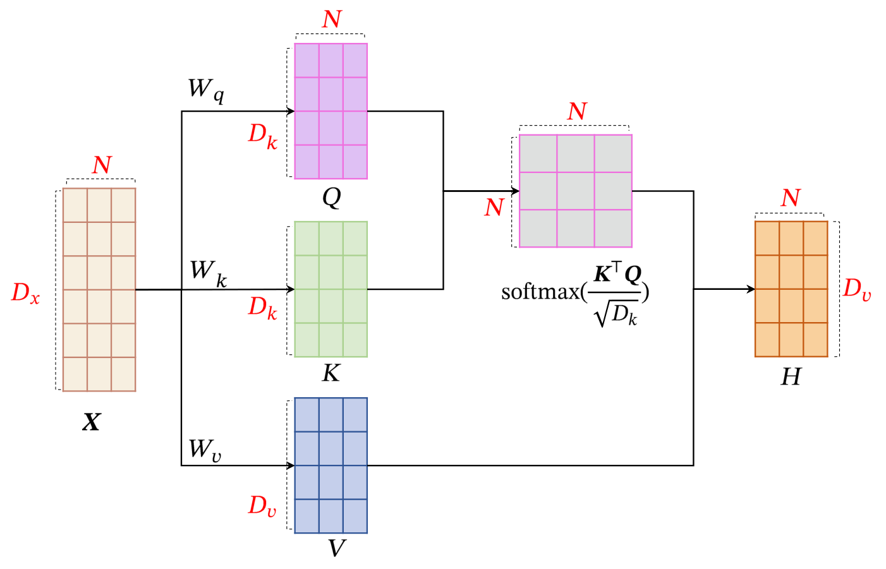
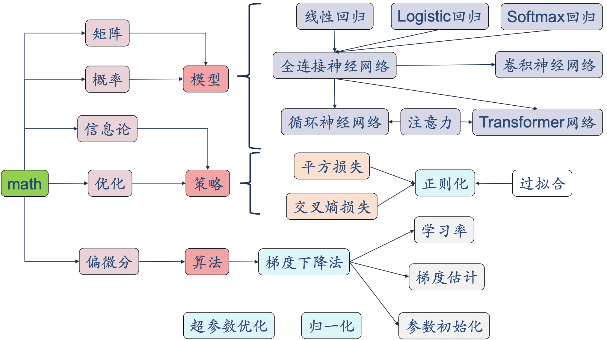

# 注意力机制与 Transformer

## 注意力机制

### 鸡尾酒会效应

当一个人在吵闹的鸡尾酒会上和朋友聊天时，尽管周围噪音干扰很多，他还是可以听到朋友的谈话内容，而忽略其他人的声音。

同时，如果未注意到的背景声中有重要的词（比如他的名字），他会马上注意到。

### 如何实现

- 自下而上 — 汇聚（pooling）
- 自上而下 — 会聚（focus）

## 人工神经网络中的注意力机制

### 注意力模型

#### 软性注意力机制（soft attention mechanism）

按照概率混合所有词

1. 计算注意力分布 $\alpha$：

$$
\alpha_n = p(z = n | \boldsymbol{X}, \boldsymbol{q}) = \text{softmax}(s(\boldsymbol{x}_n, \boldsymbol{q})) = \frac{\exp(s(\boldsymbol{x}_n, \boldsymbol{q}))}{\sum_{j=1}^{N} \exp(s(\boldsymbol{x}_j, \boldsymbol{q}))}
$$

其中 $s(\boldsymbol{x}_n, \boldsymbol{q})$ 为打分函数。

2. 根据 $\alpha$ 来计算输入信息的加权平均：

$$
\text{att}(\boldsymbol{X}, \boldsymbol{q}) = \sum_{n = 1}^{N} \alpha_n \boldsymbol{x}_n = \mathbb{E}_{z \sim p(z|\boldsymbol{X}, \boldsymbol{q})}[\boldsymbol{x}_z]
$$

**注意力打分函数** $s(\boldsymbol{x}, \boldsymbol{q})$：

| 模型 | 打分函数 |
| --- | --- |
| 加性模型 | $s(\boldsymbol{x}, \boldsymbol{q}) = \boldsymbol{v}^T \tanh(\boldsymbol{W}\boldsymbol{x} + \boldsymbol{U}\boldsymbol{q})$ |
| 点积模型 | $s(\boldsymbol{x}, \boldsymbol{q}) = \boldsymbol{x}^T \boldsymbol{q}$ |
| 缩放点积模型 | $s(\boldsymbol{x}, \boldsymbol{q}) = \dfrac{\boldsymbol{x}^T \boldsymbol{q}}{\sqrt{D}}$ |
| 双线性模型 | $s(\boldsymbol{x}, \boldsymbol{q}) = \boldsymbol{x}^T \boldsymbol{W} \boldsymbol{q}$ |

#### 注意力机制的变体

- 硬性注意力（hard attention）
- 键值对注意力（key-value pair attention）
  - 用 $(\boldsymbol{K}, \boldsymbol{V}) = [(\boldsymbol{k}_1, \boldsymbol{v}_1), \cdots, (\boldsymbol{k}_N, \boldsymbol{v}_N)]$ 表示 $N$ 个输入信息
  - $$\text{att}((\boldsymbol{K}, \boldsymbol{V}), \boldsymbol{q}) = \sum_{n = 1}^{N} \alpha_n \boldsymbol{v}_n = \sum_{n = 1}^{N} \frac{\exp(s(\boldsymbol{k}_n, \boldsymbol{q}))}{\sum_j \exp(s(\boldsymbol{k}_j, \boldsymbol{q}))} \boldsymbol{v}_n$$
- 多头注意力（multi-head attention）
  - 用多个查询 $Q$ 并行输出多组信息
  - $$\text{att}((\boldsymbol{K}, \boldsymbol{V}), \boldsymbol{Q}) = \text{att}((\boldsymbol{K}, \boldsymbol{V}), \boldsymbol{q}_1) \oplus \cdots \oplus \text{att}((\boldsymbol{K}, \boldsymbol{V}), \boldsymbol{q}_M)$$
- 结构化注意力（structural attention）
  - 层次化注意力
- 指针网络（pointer network）
  - 我们可以只利用注意力机制中的第一步，将注意力分布作为一个软性的指针（pointer）来指出相关信息的位置。

## 自注意力模型

输入序列为 $\boldsymbol{X} = [\boldsymbol{x}_1, \cdots, \boldsymbol{x}_N] \in \mathbb{R}^{D_x \times N}$

- 首先生成三个向量序列：
  - $\boldsymbol{Q} = \boldsymbol{W}_q \boldsymbol{X} \in \mathbb{R}^{d_k \times N}$
  - $\boldsymbol{K} = \boldsymbol{W}_k \boldsymbol{X} \in \mathbb{R}^{d_k \times N}$
  - $\boldsymbol{V} = \boldsymbol{W}_v \boldsymbol{X} \in \mathbb{R}^{d_v \times N}$
- 计算 $\boldsymbol{h}_n$：$\boldsymbol{h}_n = \text{att}((\boldsymbol{K}, \boldsymbol{V}), \boldsymbol{q}_n)$
- 如果使用缩放点积来作为注意力打分函数，输出向量序列可以简写为：

$$
\boldsymbol{H} = \boldsymbol{V} \cdot \text{softmax}\!\left(\frac{\boldsymbol{K}^T \boldsymbol{Q}}{\sqrt{D_k}}\right)
$$

> 你可以尝试用自注意力机制取代 RNN 所做的任何任务。

### Transformer Encoder

除了自注意力机制还用到了：

#### 位置编码

Positional Encoding

$$
\begin{align*}
    PE(pos, 2i)   &= \sin\left(pos / 10000^{2i/d}\right) \\
    PE(pos, 2i+1) &= \cos\left(pos / 10000^{2i/d}\right)
\end{align*}
$$

#### 层归一化

Add & Norm：
$$\text{LayerNorm}(\boldsymbol{X} + \text{MultiHeadAttention}(\boldsymbol{X}))$$
$$\text{LayerNorm}(\boldsymbol{X} + \text{FeedForward}(\boldsymbol{X}))$$

- Add — 残差连接
- Norm — 将每一层神经元的输入都转成均值方差都一样的，这样可以加快收敛

### Transformer-Decoder

Masked 多头注意力机制，在翻译的过程中是顺序翻译的，即翻译完第 $i$ 个单词，才可以翻译第 $i+1$ 个单词。

## 复杂度分析

| 模型 | 每层复杂度 | 序列操作数 | 最大路径长度 |
| --- | --- | --- | --- |
| CNN | $O(kLd^2)$ | $O(1)$ | $O(\log_k(L))$ |
| RNN | $O(Ld^2)$ | $O(L)$ | $O(L)$ |
| Transformer | $O(L^2d)$ | $O(1)$ | $O(1)$ |

- $k$：卷积核大小
- $L$：序列长度
- $d$：维度

